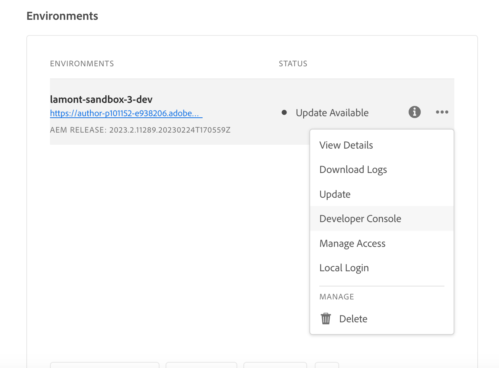

# AEM Headless API和React

欢迎阅读本教程一章，其中我们将探索配置React应用程序以使用AEM Headless SDK与Adobe Experience Manager (AEM) Headless API连接。 我们将介绍如何从AEM GraphQL API检索内容片段数据并将其显示在React应用程序中。

AEM Headless API允许从任何客户端应用程序访问AEM内容。 我们将引导您配置React应用程序，以使用AEM Headless SDK连接到AEM Headless API。 此设置可在您的React应用程序与AEM之间建立可重复使用的通信渠道。

接下来，我们将使用AEM Headless SDK从AEM GraphQL API检索内容片段数据。 AEM中的内容片段提供结构化内容管理。 利用AEM Headless SDK，您可以使用GraphQL轻松查询和提取内容片段数据。

一旦我们有内容片段数据，我们就会将它集成到您的React应用程序中。 您将学习如何以吸引人的方式格式化并显示数据。 我们将介绍在React组件中处理和呈现内容片段数据的最佳实践，确保与应用程序的UI无缝集成。

在本教程中，我们将提供说明、代码示例和实用提示。 最终，您将能够配置React应用程序以连接到AEM Headless API，使用AEM Headless SDK检索内容片段数据，并在您的React应用程序中无缝显示这些数据。 让我们开始吧！


## 克隆React应用程序

1. 从克隆应用程序 [Github](https://github.com/lamontacrook/headless-first/tree/main) 在命令行上执行以下命令。

   ```
   $ git clone git@github.com:lamontacrook/headless-first.git
   ```

1. 将更改为 `headless-first` 目录，并安装依赖项。

   ```
   $ cd headless-first
   $ npm ci
   ```

## 配置React应用程序

1. 创建名为的文件 `.env` 在项目的根目录下。 在 `.env` 设置以下值：

   ```
   REACT_APP_AEM=<URL of the AEM instance>
   REACT_APP_ENDPOINT=<the name of the endpoint>
   REACT_APP_PROJECT=<the name of the folder with Content Fragments>
   REACT_APP_TOKEN=<developer token>
   ```

1. 您可以在Cloud Manager中检索开发人员令牌。 登录 [AdobeCloud Manager](https://experience.adobe.com/). 单击 __Experience Manager> Cloud Manager__. 选择相应的程序，然后单击“Environment（环境）”旁边的省略号。

   

   1. 单击 __集成__ 选项卡
   1. 单击 __“本地令牌”选项卡和获取本地开发令牌__ 按钮
   1. 将访问令牌从打开报价之后复制到关闭报价之前。
   1. 将复制的令牌粘贴为的值 `REACT_APP_TOKEN` 在 `.env` 文件。
   1. 现在，让我们通过执行来构建应用程序 `npm ci` 在命令行上。
   1. 现在启动React应用程序并执行 `npm run start` 在命令行上。
   1. 在 [./src/utils](https://github.com/lamontacrook/headless-first/tree/main/src/utils) 名为的文件 `context.js`  包含用于在 `.env` 文件放入应用程序的上下文中。

## 运行React应用程序

1. 通过执行启动React应用程序 `npm run start` 在命令行上。

   ```
   $ npm run start
   ```

   React应用程序将启动并打开一个浏览器窗口，以 `http://localhost:3000`. 对React应用程序所做的更改将自动在浏览器中重新加载。

## 连接到AEM Headless API

1. 要将React应用程序连接到AEMas a Cloud Service，让我们添加一些内容到 `App.js`. 在 `React` 导入，添加 `useContext`.

   ```javascript
   import React, {useContext} from 'react';
   ```

   导入 `AppContext` 从 `context.js` 文件。

   ```javascript
   import { AppContext } from './utils/context';
   ```

   现在，在应用程序代码中，定义上下文变量。

   ```javascript
   const context = useContext(AppContext);
   ```

   最后，将返回代码封装在 `<AppContext.Provider> ... </AppContext.Provider>`.

   ```javascript
   ...
   return(<div className='App'>
       <AppContext.Provider value={context}>
           ...
       </AppContext.Provider>
   </div>);
   ```

   作为参考， `App.js` 现在应该象这样。

   ```javascript
   import React, {useContext} from 'react';
   import './App.css';
   import { BrowserRouter, Routes, Route } from 'react-router-dom';
   import Home from './screens/home/home';
   import { AppContext } from './utils/context';
   
   const App = () => {
   const context = useContext(AppContext);
   return (
       <div className='App'>
       <AppContext.Provider value={context}>
           <BrowserRouter>
           <Routes>
               <Route exact={true} path={'/'} element={<Home />} />
           </Routes>
           </BrowserRouter>
       </AppContext.Provider>
       </div>
   );
   };
   
   export default App;
   ```

1. 导入 `AEMHeadless` SDK。 此SDK是应用程序用于与AEM Headless API交互的帮助程序库。

   将此import语句添加到 `home.js`.

   ```javascript
   import AEMHeadless from '@adobe/aem-headless-client-js';
   ```

   添加以下内容 `{ useContext, useEffect, useState }` 到` React` import语句

   ```javascript
   import React, { useContext, useEffect, useState } from 'react';
   ```

   导入 `AppContext`.

   ```javascript
   import { AppContext } from '../../utils/context';
   ```

   内部 `Home` 组件，获取 `context` 变量来自 `AppContext`.

   ```javascript
   const Home = () => {
   const context = useContext(AppContext);
   ...
   }
   ```

1. 在中初始化AEM Headless SDK  `useEffect()`，因为AEM Headless SDK在  `context` 变量更改。

   ```javascript
   useEffect(() => {
   const sdk = new AEMHeadless({
       serviceURL: context.url,
       endpoint: context.endpoint,
       auth: context.token
   });
   }, [context]);  
   ```

   >[!NOTE]
   >
   > 有一个 `context.js` 文件位于 `/utils` 正在读取 `.env` 文件。 作为参考， `context.url` 是AEMas a Cloud Service环境的URL。 此 `context.endpoint` 是上一课程中创建的端点的完整路径。 最后， `context.token` 是开发人员令牌。


1. 创建可公开来自AEM Headless SDK的内容的React状态。

   ```javascript
   const Home = () => {
   const [content, setContent] = useState({});
   ...
   }
   ```

1. 将应用程序连接到AEM。 使用在上一课程中创建的持久查询。 让我们将以下代码添加到 `useEffect` 初始化AEM Headless SDK后。 制作 `useEffect` 取决于  `context` 变量，如下所示。


   ```javascript
   useEffect(() => {
   ...
   sdk.runPersistedQuery('<name of the endpoint>/<name of the persisted query>', { path: `/content/dam/${context.project}/<name of the teaser fragment>` })
       .then(({ data }) => {
       if (data) {
           setContent(data);
       }
       })
       .catch((error) => {
       console.log(`Error with pure-headless/teaser. ${error.message}`);
       });
   }, [context]);
   ```

1. 打开开发人员工具的“网络”视图以查看GraphQL请求。

   `<url to environment>/graphql/execute.json/pure-headless/teaser%3Bpath%3D%2Fcontent%2Fdam%2Fpure-headless%2Fhero`

   

   AEM Headless SDK对GraphQL请求进行编码，并添加提供的参数。 您可以在浏览器中打开请求。

   >[!NOTE]
   >
   > 由于请求将发送到创作环境，因此您必须在同一浏览器的其他选项卡中登录到环境。


## 呈现内容片段内容

1. 在应用程序中显示内容片段。 返回 `<div>` 包含Teaser的标题。

   ```javascript
   return (
   <div className='main-body'>
       <div>{content.component && (content.component.item.title)}</div>
   </div>
   );
   ```

   您应会看到Teaser的标题字段显示在屏幕上。

1. 最后一步是将Teaser添加到页面。 包中包含React Teaser组件。 首先，让我们包含导入。 在顶部 `home.js` 文件，添加以下行：

   `import Teaser from '../../components/teaser/teaser';`

   更新返回语句：

   ```javascript
   return (
   <div className='main-body'>
       <div>{content.component && <Teaser content={content.component.item} />}</div>
   </div>
   );
   ```

   现在，您应该会看到包含片段中包含内容的Teaser。


## 后续步骤

恭喜！您已成功更新React应用程序以使用AEM Headless SDK与AEM Headless API集成！

接下来，让我们创建一个更复杂的图像列表组件，以从AEM动态呈现引用的内容片段。

[下一章：构建图像列表组件](./3-complex-components.md)
