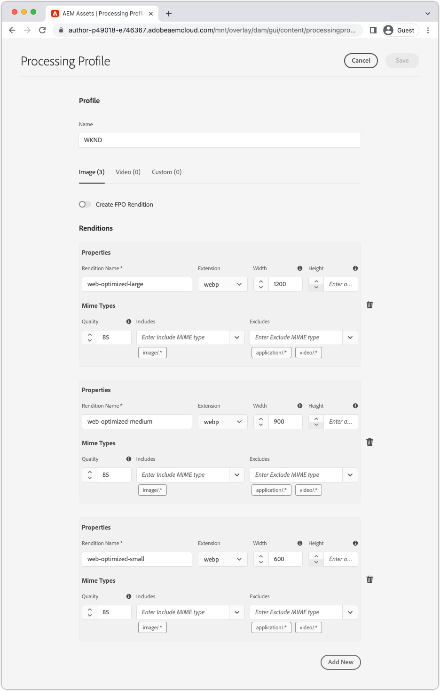

# 使用AEM Headless的图像 {#images-with-aem-headless}

图像是 [开发丰富而引人入胜的AEM无头体验](https://experienceleague.adobe.com/docs/experience-manager-learn/getting-started-with-aem-headless/graphql/multi-step/overview.html?lang=zh-Hans). AEM Headless支持管理图像资产及其优化交付。

AEM无头内容建模中使用的内容片段，通常引用要用于在无头体验中显示的图像资产。 可以编写AEM GraphQL查询，以根据引用图像的位置为图像提供URL。

的 `ImageRef` 类型具有三个用于内容引用的URL选项：

+ `_path` 是AEM中的引用路径，且不包括AEM源（主机名）
+ `_authorUrl` 是AEM作者上图像资产的完整URL
   + [AEM作者](https://experienceleague.adobe.com/docs/experience-manager-learn/cloud-service/underlying-technology/introduction-author-publish.html) 可用于提供无头应用程序的预览体验。
+ `_publishUrl` 是AEM发布中图像资产的完整URL
   + [AEM发布](https://experienceleague.adobe.com/docs/experience-manager-learn/cloud-service/underlying-technology/introduction-author-publish.html) 通常是无头应用程序的生产部署显示图像的位置。

根据以下条件，最好使用这些字段：

| ImageRef字段 | 从AEM提供的客户端Web应用程序 | 客户端应用程序查询AEM作者 | 客户端应用程序查询AEM发布 |
|--------------------|:------------------------------:|:-----------------------------:|:------------------------------:|
| `_path` | ✔ | ✔（应用程序必须在URL中指定主机） | ✔（应用程序必须在URL中指定主机） |
| `_authorUrl` | ✘ | ✔ | ✘ |
| `_publishUrl` | ✘ | ✘ | ✔ |

使用 `_authorUrl` 和 `_publishUrl` 应与用于源GraphQL响应的AEM GraphQL端点保持一致。

>[!CONTEXTUALHELP]
>id="aemcloud_learn_headless_graphql_images"
>title="使用AEM Headless的图像"
>abstract="了解AEM Headless如何支持图像资产管理及其优化交付。"

## 内容片段模型

确保包含图像引用的内容片段字段为 __内容引用__ 数据类型。

在 [内容片段模型](https://experienceleague.adobe.com/docs/experience-manager-cloud-service/content/assets/content-fragments/content-fragments-models.html)，方法是选择字段并检查 __属性__ 选项卡。


## GraphQL持久查询

在GraphQL查询中，将字段返回为 `ImageRef` 类型，并请求相应的字段 `_path`, `_authorUrl`或 `_publishUrl` 应用程序所需。 例如，查询 [WKND站点项目](https://github.com/adobe/aem-guides-wknd) ，并在其中包含图像资产引用的图像URL `primaryImage` 字段，可以使用新的保留查询完成 `wknd-shared/adventure-image-by-path` 定义为：

```graphql
query ($path: String!) {
  adventureByPath(_path: $path) {
    item {
      title,
      primaryImage {
        ... on ImageRef {
          _path
          _authorUrl
          _publishUrl
        }
      }
    }
  }
}
```

的 `$path` 变量 `_path` 过滤器需要内容片段的完整路径(例如， `/content/dam/wknd-shared/en/adventures/bali-surf-camp/bali-surf-camp`)。

## GraphQL响应

生成的JSON响应包含请求的字段，其中包含到图像资产的URL。

```json
{
  "data": {
    "adventureByPath": {
      "item": {
        "adventurePrimaryImage": {
          "_path": "/content/dam/wknd-shared/en/adventures/bali-surf-camp/adobestock-175749320.jpg",
          "_authorUrl": "https://author-p123-e456.adobeaemcloud.com/content/dam/wknd-shared/en/adventures/bali-surf-camp/adobestock-175749320.jpg",
          "_publishUrl": "https://publish-p123-e789.adobeaemcloud.com/content/dam/wknd-shared/en/adventures/bali-surf-camp/adobestock-175749320.jpg"
        }
      }
    }
  }
}
```

要在应用程序中加载引用的图像，请使用相应的字段， `_path`, `_authorUrl`或 `_publishUrl` 的 `adventurePrimaryImage` 作为图像的源URL。

的域 `_authorUrl` 和 `_publishUrl` 由AEMas a Cloud Service使用 [外部器](https://experienceleague.adobe.com/docs/experience-manager-cloud-service/content/implementing/developer-tools/externalizer.html).

在React中，显示AEM Publish中的图像如下所示：

```html

```

## 图像呈现

图像资产支持可自定义 [演绎版](../../../assets/authoring/renditions.md)，原始资产的替代表示形式。 自定义演绎版有助于优化无头体验。 无头应用程序可以请求优化的演绎版，而不是请求原始图像资产（通常是一个大型高分辨率文件）。

### 创建演绎版

AEM Assets管理员使用处理配置文件定义自定义演绎版。 然后，可以将处理配置文件直接应用于特定的文件夹树或资产，以便为这些资产生成演绎版。

#### 处理配置文件

资产演绎版规范在 [处理配置文件](../../../assets/configuring/processing-profiles.md) 由AEM Assets管理员创建。

创建或更新处理配置文件，并为无头应用程序所需的图像大小添加演绎版定义。 演绎版可以命名为任何内容，但应当从语义上命名。



在此示例中，创建了三个演绎版：

| 演绎版名称 | 扩展名 | 最大宽度 |
|-----------------------|:---------:|----------:|
| web优化 — 大 | webp | 1200像素 |
| web优化媒体 | webp | 900像素 |
| web优化 — 小 | webp | 600像素 |

上表中调用的属性很重要：

+ __演绎版名称__ 用于请求演绎版。
+ __扩展__ 是用于请求 __演绎版名称__. 首选 `webp` 演绎版，因为这些演绎版已针对Web交付进行了优化。
+ __最大宽度__ 用于根据在无头应用程序中的使用情况通知开发人员应使用哪个演绎版。

演绎版定义取决于您的无头应用程序的需求，因此请确保为用例定义最佳演绎版集，并在语义上对其使用方式进行命名。

#### 重新处理资产{#reprocess-assets}

创建（或更新）处理配置文件后，重新处理资产以生成处理配置文件中定义的新演绎版。 在使用处理配置文件处理资产之前，新演绎版不存在。

+ 最好， [将处理配置文件分配到文件夹](../../../assets/configuring//processing-profiles.md) 因此，任何上传到该文件夹的新资产都会自动生成演绎版。 必须使用以下临时方法重新处理现有资产。

+ 或者，临时选择文件夹或资产，然后选择 __重新处理资产__，然后选择新的处理配置文件名称。

   

#### 查看演绎版

演绎版可通过 [打开资产的演绎版视图](../../../assets/authoring/renditions.md)，然后选择新演绎版以在演绎版边栏中进行预览。 如果演绎版缺失， [确保使用处理配置文件处理资产](#reprocess-assets).


#### 发布资产

确保具有新演绎版的资产为 [（重新发布）](../../../assets/sharing/publish.md) 这样，新演绎版便可在AEM发布中访问。

### 访问演绎版

演绎版可通过附加 __演绎版名称__ 和 __演绎版扩展__ 处理配置文件中定义到资产URL。

| 资产 URL | 演绎版子路径 | 演绎版名称 | 演绎版扩展 |  | 演绎版URL |
|-----------|:------------------:|:--------------:|--------------------:|:--:|---|
| https://publish-p123-e789.adobeaemcloud.com/content/dam/example.jpeg | /_jcr_content/renditions/ | web优化 — 大 | .webp | → | https://publish-p123-e789.adobeaemcloud.com/content/dam/example.jpeg/_jcr_content/renditions/web-optimized-large.webp |
| https://publish-p123-e789.adobeaemcloud.com/content/dam/example.jpeg | /_jcr_content/renditions/ | web优化媒体 | .webp | → | https://publish-p123-e789.adobeaemcloud.com/content/dam/example.jpeg/_jcr_content/renditions/web-optimized-medium.webp |
| https://publish-p123-e789.adobeaemcloud.com/content/dam/example.jpeg | /_jcr_content/renditions/ | web优化 — 小 | .webp | → | https://publish-p123-e789.adobeaemcloud.com/content/dam/example.jpeg/_jcr_content/renditions/web-optimized-small.webp |

{style=&quot;table-layout:auto&quot;}

### GraphQL查询{#renditions-graphl-query}

AEM GraphQL在请求图像呈现时确实需要额外的语法。 相反 [查询图像](#images-graphql-query) 在常规方式下，所需的演绎版将以代码形式指定。 对 [确保无头应用程序使用的图像资产具有相同的命名演绎版](#reprocess-assets).

### React示例

让我们创建一个简单的React应用程序，该应用程序可显示单个图像资产的三个演绎版：Web优化的小型、Web优化的中型和Web优化的大型。


#### 创建图像组件{#react-example-image-component}

创建可渲染图像的React组件。 此组件接受四个属性：

+ `assetUrl`:通过GraphQL查询响应提供的图像资产URL。
+ `renditionName`:要加载的演绎版的名称。
+ `renditionExtension`:要加载的演绎版的扩展。
+ `alt`:图像的替换文本；辅助功能很重要！

此组件构建 [格式为 __访问演绎版__](#access-renditions). 安 `onError` 处理程序设置为在演绎版丢失时显示原始资产。

此示例使用原始资产url作为 `onError` 处理程序中，事件中缺少呈现版本。

```javascript
// src/Image.js

export default function Image({ assetUrl, renditionName, renditionExtension, alt }) {
  // Construct the rendition Url in the format:
  //   <ASSET URL>/_jcr_content/renditions<RENDITION NAME>.<RENDITION EXTENSION>
  const renditionUrl = `${assetUrl}/_jcr_content/renditions/${renditionName}.${renditionExtension}`;

  // Load the original image asset in the event the named rendition is missing
  const handleOnError = (e) => { e.target.src = assetUrl; }

  return (
    <>
      
    </>
  );
}
```

#### 定义 `App.js`{#app-js}

这很简单 `App.js` 查询AEM以获取Adventure图像，然后显示该图像的三个呈现版本：web优化 — 小型、web优化 — 中型和web优化 — 大型。

在自定义React挂接中执行AEM查询 [使用AEM Headless SDK的useAdventureByPath](./aem-headless-sdk.md#graphql-persisted-queries).

查询结果和特定的呈现版本参数将传递到 [Image React组件](#react-example-image-component).

```javascript
// src/App.js

import "./App.css";
import { useAdventureByPath } from './api/persistedQueries'
import Image from "./Image";

function App() {

  // Get data from AEM using GraphQL persisted query as defined above 
  // The details of defining a React useEffect hook are explored in How to > AEM Headless SDK
  let { data, error } = useAdventureByPath("/content/dam/wknd-shared/en/adventures/bali-surf-camp/bali-surf-camp");

  // Wait for GraphQL to provide data
  if (!data) { return <></> }

  return (
    <div className="app">
      
      <h2>Small rendition</h2>
      {/* Render the web-optimized-small rendition for the Adventure Primary Image */}
      <Image
        assetUrl={data.adventureByPath.item.primaryImage._publishUrl}
        renditionName="web-optimized-small"
        renditionExtension="webp"
        alt={data.adventureByPath.item.title}
      />

      <hr />

      <h2>Medium rendition</h2>
      {/* Render the web-optimized-medium rendition for the Adventure Primary Image */}
      <Image
        assetUrl={data.adventureByPath.item.primaryImage._publishUrl}
        renditionName="web-optimized-medium"
        renditionExtension="webp"
        alt={data.adventureByPath.item.title}
      />

      <hr />

      <h2>Large rendition</h2>
      {/* Render the web-optimized-large rendition for the Adventure Primary Image */}
      <Image
        assetUrl={data.adventureByPath.item.primaryImage._publishUrl}
        renditionName="web-optimized-large"
        renditionExtension="webp"
        alt={data.adventureByPath.item.title}
      />
    </div>
  );
}

export default App;
```
