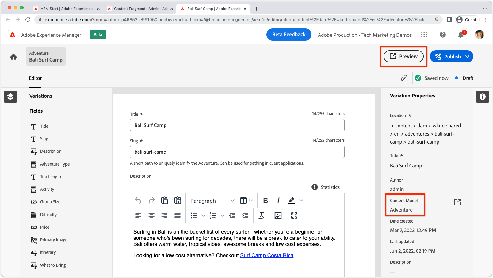

# 内容片段预览

AEM Headless应用程序支持集成的创作预览。 预览体验将AEM作者的内容片段编辑器与您的自定义应用程序链接到一起（可通过HTTP寻址），从而允许深层链接进入应用程序，以呈现正在预览的内容片段。

>[!VIDEO](https://video.tv.adobe.com/v/3449598?quality=12&learn=on&captions=chi_hans)

要使用内容片段预览，必须满足多个条件：

1. 必须将应用程序部署到作者可访问的URL中
1. 必须配置应用程序以连接到AEM创作服务(而不是AEM发布服务)
1. 应用程序必须设计有URL或路由，它们可以使用[内容片段路径或ID](#url-expressions)选择要显示的内容片段，以便在应用程序体验中预览。

## 预览URL

在内容片段模型的属性上设置使用[URL表达式](#url-expressions)的预览URL。


1. 以管理员身份登录AEM创作服务
1. 导航到&#x200B;__工具>常规>内容片段模型__
1. 选择&#x200B;__内容片段模型__&#x200B;并从顶部操作栏中选择&#x200B;__属性__。
1. 使用[URL表达式](#url-expressions)输入内容片段模型的预览URL
   + 预览URL必须指向连接到AEM Author服务的应用程序部署。

### URL表达式

每个内容片段模型都可以设置预览URL。 可以使用下表中列出的URL表达式，为每个内容片段参数化预览URL。 可以在单个预览URL中使用多个URL表达式。

|                                         | URL表达式 | 价值 |
| --------------------------------------- | ----------------------------------- | ----------- |
| 内容片段路径 | `${contentFragment.path}` | `/content/dam/wknd-shared/en/adventures/surf-camp-bali/surf-camp-bali` |
| 内容片段ID | `${contentFragment.id}` | `12c34567-8901-2aa3-45b6-d7890aa1c23c` |
| 内容片段变量 | `${contentFragment.variation}` | `main` |
| 内容片段模型路径 | `${contentFragment.model.path}` | `/conf/wknd-shared/settings/dam/cfm/models/adventure` |
| 内容片段模型名称 | `${contentFragment.model.name}` | `adventure` |

示例预览URL：

+ __冒险__&#x200B;模型上的预览URL可能类似于`https://preview.app.wknd.site/adventure${contentFragment.path}`，解析为`https://preview.app.wknd.site/adventure/content/dam/wknd-shared/en/adventures/surf-camp-bali/surf-camp-bali`
+ __Article__&#x200B;模型上的预览URL可能类似于`https://preview.news.wknd.site/${contentFragment.model.name}/${contentFragment.id}.html?variation=${contentFragment.variation}`解析的`https://preview.news.wknd.site/article/99c34317-1901-2ab3-35b6-d7890aa1c23c.html?variation=main`

## 应用程序内预览

任何使用配置的内容片段模型的内容片段都具有预览按钮。 “预览”按钮可打开内容片段模型的预览URL，并将打开的内容片段的值注入到[URL表达式](#url-expressions)中。



在预览应用程序中的内容片段更改时，执行硬刷新（清除浏览器的本地缓存）。

## React示例

让我们来探索WKND应用程序，它是一个简单的React应用程序，使用AEM Headless GraphQL API显示AEM中的冒险。

示例代码在[Github.com](https://github.com/adobe/aem-guides-wknd-graphql/tree/main/preview-tutorial)上可用。

## URL和路由

用于预览内容片段的URL或路由必须可以使用[URL表达式](#url-expressions)进行组合。 在此启用了预览的WKND应用程序版本中，冒险内容片段通过绑定到路由`/adventure<CONTENT FRAGMENT PATH>`的`AdventureDetail`组件显示。 因此，必须将WKND Adventure模型的预览URL设置为`https://preview.app.wknd.site:3000/adventure${contentFragment.path}`才能解析到此路由。

仅当应用程序具有可寻址路由时，内容片段预览才有效，可寻址路由由[URL表达式](#url-expressions)填充，该表达式以可预览的方式在应用中呈现内容片段。

+ `src/App.js`

```javascript
...
function App() {
  return (
    <Router>
      <div className="App">
        <header>
            <Link to={"/"}>
                
            </Link>        
            <hr />
        </header>
        <Routes>
          {/* The route's path must match the Adventure Model's Preview URL expression. In React since the path has `/` you must use wildcards to match instead of the usual `:path` */}
          <Route path='/adventure/*' element={<AdventureDetail />}/>
          <Route path="/" element={<Home />}/>
        </Routes>
      </div>
    </Router>
  );
}

export default App;
```

### 显示创作的内容

`AdventureDetail`组件只是解析内容片段路径，从路由URL通过`${contentFragment.path}` [URL表达式](#url-expressions)插入预览URL中，并使用它来收集和呈现WKND Adventure。

+ `src/components/AdventureDetail.js`

```javascript
...
function AdventureDetail() {

    // Read the `path` value which is the parameter used to query for the adventure's details
    // since the params value captures the `*` wildcard in `/adventure/*`, or everything after the first `/` in the Content Fragment path.
    const params = useParams();
    const pathParam = params["*"];

    // Add the leading '/' back on 
    const path = '/' + pathParam;
    
    // Query AEM for the Adventures's details, using the Content Fragment's `path`
    const { adventure, references, error } = useAdventureByPath(path);

    // Handle error and loading conditions
    if (error) {
        return <Error errorMessage={error} />;
    } else if (!adventure) {
        return <Loading />;
    }

    return (<div className="adventure-detail">
        ...
        <AdventureDetailRender {...adventure} references={references} />
    </div>);
}
...
```
