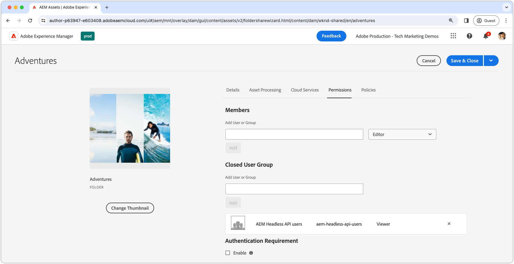

# 保护AEM Headless中的内容

从AEM Publish提供AEM Headless内容时，确保数据的完整性和安全性在提供敏感内容时至关重要。 本操作说明如何保护AEM Headless GraphQL API端点提供的内容。

本教程中的指南对内容有严格要求，不能仅提供给特定用户或用户组。 必须区分个性化营销内容和私人内容，如PII或个人财务数据，以避免混淆和意外结果。 本教程将介绍保护私有内容的问题。

在讨论营销内容时，我们指的就是为个别用户或组定制的内容，该内容并非用于一般用途。 但是，必须了解一点，虽然此内容可能会面向某些用户，但在预期上下文之外（例如，通过操纵HTTP请求）暴露于此内容不会带来安全、法律或声誉风险。

需要强调的是，本文中所涉及的所有内容均被假定为私密内容，只能由指定的用户或组查看。 营销内容通常不需要保护，而是应用程序可以管理其提供给特定用户的内容，并缓存这些内容以提高性能。

本操作说明不包括：

- 直接保护端点，而是侧重于保护它们提供的内容。
- AEM发布或获取登录令牌的身份验证。 身份验证方法和凭据传递取决于各个用例和实施。

## 用户组

首先，我们必须定义一个[用户组](https://experienceleague.adobe.com/zh-hans/docs/experience-manager-learn/cloud-service/accessing/aem-users-groups-and-permissions)，该用户组包含应有权访问受保护内容的用户。

{align="center"}

用户组分配对AEM Headless内容的访问权限，包括内容片段或其他引用的资源。

1. 以&#x200B;**用户管理员**&#x200B;身份登录AEM Author。
1. 导航到&#x200B;**工具** > **安全** > **组**。
1. 选择右上角的&#x200B;**创建**。
1. 在&#x200B;**详细信息**&#x200B;选项卡中，指定&#x200B;**组ID**&#x200B;和&#x200B;**组名**。
   - 组ID和组名称可以是任何内容，但在此示例中使用名称&#x200B;**AEM Headless API users**。
1. 选择&#x200B;**保存并关闭**。
1. 选择新创建的组，然后从操作栏中选择&#x200B;**激活**。

如果需要各种级别的访问，请创建多个可与不同内容关联的用户组。

### 将用户添加到用户组

要授予AEM Headless GraphQL API请求访问受保护内容的权限，您可以将headless请求与属于特定用户组的用户相关联。 以下是两种常用方法：

1. **AEM as a Cloud Service [技术帐户](https://experienceleague.adobe.com/en/docs/experience-manager-learn/getting-started-with-aem-headless/authentication/service-credentials)：**
   - 在AEM as a Cloud Service Developer Console中创建技术帐户。
   - 使用技术帐户登录AEM Author一次。
   - 通过&#x200B;**工具>安全>组> AEM Headless API用户>成员**，将技术帐户添加到用户组。
   - 在AEM发布中&#x200B;**同时激活技术帐户用户和用户组**。
   - 此方法要求Headless客户端不要向用户公开服务凭据，因为它们是特定用户的凭据，不应共享。

   {align="center"}

2. **已命名用户：**
   - 在AEM Publish上验证已命名用户并直接将其添加到用户组。
   - 此方法要求Headless客户端使用AEM Publish对用户凭据进行身份验证，获取AEM登录或访问令牌，并将此令牌用于向AEM发出的后续请求。 本操作方法中未涵盖有关如何实现此目标的详细信息，具体取决于实施。

## 保护内容片段

保护内容片段对于保护AEM Headless内容至关重要，可通过将内容与封闭用户组(CUG)关联来实现。 当用户向AEM Headless GraphQL API发出请求时，会根据用户的CUG过滤返回的内容。

{align="center"}

按照以下步骤通过[封闭用户组(CUG)](https://experienceleague.adobe.com/en/docs/experience-manager-learn/assets/advanced/closed-user-groups)实现此目的。

1. 以&#x200B;**DAM用户**&#x200B;身份登录AEM作者。
2. 导航到&#x200B;**Assets >文件**，然后选择包含要保护的内容片段的&#x200B;**文件夹**。 除非被其他CUG覆盖，否则CUG按层级应用，并会影响到子文件夹。
   - 确保此用户组中包含属于其他利用文件夹内容的渠道的用户。 或者，在CUG列表中包括与这些频道相关联的用户组。 否则，这些渠道将无法访问内容。
3. 选择文件夹，然后从工具栏中选择&#x200B;**属性**。
4. 选择&#x200B;**权限**&#x200B;选项卡。
5. 键入&#x200B;**组名称**&#x200B;并选择&#x200B;**添加**&#x200B;按钮以添加新的CUG。
6. **保存**&#x200B;以应用封闭用户组。
7. **选择**&#x200B;资源文件夹并选择&#x200B;**发布**&#x200B;以将应用了CUG的文件夹发送到AEM发布，并将作为权限进行评估。

对包含需要保护的内容片段的所有文件夹执行这些相同步骤，将正确的CUG应用于每个文件夹。

现在，向AEM Headless GraphQL API端点发出HTTP请求时，结果中将仅包含请求用户的指定CUG可访问的内容片段。 如果用户无法访问任何内容片段，则结果将为空，但仍返回200 HTTP状态代码。

### 保护引用的内容

内容片段经常引用其他AEM内容，例如图像。 要保护此引用内容，请将CUG应用于存储引用资产的资产文件夹。 请注意，通常使用与AEM Headless GraphQL API不同的方法请求引用的资源。 因此，在请求向这些引用的资产传递访问令牌的方式可能会有所不同。

根据内容体系结构，可能有必要将CUG应用于多个文件夹，以确保所有引用的内容都受到保护。

## 防止缓存受保护的内容

默认情况下，AEM as a Cloud Service [缓存HTTP响应](https://experienceleague.adobe.com/en/docs/experience-manager-learn/cloud-service/caching/publish)以提高性能。 但是，这可能会导致提供受保护内容时出现问题。 要阻止缓存此类内容，请在AEM发布实例的Apache配置中[删除特定端点](https://experienceleague.adobe.com/en/docs/experience-manager-learn/cloud-service/caching/publish#how-to-customize-cache-rules-1)的缓存标头。

将以下规则添加到Dispatcher项目的Apache配置文件中，以删除特定端点的缓存标头：

```xml
# dispatcher/src/conf.d/available_vhosts/example.vhost

<VirtualHost *:80>
    ...
    # Replace `example` with the name of your GraphQL endpoint's configuration name.
    <LocationMatch "^/graphql/execute.json/example/.*$">
        # Remove cache headers for protected endpoints so they are not cached
        Header unset Cache-Control
        Header unset Surrogate-Control
        Header set Age 0
    </LocationMatch>
    ...
</VirtualHost>
```

请注意，这将导致性能损失，因为Dispatcher或CDN不会缓存内容。 这是性能和安全性之间的权衡。

## 保护AEM Headless GraphQL API端点

本指南不涉及保护[AEM Headless GraphQL API端点](https://experienceleague.adobe.com/en/docs/experience-manager-cloud-service/content/headless/graphql-api/graphql-endpoint)本身，而是侧重于保护它们提供的内容。 所有用户（包括匿名用户）都可以访问包含受保护内容的端点。 将仅返回可由用户的封闭用户组访问的内容。 如果没有可访问的内容，AEM Headless API响应将仍具有200 HTTP响应状态代码，但结果将为空。 通常，保护内容安全就足够了，因为端点本身不会公开敏感数据。 如果您需要保护端点，请通过[Sling存储库初始化(repoinit)脚本](https://sling.apache.org/documentation/bundles/repository-initialization.html#repoinit-parser-test-scenarios)在AEM Publish上将ACL应用到这些端点。
