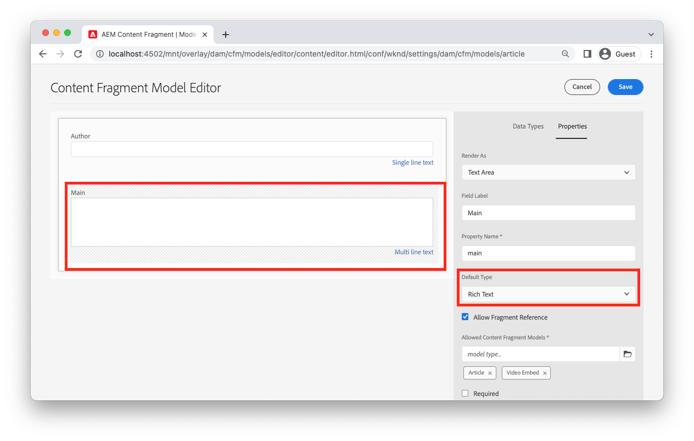
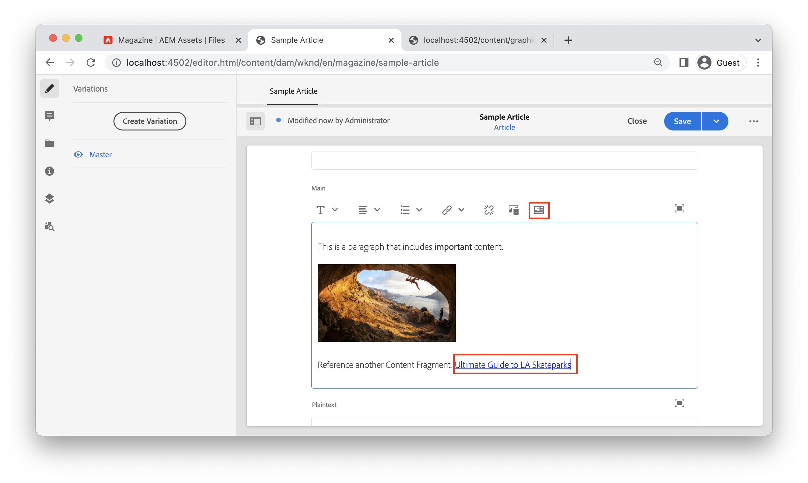

# AEM Headless多信息文本

多行文本字段是内容片段的数据类型，它允许作者创建富文本内容。 对其他内容（如图像或其他内容片段）的引用可以动态地内嵌在文本流中。 单行文本字段是内容片段的另一种数据类型，应当用于简单文本元素。

AEM的GraphQL API提供了一项强大的功能，可将RTF作为HTML、纯文本或纯JSON返回。 JSON表示法非常强大，因为它使客户端应用程序可以完全控制如何呈现内容。

## 多行编辑器

>[!VIDEO](https://video.tv.adobe.com/v/342104?quality=12&learn=on)

在内容片段编辑器中，多行文本字段的菜单栏为作者提供标准的RTF格式功能，如&#x200B;**bold**、*斜体*&#x200B;和下划线。 在全屏模式下打开多行字段可启用[其他格式工具，如段落文字、查找和替换、拼写检查等](https://experienceleague.adobe.com/docs/experience-manager-cloud-service/content/assets/content-fragments/content-fragments-variations.html?lang=zh-Hans)。

>[!NOTE]
>
> 无法自定义多行编辑器中的富文本插件。

## 多行文本数据类型 {#multi-line-data-type}

定义内容片段模型时，请使用&#x200B;**多行文本**&#x200B;数据类型来启用RTF创作。



可以配置多行字段的多个属性。

**呈现为**&#x200B;属性可以设置为：

* 文本区域 — 呈现单个多行字段
* 多个字段 — 呈现多个多行字段


**默认类型**&#x200B;可以设置为：

* 富文本
* Markdown
* 纯文本

**默认类型**&#x200B;选项直接影响编辑体验，并确定是否存在RTF工具。

您还可以通过检查&#x200B;**允许片段引用**&#x200B;并配置&#x200B;**允许的内容片段模型**&#x200B;来[启用对其他内容片段的内联引用](#insert-fragment-references)。

如果要将内容本地化，请选中&#x200B;**可翻译**&#x200B;框。 只能本地化富文本和纯文本。 有关更多详细信息，请参阅[使用本地化的内容](./localized-content.md)。

## GraphQL API富文本响应

创建GraphQL查询时，开发人员可以从多行字段中选择来自`html`、`plaintext`、`markdown`和`json`的其他响应类型。

开发人员可以在内容片段编辑器中使用[JSON预览](https://experienceleague.adobe.com/docs/experience-manager-cloud-service/content/assets/content-fragments/content-fragments-json-preview.html?lang=zh-hans)来显示当前内容片段的所有值，这些值可以使用GraphQL API返回。

## GraphQL持久查询

在处理富文本内容时，为多行字段选择`json`响应格式可提供最大的灵活性。 富文本内容以JSON节点类型数组的形式交付，可以基于客户端平台唯一处理这些类型。

以下是名为`main`的多行字段的JSON响应类型，该字段包含段落：“*”这是一个包含&#x200B;**重要**&#x200B;内容的段落。*，其中“重要”标记为&#x200B;**bold**。

```graphql
query ($path: String!) {
  articleByPath(_path: $path)
  {
    item {
      _path
      main {
        json
      }
    }
  }
}
```

`_path`筛选器中使用的`$path`变量需要内容片段的完整路径（例如`/content/dam/wknd/en/magazine/sample-article`）。

**GraphQL响应：**

```json
{
  "data": {
    "articleByPath": {
      "item": {
        "_path": "/content/dam/wknd/en/magazine/sample-article",
        "main": {
          "json": [
            {
              "nodeType": "paragraph",
              "content": [
                {
                  "nodeType": "text",
                  "value": "This is a paragraph that includes "
                },
                {
                  "nodeType": "text",
                  "value": "important",
                  "format": {
                    "variants": [
                      "bold"
                    ]
                  }
                },
                {
                  "nodeType": "text",
                  "value": " content. "
                }
              ]
            }
          ]
        }
      }
    }
  }
}
```

### 其他示例

以下是名为`main`的多行字段的响应类型的几个示例，该字段包含段落：“这是一个包含&#x200B;**重要**&#x200B;内容的段落。” 其中，“重要”标记为&#x200B;**bold**。

+++HTML示例

**GraphQL持久查询：**

```graphql
query ($path: String!) {
  articleByPath(_path: $path)
  {
    item {
      _path
      main {
        html
      }
    }
  }
}
```

**GraphQL响应：**

```json
{
  "data": {
    "articleByPath": {
      "item": {
        "_path": "/content/dam/wknd/en/magazine/sample-article",
        "main": {
            "html": "<p>This is a paragraph that includes <b>important</b> content.&nbsp;</p>\n"
        }
      }
    }
  }
}
```

+++

+++Markdown示例

**GraphQL持久查询：**

```graphql
query ($path: String!) {
  articleByPath(_path: $path)
  {
    item {
      _path
      main {
        markdown
      }
    }
  }
}
```

**GraphQL响应：**

```json
{
  "data": {
    "articleByPath": {
      "item": {
        "_path": "/content/dam/wknd/en/magazine/sample-article",
        "main": {
            "markdown": "This is a paragraph that includes **important** content. \n\n ",
        }
      }
    }
  }
}
```

+++

+++纯文本示例

**GraphQL持久查询：**

```graphql
query ($path: String!) {
  articleByPath(_path: $path)
  {
    item {
      _path
      main {
        plaintext
      }
    }
  }
}
```

**GraphQL响应：**

```json
{
  "data": {
    "articleByPath": {
      "item": {
        "_path": "/content/dam/wknd/en/magazine/sample-article",
        "main": {
            "plaintext": "This is a paragraph that includes important content. ",
        }
      }
    }
  }
}
```

`plaintext`渲染选项会去除任何格式。

+++


## 呈现富文本JSON响应 {#render-multiline-json-richtext}

多行字段的富文本JSON响应被构造为分层树。 每个对象或节点表示富文本中的其他HTML块。

以下是多行文本字段的JSON响应示例。 请注意，每个对象或节点都包含一个`nodeType`，它表示富文本（如`paragraph`、`link`和`text`）中的HTML块。 每个节点可选地包含`content`，它是一个包含当前节点的任何子节点的子数组。

```json
"json": [// root "content" or child nodes
            {
                "nodeType": "paragraph", // node for a paragraph
                "content": [ // children of current node
                {
                    "nodeType": "text", // node for a text
                    "value": "This is the first paragraph. "
                },
                {
                    "nodeType": "link",
                    "data": {
                        "href": "http://www.adobe.com"
                    },
                    "value": "An external link"
                }
                ],
            },
            {
                "nodeType": "paragraph",
                "content": [
                {
                    "nodeType": "text",
                    "value": "This is the second paragraph."
                },
                ],
            },
]
```

呈现多行`json`响应的最简单方法是处理响应中的每个对象或节点，然后处理当前节点的任何子节点。 递归函数可用于遍历JSON树。

以下是说明递归遍历方法的示例代码。 这些示例基于JavaScript并使用React的[JSX](https://reactjs.org/docs/introducing-jsx.html)，但编程概念可以应用于任何语言。

```javascript
// renderNodeList - renders a list of nodes
function renderNodeList(childNodes) {
    
    if(!childNodes) {
        // null check
        return null;
    }

    return childNodes.map(node, index) => {
        return renderNode(node);
    }
}
```

`renderNodeList`是一个递归函数，它采用`childNodes`的数组。 数组中的每个节点随后都会传递到函数`renderNode`，如果节点具有子节点，则函数会调用`renderNodeList`。

```javascript
// renderNode - renders an individual node
function renderNode(node) {

    // if the current node has children, recursively process them
    const children = node.content ? renderNodeList(node.content) : null;

    // use a map to render the current node based on its nodeType
    return nodeMap[node.nodeType]?.(node, children);
}
```

`renderNode`函数需要一个名为`node`的对象。 节点可以具有使用上述`renderNodeList`函数递归处理的子节点。 最后，`nodeMap`用于根据其`nodeType`呈现节点的内容。

```javascript
// nodeMap - object literal that maps a JSX response based on a given key (nodeType)
const nodeMap = {
    'paragraph': (node, children) => <p>{children}</p>,
    'link': node => <a href={node.data.href} target={node.data.target}>{node.value}</a>,
    'text': node => node.value,
    'unordered-list': (node, children) => <ul>{children}</ul>,
    'ordered-list': (node, children) => <ol>{children}</ol>,
    'list-item': (node, children) => <li>{children}</li>,
    ...
}
```

`nodeMap`是用作映射的JavaScript对象文字。 每个“键”代表不同的`nodeType`。 `node`和`children`的参数可以传递到渲染节点的生成函数。 此示例中使用的返回类型是JSX，但该方法可以适用于构建表示HTML内容的字符串文字。

### 完整代码示例

可在[WKND GraphQL React示例](https://github.com/adobe/aem-guides-wknd-graphql/tree/main/react-app)中找到可重用的富文本渲染实用程序。

* [renderRichText.js](https://github.com/adobe/aem-guides-wknd-graphql/blob/main/react-app/src/utils/renderRichText.js) — 可重用实用程序，该实用程序公开函数`mapJsonRichText`。 此实用程序可供希望将富文本JSON响应渲染为React JSX的组件使用。
* [AdventureDetail.js](https://github.com/adobe/aem-guides-wknd-graphql/blob/main/react-app/src/components/AdventureDetail.js) — 发出包含富文本的GraphQL请求的组件示例。 组件使用`mapJsonRichText`实用程序呈现富文本和任何引用。


## 添加对富文本的内联引用 {#insert-fragment-references}

利用多行字段，作者可以在富文本流中插入来自AEM Assets的图像或其他数字资产。


上面的屏幕快照描述了使用&#x200B;**插入资源**&#x200B;按钮在多行字段中插入的图像。

也可以使用&#x200B;**插入内容片段**&#x200B;按钮在多行字段中链接或插入对其他内容片段的引用。



上面的屏幕截图描述了另一个内容片段，洛杉矶滑板公园的Ultimate指南，插入多行字段中。 可插入到字段中的内容片段的类型由内容片段模型中[多行数据类型](#multi-line-data-type)中的&#x200B;**允许的内容片段模型**&#x200B;配置控制。

## 使用GraphQL查询内联引用

GraphQL API允许开发人员创建查询，查询中包含有关插入到多行字段中的任何引用的其他属性。 JSON响应包含一个单独的`_references`对象，其中列出了这些额外的属性。 JSON响应可让开发人员完全控制如何呈现引用或链接，而不必处理教条式的HTML。

例如，您可能希望：

* 包含自定义路由逻辑，用于在实施单页应用程序（如使用React Router或Next.js）时管理指向其他内容片段的链接
* 使用指向AEM Publish环境的绝对路径作为`src`值渲染内嵌图像。
* 确定如何使用其他自定义属性呈现对其他内容片段的嵌入引用。

构造GraphQL查询时，请使用`json`返回类型并包含`_references`对象：

**GraphQL持久查询：**

```graphql
query ($path: String!) {
  articleByPath(_path: $path, _assetTransform: { format: JPG, preferWebp: true })
  {
    item {
      _path
      main {
        json
      }
    }
    _references {
      ...on ImageRef {
        _dynamicUrl
        __typename
      }
      ...on ArticleModel {
        _path
        author
        __typename
      }  
    }
  }
}
```

在上述查询中，`main`字段返回为JSON。 `_references`对象包含用于处理任何类型为`ImageRef`或类型为`ArticleModel`的引用的片段。

**JSON响应：**

```json
{
  "data": {
    "articleByPath": {
      "item": {
        "_path": "/content/dam/wknd/en/magazine/sample-article",
        "main": {
          "json": [
            {
              "nodeType": "paragraph",
              "content": [
                {
                  "nodeType": "text",
                  "value": "This is a paragraph that includes "
                },
                {
                  "nodeType": "text",
                  "value": "important",
                  "format": {
                    "variants": [
                      "bold"
                    ]
                  }
                },
                {
                  "nodeType": "text",
                  "value": " content. "
                }
              ]
            },
            {
              "nodeType": "paragraph",
              "content": [
                {
                  "nodeType": "reference",
                  "data": {
                    "path": "/content/dam/wknd/en/activities/climbing/sport-climbing.jpg",
                    "mimetype": "image/jpeg"
                  }
                }
              ]
            },
            {
              "nodeType": "paragraph",
              "content": [
                {
                  "nodeType": "text",
                  "value": "Reference another Content Fragment: "
                },
                {
                  "nodeType": "reference",
                  "data": {
                    "href": "/content/dam/wknd/en/magazine/la-skateparks/ultimate-guide-to-la-skateparks",
                    "type": "fragment"
                  },
                  "value": "Ultimate Guide to LA Skateparks"
                }
              ]
            }
          ]
        }
      },
      "_references": [
        {
          "_dynamicUrl": "/adobe/dynamicmedia/deliver/dm-aid--dd42d814-88ec-4c4d-b5ef-e3dc4bc0cb42/sport-climbing.jpg?preferwebp=true",
          "__typename": "ImageRef"
        },
        {
          "_path": "/content/dam/wknd/en/magazine/la-skateparks/ultimate-guide-to-la-skateparks",
          "author": "Stacey Roswells",
          "__typename": "ArticleModel"
        }
      ]
    }
  }
}
```

JSON响应包括引用插入到带`"nodeType": "reference"`的富文本中的位置。 然后，`_references`对象包含每个引用。

## 以富文本呈现内联引用

要呈现内联引用，可以展开[呈现多行JSON响应](#render-multiline-json-richtext)中说明的递归方法。

其中`nodeMap`是渲染JSON节点的映射。

```javascript
const nodeMap = {
        'reference': (node, children) => {

            // variable for reference in _references object
            let reference;
            
            // asset reference
            if (node.data.path) {
                // find reference based on path
                reference = references.find( ref => ref._path === node.data.path);
            }
            // Fragment Reference
            if (node.data.href) {
                // find in-line reference within _references array based on href and _path properties
                reference = references.find( ref => ref._path === node.data.href);
            }

            // if reference found, merge properties of reference and current node, then return render method of it using __typename property
            return reference ? renderReference[reference.__typename]({...reference, ...node}) : null;
        }
    }
```

高级方法是每当`nodeType`等于Mutli Line JSON响应中的`reference`时进行检查。 然后，可以调用一个自定义渲染函数，该函数包含在GraphQL响应中返回的`_references`对象。

然后，可以将内联引用路径与`_references`对象中的相应条目进行比较，并且可以调用另一个自定义映射`renderReference`。

```javascript
const renderReference = {
    // node contains merged properties of the in-line reference and _references object
    'ImageRef': (node) => {
        // when __typename === ImageRef
        return  
    },
    'ArticleModel': (node) => {
        // when __typename === ArticleModel
        return <Link to={`/article:${node._path}`}>{`${node.value}`}</Link>;
    }
    ...
}
```

`_references`对象的`__typename`可用于将不同的引用类型映射到不同的渲染函数。

### 完整代码示例

在[AdventureDetail.js](https://github.com/adobe/aem-guides-wknd-graphql/blob/main/react-app/src/components/AdventureDetail.js)中可以找到编写自定义引用渲染器的完整示例，它是[WKND GraphQL React示例](https://github.com/adobe/aem-guides-wknd-graphql/tree/main/react-app)的一部分。

## 端到端示例

>[!VIDEO](https://video.tv.adobe.com/v/3449710?quality=12&learn=on&captions=chi_hans)

>[!NOTE]
>
> 上述视频使用`_publishUrl`渲染图像引用。 相反，首选使用`_dynamicUrl`，如[网络优化图像how-to](./images.md)中所述；


前面的视频展示了一个端到端示例：

1. 更新内容片段模型的多行文本字段以允许片段引用
2. 使用内容片段编辑器在多行文本字段中包含图像和对其他片段的引用。
3. 创建一个GraphQL查询，该查询包括作为JSON的多行文本响应以及使用的任何`_references`。
4. 编写可呈现富文本响应的内联引用的React SPA。
