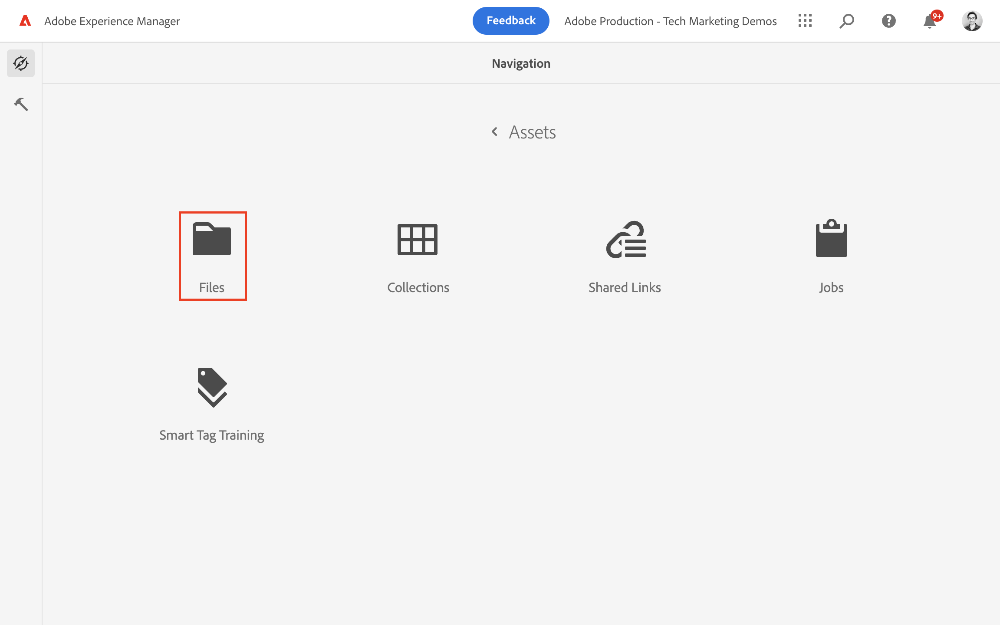

# 创作内容片段 {#authoring-content-fragments}

在本章中，您将根据[新定义的内容片段模型](./content-fragment-models.md)创建和编辑新的内容片段。 您还将了解如何创建内容片段的变体。

## 先决条件 {#prerequisites}

这是一个多部分教程，并假定已完成[定义内容片段模型](./content-fragment-models.md)中概述的步骤。

## 目标 {#objectives}

* 根据内容片段模型创作内容片段
* 创建内容片段变量

## 创建资产文件夹

内容片段存储在AEM Assets的文件夹中。 要根据上一章中创建的模型创建内容片段，必须创建一个文件夹来存储这些内容。 需要在该文件夹上进行配置才能从特定模型创建片段。

1. 从AEM“开始”屏幕中，导航到&#x200B;**Assets** > **文件**。

   

1. 点按右上角的&#x200B;**创建**，然后点按&#x200B;**文件夹**。 在生成的对话框中，输入：

   * 标题*：**我的项目**
   * 名称： **my-project**

   

1. 选择&#x200B;**我的文件夹**&#x200B;文件夹并点按&#x200B;**属性**。

   

1. 点按&#x200B;**云服务**&#x200B;选项卡。 在云配置选项卡下，使用路径查找器选择&#x200B;**我的项目**&#x200B;配置。 该值应为`/conf/my-project`。

   

   通过设置此属性，可以使用上一章中创建的模型创建内容片段。

1. 点按&#x200B;**策略**&#x200B;选项卡，在&#x200B;**允许的内容片段模型**&#x200B;字段下，使用路径查找器选择之前创建的&#x200B;**人员**&#x200B;和&#x200B;**团队**&#x200B;模型。

   

   任何子文件夹都会自动继承这些策略，并且可以覆盖这些策略。 您还可以按标记允许模型，或从其他项目配置启用模型。 此机制提供了一种管理内容层次结构的强大方法。

1. 点按&#x200B;**保存并关闭**&#x200B;以保存对文件夹属性所做的更改。

1. 在&#x200B;**我的项目**&#x200B;文件夹中导航。

1. 创建另一个具有以下值的文件夹：

   * 标题*： **英语**
   * 名称： **en**

   最佳做法是为多语言支持设置项目。 有关详细信息，请参阅[以下文档页面](https://experienceleague.adobe.com/docs/experience-manager-cloud-service/content/assets/admin/translate-assets.html?lang=zh-Hans)。

## 创建内容片段 {#create-content-fragment}

>[!TIP]
>
>对于本地AEM SDK用户：利用AEM Assets UI创建和创作内容片段，而不是下面介绍的内容片段UI。 有关详细说明，请参阅[AEM文档](https://experienceleague.adobe.com/docs/experience-manager-cloud-service/content/assets/content-fragments/content-fragments-managing.html?lang=zh-Hans)。

接下来几个内容片段是基于&#x200B;**团队**&#x200B;和&#x200B;**人员**&#x200B;模型创建的。

1. 从AEM开始屏幕中，点按&#x200B;**内容片段**&#x200B;以打开内容片段UI。

   

1. 在左边栏中，展开&#x200B;**我的项目**&#x200B;并点按&#x200B;**英语**。
1. 点按&#x200B;**创建**&#x200B;以打开&#x200B;**新建内容片段**&#x200B;对话框并输入以下值：

   * 位置： `/content/dam/my-project/en`
   * 内容片段模型： **人员**
   * 标题： **John Doe**
   * 名称：`john-doe`

   
1. 点按&#x200B;**创建**。
1. 重复上述步骤以创建表示&#x200B;**Alison Smith**&#x200B;的片段：

   * 位置： `/content/dam/my-project/en`
   * 内容片段模型： **人员**
   * 标题： **Alison Smith**
   * 名称：`alison-smith`

   点按&#x200B;**创建**&#x200B;以创建人员片段。

1. 接下来，重复这些步骤以创建表示&#x200B;**团队Alpha**&#x200B;的&#x200B;**团队**&#x200B;片段：

   * 位置： `/content/dam/my-project/en`
   * 内容片段模型： **团队**
   * 标题： **Alpha团队**
   * 名称：`team-alpha`

   点按&#x200B;**创建**&#x200B;以创建团队片段。

1. **我的项目** > **英语**&#x200B;下应该有三个内容片段：

   

## 编辑人员内容片段 {#edit-person-content-fragments}

接下来，使用数据填充新创建的片段。

1. 点按&#x200B;**John Doe**&#x200B;旁边的复选框，然后点按&#x200B;**打开**。

   

1. 内容片段编辑器包含一个基于内容片段模型的表单。 填写各个字段以向&#x200B;**John Doe**&#x200B;片段添加内容。 对于个人资料图片，请将您自己的图像上传到AEM Assets。

   

1. 点按&#x200B;**保存并关闭**&#x200B;以保存对John Doe片段的更改。
1. 返回内容片段UI并打开&#x200B;**Alison Smith**&#x200B;文件以进行编辑。
1. 重复上述步骤以使用内容填充&#x200B;**Alison Smith**&#x200B;片段。

## 编辑团队内容片段 {#edit-team-content-fragment}

1. 使用内容片段UI打开&#x200B;**团队Alpha**&#x200B;内容片段。
1. 填写&#x200B;**标题**、**短名称**&#x200B;和&#x200B;**描述**&#x200B;的字段。
1. 选择&#x200B;**John Doe**&#x200B;和&#x200B;**Alison Smith**&#x200B;内容片段以填充&#x200B;**团队成员**&#x200B;字段：

   

   >[!NOTE]
   >
   >您还可以使用&#x200B;**新建内容片段**&#x200B;按钮创建内嵌内容片段。

1. 点按&#x200B;**保存并关闭**&#x200B;以保存对Alpha团队片段的更改。

## 发布内容片段

>[!TIP]
>
>对于本地AEM SDK用户：利用AEM Assets UI发布内容片段，而不是下面介绍的内容片段UI。 有关详细说明，请参阅[AEM文档](https://experienceleague.adobe.com/docs/experience-manager-cloud-service/content/assets/content-fragments/content-fragments-managing.html?lang=zh-Hans#publishing-and-referencing-a-fragment)。

审核和验证后，发布创作的`Content Fragments`

1. 从AEM开始屏幕中，点按&#x200B;**内容片段**&#x200B;以打开内容片段UI。

1. 在左边栏中，展开&#x200B;**我的项目**&#x200B;并点按&#x200B;**英语**。

1. 点按内容片段旁边的复选框，然后点按&#x200B;**发布**。
   

## 恭喜！ {#congratulations}

恭喜，您已创作多个内容片段并创建了一个变体。

## 后续步骤 {#next-steps}

在下一章[浏览GraphQL API](explore-graphql-api.md)中，您将使用内置的GrapiQL工具浏览AEM的GraphQL API。 了解AEM如何根据内容片段模型自动生成GraphQL架构。 您将尝试使用GraphQL语法构建基本查询。

## 相关文档

* [管理内容片段](https://experienceleague.adobe.com/docs/experience-manager-cloud-service/content/assets/content-fragments/content-fragments-managing.html?lang=zh-Hans)
* [变量 - 创作片段内容](https://experienceleague.adobe.com/docs/experience-manager-cloud-service/content/assets/content-fragments/content-fragments-variations.html?lang=zh-Hans)
