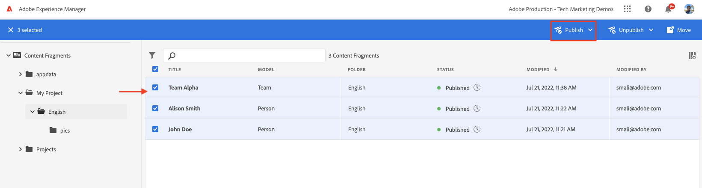

# 创作内容片段 {#authoring-content-fragments}

在本章中，您将根据 [新定义的内容片段模型](./content-fragment-models.md). 您还将了解如何创建内容片段的变体。

## 前提条件 {#prerequisites}

这是一个多部分教程，我们假定在 [定义内容片段模型](./content-fragment-models.md) 已完成。

## 目标 {#objectives}

* 基于内容片段模型创作内容片段
* 创建内容片段变量

## 创建资产文件夹

内容片段存储在AEM Assets的文件夹中。 要根据在上一章中创建的模型创建内容片段，必须创建一个文件夹才能存储这些片段。 需要对文件夹进行配置，才能从特定模型创建片段。

1. 从AEM开始屏幕中，导航到 **资产** > **文件**.

   

1. 点按 **创建** 点按 **文件夹**. 在结果对话框中，输入：

   * 标题*: **我的项目**
   * 名称： **my-project**

   

1. 选择 **我的文件夹** 文件夹，然后点按 **属性**.

   

1. 点按 **Cloud Services** 选项卡。 在 **云配置** 使用路径查找器选择 **我的项目** 配置。 值应为 `/conf/my-project`.

   

   设置此属性将允许使用上一章中创建的模型创建内容片段。

1. 点按 **策略** 选项卡。 在 **允许的内容片段模型** 使用路径查找器选择 **人员** 和 **团队** 之前创建的模型。

   

   这些策略会自动由任何子文件夹继承，并可以覆盖。 请注意，您还可以允许按标记显示模型或从其他项目配置中启用模型。 此机制为管理内容层次结构提供了一种有效的方法。

1. 点按 **保存并关闭** 以保存对文件夹属性所做的更改。

1. 在 **我的项目** 文件夹。

1. 使用以下值创建另一个文件夹：

   * 标题*: **英语**
   * 名称： **en**

   最佳做法是设置多语言支持项目。 请参阅 [以下文档页面以了解更多信息](https://experienceleague.adobe.com/docs/experience-manager-cloud-service/content/assets/admin/translate-assets.html).

## 创建内容片段 {#create-content-fragment}

接下来，将根据 **团队** 和 **人员** 模型。

1. 从AEM开始屏幕点按 **内容片段** 打开内容片段UI。

   

1. 在左边栏中，展开 **我的项目** 点按 **英语**.
1. 点按 **创建** 提起 **新内容片段** 对话框，然后输入以下值：

   * 位置: `/content/dam/my-project/en`
   * 内容片段模型： **人员**
   * 标题： **无名氏**
   * 名称: `john-doe`

   
1. 点按&#x200B;**创建**。
1. 重复上述步骤以创建表示 **艾莉森·史密斯**:

   * 位置: `/content/dam/my-project/en`
   * 内容片段模型： **人员**
   * 标题： **艾莉森·史密斯**
   * 名称: `alison-smith`

   点按 **创建** 创建新的“人员”片段。

1. 接下来，重复这些步骤以创建新 **团队** 片段表示 **A队**:

   * 位置: `/content/dam/my-project/en`
   * 内容片段模型： **团队**
   * 标题： **A队**
   * 名称: `team-alpha`

   点按 **创建** 创建新的团队片段。

1. 下面应该有三个内容片段 **我的项目** > **英语**:

   

## 编辑人员内容片段 {#edit-person-content-fragments}

接下来，使用数据填充新创建的片段。

1. 点按旁边的复选框 **无名氏** 点按 **打开**.

   

1. 内容片段编辑器包含基于内容片段模型的表单。 填写各个字段，以向 **无名氏** 片段。 对于配置文件图片，请将您自己的图像上传到AEM Assets。

   

1. 点按 **保存并关闭** 以保存对John Doe片段所做的更改。
1. 返回到内容片段UI并打开 **艾莉森·史密斯** 文件进行编辑。
1. 重复上述步骤以填充 **艾莉森·史密斯** 包含内容的片段。

## 编辑团队内容片段 {#edit-team-content-fragment}

1. 打开 **A队** 使用内容片段UI的内容片段。
1. 填写 **标题**, **短名称**&#x200B;和 **描述**.
1. 选择 **无名氏** 和 **艾莉森·史密斯** 用于填充 **团队成员** 字段：

   

   >[!NOTE]
   >
   >您还可以使用 **新内容片段** 按钮。

1. 点按 **保存并关闭** 以保存对Alpha团队片段的更改。

## 发布内容片段

审核后，发布创作的 `Content Fragments`

1. 从AEM开始屏幕点按 **内容片段** 打开内容片段UI。

1. 在左边栏中，展开 **我的项目** 点按 **英语**.

1. 点按内容片段旁边的复选框，然后点按 **发布**

   

## 恭喜！ {#congratulations}

恭喜，您刚刚创作了多个内容片段并创建了一个变体。

## 后续步骤 {#next-steps}

在下一章中， [浏览GraphQL API](explore-graphql-api.md)，您将使用内置的GrapiQL工具浏览AEM GraphQL API。 了解AEM如何根据内容片段模型自动生成GraphQL模式。 您将尝试使用GraphQL语法构建基本查询。

## 相关文档

* [管理内容片段](https://experienceleague.adobe.com/docs/experience-manager-cloud-service/content/assets/content-fragments/content-fragments-managing.html)
* [变量 - 创作片段内容](https://experienceleague.adobe.com/docs/experience-manager-cloud-service/content/assets/content-fragments/content-fragments-variations.html)
