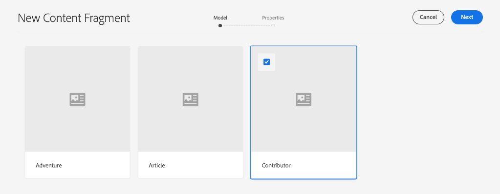
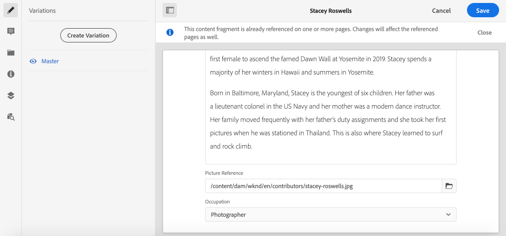
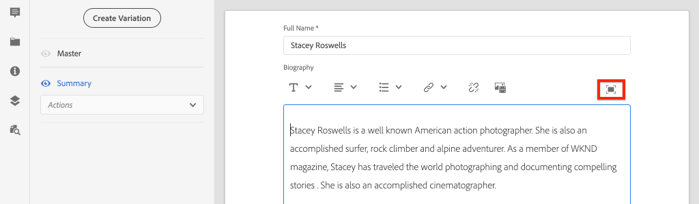
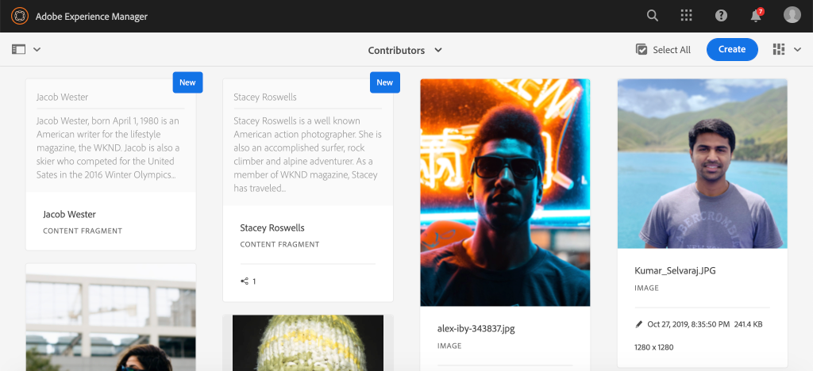

# 创作内容片段 {#authoring-content-fragments}

在本章中，您将根据[新定义的参与者内容片段模型](./content-fragment-models.md)创建和编辑新的内容片段。 您还将了解如何创建内容片段的变体。

## 前提条件 {#prerequisites}

这是一个多部分教程，假定已完成[定义内容片段模型](./content-fragment-models.md)中概述的步骤。

## 目标 {#objectives}

* 基于内容片段模型创作内容片段
* 创建内容片段变量

## 内容片段创作概述 {#overview}

>[!VIDEO](https://video.tv.adobe.com/v/22451/?quality=12&learn=on)

以上视频为创作内容片段提供了高级概述。

## 创建内容片段 {#create-content-fragment}

在上一章[定义内容片段模型](./content-fragment-models.md)中，创建了&#x200B;**参与者**&#x200B;模型。 使用此模型创作新的内容片段。

1. 从&#x200B;**AEM Start**&#x200B;菜单中，导航到&#x200B;**Assets** > **Files**。
1. 单击文件夹可导航到&#x200B;**WKND Site** > **English** > **参与者**。 此文件夹包含WKND品牌参与者的头像列表。

1. 单击右上角的&#x200B;**创建** ，然后选择&#x200B;**内容片段**:

   

1. 选择&#x200B;**Contributor**&#x200B;模型，然后单击&#x200B;**Next**。

   

   这与在上一章中创建的&#x200B;**Contributor**&#x200B;模型相同。

1. 在标题中输入&#x200B;**Stacey Roswells**，然后单击&#x200B;**创建**。
1. 单击&#x200B;**在** Success **对话框中打开** ，以打开新创建的片段。

   

   请注意，模型定义的字段现在可用于创作此内容片段实例。

1. 对于&#x200B;**全名**，输入：**Stacey Roswells**。
1. 对于&#x200B;**传记**，输入简短传记。 需要灵感吗？ 请随时重新使用此[文本文件](assets/author-content-fragments/stacey-roswells-bio.txt)。
1. 对于&#x200B;**图片引用**，单击&#x200B;**文件夹**&#x200B;图标，然后浏览到&#x200B;**WKND Site** > **英语** > **参与者** > **stacey-roswells.jpg**。 这将评估路径：`/content/dam/wknd/en/contributors/stacey-roswells.jpg`。
1. 对于&#x200B;**Aspriation**，选择&#x200B;**Photographer**。

   

1. 单击&#x200B;**Save**&#x200B;以保存更改。

## 创建内容片段变量

所有内容片段均以&#x200B;**主控**&#x200B;变量开头。 **主控**&#x200B;变量可被视为片段的&#x200B;*默认*&#x200B;内容，在通过GraphQL API公开内容时自动使用。 也可以创建内容片段的变体。 此功能为设计实施提供了额外的灵活性。

变量可用于定位特定渠道。 例如，可以创建&#x200B;**mobile**&#x200B;变体，其中包含少量文本或引用特定于渠道的图像。 变量的使用方式取决于具体的实施。 与任何功能一样，在使用之前应当进行仔细的规划。

接下来，创建一个新变体以了解可用功能。

1. 重新打开&#x200B;**Stacey Roswells**&#x200B;内容片段。
1. 在左侧边栏中，单击&#x200B;**创建变量**。
1. 在&#x200B;**New Variation**&#x200B;模式窗口中，输入&#x200B;**Summary**&#x200B;的标题。

   

1. 单击&#x200B;**Berium**&#x200B;多行字段，然后单击&#x200B;**Expand**&#x200B;按钮以输入多行字段的全屏视图。

   

1. 单击右上角菜单中的&#x200B;**Summalize Text**。

1. 输入&#x200B;****&#x200B;的&#x200B;**50**&#x200B;字的目标，然后单击&#x200B;**开始**。

   

   这将打开摘要预览。 AEM机器语言处理器将尝试根据目标字数来汇总文本。 您还可以选择要删除的不同句子。

1. 如果您对总结很满意，请单击&#x200B;**摘要**。 单击多行文本字段并切换&#x200B;**展开**&#x200B;按钮以返回到主视图。

1. 单击&#x200B;**Save**&#x200B;以保存更改。

## 创建其他内容片段

重复[创建内容片段](#create-content-fragment)中所述的步骤，以创建额外的&#x200B;**参与者**。 将在下一章中用作如何查询多个片段的示例。

1. 在&#x200B;**参与者**&#x200B;文件夹中，单击右上角的&#x200B;**创建**，然后选择&#x200B;**内容片段**:
1. 选择&#x200B;**Contributor**&#x200B;模型，然后单击&#x200B;**Next**。
1. 输入&#x200B;**Jacob Wester**&#x200B;作为标题，然后单击&#x200B;**创建**。
1. 单击&#x200B;**在** Success **对话框中打开** ，以打开新创建的片段。
1. 对于&#x200B;**全名**，输入：**雅各布·韦斯特**。
1. 对于&#x200B;**传记**，输入简短传记。 需要灵感吗？ 请随时重新使用此[文本文件](assets/author-content-fragments/jacob-wester.txt)。
1. 对于&#x200B;**图片引用**，单击&#x200B;**文件夹**&#x200B;图标并浏览到&#x200B;**WKND Site** > **英语** > **参与者** > **jacob_wester.jpg**。 这将评估路径：`/content/dam/wknd/en/contributors/jacob_wester.jpg`。
1. 对于&#x200B;**Aspriation**，选择&#x200B;**Writer**。
1. 单击&#x200B;**Save**&#x200B;以保存更改。 除非您想要，否则无需创建变量！

   

   现在，您应该有两个&#x200B;**参与者**&#x200B;片段。

## 恭喜！ {#congratulations}

恭喜，您刚刚创作了多个内容片段并创建了一个变体。

## 后续步骤 {#next-steps}

在下一章[浏览GraphQL API](explore-graphql-api.md)中，您将使用内置的GrapiQL工具浏览AEM GraphQL API。 了解AEM如何根据内容片段模型自动生成GraphQL模式。 您将尝试使用GraphQL语法构建基本查询。
