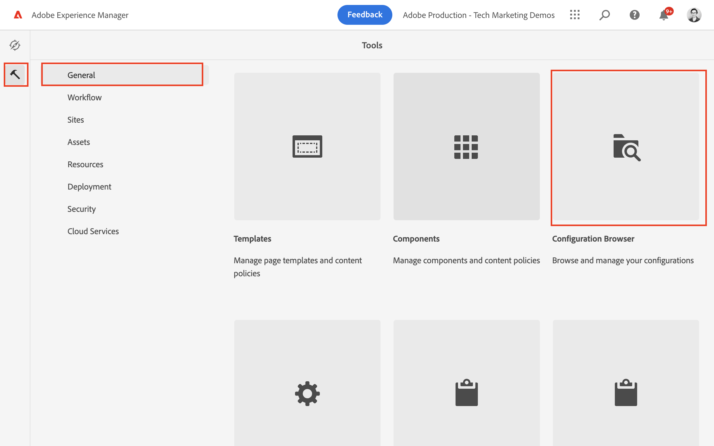
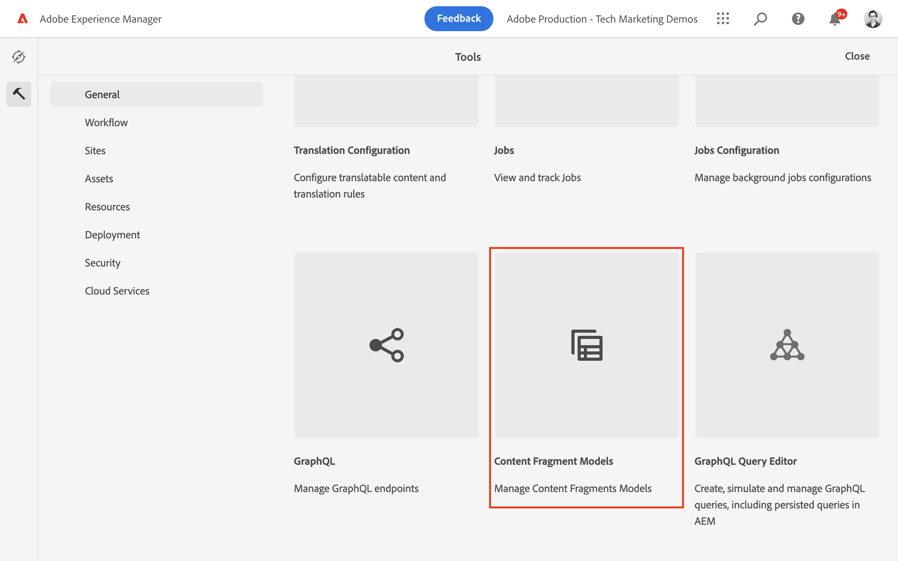

# 定义内容片段模型 {#content-fragment-models}

在本章中，了解如何使用建模内容并构建架构 **内容片段模型**. 了解可用于将架构定义为模型一部分的不同数据类型。

我们创建两个简单的模型， **团队** 和 **人员**. 此 **团队** 数据模型具有名称、简短名称和描述，并引用 **人员** 数据模型，其中包含全名、个人简历、个人资料图片和职业列表。

此外，还欢迎您按照基本步骤创建自己的模型，并调整相应的步骤，如GraphQL查询和React应用程序代码，或只是按照这些章节中概述的步骤进行操作。

## 前提条件 {#prerequisites}

这是一个多部分教程，并假定在 [AEM创作环境可用](./overview.md#prerequisites).

## 目标 {#objectives}

* 创建内容片段模型。
* 确定用于构建模型的可用数据类型和验证选项。
* 了解内容片段模型如何定义 **两者** 内容片段的数据架构和创作模板。

## 创建项目配置

项目配置包含与特定项目关联的所有内容片段模型，并提供组织模型的方法。 必须至少创建一个项目 **早于** 正在创建内容片段模型。

1. 登录AEM **作者** 环境(例如 `https://author-pYYYY-eXXXX.adobeaemcloud.com/`)
1. 从AEM开始屏幕，导航到 **工具** > **常规** > **配置浏览器**.

   
1. 单击 **创建**，位于右上角
1. 在生成的对话框中，输入：

   * 标题*： **我的项目**
   * 名称*： **my-project** (偏好使用所有小写字母并使用连字符来分隔单词。 此字符串会影响客户端应用程序执行请求的唯一GraphQL端点。)
   * Check **内容片段模型**
   * Check **GraphQL持久查询**

   

## 创建内容片段模型

接下来，为创建两个模型 **团队** 和 **人员**.

### 创建人员模型

为创建模型 **人员**，即表示属于某个团队的人员的数据模型。

1. 从AEM开始屏幕，导航到 **工具** > **常规** > **内容片段模型**.

   

1. 导航到 **我的项目** 文件夹。
1. 点按 **创建** 在右上角显示 **创建模型** 向导。
1. 在 **模型标题** 字段，输入 **人员** 并点击 **创建**. 在生成的对话框中，点按 **打开**，以构建模型。

1. 拖放 **单行文本** 元素添加到主面板。 在 **属性** 选项卡：

   * **字段标签**： **全名**
   * **属性名称**： `fullName`
   * Check **必填**

   

   此 **属性名称** 定义保留到AEM的属性的名称。 此 **属性名称** 还定义 **键** 作为数据架构一部分的此属性的名称。 此 **键** 在通过GraphQL API公开内容片段数据时使用。

1. 点按 **数据类型** 制表符并拖放 **多行文本** 下的字段 **全名** 字段。 输入以下属性：

   * **字段标签**： **传记**
   * **属性名称**： `biographyText`
   * **默认类型**： **富文本**

1. 单击 **数据类型** 制表符并拖放 **内容引用** 字段。 输入以下属性：

   * **字段标签**： **个人资料图片**
   * **属性名称**： `profilePicture`
   * **根路径**： `/content/dam`

   配置 **根路径**，您可以单击 **文件夹** 图标以调出模式窗口来选择路径。 这会限制作者可以使用哪些文件夹填充路径。 `/content/dam` 是存储所有AEM Assets（图像、视频和其他内容片段）的根。

1. 将验证添加到 **图片引用** 因此只有内容类型 **图像** 可用于填充字段。

   

1. 单击 **数据类型** 制表符并拖放 **明细列表**  数据类型位于 **图片引用** 字段。 输入以下属性：

   * **呈现为**： **复选框**
   * **字段标签**： **职业**
   * **属性名称**： `occupation`

1. 添加多个 **选项** 使用 **添加选项** 按钮。 对使用相同的值 **选项标签** 和 **选项值**：

   **艺人**， **影响因素**， **摄影师**， **Traveler**， **作者**， **YouTuber**

1. 最终的 **人员** 模型应如下所示：

   

1. 单击 **保存** 以保存更改。

### 创建团队模型

为创建模型 **团队**，即面向团队人员的数据模型。 团队模型引用“人员”模型来表示团队成员。

1. 在 **我的项目** 文件夹，点按 **创建** 在右上角显示 **创建模型** 向导。
1. 在 **模型标题** 字段，输入 **团队** 并点击 **创建**.

   点按 **打开** 在生成的对话框中，打开新创建的模型。

1. 拖放 **单行文本** 元素添加到主面板。 在 **属性** 选项卡：

   * **字段标签**： **标题**
   * **属性名称**： `title`
   * Check **必填**

1. 点按 **数据类型** 制表符并拖放 **单行文本** 元素添加到主面板。 在 **属性** 选项卡：

   * **字段标签**： **简短名称**
   * **属性名称**： `shortName`
   * Check **必填**
   * Check **独特**
   * 下， **验证类型** >选择 **自定义**
   * 下， **自定义验证正则表达式** > enter `^[a-z0-9\-_]{5,40}$`  — 这确保只能输入5到40个字符的小写字母数字值和破折号。

   此 `shortName` 属性为我们提供了一种根据缩短路径查询单个团队的方法。 此 **独特** 设置可确保该值在此模型的每个内容片段中始终是唯一的。

1. 点按 **数据类型** 制表符并拖放 **多行文本** 下的字段 **简短名称** 字段。 输入以下属性：

   * **字段标签**： **描述**
   * **属性名称**： `description`
   * **默认类型**： **富文本**

1. 单击 **数据类型** 制表符并拖放 **片段引用** 字段。 输入以下属性：

   * **呈现为**： **多个字段**
   * **字段标签**： **团队成员**
   * **属性名称**： `teamMembers`
   * **允许的内容片段模型**：使用文件夹图标选择 **人员** 模型。

1. 最终的 **团队** 模型应如下所示：

   

1. 单击 **保存** 以保存更改。

1. 您现在应该可以从以下两个模型工作：

   

## 发布项目配置和内容片段模型

经审查和验证后，发布 `Project Configuration` 和 `Content Fragment Model`

1. 从AEM开始屏幕，导航到 **工具** > **常规** > **配置浏览器**.

1. 点按旁边的复选框 **我的项目** 并点击 **Publish**

   

1. 从AEM开始屏幕，导航到 **工具** > **常规** > **内容片段模型**.

1. 导航到 **我的项目** 文件夹。

1. 点按 **人员** 和 **团队** 模型和点击 **Publish**

   

## 恭喜！ {#congratulations}

恭喜，您刚刚创建了您的第一个内容片段模型！

## 后续步骤 {#next-steps}

在下一章中， [创作内容片段模型](author-content-fragments.md)中，您将基于内容片段模型创建和编辑新的内容片段。 您还将了解如何创建内容片段的变体。

## 相关文档

* [内容片段模型](https://experienceleague.adobe.com/docs/experience-manager-cloud-service/content/assets/content-fragments/content-fragments-models.html)

