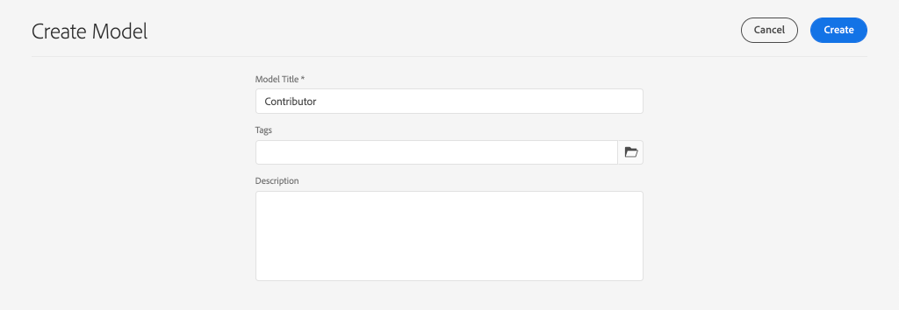

# 定义内容片段模型 {#content-fragment-models}

在本章中，了解如何对内容建模并使用 **内容片段模型**. 您将检查现有模型并创建新模型。 您还将了解可用于定义模式作为模型一部分的不同数据类型。

在本章中，您将为 **参与者**，这是作为WKND品牌一部分创作杂志和冒险内容的用户的数据模型。

## 前提条件 {#prerequisites}

这是一个多部分教程，我们假定在 [快速设置](../quick-setup/local-sdk.md) 已完成。

## 目标 {#objectives}

* 创建新的内容片段模型。
* 确定用于构建模型的可用数据类型和验证选项。
* 了解内容片段模型如何定义 **both** 内容片段的数据架构和创作模板。

## 内容片段模型概述 {#overview}

>[!VIDEO](https://video.tv.adobe.com/v/22452/?quality=12&learn=on)

以上视频提供了有关使用内容片段模型的高级概述。

>[!CAUTION]
>
> 以上视频演示了 **参与者** 名为的模型 `Contributors`. 在您自己的环境中执行这些步骤时，请确保标题使用单数形式： `Contributor` 没有 **s**. 内容片段模型的命名驱动着GraphQL API调用，该调用将在本教程的稍后部分中执行。

## Inspect冒险内容片段模型

在上一章中，在外部应用程序上编辑和显示了几个冒险内容片段。 让我们检查冒险内容片段模型，以了解这些片段的基础数据架构。

1. 从 **AEM开始** 菜单导航到 **工具** > **资产** > **内容片段模型**.

   

1. 导航到 **WKND站点** 文件夹，并将鼠标悬停在 **冒险** 内容片段模型，然后单击 **编辑** 图标（铅笔）以打开模型。

   

1. 这将打开 **内容片段模型编辑器**. 请注意，定义Adventure模型的字段包含不同 **数据类型** 点赞 **单行文本**, **多行文本**, **明细列表**&#x200B;和 **内容参考**.

1. 编辑器的右列列出了可用的 **数据类型** 定义用于创作内容片段的表单字段。

1. 选择 **标题** 字段。 在右列中，单击 **属性** 选项卡：

   

   观察 **属性名称** 字段设置为 `adventureTitle`. 这可定义保留到AEM的属性的名称。 的 **属性名称** 还定义 **key** 作为数据架构一部分的此属性的名称。 此 **key** 将在通过GraphQL API公开内容片段数据时使用。

   >[!CAUTION]
   >
   > 修改 **属性名称** 字段 **after** 内容片段是从模型派生的，具有下游效果。 现有片段中的字段值将不再被引用，GraphQL公开的数据架构将发生更改，从而影响现有应用程序。

1. 在 **属性** 选项卡，并查看 **验证类型** 下拉列表。

   

   表单验证功能现成可用 **电子邮件** 和 **URL**. 也可以定义 **自定义** 使用正则表达式进行验证。

1. 单击 **取消** 以关闭内容片段模型编辑器。

## 创建参与者模型

接下来，为 **参与者**，这是作为WKND品牌一部分创作杂志和冒险内容的用户的数据模型。

1. 单击 **创建** 在右上角， **创建模型** 向导。
1. 对于 **模型标题** 输入： **参与者** 单击 **创建**

   

   单击 **打开** 打开新创建的模型。

1. 拖放 **单行文本** 元素。 在 **属性** 选项卡：

   * **字段标签**: **全名**
   * **属性名称**: `fullName`
   * 检查 **必需**

   

1. 单击 **数据类型** 选项卡，并拖放 **多行文本** 字段 **全名** 字段。 输入以下属性：

   * **字段标签**: **传记**
   * **属性名称**: `biographyText`
   * **默认类型**: **富文本**

1. 单击 **数据类型** 选项卡，并拖放 **内容参考** 字段。 输入以下属性：

   * **字段标签**: **图片参考**
   * **属性名称**: `pictureReference`
   * **根路径**: `/content/dam/wknd`

   配置 **根路径** 您可以单击 **文件夹** 图标来显示用于选择路径的模式窗口。 这将限制作者可以使用哪些文件夹来填充路径。

   

1. 向 **图片参考** 以便仅查看内容类型 **图像** 可用于填充字段。

   

1. 单击 **数据类型** 选项卡，并拖放 **明细列表**  下方的数据类型 **图片参考** 字段。 输入以下属性：

   * **字段标签**: **职业**
   * **属性名称**: `occupation`

1. 添加多个 **选项** 使用 **添加选项** 按钮。 对 **选项标签** 和 **选项值**:

   **艺术家**, **影响者**, **摄影师**, **旅行者**, **作者**, **YouTube**

   

1. 最后 **参与者** 模型应如下所示：

   

1. 单击 **保存** 以保存更改。

## 启用参与者模型

内容片段模型需要 **已启用** 内容作者使用它之前。 可以 **禁用** 内容片段模型，因此禁止作者使用该模型。 回顾修改 **属性名称** 模型中字段的会更改基础数据架构，并且对现有片段和外部应用程序具有显着的下游影响。 建议仔细规划用于 **属性名称** 的字段。

1. 确保 **参与者** 模型当前位于 **已启用** 状态。

   

   可以通过将鼠标悬停在卡片上并单击 **禁用** / **启用** 图标。

## 恭喜！ {#congratulations}

恭喜，您刚刚创建了您的第一个内容片段模型！

## 后续步骤 {#next-steps}

在下一章中， [创作内容片段模型](author-content-fragments.md)，您将根据内容片段模型创建和编辑新的内容片段。 您还将了解如何创建内容片段的变体。
