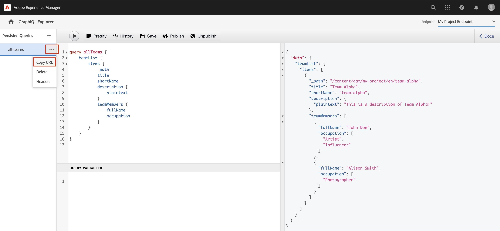
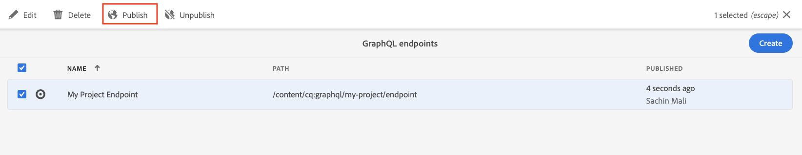

# 探索GraphQL API {#explore-graphql-apis}

AEM的GraphQL API提供了一种强大的查询语言，用于将内容片段的数据公开给下游应用程序。 内容片段模型定义内容片段使用的数据架构。 每当创建或更新内容片段模型时，都会翻译架构并将其添加到组成GraphQL API的“图形”。

在本章中，我们来探索一些常见的GraphQL查询，以使用名为的IDE收集内容 [GraphiQL](https://github.com/graphql/graphiql). GraphiQL IDE允许您快速测试和优化返回的查询和数据。 它还提供对文档的轻松访问，使其能够轻松地学习和了解有哪些方法可用。

## 前提条件 {#prerequisites}

这是一个多部分教程，假定其中包含了 [创作内容片段](./author-content-fragments.md) 已完成。

## 目标 {#objectives}

* 了解如何使用GraphiQL工具通过GraphQL语法构建查询。
* 了解如何查询内容片段的列表和单个内容片段。
* 了解如何过滤和请求特定数据属性。
* 了解如何连接多个内容片段模型的查询
* 了解如何持久GraphQL查询。

## 启用 GraphQL 端点 {#enable-graphql-endpoint}

必须配置GraphQL端点才能为内容片段启用GraphQL API查询。

1. 从AEM开始屏幕，导航到 **工具** > **常规** > **GraphQL**.

   

1. 点按 **创建** 在生成的对话框中，输入以下值：

   * 名称*： **我的项目端点**.
   * 使用由以下对象提供的GraphQL架构…… *： **我的项目**

   

   点按 **创建** 以保存端点。

   基于项目配置创建的GraphQL端点仅启用对属于该项目的模型的查询。 在这种情况下，仅针对 **人员** 和 **团队** 可以使用模型。

   >[!NOTE]
   >
   > 还可以创建全局端点以启用跨多个配置的模型查询。 使用此选项时应当谨慎，因为它可能会使环境面临更多安全漏洞，并增加管理AEM的整体复杂性。

1. 此时，您应会看到环境中启用了一个GraphQL端点。

   

## 使用 GraphiQL IDE

此 [GraphiQL](https://experienceleague.adobe.com/docs/experience-manager-cloud-service/content/headless/graphql-api/graphiql-ide.html) 开发人员可以使用工具针对当前AEM环境中的内容创建和测试查询。 GraphiQL工具还使用户能够 **保留或保存** 在生产设置中由客户端应用程序使用的查询。

接下来，使用内置的GraphiQL IDE探索AEM GraphQL API的强大功能。

1. 从AEM开始屏幕，导航到 **工具** > **常规** > **GraphQL查询编辑器**.

   

   >[!NOTE]
   >
   > 在中，可能未内置旧版AEM GraphiQL IDE。 它可以按照以下步骤手动安装 [说明](#install-graphiql).

1. 在右上角，确保将“端点”设置为 **我的项目端点**.

   

这会将所有查询的范围限定于在 **我的项目** 项目。

### 查询内容片段列表 {#query-list-cf}

常见要求是查询多个内容片段。

1. 将以下查询粘贴到主面板中（替换注释列表）：

   ```graphql
   query allTeams {
     teamList {
       items {
         _path
         title
       }
     }
   } 
   ```

1. 按 **播放** 按钮来执行查询。 您应该会看到上一章内容片段的结果：

   

1. 将光标放置在 `title` 文本并输入 **CTRL+空格键** 以触发代码提示。 添加 `shortname` 和 `description` 到查询。

   

1. 通过按 **播放** 按钮时，您应该看到结果包含 `shortname` 和 `description`.

   

   此 `shortname` 是一个简单的属性，并且 `description` 是一个多行文本字段，GraphQL API允许我们为结果选择各种格式，如 `html`， `markdown`， `json`，或 `plaintext`.

### 查询嵌套片段

接下来，尝试查询以检索嵌套片段，请记住 **团队** 模型引用 **人员** 模型。

1. 更新查询以包含 `teamMembers` 属性。 请记住，这是 **片段引用** 人员模型的字段。 可返回人员模型的属性：

   ```graphql
   query allTeams {
       teamList {
           items {
               _path
               title
               shortName
               description {
                   plaintext
               }
               teamMembers {
                   fullName
                   occupation
               }
           }
       }
   }
   ```

   JSON响应：

   ```json
   {
       "data": {
           "teamList": {
           "items": [
               {
               "_path": "/content/dam/my-project/en/team-alpha",
               "title": "Team Alpha",
               "shortName": "team-alpha",
               "description": {
                   "plaintext": "This is a description of Team Alpha!"
               },
               "teamMembers": [
                   {
                   "fullName": "John Doe",
                   "occupation": [
                       "Artist",
                       "Influencer"
                   ]
                   },
                   {
                   "fullName": "Alison Smith",
                   "occupation": [
                       "Photographer"
                   ]
                   }
                 ]
           }
           ]
           }
       }
   }
   ```

   能够针对嵌套片段进行查询是AEM GraphQL API的强大功能。 在这个简单的示例中，嵌套只有两层深。 然而，有可能进一步巢状化碎片。 例如，如果有 **地址** 与关联的模型 **人员** 可以在单个查询中返回来自所有三个模型的数据。

### 筛选内容片段列表 {#filter-list-cf}

接下来，我们看一下如何能够根据属性值将结果过滤为内容片段的子集。

1. 在GraphiQL UI中输入以下查询：

   ```graphql
   query personByName($name:String!){
     personList(
       filter:{
         fullName:{
           _expressions:[{
             value:$name
             _operator:EQUALS
           }]
         }
       }
     ){
       items{
         _path
         fullName
         occupation
       }
     }
   }  
   ```

   上述查询对系统中的所有人员片段执行搜索。 在查询开头添加的过滤器会对 `name` 字段和变量字符串 `$name`.

1. 在 **查询变量** 面板输入以下内容：

   ```json
   {"name": "John Doe"}
   ```

1. 执行查询，应仅 **人员** 返回内容片段的值为 `John Doe`.

   

   还有许多其他选项可用于筛选和创建复杂查询，请参阅 [了解如何将GraphQL与AEM结合使用 — 示例内容和查询](https://experienceleague.adobe.com/docs/experience-manager-cloud-service/content/headless/graphql-api/sample-queries.html).

1. 增强上述查询以获取配置文件图片

   ```graphql
   query personByName($name:String!){
     personList(
       filter:{
         fullName:{
           _expressions:[{
             value:$name
             _operator:EQUALS
           }]
         }
       }
     ){
       items{  
         _path
         fullName
         occupation
         profilePicture{
           ... on ImageRef{
             _path
             _authorUrl
             _publishUrl
             height
             width
   
           }
         }
       }
     }
   } 
   ```

   此 `profilePicture` 是一个内容引用，由于它应该是图像，因此是内置的 `ImageRef` 对象已使用。 这样，我们即可请求有关所引用图像的附加数据，例如 `width` 和 `height`.

### 查询单个内容片段 {#query-single-cf}

也可以直接查询单个内容片段。 AEM中的内容以分层方式存储，片段的唯一标识符基于片段的路径。

1. 在GraphiQL编辑器中输入以下查询：

   ```graphql
   query personByPath($path: String!) {
       personByPath(_path: $path) {
           item {
           fullName
           occupation
           }
       }
   }
   ```

1. 输入以下内容 **查询变量**：

   ```json
   {"path": "/content/dam/my-project/en/alison-smith"}
   ```

1. 执行查询并观察是否返回了单个结果。

## 持久查询 {#persist-queries}

一旦开发人员对查询和从查询返回的结果数据感到满意，下一步就是将查询存储或保留到AEM。 此 [持久查询](https://experienceleague.adobe.com/docs/experience-manager-cloud-service/content/headless/graphql-api/persisted-queries.html) 是将GraphQL API公开给客户端应用程序的首选机制。 持久查询后，可以使用GET请求来请求它，并将其缓存在Dispatcher和CDN层。 持久查询的性能要好得多。 除了性能优势之外，持久查询还可以确保不会意外向客户端应用程序显示额外数据。 更多有关 [可以在此处找到持久查询](https://experienceleague.adobe.com/docs/experience-manager-cloud-service/content/headless/graphql-api/persisted-queries.html).

接下来，保留两个简单查询，它们将在下一章中使用。

1. 在GraphiQL IDE中输入以下查询：

   ```graphql
   query allTeams {
       teamList {
           items {
               _path
               title
               shortName
               description {
                   plaintext
               }
               teamMembers {
                   fullName
                   occupation
               }
           }
       }
   }
   ```

   验证查询是否有效。

1. 下一次点按 **另存为** 并输入 `all-teams` 作为 **查询名称**.

   查询应显示在下 **持久查询** 在左边栏中。

   
1. 接下来，点按省略号 **...** 在持久查询旁边，然后点击 **复制URL** 以将路径复制到剪贴板。

   

1. 打开新选项卡并将复制的路径粘贴到浏览器中：

   ```plain
   https://$YOUR-AEMasCS-INSTANCEID$.adobeaemcloud.com/graphql/execute.json/my-project/all-teams
   ```

   它应该类似于上述路径。 您应会看到查询返回的JSON结果。

   划分上述URL：

   | 名称 | 描述 |
   | ---------|---------- |
   | `/graphql/execute.json` | 持久查询端点 |
   | `/my-project` | 的项目配置 `/conf/my-project` |
   | `/all-teams` | 持久查询的名称 |

1. 返回到GraphiQL IDE并使用加号按钮 **+** 保留NEW查询

   ```graphql
   query personByName($name: String!) {
     personList(
       filter: {
         fullName:{
           _expressions: [{
             value: $name
             _operator:EQUALS
           }]
         }
       }){
       items {
         _path
         fullName
         occupation
         biographyText {
           json
         }
         profilePicture {
           ... on ImageRef {
             _path
             _authorUrl
             _publishUrl
             width
             height
           }
         }
       }
     }
   }
   ```

1. 将查询另存为： `person-by-name`.
1. 您应该保存两个持久查询：

   


## 发布GraphQL端点和持久查询

经审查和验证后，发布 `GraphQL Endpoint` 和 `Persisted Queries`

1. 从AEM开始屏幕，导航到 **工具** > **常规** > **GraphQL**.

1. 点按旁边的复选框 **我的项目端点** 并点击 **Publish**

   

1. 从AEM开始屏幕，导航到 **工具** > **常规** > **GraphQL查询编辑器**

1. 点按 **所有团队** 从“持久查询”面板中查询并点按 **Publish**

   

1. 重复上述步骤以用于 `person-by-name` 查询

## 解决方案文件 {#solution-files}

下载在前三章中创建的内容、模型和持久查询： [basic-tutorial-solution.content.zip](assets/explore-graphql-api/basic-tutorial-solution.content.zip)

## 其他资源

要了解有关GraphQL查询的更多信息，请访问 [了解如何将GraphQL与AEM结合使用 — 示例内容和查询](https://experienceleague.adobe.com/docs/experience-manager-cloud-service/content/headless/graphql-api/sample-queries.html).

## 恭喜！ {#congratulations}

恭喜，您已创建并执行多个GraphQL查询！

## 后续步骤 {#next-steps}

在下一章中， [构建React应用程序](./graphql-and-react-app.md)中，您将了解外部应用程序如何查询AEM GraphQL端点并使用这两个持久查询。 此外，还向您介绍了在GraphQL查询执行期间进行的一些基本错误处理。

## 安装GraphiQL工具（可选） {#install-graphiql}

在中，某些版本的AEM (6.X.X) GraphiQL IDE工具需要手动安装，请使用 [此处说明](../how-to/install-graphiql-aem-6-5.md).

