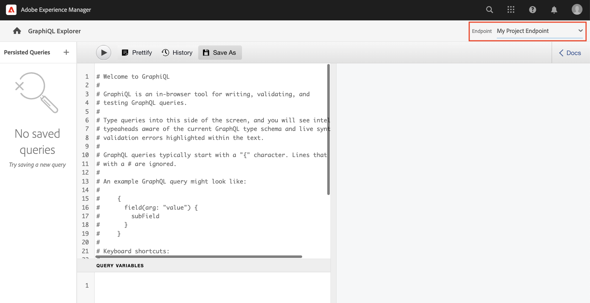

# 探索GraphQL API {#explore-graphql-apis}

AEM的GraphQL API提供了一种强大的查询语言，用于将内容片段的数据公开给下游应用程序。 内容片段模型定义内容片段使用的数据架构。 每当创建或更新内容片段模型时，都会翻译架构并将其添加到组成GraphQL API的“图形”。

在本章中，让我们探索一些常见的GraphQL查询，以使用名为[GraphiQL](https://github.com/graphql/graphiql)的IDE收集内容。 GraphiQL IDE允许您快速测试和优化返回的查询和数据。 它还提供对文档的轻松访问，使其能够轻松地学习和了解有哪些方法可用。

## 先决条件 {#prerequisites}

这是一个多部分教程，并假定已完成[创作内容片段](./author-content-fragments.md)中概述的步骤。

## 目标 {#objectives}

* 了解如何使用GraphiQL工具通过GraphQL语法构建查询。
* 了解如何查询内容片段的列表和单个内容片段。
* 了解如何过滤和请求特定数据属性。
* 了解如何连接多个内容片段模型的查询
* 了解如何持久GraphQL查询。

## 启用 GraphQL 端点 {#enable-graphql-endpoint}

必须配置GraphQL端点才能为内容片段启用GraphQL API查询。

1. 从AEM开始屏幕中，导航到&#x200B;**工具** > **常规** > **GraphQL**。

   

1. 点按右上角的&#x200B;**创建**，在生成的对话框中，输入以下值：

   * 名称*：**我的项目终结点**。
   * 使用由以下对象提供的GraphQL架构…… *： **我的项目**

   

   点按&#x200B;**创建**&#x200B;以保存终结点。

   基于项目配置创建的GraphQL端点仅启用对属于该项目的模型的查询。 在这种情况下，只能使用对&#x200B;**人员**&#x200B;和&#x200B;**团队**&#x200B;模型的查询。

   >[!NOTE]
   >
   > 还可以创建全局端点以启用跨多个配置的模型查询。 使用此选项时应谨慎，因为它可能会使环境面临更多安全漏洞，并会增加管理AEM的整体复杂性。

1. 此时，您应会看到环境中启用了一个GraphQL端点。

   

## 使用 GraphiQL IDE

[GraphiQL](https://experienceleague.adobe.com/docs/experience-manager-cloud-service/content/headless/graphql-api/graphiql-ide.html)工具使开发人员能够针对当前AEM环境中的内容创建和测试查询。 GraphiQL工具还使用户能够&#x200B;**保留或保存**&#x200B;查询，以供生产设置中的客户端应用程序使用。

接下来，使用内置的GraphiQL IDE来探索AEM的GraphQL API的强大功能。

1. 从AEM“开始”屏幕中，导航到&#x200B;**工具** > **常规** > **GraphQL查询编辑器**。

   

   >[!NOTE]
   >
   > 在中，旧版本的AEM可能未内置GraphiQL IDE。 可以按照这些[说明](#install-graphiql)手动安装。

1. 在右上角，确保终结点设置为&#x200B;**我的项目终结点**。

   

这会将所有查询的范围设定为在&#x200B;**我的项目**&#x200B;项目中所创建的模型。

### 查询内容片段列表 {#query-list-cf}

常见要求是查询多个内容片段。

1. 将以下查询粘贴到主面板中（替换注释列表）：

   ```graphql
   query allTeams {
     teamList {
       items {
         _path
         title
       }
     }
   } 
   ```

1. 按顶部菜单中的&#x200B;**播放**&#x200B;按钮执行查询。 您应该会看到上一章内容片段的结果：

   

1. 将光标置于`title`文本下方并输入&#x200B;**CTRL+空格键**&#x200B;以触发代码提示。 将`shortname`和`description`添加到查询。

   

1. 按&#x200B;**播放**&#x200B;按钮再次执行查询，您应该会看到结果包含`shortname`和`description`的其他属性。

   

   `shortname`是一个简单的属性，`description`是一个多行文本字段，GraphQL API允许我们为结果（如`html`、`markdown`、`json`或`plaintext`）选择各种格式。

### 查询嵌套片段

接下来，尝试查询正在检索嵌套片段，请记住&#x200B;**团队**&#x200B;模型引用了&#x200B;**人员**&#x200B;模型。

1. 更新查询以包含`teamMembers`属性。 记住，这是人员模型的&#x200B;**片段引用**&#x200B;字段。 可返回人员模型的属性：

   ```graphql
   query allTeams {
       teamList {
           items {
               _path
               title
               shortName
               description {
                   plaintext
               }
               teamMembers {
                   fullName
                   occupation
               }
           }
       }
   }
   ```

   JSON响应：

   ```json
   {
       "data": {
           "teamList": {
           "items": [
               {
               "_path": "/content/dam/my-project/en/team-alpha",
               "title": "Team Alpha",
               "shortName": "team-alpha",
               "description": {
                   "plaintext": "This is a description of Team Alpha!"
               },
               "teamMembers": [
                   {
                   "fullName": "John Doe",
                   "occupation": [
                       "Artist",
                       "Influencer"
                   ]
                   },
                   {
                   "fullName": "Alison Smith",
                   "occupation": [
                       "Photographer"
                   ]
                   }
                 ]
           }
           ]
           }
       }
   }
   ```

   能够针对嵌套片段进行查询是AEM GraphQL API的强大功能。 在这个简单的示例中，嵌套只有两层深。 然而，有可能进一步巢状化碎片。 例如，如果有一个&#x200B;**Address**&#x200B;模型与&#x200B;**人员**&#x200B;关联，则可以在单个查询中返回来自所有三个模型的数据。

### 筛选内容片段列表 {#filter-list-cf}

接下来，我们看一下如何能够根据属性值将结果过滤为内容片段的子集。

1. 在GraphiQL UI中输入以下查询：

   ```graphql
   query personByName($name:String!){
     personList(
       filter:{
         fullName:{
           _expressions:[{
             value:$name
             _operator:EQUALS
           }]
         }
       }
     ){
       items{
         _path
         fullName
         occupation
       }
     }
   }  
   ```

   上述查询对系统中的所有人员片段执行搜索。 添加到查询开头的筛选器对`name`字段和变量字符串`$name`执行比较。

1. 在&#x200B;**查询变量**&#x200B;面板中输入以下内容：

   ```json
   {"name": "John Doe"}
   ```

1. 执行查询，应仅返回&#x200B;**人**&#x200B;内容片段，其值为`John Doe`。

   

   有许多其他选项可用于筛选和创建复杂查询，请参阅[学习将GraphQL与AEM结合使用 — 示例内容和查询](https://experienceleague.adobe.com/docs/experience-manager-cloud-service/content/headless/graphql-api/sample-queries.html)。

1. 增强上述查询以获取配置文件图片

   ```graphql
   query personByName($name:String!){
     personList(
       filter:{
         fullName:{
           _expressions:[{
             value:$name
             _operator:EQUALS
           }]
         }
       }
     ){
       items{  
         _path
         fullName
         occupation
         profilePicture{
           ... on ImageRef{
             _path
             _authorUrl
             _publishUrl
             height
             width
   
           }
         }
       }
     }
   } 
   ```

   `profilePicture`是内容引用，它应为图像，因此使用内置`ImageRef`对象。 这允许我们请求有关所引用图像的附加数据，如`width`和`height`。

### 查询单个内容片段 {#query-single-cf}

也可以直接查询单个内容片段。 AEM中的内容以分层方式存储，片段的唯一标识符基于片段的路径。

1. 在GraphiQL编辑器中输入以下查询：

   ```graphql
   query personByPath($path: String!) {
       personByPath(_path: $path) {
           item {
           fullName
           occupation
           }
       }
   }
   ```

1. 为&#x200B;**查询变量**&#x200B;输入以下内容：

   ```json
   {"path": "/content/dam/my-project/en/alison-smith"}
   ```

1. 执行查询并观察是否返回了单个结果。

## 持久查询 {#persist-queries}

一旦开发人员对从查询返回的查询和结果数据满意，下一步就是将查询存储或保留到AEM。 [持久查询](https://experienceleague.adobe.com/docs/experience-manager-cloud-service/content/headless/graphql-api/persisted-queries.html)是向客户端应用程序公开GraphQL API的首选机制。 持久查询后，可以使用GET请求来请求它，并缓存到Dispatcher和CDN层。 持久查询的性能要好得多。 除了性能优势之外，持久查询还可以确保不会意外向客户端应用程序显示额外数据。 有关[持久查询的更多详细信息见此处](https://experienceleague.adobe.com/docs/experience-manager-cloud-service/content/headless/graphql-api/persisted-queries.html)。

接下来，保留两个简单查询，它们将在下一章中使用。

1. 在GraphiQL IDE中输入以下查询：

   ```graphql
   query allTeams {
       teamList {
           items {
               _path
               title
               shortName
               description {
                   plaintext
               }
               teamMembers {
                   fullName
                   occupation
               }
           }
       }
   }
   ```

   验证查询是否有效。

1. 接下来，点按&#x200B;**另存为**，并输入`all-teams`作为&#x200B;**查询名称**。

   查询应显示在左边栏中的&#x200B;**持久查询**&#x200B;下。

   
1. 接下来，点按永久查询旁边的省略号&#x200B;**...**，然后点按&#x200B;**复制URL**&#x200B;以将路径复制到剪贴板。

   

1. 打开新选项卡并将复制的路径粘贴到浏览器中：

   ```plain
   https://$YOUR-AEMasCS-INSTANCEID$.adobeaemcloud.com/graphql/execute.json/my-project/all-teams
   ```

   它应该类似于上述路径。 您应会看到查询返回的JSON结果。

   划分上述URL：

   | 名称 | 描述 |
   | ---------|---------- |
   | `/graphql/execute.json` | 持久查询端点 |
   | `/my-project` | `/conf/my-project`的项目配置 |
   | `/all-teams` | 持久查询的名称 |

1. 返回GraphiQL IDE并使用加号按钮&#x200B;**+**&#x200B;保留NEW查询

   ```graphql
   query personByName($name: String!) {
     personList(
       filter: {
         fullName:{
           _expressions: [{
             value: $name
             _operator:EQUALS
           }]
         }
       }){
       items {
         _path
         fullName
         occupation
         biographyText {
           json
         }
         profilePicture {
           ... on ImageRef {
             _path
             _authorUrl
             _publishUrl
             width
             height
           }
         }
       }
     }
   }
   ```

1. 将查询另存为： `person-by-name`。
1. 您应该保存两个持久查询：

   


## 发布GraphQL端点和持久查询

审核和验证后，发布`GraphQL Endpoint`和`Persisted Queries`

1. 从AEM开始屏幕中，导航到&#x200B;**工具** > **常规** > **GraphQL**。

1. 点按&#x200B;**我的项目端点**&#x200B;旁边的复选框，然后点按&#x200B;**发布**

   

1. 从AEM开始屏幕中，导航到&#x200B;**工具** > **常规** > **GraphQL查询编辑器**

1. 点按“持久查询”面板中的&#x200B;**所有团队**&#x200B;查询，然后点按&#x200B;**发布**

   

1. 对`person-by-name`查询重复上述步骤

## 解决方案文件 {#solution-files}

下载在最后三章中创建的内容、模型和持久查询： [basic-tutorial-solution.content.zip](assets/explore-graphql-api/basic-tutorial-solution.content.zip)

## 其他资源

要了解有关GraphQL查询的更多信息，请访问[学习将GraphQL与AEM结合使用 — 示例内容和查询](https://experienceleague.adobe.com/docs/experience-manager-cloud-service/content/headless/graphql-api/sample-queries.html)。

## 恭喜！ {#congratulations}

恭喜，您已创建并执行多个GraphQL查询！

## 后续步骤 {#next-steps}

在下一章[构建React应用程序](./graphql-and-react-app.md)中，您将探索外部应用程序如何查询AEM的GraphQL端点并使用这两个持久查询。 此外，还向您介绍了在GraphQL查询执行期间进行的一些基本错误处理。

## 安装GraphiQL工具（可选） {#install-graphiql}

在中，某些版本的AEM (6.X.X)需要手动安装GraphiQL IDE工具，请使用此处[&#128279;](../how-to/install-graphiql-aem-6-5.md)中的说明。

