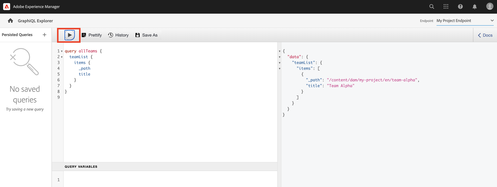

# 浏览GraphQL API {#explore-graphql-apis}

AEM的GraphQL API提供了一种功能强大的查询语言，用于将内容片段的数据公开到下游应用程序。 内容片段模型定义内容片段使用的数据架构。 每当创建或更新内容片段模型时，架构都会进行转换并添加到构成GraphQL API的“图形”中。

在本章中，我们将探索一些常见的GraphQL查询，以使用名为 [GraphiQL](https://github.com/graphql/graphiql). GraphiQL IDE允许您快速测试和优化返回的查询和数据。 GraphiQL 还提供了对文档的轻松访问，使其可以轻松地学习和了解有哪些方法可用。

## 前提条件 {#prerequisites}

这是一个多部分教程，我们假定在 [创作内容片段](./author-content-fragments.md) 已完成。

## 目标 {#objectives}

* 了解如何使用GraphiQL工具使用GraphQL语法构建查询。
* 了解如何查询内容片段和单个内容片段的列表。
* 了解如何过滤和请求特定数据属性。
* 了解如何连接多个内容片段模型的查询
* 了解如何保留GraphQL查询。

## 启用 GraphQL 端点 {#enable-graphql-endpoint}

需要配置GraphQL端点，以为内容片段启用GraphQL API查询。

1. 从AEM开始屏幕中，导航到 **工具** > **常规** > **GraphQL**.

   

1. 点按 **创建** 在右上角。 在对话框中输入以下值：

   * 名称*: **我的项目端点**.
   * 使用…… *提供的GraphQL模式： **我的项目**

   

   点按 **创建** 以保存端点。

   基于项目配置创建的GraphQL端点将仅对属于该项目的模型启用查询。 在本例中，仅对 **人员** 和 **团队** 可以使用模型。

   >[!NOTE]
   >
   > 还可以创建全局端点，以便跨项目对模型进行查询。 例如，如果要组合一个查询，该查询涉及 **WKND共享** 项目和 **我的项目**. 应谨慎使用，并且仅在必要时使用，因为它可能会向其他安全漏洞打开环境。

1. 现在，您应会看到环境中已启用的两个GraphQL端点（假定您已安装WKND共享内容）。

   

## 使用 GraphiQL IDE

的 [GraphiQL工具](https://experienceleague.adobe.com/docs/experience-manager-cloud-service/content/headless/graphql-api/graphiql-ide.html) 允许开发人员在当前AEM环境中针对内容创建和测试查询。 GraphiQL工具还允许用户 **persist** 或将要由客户端应用程序在生产设置中使用的查询保存。

接下来，使用内置的GraphiQL IDE来探索AEM GraphQL API的强大功能。

1. 从AEM开始屏幕中，导航到 **工具** > **常规** > **GraphQL查询编辑器**.

   

   >[!NOTE]
   >
   > 对于AEM的旧版本，可能无法内置GraphiQL IDE。 可以按照以下步骤手动安装 [说明](#install-graphiql).

1. 在右上角，将 **端点** to **我的项目端点**.

   

   这会将所有查询的范围扩展到 **我的项目** 项目。 请注意，还有一个 **WKND共享**.

### 查询内容片段列表 {#query-list-cf}

一个常见要求是查询多个内容片段。

1. 将以下查询粘贴到主面板中（替换注释列表）：

   ```graphql
   query allTeams {
     teamList {
       items {
         _path
         title
       }
     }
   } 
   ```

1. 按 **播放** 按钮以执行查询。 您应会看到上一章中内容片段的结果：

   

1. 将光标放在 `title` 文本和输入 **CTRL+空格键** 来触发代码提示。 添加 `shortname` 和 `description` 到查询。

   

1. 通过按 **播放** 按钮时，您应会看到结果包括 `shortname` 和 `description`.

   

   的 `shortname` 是一个简单的属性， `description` 是多行文本字段，GraphQL API允许我们为诸如之类的结果选择多种格式 `html`, `markdown`, `json` 或 `plaintext`.

### 嵌套片段的查询

接下来，尝试进行查询的是检索嵌套片段，请记住 **团队** 模型参照 **人员** 模型。

1. 更新查询以包含 `teamMembers` 属性。 回想一下，这是 **片段引用** 字段。 可以返回人员模型的属性：

   ```graphql
   query allTeams {
       teamList {
           items {
               _path
               title
               shortName
               description {
                   plaintext
               }
               teamMembers {
                   fullName
                   occupation
               }
           }
       }
   }
   ```

   JSON响应：

   ```json
   {
       "data": {
           "teamList": {
           "items": [
               {
               "_path": "/content/dam/my-project/en/team-alpha",
               "title": "Team Alpha",
               "shortName": "team-alpha",
               "description": {
                   "plaintext": "This is a description of Team Alpha!"
               },
               "teamMembers": [
                   {
                   "fullName": "John Doe",
                   "occupation": [
                       "Artist",
                       "Influencer"
                   ]
                   },
                   {
                   "fullName": "Alison Smith",
                   "occupation": [
                       "Photographer"
                   ]
                   }
                 ]
           }
           ]
           }
       }
   }
   ```

   对嵌套片段进行查询的功能是AEM GraphQL API的强大功能。 在这个简单的示例中，嵌套只有两层深度。 然而，它可以进一步嵌套碎片。 例如，如果 **地址** 与 **人员** 可以在单个查询中返回所有三个模型的数据。

### 过滤内容片段列表 {#filter-list-cf}

接下来，让我们看看如何根据属性值将结果过滤为内容片段的子集。

1. 在GraphiQL UI中输入以下查询：

   ```graphql
   query personByName($name:String!){
     personList(
       filter:{
         fullName:{
           _expressions:[{
             value:$name
             _operator:EQUALS
           }]
         }
       }
     ){
       items{
         _path
         fullName
         occupation
       }
     }
   }  
   ```

   上述查询对系统中的所有人员片段执行搜索。 向查询开头添加的过滤器将对 `name` 字段和变量字符串 `$name`.

1. 在 **查询变量** 面板输入以下内容：

   ```json
   {"name": "John Doe"}
   ```

1. 执行查询时，应仅 **人员** 将返回，其值为“John Doe”。

   

   还有许多其他选项可用于筛选和创建复杂查询，请参阅 [了解如何将GraphQL与AEM结合使用 — 示例内容和查询](https://experienceleague.adobe.com/docs/experience-manager-cloud-service/assets/admin/content-fragments-graphql-samples.html?lang=zh-Hans).

1. 增强上述查询以获取配置文件图片

   ```graphql
   query personByName($name:String!){
     personList(
       filter:{
         fullName:{
           _expressions:[{
             value:$name
             _operator:EQUALS
           }]
         }
       }
     ){
       items{  
         _path
         fullName
         occupation
         profilePicture{
           ... on ImageRef{
             _path
             _authorUrl
             _publishUrl
             height
             width
   
           }
         }
       }
     }
   } 
   ```

   的 `profilePicture` 是内容引用，应为图像，因此是内置的 `ImageRef` 对象。 这允许我们请求有关所引用图像的其他数据，如 `width` 和 `height`.

### 查询单个内容片段 {#query-single-cf}

也可以直接查询单个内容片段。 AEM中的内容以分层方式存储，并且片段的唯一标识符基于片段的路径。

1. 在GraphiQL编辑器中输入以下查询：

   ```graphql
   query personByPath($path: String!) {
       personByPath(_path: $path) {
           item {
           fullName
           occupation
           }
       }
   }
   ```

1. 在 **查询变量**:

   ```json
   {"path": "/content/dam/my-project/en/alison-smith"}
   ```

1. 执行查询并观察是否返回了单个结果。

## 保留查询 {#persist-queries}

开发人员对返回的查询和数据感到满意后，下一步是存储查询或将查询保留到AEM。 [持久化查询](https://experienceleague.adobe.com/docs/experience-manager-cloud-service/content/headless/graphql-api/persisted-queries.html) 是将GraphQL API公开给客户端应用程序的首选机制。 保留查询后，可以使用GET请求来请求该查询，并将其缓存到Dispatcher和CDN层。 持久查询的性能要好得多。 除了性能优势外，持久查询还可确保不会意外将额外数据暴露给客户端应用程序。 有关 [可在此处找到保留的查询](https://experienceleague.adobe.com/docs/experience-manager-cloud-service/content/headless/graphql-api/persisted-queries.html).

接下来，保留两个简单的查询，它们将在下一章中使用。

1. 在GraphiQL IDE中，输入以下查询：

   ```graphql
   query allTeams {
       teamList {
           items {
               _path
               title
               shortName
               description {
                   plaintext
               }
               teamMembers {
                   fullName
                   occupation
               }
           }
       }
   }
   ```

   验证查询是否有效。

1. 下一点按 **另存为** 输入 `all-teams` 作为 **查询名称**.

   查询现在应显示在 **持久化查询** 中。

   
1. 接下来点按省略号 **...** 在永久查询旁边，然后点按 **复制URL** 将路径复制到剪贴板。

   

1. 打开新选项卡，并在浏览器中粘贴复制的路径：

   ```plain
   https://$YOUR-AEMasCS-INSTANCEID$.adobeaemcloud.com/graphql/execute.json/my-project/all-teams
   ```

   它应该与上述路径类似。 您应会看到返回的查询的JSON结果。

   划分URL:

   | 名称 | 描述 |
   | ---------|---------- |
   | `/graphql/execute.json` | 永久查询端点 |
   | `/my-project` | 的项目配置 `/conf/my-project` |
   | `/all-teams` | 永久查询的名称 |

1. 返回到GraphiQL IDE并使用加号按钮 **+** 执行新查询

   ```graphql
   query personByName($name: String!) {
     personList(
       filter: {
         fullName:{
           _expressions: [{
             value: $name
             _operator:EQUALS
           }]
         }
       }){
       items {
         _path
         fullName
         occupation
         biographyText {
           json
         }
         profilePicture {
           ... on ImageRef {
             _path
             _authorUrl
             _publishUrl
             width
             height
           }
         }
       }
     }
   }
   ```

1. 将查询另存为： **person-by-name**.
1. 您应保存2个保留的查询：

   

## 解决方案文件 {#solution-files}

下载在最近三章中创建的内容、模型和永久查询： [tutorial-solution-content.zip](assets/explore-graphql-api/tutorial-solution-content.zip)

## 浏览WKND持久化查询（可选） {#explore-wknd-content-fragments}

如果您 [已安装WKND共享示例内容](./overview.md#install-sample-content) 您可以查看和执行持久查询，如“全部冒险”、“逐个活动冒险”、“逐个路径冒险”等。


## 其他资源

有关GraphQL查询的更多示例，请参阅： [了解如何将GraphQL与AEM结合使用 — 示例内容和查询](https://experienceleague.adobe.com/docs/experience-manager-cloud-service/assets/admin/content-fragments-graphql-samples.html).

## 恭喜！ {#congratulations}

恭喜，您刚刚创建并执行了多个GraphQL查询！

## 后续步骤 {#next-steps}

在下一章中， [构建React应用程序](./graphql-and-react-app.md)，您将了解外部应用程序如何查询AEM GraphQL端点并利用这两个持久查询。 此外，还将介绍一些基本的错误处理。

## 安装GraphiQL工具（可选） {#install-graphiql}

对于AEM的某些版本，需要手动安装GraphiQL IDE工具。 按照以下说明手动安装：

1. 导航到&#x200B;**[软件分发门户](https://experience.adobe.com/#/downloads/content/software-distribution/en/aemcloud.html)** > **AEM as a Cloud Service**。
1. 搜索“GraphiQL”（请确保包括了 **GraphiQL** 中的 **i**）。
1. 下载最新的 **GraphiQL Content Package v.x.x.x**。

   

   zip文件是可直接安装的AEM包。

1. 从 **AEM 开始**&#x200B;菜单，导航到&#x200B;**工具** > **部署** > **软件包**。
1. 单击&#x200B;**上传软件包**，然后选择在之前步骤中下载的软件包。单击&#x200B;**安装**&#x200B;可安装软件包。

   
