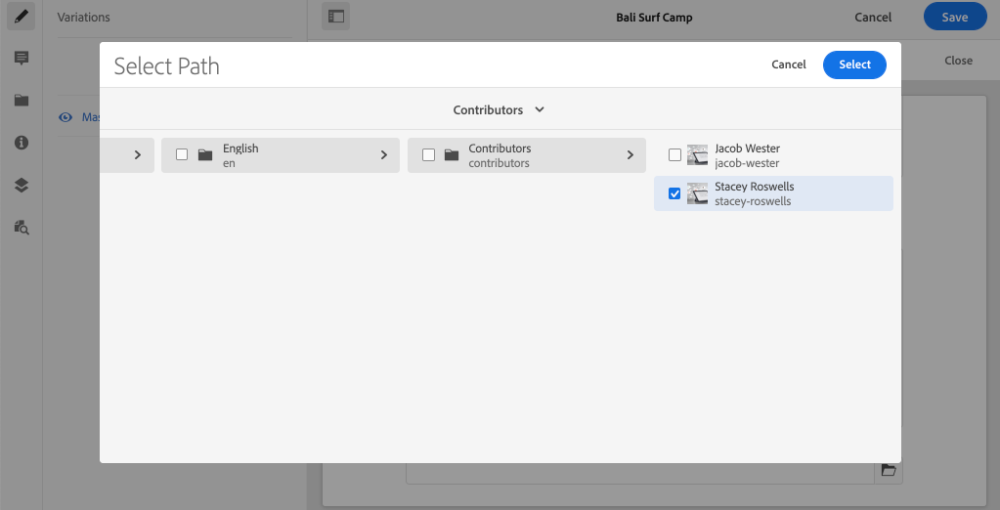

# 使用片段引用进行高级数据建模

可以从其他内容片段中引用内容片段。 这允许用户使用片段之间的关系构建复杂的数据模型。

在本章中，您将更新Adventure模型，以包含使用&#x200B;**片段引用**&#x200B;字段对参与者模型的引用。 您还将了解如何修改GraphQL查询，以包含引用模型中的字段。

## 前提条件

这是一个多部分教程，假定已完成前面部分中概述的步骤。

## 目标

在本章中，我们将学习如何：

* 更新内容片段模型以使用片段引用字段
* 创建可返回引用模型中字段的GraphQL查询

## 添加片段引用 {#add-fragment-reference}

更新冒险内容片段模型以添加对参与者模型的引用。

1. 打开新浏览器并导航到AEM。
1. 从&#x200B;**AEM开始**&#x200B;菜单中，导航到&#x200B;**工具** > **资产** > **内容片段模型** > **WKND站点**。
1. 打开&#x200B;**Adventure**&#x200B;内容片段模型

   

1. 在&#x200B;**数据类型**&#x200B;下，将&#x200B;**片段引用**&#x200B;字段拖放到主面板中。

   

1. 使用以下内容更新此字段的&#x200B;**属性**:

   * 呈现为 - `fragmentreference`
   * 字段标签 — **Adventure Contributor**
   * 属性名称 - `adventureContributor`
   * 模型类型 — 选择&#x200B;**参与者**&#x200B;模型
   * 根路径 - `/content/dam/wknd`

   

   属性名称`adventureContributor`现在可用于引用参与者内容片段。

1. 保存对模型所做的更改。

## 为冒险活动分配参与者

现在，冒险内容片段模型已更新，我们可以编辑现有片段并引用参与者。 应该注意的是，编辑内容片段模型&#x200B;*会影响*&#x200B;从其创建的任何现有内容片段。

1. 导航至&#x200B;**Assets** > **文件** > **WKND Site** > **英语** > **Adventures** > **[Bali Surf Camp](http://localhost:4502/assets.html/content/dam/wknd/en/adventures/bali-surf-camp)**。

   

1. 单击&#x200B;**Bali Surf Camp**&#x200B;内容片段以打开内容片段编辑器。
1. 更新&#x200B;**Adventure Contributor**&#x200B;字段，并单击文件夹图标以选择参与者。

   

   *选择参与者片段的路径*

   

   请注意，只有使用&#x200B;**Contributor**&#x200B;模型创建的片段才能被选择。

1. 保存对片段所做的更改。

1. 重复上述步骤，为[Yosemite Backpacking](http://localhost:4502/editor.html/content/dam/wknd/en/adventures/yosemite-backpacking/yosemite-backpacking)和[Colorado Rock Climbing](http://localhost:4502/editor.html/content/dam/wknd/en/adventures/colorado-rock-climbing/colorado-rock-climbing)等冒险活动分配参与者

## 使用GraphiQL查询嵌套内容片段

接下来，对冒险项执行查询，并添加引用的参与者模型的嵌套属性。 我们将使用GraphiQL工具快速验证查询的语法。

1. 在AEM中导航到GraphiQL工具：[http://localhost:4502/content/graphiql.html](http://localhost:4502/content/graphiql.html)

1. 输入以下查询：

   ```graphql
   {
     adventureByPath(_path:"/content/dam/wknd/en/adventures/bali-surf-camp/bali-surf-camp") {
        item {
          _path
          adventureTitle
          adventureContributor {
            fullName
            occupation
            pictureReference {
           ...on ImageRef {
             _path
           }
         }
       }
     }
    }
   }
   ```

   上面的查询是一条路径上的“冒险”。 `adventureContributor`属性引用参与者模型，然后我们可以从嵌套的内容片段中请求属性。

1. 执行查询，您应获得如下结果：

   ```json
   {
     "data": {
       "adventureByPath": {
           "item": {
               "_path": "/content/dam/wknd/en/adventures/bali-surf-camp/bali-surf-camp",
               "adventureTitle": "Bali Surf Camp",
               "adventureContributor": {
                   "fullName": "Stacey Roswells",
                   "occupation": "Photographer",
                   "pictureReference": {
                       "_path": "/content/dam/wknd/en/contributors/stacey-roswells.jpg"
                   }
               }
           }
        }
     }
   }
   ```

1. 尝试使用其他查询（如`adventureList`），并在`adventureContributor`下添加引用内容片段的属性。

## 更新React应用程序以显示参与者内容

接下来，更新React应用程序使用的查询，以包含新的参与者，并在“冒险详细信息”视图中显示有关参与者的信息。

1. 在IDE中打开WKND GraphQL React应用程序。

1. 打开文件`src/components/AdventureDetail.js`。

   

1. 查找函数`adventureDetailQuery(_path)`。 `adventureDetailQuery(..)`函数只包含过滤GraphQL查询，该查询使用AEM `<modelName>ByPath`语法来查询通过其JCR路径标识的单个内容片段。

1. 更新查询以包含有关引用的参与者的信息：

   ```javascript
   function adventureDetailQuery(_path) {
       return `{
           adventureByPath (_path: "${_path}") {
           item {
               _path
               adventureTitle
               adventureActivity
               adventureType
               adventurePrice
               adventureTripLength
               adventureGroupSize
               adventureDifficulty
               adventurePrice
               adventurePrimaryImage {
                   ... on ImageRef {
                   _path
                   mimeType
                   width
                   height
                   }
               }
               adventureDescription {
                   html
               }
               adventureItinerary {
                   html
               }
               adventureContributor {
                   fullName
                   occupation
                   pictureReference {
                       ...on ImageRef {
                           _path
                       }
                   }
               }
             }
          }
        }
       `;
   }
   ```

   通过此更新，查询中将包含有关`adventureContributor`、`fullName`、`occupation`和`pictureReference`的其他属性。

1. Inspect `Contributor`组件，该组件嵌入在`AdventureDetail.js`文件的`function Contributor(...)`中。 如果属性存在，则此组件将呈现参与者的名称、职位和图片。

   `Contributor`组件在`AdventureDetail(...)` `return`方法中引用：

   ```javascript
   function AdventureDetail(props) {
       ...
       return (
           ...
            <h2>Itinerary</h2>
           <hr />
           <div className="adventure-detail-itinerary"
                dangerouslySetInnerHTML={{__html: adventureData.adventureItinerary.html}}></div>
           {/* Contributor component is instaniated and 
               is passed the adventureContributor object from the GraphQL Query results */}
           <Contributer {...adventureData.adventureContributor} />
           ...
       )
   }
   ```

1. 保存对文件所做的更改。
1. 启动React应用程序（如果尚未运行）：

   ```shell
   $ cd aem-guides-wknd-graphql/react-app
   $ npm start
   ```

1. 导航到[http://localhost:3000](http://localhost:3000/)，然后单击包含引用的参与者的冒险。 现在，您应会看到&#x200B;**Interinal**&#x200B;下面列出的参与者信息：

   

## 恭喜！{#congratulations}

恭喜！ 您已更新现有的内容片段模型，以使用&#x200B;**片段引用**&#x200B;字段引用嵌套的内容片段。 您还学习了如何修改GraphQL查询以包含引用模型中的字段。

## 后续步骤 {#next-steps}

在下一章中， [使用AEM发布环境的生产部署](./production-deployment.md) ，了解AEM创作和发布服务以及无头应用程序的推荐部署模式。 您将更新现有应用程序，以使用环境变量根据目标环境动态更改GraphQL端点。 您还将了解如何正确配置AEM以进行跨域资源共享(CORS)。
