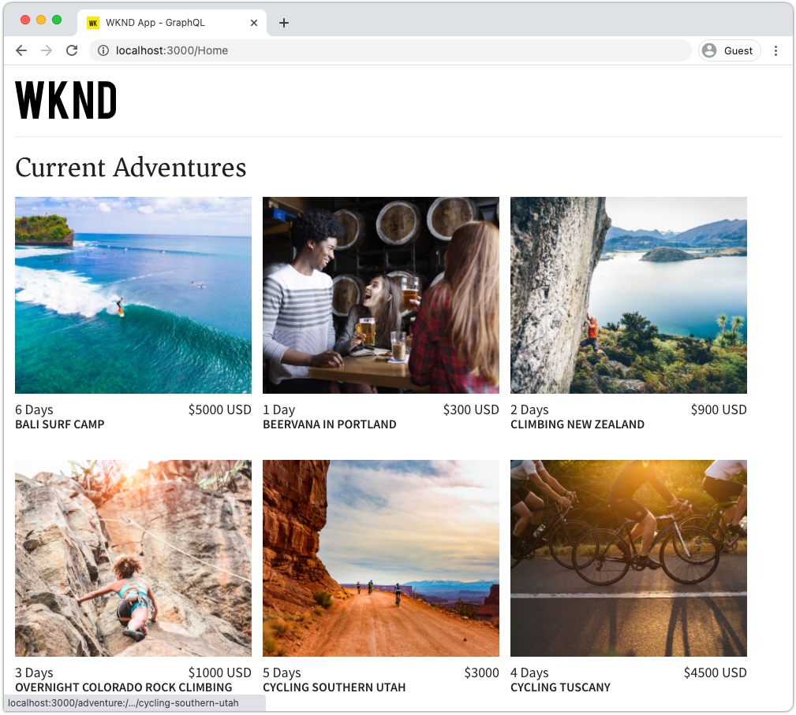

# 使用GraphQL从外部应用程序查询AEM

在本章中，我们将探讨如何使用AEM GraphQL API来在外部应用程序中提供体验。

本教程使用一个简单的React应用程序来查询和显示由AEM GraphQL API公开的Adventure内容。 React的使用基本上不重要，任何平台的任何框架都可以编写消耗性外部应用程序。

## 前提条件

这是一个多部分教程，假定已完成前面部分中概述的步骤。

_本章中的IDE屏幕截图来自 [Visual Studio代码](https://code.visualstudio.com/)_

或者，安装诸如[GraphQL网络检查器](https://chrome.google.com/webstore/detail/graphql-network-inspector/ndlbedplllcgconngcnfmkadhokfaaln)之类的浏览器扩展，以便能够查看有关GraphQL查询的更多详细信息。

## 目标

在本章中，我们将学习如何：

* 开始并了解示例React应用程序的功能
* 了解如何从外部应用程序对AEM GraphQL端点发起调用
* 定义GraphQL查询，以按活动筛选历险内容片段列表
* 更新React应用程序以提供控件，以便通过GraphQL（按活动划分的历险列表）进行筛选

## 启动React应用程序

由于本章重点介绍如何开发客户端以通过GraphQL使用内容片段，因此必须下载示例[WKND GraphQL React应用程序源代码，并在本地计算机上设置](./setup.md#react-app)，并且[AEM SDK将作为创作服务](./setup.md#aem-sdk)运行，并安装[示例WKND站点](./setup.md#wknd-site)。

在[快速设置](./setup.md)章节中，对启动React应用程序进行了更详细的概述，但可以遵循以下简略说明：

1. 如果尚未克隆示例WKND GraphQL React应用程序，请从[Github.com](https://github.com/adobe/aem-guides-wknd-graphql)中克隆示例WKND GraphQL React应用程序

   ```shell
   $ git clone --branch tutorial/react git@github.com:adobe/aem-guides-wknd-graphql.git
   ```

1. 在IDE中打开WKND GraphQL React应用程序

   

1. 在命令行中，导航到`react-app`文件夹
1. 从项目根目录（`react-app`文件夹）中执行以下命令，以启动WKND GraphQL React应用程序

   ```shell
   $ cd aem-guides-wknd-graphql/react-app
   $ npm start
   ```

1. 在[http://localhost:3000/](http://localhost:3000/)查看应用程序。 示例React应用程序包含两个主要部分：

   * 通过使用GraphQL查询AEM中的&#x200B;__Adventure__&#x200B;内容片段，主页体验可充当WKND冒险的索引。 在本章中，我们将修改此视图，以支持按活动筛选冒险。

      

   * 探险详细信息体验，使用GraphQL查询特定的&#x200B;__Adventure__&#x200B;内容片段，并显示更多数据点。

      

1. 使用浏览器的开发工具和浏览器扩展（如[GraphQL Network Inspector](https://chrome.google.com/webstore/detail/graphql-network-inspector/ndlbedplllcgconngcnfmkadhokfaaln)）来检查发送到AEM的GraphQL查询及其JSON响应。 此方法可用于监控GraphQL请求和响应，以确保它们得到正确表达，并且其响应符合预期。

   

   *从React应用程序发送到AEM的GraphQL查询*

   

   *从AEM到React应用程序的JSON响应*

   查询和响应应与GraphiQL IDE中显示的内容相匹配。

   >[!NOTE]
   >
   > 在开发过程中，React应用程序配置为通过WebPack开发服务器将HTTP请求代理到AEM。 React应用程序向`http://localhost:3000`发出请求，由将请求代理到`http://localhost:4502`上运行的AEM创作服务。 有关详细信息，请查看文件`src/setupProxy.js`和`env.development`。
   >
   > 在非开发方案中，将配置React应用程序，以直接向AEM发出请求。

## 浏览应用程序的GraphQL代码

1. 在IDE中，打开文件`src/api/useGraphQL.js`。

   这是一个[React Effect Hook](https://reactjs.org/docs/hooks-overview.html#effect-hook)，用于侦听对应用程序`query`的更改，在发生更改时，会向AEM GraphQL端点发出HTTPPOST请求，并向应用程序返回JSON响应。

   每当React应用程序需要进行GraphQL查询时，它都会调用此自定义`useGraphQL(query)`挂接，并传入GraphQL以发送到AEM。

   此挂接使用简单的`fetch`模块发出HTTPPOSTGraphQL请求，但其他模块（如[Apollo GraphQL客户端](https://www.apollographql.com/docs/react/)）的使用方式类似。

1. 在IDE中打开`src/components/Adventures.js`,IDE负责主视图的冒险列表，并查看`useGraphQL`挂接的调用。

   此代码将默认的`query`设置为`allAdventuresQuery`，如此文件下面所定义。

   ```javascript
   const [query, setQuery] = useState(allAdventuresQuery);
   ```

   ...每当`query`变量发生更改时，都会调用`useGraphQL`挂接，进而对AEM执行GraphQL查询，将JSON返回到`data`变量，然后该变量将用于呈现冒险列表。

   ```javascript
   const { data, errorMessage } = useGraphQL(query);
   ```

   `allAdventuresQuery`是文件中定义的常量GraphQL查询，该查询可查询所有Adventure内容片段（不进行任何筛选），并且只返回需要渲染主页视图的数据点。

   ```javascript
   const allAdventuresQuery = `
   {
       adventureList {
         items {
           _path
           adventureTitle
           adventurePrice
           adventureTripLength
           adventurePrimaryImage {
           ... on ImageRef {
               _path
               mimeType
               width
               height
             }
           }
         }
     }
   }
   `;
   ```

1. 打开`src/components/AdventureDetail.js`，该React组件负责显示冒险详细信息体验。 此视图使用特定内容片段的JCR路径作为其唯一ID来请求特定内容片段，并呈现提供的详细信息。

   与`Adventures.js`类似，会重新使用自定义`useGraphQL` React Hook对AEM执行GraphQL查询。

   内容片段的路径是从组件的`props`顶部收集的，用于指定要查询的内容片段。

   ```javascript
   const contentFragmentPath = props.location.pathname.substring(props.match.url.length);
   ```

   ...并使用`adventureDetailQuery(..)`函数构建GraphQL参数化查询，并将其传递到`useGraphQL(query)`，该对AEM执行GraphQL查询，并将结果返回到`data`变量。

   ```javascript
   const { data, errorMessage } = useGraphQL(adventureDetailQuery(contentFragmentPath));
   ```

   `adventureDetailQuery(..)`函数只需包含一个过滤GraphQL查询，该查询使用AEM `<modelName>ByPath`语法来查询通过其JCR路径标识的单个内容片段，并返回呈现冒险详细信息所需的所有指定数据点。

   ```javascript
   function adventureDetailQuery(_path) {
   return `{
       adventureByPath (_path: "${_path}") {
         item {
           _path
           adventureTitle
           adventureActivity
           adventureType
           adventurePrice
           adventureTripLength
           adventureGroupSize
           adventureDifficulty
           adventurePrice
           adventurePrimaryImage {
               ... on ImageRef {
               _path
               mimeType
               width
               height
               }
           }
           adventureDescription {
               html
           }
           adventureItinerary {
               html
           }
         }
       }
   }
   `;
   }
   ```

## 创建参数化GraphQL查询

接下来，让我们修改React应用程序以执行参数化的GraphQL查询，这些查询通过冒险活动来限制主页视图。

1. 在IDE中，打开文件：`src/components/Adventures.js`。 此文件表示主页体验的冒险组件，该组件可查询并显示冒险卡片。
1. Inspect函数`filterQuery(activity)`(未使用，但已准备制定GraphQL查询，该查询按`activity`筛选冒险。

   请注意，参数`activity`作为`adventureActivity`字段中`filter`的一部分插入到GraphQL查询中，该字段的值需要与参数的值匹配。

   ```javascript
   function filterQuery(activity) {
       return `
           {
           adventures (filter: {
               adventureActivity: {
               _expressions: [
                   {
                   value: "${activity}"
                   }
                 ]
               }
           }){
               items {
               _path
               adventureTitle
               adventurePrice
               adventureTripLength
               adventurePrimaryImage {
               ... on ImageRef {
                   _path
                   mimeType
                   width
                   height
               }
               }
             }
         }
       }
       `;
   }
   ```

1. 更新React Adventures组件的`return`语句，以添加按钮，调用新的参数化`filterQuery(activity)`以提供要列出的冒险。

   ```javascript
   function Adventures() {
       ...
       return (
           <div className="adventures">
   
           {/* Add these three new buttons that set the GraphQL query accordingly */}
   
           {/* The first button uses the default `allAdventuresQuery` */}
           <button onClick={() => setQuery(allAdventuresQuery)}>All</button>
   
           {/* The 2nd and 3rd button use the `filterQuery(..)` to filter by activity */}
           <button onClick={() => setQuery(filterQuery('Camping'))}>Camping</button>
           <button onClick={() => setQuery(filterQuery('Surfing'))}>Surfing</button>
   
           <ul className="adventure-items">
           ...
       )
   }
   ```

1. 保存更改，然后在Web浏览器中重新加载React应用程序。 三个新按钮显示在顶部，单击它们会自动使用匹配的活动重新查询AEM的冒险内容片段。

   

1. 尝试为活动添加更多过滤按钮：`Rock Climbing`、`Cycling`和`Skiing`

## 处理GraphQL错误

GraphQL是强类型，因此在查询无效时可能会返回有用的错误消息。 接下来，让我们模拟一个错误的查询，以查看返回的错误消息。

1. 重新打开文件`src/api/useGraphQL.js`。 Inspect以下代码片段可查看错误处理：

   ```javascript
   //useGraphQL.js
   .then(({data, errors}) => {
           //If there are errors in the response set the error message
           if(errors) {
               setErrors(mapErrors(errors));
           }
           //Otherwise if data in the response set the data as the results
           if(data) {
               setData(data);
           }
       })
       .catch((error) => {
           setErrors(error);
       });
   ```

   将检查响应，以查看其是否包含`errors`对象。 如果GraphQL查询存在问题（如基于架构的未定义字段），则AEM将发送`errors`对象。 如果没有`errors`对象，则设置并返回`data`。

   `window.fetch`包含`.catch`语句，用于&#x200B;*catch*&#x200B;任何常见错误，如无效的HTTP请求或无法与服务器建立连接。

1. 打开文件`src/components/Adventures.js`。
1. 修改`allAdventuresQuery`以包含无效属性`adventurePetPolicy`:

   ```javascript
   /**
    * Query for all Adventures
    * adventurePetPolicy has been added beneath items
   */
   const allAdventuresQuery = `
   {
       adventureList {
         items {
           adventurePetPolicy
           _path
           adventureTitle
           adventurePrice
           adventureTripLength
           adventurePrimaryImage {
           ... on ImageRef {
               _path
               mimeType
               width
               height
           }
           }
         }
       }
   }
   `;
   ```

   我们知道`adventurePetPolicy`不是Adventure模型的一部分，因此这应会触发错误。

1. 保存更改并返回到浏览器。 您应会看到如下错误消息：

   

   GraphQL API会检测到`adventurePetPolicy`在`AdventureModel`中未定义，并返回相应的错误消息。

1. Inspect来自AEM的响应将使用浏览器的开发人员工具来查看`errors` JSON对象：

   

   `errors`对象是详细的，其中包含有关格式错误查询的位置和错误分类的信息。

1. 返回到`Adventures.js`并还原查询更改，以将应用程序返回到其正确状态。

## 恭喜！{#congratulations}

恭喜！ 您已成功探索了示例WKND GraphQL React应用程序的代码，并将其更新为使用参数化、过滤GraphQL查询来按活动列出冒险！ 您还有机会探索一些基本的错误处理。

## 后续步骤 {#next-steps}

在下一章[使用片段引用进行高级数据建模](./fragment-references.md)中，您将了解如何使用片段引用功能在两个不同的内容片段之间创建关系。 您还将了解如何修改GraphQL查询以包含引用模型中的字段。
