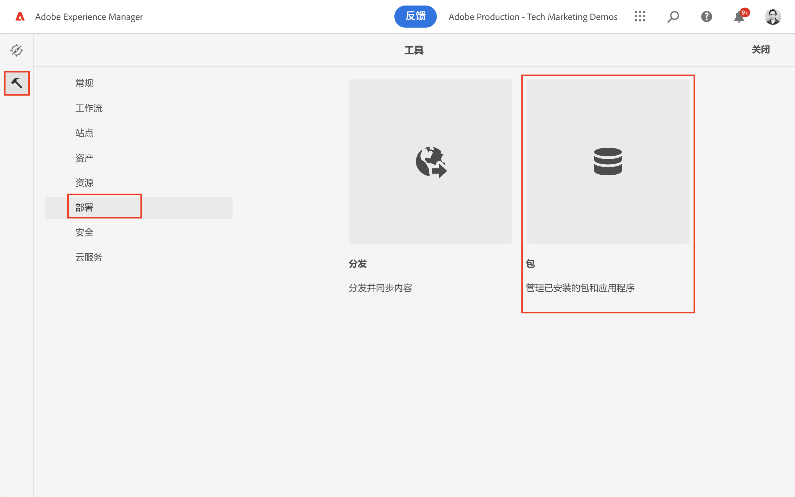
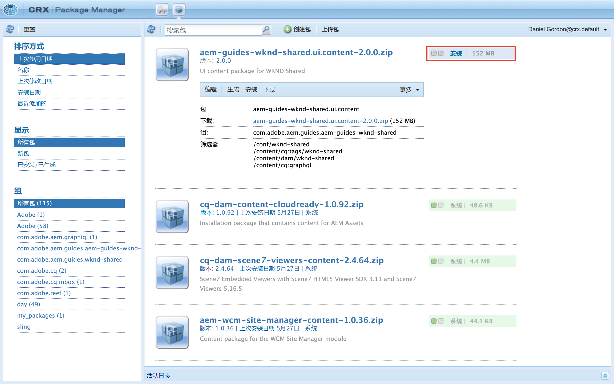

# AEM无头入门 — GraphQL

一个端到端教程，其中演示了如何在无头CMS场景中使用AEM GraphQL API构建和显示由外部应用程序使用的内容。

本教程探讨如何使用AEM GraphQL API和无头功能来为外部应用程序中显示的体验提供动力。

本教程将涵盖以下主题：

* 创建新项目配置
* 创建新的内容片段模型以对数据进行建模
* 根据先前制作的模型创建新内容片段。
* 了解如何使用集成的GraphiQL开发工具查询AEM中的内容片段。
* 要存储GraphQL查询或将其保留到AEM
* 从示例React应用程序中使用持久GraphQL查询

## 前提条件 {#prerequisites}

以下内容需要阅读本教程：

* 基本HTML和JavaScript技能
* 必须在本地安装以下工具：
   * [Node.js v10+](https://nodejs.org/en/)
   * [npm 6+](https://www.npmjs.com/)
   * [Git](https://git-scm.com/)
   * IDE(例如， [Microsoft® Visual Studio代码](https://code.visualstudio.com/))

### AEM Environment

需要Adobe Experience Manager环境才能完成本教程。 可以使用以下任一选项(屏幕截图是从AEMas a Cloud Service环境中记录的):

* AEMas a Cloud Service环境：
   * [访问AEMas a Cloud Service和Cloud Manager](/help/cloud-service/accessing/overview.md)
      * **AEM管理员** 访问AEMas a Cloud Service
      * **Cloud Manager — 开发人员** 对Cloud Manager的访问权限

### 安装示例内容 {#install-sample-content}

让示例内容在AEM环境中已可用作引用，这会非常有用。

1. 导航到 [AEM WKND共享项目](https://github.com/adobe/aem-guides-wknd-shared/releases).
1. 下载最新发布的资产： `aem-guides-wknd-shared.ui.content-x.x.x.zip`.
1. 登录到要用于本教程的AEM创作环境。
1. 从AEM开始屏幕，导航到 **工具** > **部署** > **包**:

   

1. 点按 **上传包** 然后选择 `aem-guides-wknd-shared.ui.content-x.x.x.zip` 文件。 点按 **确定** 上传。
1. 包上传完成后，点按 **安装** 来安装内容。

   

1. 将为虚拟图片安装示例内容片段、内容片段模型、图像等 [WKND品牌](https://wknd.site/). 稍后将在教程中引用示例内容。

## 开始吧！

1. 以开始教程 [定义内容片段模型](content-fragment-models.md).

## GitHub项目

源代码和内容包位于 [AEM指南 — WKND GraphQL GitHub项目](https://github.com/adobe/aem-guides-wknd-graphql).

如果您发现本教程或代码存在问题，请保留 [GitHub问题](https://github.com/adobe/aem-guides-wknd-graphql/issues).

示例内容片段、模型和查询可在 [AEM WKND共享项目](https://github.com/adobe/aem-guides-wknd-shared)
