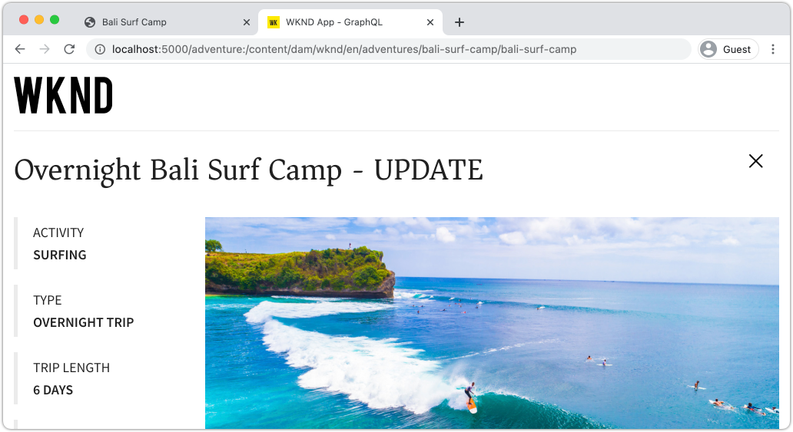

# 使用AEM Publish服务执行生产部署

在本教程中，您将设置一个本地环境来模拟将内容从Author实例分发到Publish实例。 您还将生成一个React应用程序的生产版本，该应用程序配置为使用GraphQL API从AEM Publish环境使用内容。 您将逐渐学会如何有效地使用环境变量以及如何更新AEM CORS配置。

## 先决条件

本教程是多部分教程的一部分。 假定前几部分中概述的步骤已经完成。

## 目标

了解如何：

* 了解AEM创作和发布架构。
* 了解管理环境变量的最佳实践。
* 了解如何正确配置AEM以进行跨源资源共享(CORS)。

## 作者发布部署模式 {#deployment-pattern}

完整的 AEM 环境由创作、发布和 Dispatcher 构成。Author服务是内部用户创建、管理和预览内容的地方。 Publish服务被视为“实时”环境，通常是最终用户与之交互的对象。 在Author服务上编辑和批准之后的内容，分发到Publish服务。

AEM Headless 应用程序最常见的部署模式是将应用程序的生产版本连接到 AEM Publish 服务。


上图描绘了这种常见的部署模式。

1. **内容作者**&#x200B;使用AEM作者服务创建、编辑和管理内容。
2. **内容作者**&#x200B;和其他内部用户可直接在 Author 服务上预览内容。应用程序的预览版本可以设置为连接到 Author 服务。
3. 内容获得批准后，便可以&#x200B;**发布**&#x200B;到AEM Publish服务。
4. **最终用户**&#x200B;与应用程序的生产版本交互。 生产应用程序连接到Publish服务，并使用GraphQL API请求和使用内容。

本教程通过在当前设置中添加AEM Publish实例来模拟上述部署。 在前面的章节中，React应用程序通过直接连接到Author实例来充当预览。 React应用程序的生产内部版本将部署到连接到新发布实例的静态Node.js服务器。

最后，有三个本地服务器正在运行：

* http://localhost:4502 — 创作实例
* http://localhost:4503 — 发布实例
* http://localhost:5000 — 处于生产模式的React应用程序，连接到Publish实例。

## 安装AEM SDK — 发布模式 {#aem-sdk-publish}

当前，有一个SDK实例正在&#x200B;**创作**&#x200B;模式下运行。 也可以在&#x200B;**Publish**&#x200B;模式下启动SDK以模拟AEM Publish环境。

有关设置本地开发环境[的更详细指南，请参阅此处](https://experienceleague.adobe.com/docs/experience-manager-learn/cloud-service/local-development-environment-set-up/overview.html?lang=en#local-development-environment-set-up)。

1. 在本地文件系统上，创建一个专用文件夹来安装发布实例，即名为`~/aem-sdk/publish`。
1. 复制前几章中用于创作实例的快速入门jar文件，并将其粘贴到`publish`目录中。 或者，导航到[软件分发门户](https://experience.adobe.com/#/downloads/content/software-distribution/en/aemcloud.html)，下载最新的SDK并解压缩快速入门jar文件。
1. 将jar文件重命名为`aem-publish-p4503.jar`。

   `publish`字符串指定快速入门Jar以发布模式启动。 `p4503`指定快速入门服务器在端口4503上运行。

1. 打开新的终端窗口，并导航到包含jar文件的文件夹。 安装并启动AEM实例：

   ```shell
   $ cd ~/aem-sdk/publish
   $ java -jar aem-publish-p4503.jar
   ```

1. 提供管理员密码作为`admin`。 可接受任何管理员密码，但建议使用默认密码进行本地开发，以避免额外的配置。
1. 当AEM实例安装完成后，将在[http://localhost:4503/content.html](http://localhost:4503/content.html)处打开一个新的浏览器窗口

   应返回“404未找到”页面。 这是一个全新的AEM实例，尚未安装任何内容。

## 安装示例内容和GraphQL端点 {#wknd-site-content-endpoints}

与创作实例一样，发布实例需要启用GraphQL端点，并需要示例内容。 接下来，在发布实例上安装WKND引用站点。

1. 下载适用于WKND站点的最新编译的AEM包： [aem-guides-wknd.all-x.x.x.zip](https://github.com/adobe/aem-guides-wknd/releases/latest)。

   >[!NOTE]
   >
   > 请确保下载与AEM as a Cloud Service兼容的标准版本，并且&#x200B;**不** `classic`版本。

1. 使用用户名`admin`和密码`admin`直接导航到[http://localhost:4503/libs/granite/core/content/login.html](http://localhost:4503/libs/granite/core/content/login.html)以登录Publish实例。
1. 接下来，导航到[http://localhost:4503/crx/packmgr/index.jsp](http://localhost:4503/crx/packmgr/index.jsp)上的包管理器。
1. 单击&#x200B;**上传包**，然后选择在上一步中下载的WKND包。 单击&#x200B;**安装**&#x200B;可安装软件包。
1. 安装包后，WKND引用站点现在位于[http://localhost:4503/content/wknd/us/en.html](http://localhost:4503/content/wknd/us/en.html)。
1. 单击菜单栏中的“注销”按钮，以`admin`用户身份注销。

   

   与AEM Author实例不同，AEM Publish实例默认为匿名只读访问。 我们希望在运行React应用程序时模拟匿名用户的体验。

## 更新环境变量以指向发布实例 {#react-app-publish}

接下来，更新React应用程序使用的环境变量以指向发布实例。 React应用程序应&#x200B;**仅**&#x200B;连接到生产模式下的发布实例。

接下来，添加新文件`.env.production.local`以模拟生产体验。

1. 在IDE中打开WKND GraphQL React应用程序。

1. 在`aem-guides-wknd-graphql/react-app`下，添加名为`.env.production.local`的文件。
1. 使用以下内容填充`.env.production.local`：

   ```plain
   REACT_APP_HOST_URI=http://localhost:4503
   REACT_APP_GRAPHQL_ENDPOINT=/content/graphql/global/endpoint.json
   ```

   

   通过使用环境变量，可以轻松地在Author或Publish环境之间切换GraphQL端点，而无需在应用程序代码中添加额外的逻辑。 有关React的[自定义环境变量的更多信息，请参阅此处](https://create-react-app.dev/docs/adding-custom-environment-variables)。

   >[!NOTE]
   >
   > 请注意，由于发布环境默认提供对内容的匿名访问，因此不包含身份验证信息。

## 部署静态节点服务器 {#static-server}

React应用程序可以通过使用webpack服务器启动，但这仅适用于开发。 接下来，使用[服务](https://github.com/vercel/serve)模拟生产部署，以使用Node.js承载React应用程序的生产内部版本。

1. 打开新的终端窗口并导航到`aem-guides-wknd-graphql/react-app`目录

   ```shell
   $ cd aem-guides-wknd-graphql/react-app
   ```

1. 使用以下命令安装[服务](https://github.com/vercel/serve)：

   ```shell
   $ npm install serve --save-dev
   ```

1. 在`react-app/package.json`处打开文件`package.json`。 添加名为`serve`的脚本：

   ```diff
    "scripts": {
       "start": "react-scripts start",
       "build": "react-scripts build",
       "test": "react-scripts test",
       "eject": "react-scripts eject",
   +   "serve": "npm run build && serve -s build"
   },
   ```

   `serve`脚本执行两个操作。 首先，生成React应用程序的生产版本。 其次，Node.js服务器启动并使用生产版本。

1. 返回到终端并输入启动静态服务器的命令：

   ```shell
   $ npm run serve
   
   ┌────────────────────────────────────────────────────┐
   │                                                    │
   │   Serving!                                         │
   │                                                    │
   │   - Local:            http://localhost:5000        │
   │   - On Your Network:  http://192.168.86.111:5000   │
   │                                                    │
   │   Copied local address to clipboard!               │
   │                                                    │
   └────────────────────────────────────────────────────┘
   ```

1. 打开新浏览器并导航到[http://localhost:5000/](http://localhost:5000/)。 您应该会看到正在提供的React应用程序。

   

   请注意，GraphQL查询正在主页上运行。 使用开发人员工具检查&#x200B;**XHR**&#x200B;请求。 观察GraphQL POST位于`http://localhost:4503/content/graphql/global/endpoint.json`的发布实例。

   但是，主页上的所有图像都已损坏！

1. 单击进入某个“Adventure Detail”（冒险详细信息）页面。

   

   观察到`adventureContributor`引发了GraphQL错误。 在接下来的练习中，将修复损坏的图像和`adventureContributor`问题。

## 绝对图像引用 {#absolute-image-references}

图像似乎已损坏，因为``标记时，修改位于`function AdventureItem(props)`的`AdventureItem`组件以引用`_publishUrl`而不是`_path`属性：

   ```diff
   - 
   + 
   ```

1. 在`react-app/src/components/AdventureDetail.js`处打开文件`AdventureDetail.js`。
1. 重复相同的步骤以修改GraphQL查询并添加`_publishUrl`属性以用于冒险

   ```diff
    adventureByPath (_path: "${_path}") {
       item {
           _path
           adventureTitle
           adventureActivity
           adventureType
           adventurePrice
           adventureTripLength
           adventureGroupSize
           adventureDifficulty
           adventurePrice
           adventurePrimaryImage {
               ... on ImageRef {
               _path
   +           _publishUrl
               mimeType
               width
               height
               }
           }
           adventureDescription {
               html
           }
           adventureItinerary {
               html
           }
           adventureContributor {
               fullName
               occupation
               pictureReference {
                   ...on ImageRef {
                       _path
   +                   _publishUrl
                   }
               }
           }
       }
       }
   } 
   ```

1. 在`AdventureDetail.js`中修改冒险主图像和参与者图片引用的两个``标记：

   ```diff
   /* AdventureDetail.js */
   ...
   
   ...
   pictureReference =  
   ```

1. 返回到终端并启动静态服务器：

   ```shell
   $ npm run serve
   ```

1. 导航到[http://localhost:5000/](http://localhost:5000/)并观察图像是否出现以及``属性是否指向`http://localhost:4503`。

   

## 模拟内容发布 {#content-publish}

请记住，在请求“冒险详细信息”页面时，`adventureContributor`引发了GraphQL错误。 发布实例上尚不存在&#x200B;**参与者**&#x200B;内容片段模型。 对&#x200B;**Adventure**&#x200B;内容片段模型所做的更新在发布实例上不可用。 这些更改是直接对创作实例做出的，需要分发到发布实例。

在将新更新转出到依赖于内容片段或内容片段模型的更新的应用程序时，需要考虑这一点。

接下来，用于模拟本地Author和Publish实例之间的内容发布。

1. 启动创作实例（如果尚未启动），并在[http://localhost:4502/crx/packmgr/index.jsp](http://localhost:4502/crx/packmgr/index.jsp)处导航到包管理器
1. 下载包[EnableReplicationAgent.zip](./assets/publish-deployment/EnableReplicationAgent.zip)并使用包管理器安装它。

   此包将安装一种配置，该配置允许作者实例将内容发布到发布实例。 可以在此处](https://experienceleague.adobe.com/docs/experience-manager-learn/cloud-service/local-development-environment-set-up/aem-runtime.html?lang=en#content-distribution)找到[此配置的手动步骤。

   >[!NOTE]
   >
   > 在AEM as a Cloud Service环境中，创作层自动设置为将内容分发到发布层。

1. 从&#x200B;**AEM开始**&#x200B;菜单，导航到&#x200B;**工具** > **Assets** > **内容片段模型**。

1. 单击&#x200B;**WKND Site**&#x200B;文件夹。

1. 选择所有三个模型并单击&#x200B;**发布**：

   

   出现确认对话框，请单击&#x200B;**发布**。

1. 导航到[http://localhost:4502/editor.html/content/dam/wknd/en/adventures/bali-surf-camp/bali-surf-camp](http://localhost:4502/editor.html/content/dam/wknd/en/adventures/bali-surf-camp/bali-surf-camp)上的“巴厘岛冲浪营”内容片段。

1. 单击顶部菜单栏中的&#x200B;**发布**&#x200B;按钮。

   

1. 发布向导会显示应发布的任何依赖关系资源。 在这种情况下，将列出引用的片段&#x200B;**stacey-roswells**，并且还将引用多个图像。 引用的资产会与片段一起发布。

   

   再次单击&#x200B;**发布**&#x200B;按钮可发布内容片段和从属资源。

1. 返回在[http://localhost:5000/](http://localhost:5000/)运行的React应用程序。 现在，您可以单击巴厘岛冲浪营地，查看冒险详细信息。

1. 切换回位于[http://localhost:4502/editor.html/content/dam/wknd/en/adventures/bali-surf-camp/bali-surf-camp](http://localhost:4502/editor.html/content/dam/wknd/en/adventures/bali-surf-camp/bali-surf-camp)的AEM创作实例并更新片段的&#x200B;**Title**。 **保存并关闭**&#x200B;片段。 然后&#x200B;**发布**&#x200B;片段。
1. 返回到[http://localhost:5000/adventure:/content/dam/wknd/en/adventures/bali-surf-camp/bali-surf-camp](http://localhost:5000/adventure:/content/dam/wknd/en/adventures/bali-surf-camp/bali-surf-camp)并观察发布的更改。

   

## 更新COR配置

默认情况下，AEM是安全的，不允许非AEM Web资产进行客户端调用。 AEM的跨源资源共享(CORS)配置允许特定域调用AEM。

接下来，试验AEM发布实例的CORS配置。

1. 返回使用命令`npm run serve`运行React应用程序的终端窗口：

   ```shell
   ┌────────────────────────────────────────────────────┐
   │                                                    │
   │   Serving!                                         │
   │                                                    │
   │   - Local:            http://localhost:5000        │
   │   - On Your Network:  http://192.168.86.205:5000   │
   │                                                    │
   │   Copied local address to clipboard!               │
   │                                                    │
   └────────────────────────────────────────────────────┘
   ```

   请注意，提供了两个URL。 一个使用`localhost`，另一个使用本地网络IP地址。

1. 导航到以[http://192.168.86.XXX:5000](http://192.168.86.XXX:5000)开头的地址。 每台本地计算机的地址稍有不同。 请注意，获取数据时存在CORS错误。 这是因为当前CORS配置仅允许来自`localhost`的请求。

   

   接下来，更新AEM发布CORS配置以允许来自网络IP地址的请求。

1. 导航到[http://localhost:4503/content/wknd/us/en/errors/sign-in.html](http://localhost:4503/content/wknd/us/en/errors/sign-in.html)并使用用户名`admin`和密码`admin`登录。

1. 导航到[http://localhost:4503/system/console/configMgr](http://localhost:4503/system/console/configMgr)，并在`com.adobe.granite.cors.impl.CORSPolicyImpl~wknd-graphql`处找到WKND GraphQL配置。

1. 更新&#x200B;**允许的源**&#x200B;字段以包含网络IP地址：

   

   还可以包括正则表达式，以允许来自特定子域的所有请求。 保存更改。

1. 搜索&#x200B;**Apache Sling引用过滤器**&#x200B;并查看配置。 还需要配置&#x200B;**允许为空**&#x200B;以启用来自外部域的GraphQL请求。

   

   这些内容已配置为WKND参考网站的一部分。 您可以通过[GitHub存储库](https://github.com/adobe/aem-guides-wknd/tree/master/ui.config/src/main/content/jcr_root/apps/wknd/osgiconfig)查看完整的OSGi配置集。

   >[!NOTE]
   >
   > OSGi配置在提交到源代码控制的AEM项目中管理。 AEM项目可以使用Cloud Manager部署到AEM as Cloud Service环境。 [AEM项目原型](https://github.com/adobe/aem-project-archetype)可以帮助为特定实施生成项目。

1. 返回以[http://192.168.86.XXX:5000](http://192.168.86.XXX:5000)开头的React应用程序，并观察到该应用程序不再引发CORS错误。

   

## 恭喜！ {#congratulations}

恭喜！您现在已使用AEM Publish环境模拟完整生产部署。 您还学习了如何在AEM中使用CORS配置。

## 其他资源

有关内容片段和GraphQL的更多详细信息，请参阅以下资源：

* 使用带有GraphQL的内容片段的[Headless内容投放](https://experienceleague.adobe.com/docs/experience-manager-cloud-service/assets/content-fragments/content-fragments-graphql.html?lang=zh-Hans)
* [用于内容片段的 AEM GraphQL API](https://experienceleague.adobe.com/docs/experience-manager-cloud-service/assets/admin/graphql-api-content-fragments.html?lang=zh-Hans)
* [基于令牌的身份验证](https://experienceleague.adobe.com/docs/experience-manager-learn/getting-started-with-aem-headless/authentication/overview.html?lang=en#authentication)
* [将代码部署到AEM as a Cloud Service](https://experienceleague.adobe.com/docs/experience-manager-learn/cloud-service/cloud-manager/devops/deploy-code.html?lang=en#cloud-manager)
