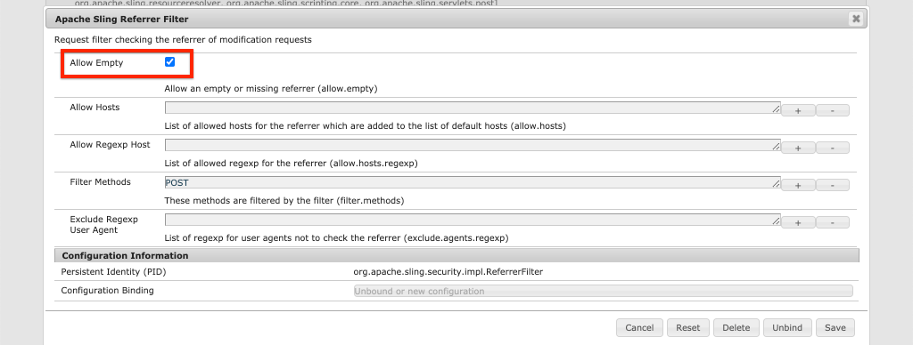

# 使用AEM发布服务进行生产部署

在本教程中，您将设置一个本地环境，以模拟从创作实例分发到发布实例的内容。 您还将生成React应用程序的生产内部版本，该应用程序配置为使用GraphQL API从AEM发布环境中使用内容。 在此过程中，您将了解如何有效使用环境变量以及如何更新AEM CORS配置。

## 前提条件

本教程是多部分教程的一部分。 假定已完成前几部分中概述的步骤。

## 目标

了解如何：

* 了解AEM创作和发布架构。
* 了解管理环境变量的最佳实践。
* 了解如何正确配置AEM以进行跨域资源共享(CORS)。

## 创作发布部署模式 {#deployment-pattern}

完整的AEM环境由创作、发布和调度程序组成。 Author 服务是内部用户创建、管理和预览内容的地方。发布服务被视为“实时”环境，通常是最终用户与之交互的环境。 在 Author 服务上编辑和审批之后的内容，分发到 Publish 服务。

AEM Headless 应用程序最常见的部署模式是将应用程序的生产版本连接到 AEM Publish 服务。


上图描绘了这种常见的部署模式。

1. A **内容作者** 使用AEM创作服务创建、编辑和管理内容。
2. **内容作者**&#x200B;和其他内部用户可直接在 Author 服务上预览内容。应用程序的预览版本可以设置为连接到 Author 服务。
3. 内容获得批准后，即可 **发布** 到AEM发布服务。
4. **最终用户与应用程序的生产版本交互。**&#x200B;生产应用程序连接到发布服务，并使用GraphQL API请求和使用内容。

本教程通过将AEM Publish实例添加到当前设置来模拟上述部署。 在前几章中，React应用程序通过直接连接到创作实例来充当预览。 React应用程序的生产内部版本会部署到一个静态Node.js服务器，该服务器连接到新的发布实例。

最后，运行了三台本地服务器：

* http://localhost:4502 — 创作实例
* http://localhost:4503 — 发布实例
* http://localhost:5000 — 在生产模式下， React应用程序连接到发布实例。

## 安装AEM SDK — 发布模式 {#aem-sdk-publish}

当前，我们在 **作者** 模式。 SDK也可以在 **发布** 模式来模拟AEM发布环境。

有关设置本地开发环境的更详细指南 [可在此处找到](https://experienceleague.adobe.com/docs/experience-manager-learn/cloud-service/local-development-environment-set-up/overview.html?lang=en#local-development-environment-set-up).

1. 在本地文件系统上，创建一个专用文件夹以安装Publish实例，即 `~/aem-sdk/publish`.
1. 复制前几章中用于创作实例的快速入门Jar文件，并将其粘贴到 `publish` 目录访问Advertising Cloud的帮助。 或者，导航到 [软件分发门户](https://experience.adobe.com/#/downloads/content/software-distribution/en/aemcloud.html) 并下载最新的SDK并解压缩快速入门jar文件。
1. 将jar文件重命名为 `aem-publish-p4503.jar`.

   的 `publish` 字符串指定快速入门Jar以“发布”模式启动。 的 `p4503` 指定快速启动服务器在端口4503上运行。

1. 打开新的“终端”窗口，然后导航到包含jar文件的文件夹。 安装并启动AEM实例：

   ```shell
   $ cd ~/aem-sdk/publish
   $ java -jar aem-publish-p4503.jar
   ```

1. 提供管理员密码作为 `admin`. 可接受任何管理员密码，但建议将默认密码用于本地开发，以避免额外配置。
1. 安装完AEM实例后，将在 [http://localhost:4503/content.html](http://localhost:4503/content.html)

   应会返回“404未找到”页面。 这是一个全新的AEM实例，尚未安装任何内容。

## 安装示例内容和GraphQL端点 {#wknd-site-content-endpoints}

与创作实例一样，发布实例需要启用GraphQL端点，并且需要示例内容。 接下来，在发布实例上安装WKND引用站点。

1. 下载适用于WKND站点的最新编译的AEM包： [aem-guides-wknd.all-x.x.x.zip](https://github.com/adobe/aem-guides-wknd/releases/latest).

   >[!NOTE]
   >
   > 确保下载与AEM as a Cloud Service兼容的标准版本，以及 **not** the `classic` 版本。

1. 通过直接导航到以下位置，登录到Publish实例： [http://localhost:4503/libs/granite/core/content/login.html](http://localhost:4503/libs/granite/core/content/login.html) 和用户名 `admin` 和密码 `admin`.
1. 接下来，导航到包管理器(位于 [http://localhost:4503/crx/packmgr/index.jsp](http://localhost:4503/crx/packmgr/index.jsp).
1. 单击 **上传包** 并选择在上一步骤中下载的WKND包。 单击&#x200B;**安装**&#x200B;可安装软件包。
1. 安装包后，现在可以在 [http://localhost:4503/content/wknd/us/en.html](http://localhost:4503/content/wknd/us/en.html).
1. 注销为 `admin` 用户，方法是单击菜单栏中的“注销”按钮。

   

   与AEM创作实例不同，AEM发布实例默认使用匿名只读访问。 我们希望在运行React应用程序时模拟匿名用户的体验。

## 更新环境变量以指向发布实例 {#react-app-publish}

接下来，更新React应用程序使用的环境变量以指向Publish实例。 React应用程序应 **仅** 在生产模式下连接到Publish实例。

接下来，添加新文件 `.env.production.local` 来模拟生产体验。

1. 在IDE中打开WKND GraphQL React应用程序。

1. 下 `aem-guides-wknd-graphql/react-app`，添加名为的文件 `.env.production.local`.
1. 填充 `.env.production.local` ，具有以下特点：

   ```plain
   REACT_APP_HOST_URI=http://localhost:4503
   REACT_APP_GRAPHQL_ENDPOINT=/content/graphql/global/endpoint.json
   ```

   

   通过使用环境变量，可以轻松地在创作或发布环境之间切换GraphQL端点，而无需在应用程序代码中添加额外的逻辑。 有关 [可在此处找到React的自定义环境变量](https://create-react-app.dev/docs/adding-custom-environment-variables).

   >[!NOTE]
   >
   > 请注意，由于发布环境默认提供对内容的匿名访问，因此未包含任何身份验证信息。

## 部署静态节点服务器 {#static-server}

React应用程序可以使用Webpack服务器启动，但仅供开发使用。 接下来，使用 [服务](https://github.com/vercel/serve) 使用Node.js托管React应用程序的生产内部版本。

1. 打开新的终端窗口并导航到 `aem-guides-wknd-graphql/react-app` 目录

   ```shell
   $ cd aem-guides-wknd-graphql/react-app
   ```

1. 安装 [服务](https://github.com/vercel/serve) 使用以下命令：

   ```shell
   $ npm install serve --save-dev
   ```

1. 打开文件 `package.json` at `react-app/package.json`. 添加名为 `serve`:

   ```diff
    "scripts": {
       "start": "react-scripts start",
       "build": "react-scripts build",
       "test": "react-scripts test",
       "eject": "react-scripts eject",
   +   "serve": "npm run build && serve -s build"
   },
   ```

   的 `serve` 脚本执行两个操作。 首先，生成React应用程序的生产内部版本。 其次，Node.js服务器启动并使用生产内部版本。

1. 返回到终端并输入启动静态服务器的命令：

   ```shell
   $ npm run serve
   
   ┌────────────────────────────────────────────────────┐
   │                                                    │
   │   Serving!                                         │
   │                                                    │
   │   - Local:            http://localhost:5000        │
   │   - On Your Network:  http://192.168.86.111:5000   │
   │                                                    │
   │   Copied local address to clipboard!               │
   │                                                    │
   └────────────────────────────────────────────────────┘
   ```

1. 打开新浏览器并导航到 [http://localhost:5000/](http://localhost:5000/). 您应会看到正在提供React应用程序。

   

   请注意，GraphQL查询在主页上工作。 Inspect **XHR** 请求。 请注意，GraphQLPOST位于 `http://localhost:4503/content/graphql/global/endpoint.json`.

   但是，主页上的所有图像都损坏了！

1. 单击其中一个“Adventure Detail”页面。

   

   观察是否引发了GraphQL错误 `adventureContributor`. 在接下来的练习中，会显示损坏的图像和 `adventureContributor` 问题已修复。

## 绝对图像引用 {#absolute-image-references}

由于 `` 标记：

   ```diff
   - 
   + 
   ```

1. 打开文件 `AdventureDetail.js` at `react-app/src/components/AdventureDetail.js`.
1. 重复相同步骤以修改GraphQL查询并添加 `_publishUrl` 《冒险》的财产

   ```diff
    adventureByPath (_path: "${_path}") {
       item {
           _path
           adventureTitle
           adventureActivity
           adventureType
           adventurePrice
           adventureTripLength
           adventureGroupSize
           adventureDifficulty
           adventurePrice
           adventurePrimaryImage {
               ... on ImageRef {
               _path
   +           _publishUrl
               mimeType
               width
               height
               }
           }
           adventureDescription {
               html
           }
           adventureItinerary {
               html
           }
           adventureContributor {
               fullName
               occupation
               pictureReference {
                   ...on ImageRef {
                       _path
   +                   _publishUrl
                   }
               }
           }
       }
       }
   } 
   ```

1. 修改 `` 中冒险主图像和参与者图片引用的标记 `AdventureDetail.js`:

   ```diff
   /* AdventureDetail.js */
   ...
   
   ...
   pictureReference =  
   ```

1. 返回到终端并启动静态服务器：

   ```shell
   $ npm run serve
   ```

1. 导航到 [http://localhost:5000/](http://localhost:5000/) 并观察图像的出现和 `` 属性点到 `http://localhost:4503`.

   

## 模拟内容发布 {#content-publish}

请记住，在 `adventureContributor` 请求“冒险详细信息”页面时。 的 **参与者** 发布实例上尚不存在内容片段模型。 对 **冒险** 内容片段模型在发布实例上也不可用。 这些更改直接发生在创作实例中，需要分发到发布实例。

对依赖于内容片段或内容片段模型更新的应用程序推出新更新时，需要考虑这一点。

接下来，允许在本地创作实例和发布实例之间模拟内容发布。

1. 启动创作实例（如果尚未启动），然后导航到包管理器(位于 [http://localhost:4502/crx/packmgr/index.jsp](http://localhost:4502/crx/packmgr/index.jsp)
1. 下载包 [EnableReplicationAgent.zip](./assets/publish-deployment/EnableReplicationAgent.zip) 并使用包管理器进行安装。

   此包将安装一个配置，该配置允许创作实例将内容发布到发布实例。 手动步骤 [此配置可在此处找到](https://experienceleague.adobe.com/docs/experience-manager-learn/cloud-service/local-development-environment-set-up/aem-runtime.html?lang=en#content-distribution).

   >[!NOTE]
   >
   > 在AEMas a Cloud Service环境中，创作层会自动设置为将内容分发到发布层。

1. 从 **AEM开始** 菜单，导航至 **工具** > **资产** > **内容片段模型**.

1. 单击 **WKND站点** 文件夹。

1. 选择所有三个模型并单击 **发布**:

   

   出现确认对话框，单击 **发布**.

1. 导航到位于的巴厘岛冲浪营内容片段 [http://localhost:4502/editor.html/content/dam/wknd/en/adventures/bali-surf-camp/bali-surf-camp](http://localhost:4502/editor.html/content/dam/wknd/en/adventures/bali-surf-camp/bali-surf-camp).

1. 单击 **发布** 按钮。

   

1. “发布”向导会显示应发布的任何从属资产。 在本例中，引用的片段 **斯泰西·罗斯韦尔斯** 列出了，并且还引用了多个图像。 引用的资产与片段一起发布。

   

   单击 **发布** 按钮以发布内容片段和从属资产。

1. 返回运行在 [http://localhost:5000/](http://localhost:5000/). 您现在可以点击巴厘岛冲浪营地，查看冒险的详细信息。

1. 切换回位于的AEM创作实例 [http://localhost:4502/editor.html/content/dam/wknd/en/adventures/bali-surf-camp/bali-surf-camp](http://localhost:4502/editor.html/content/dam/wknd/en/adventures/bali-surf-camp/bali-surf-camp) 并更新 **标题** 片段的子集。 **保存并关闭** 片段。 然后 **发布** 片段。
1. 返回 [http://localhost:5000/adventure:/content/dam/wknd/en/adventures/bali-surf-camp/bali-surf-camp](http://localhost:5000/adventure:/content/dam/wknd/en/adventures/bali-surf-camp/bali-surf-camp) 并观察已发布的更改。

   

## 更新COR配置

AEM默认是安全的，不允许非AEM web属性进行客户端调用。 AEM跨域资源共享(CORS)配置允许特定域调用AEM。

接下来，尝试使用AEM发布实例的CORS配置。

1. 返回到使用命令运行React应用程序的终端窗口 `npm run serve`:

   ```shell
   ┌────────────────────────────────────────────────────┐
   │                                                    │
   │   Serving!                                         │
   │                                                    │
   │   - Local:            http://localhost:5000        │
   │   - On Your Network:  http://192.168.86.205:5000   │
   │                                                    │
   │   Copied local address to clipboard!               │
   │                                                    │
   └────────────────────────────────────────────────────┘
   ```

   请注意提供了两个URL。 一个使用 `localhost` 另一个使用本地网络IP地址。

1. 导航到以开始的地址 [http://192.168.86.XXX:5000](http://192.168.86.XXX:5000). 每个本地计算机的地址略有不同。 请注意，获取数据时出现CORS错误。 这是因为当前的CORS配置仅允许来自 `localhost`.

   

   接下来，更新AEM发布CORS配置，以允许来自网络IP地址的请求。

1. 导航到 [http://localhost:4503/content/wknd/us/en/errors/sign-in.html](http://localhost:4503/content/wknd/us/en/errors/sign-in.html) 并使用用户名登录 `admin` 和密码 `admin`.

1. 导航到 [http://localhost:4503/system/console/configMgr](http://localhost:4503/system/console/configMgr) 并在 `com.adobe.granite.cors.impl.CORSPolicyImpl~wknd-graphql`.

1. 更新 **允许的源** 字段以包含网络IP地址：

   

   还可以包含允许来自特定子域的所有请求的正则表达式。 保存更改。

1. 搜索 **Apache Sling反向链接过滤器** 并查看配置。 的 **允许为空** 还需要配置才能从外部域启用GraphQL请求。

   

   这些引用已配置为WKND引用站点的一部分。 您可以通过 [GitHub存储库](https://github.com/adobe/aem-guides-wknd/tree/master/ui.config/src/main/content/jcr_root/apps/wknd/osgiconfig).

   >[!NOTE]
   >
   > OSGi配置在提交到源控制的AEM项目中进行管理。 可以使用Cloud Manager将AEM项目部署到AEM作为Cloud Service环境。 的 [AEM项目原型](https://github.com/adobe/aem-project-archetype) 可帮助为特定实施生成项目。

1. 从开始返回React应用程序 [http://192.168.86.XXX:5000](http://192.168.86.XXX:5000) 并观察应用程序不再引发CORS错误。

   

## 恭喜！ {#congratulations}

恭喜！您现在已使用AEM发布环境模拟完整的生产部署。 您还学习了如何在AEM中使用CORS配置。

## 其他资源

有关内容片段和GraphQL的更多详细信息，请参阅以下资源：

* [使用带有 GraphQL 的内容片段的 Headless 内容投放](https://experienceleague.adobe.com/docs/experience-manager-cloud-service/assets/content-fragments/content-fragments-graphql.html?lang=zh-Hans)
* [用于内容片段的 AEM GraphQL API](https://experienceleague.adobe.com/docs/experience-manager-cloud-service/assets/admin/graphql-api-content-fragments.html?lang=zh-Hans)
* [基于令牌的身份验证](https://experienceleague.adobe.com/docs/experience-manager-learn/getting-started-with-aem-headless/authentication/overview.html?lang=en#authentication)
* [将代码部署到AEMas a Cloud Service](https://experienceleague.adobe.com/docs/experience-manager-learn/cloud-service/cloud-manager/devops/deploy-code.html?lang=en#cloud-manager)
