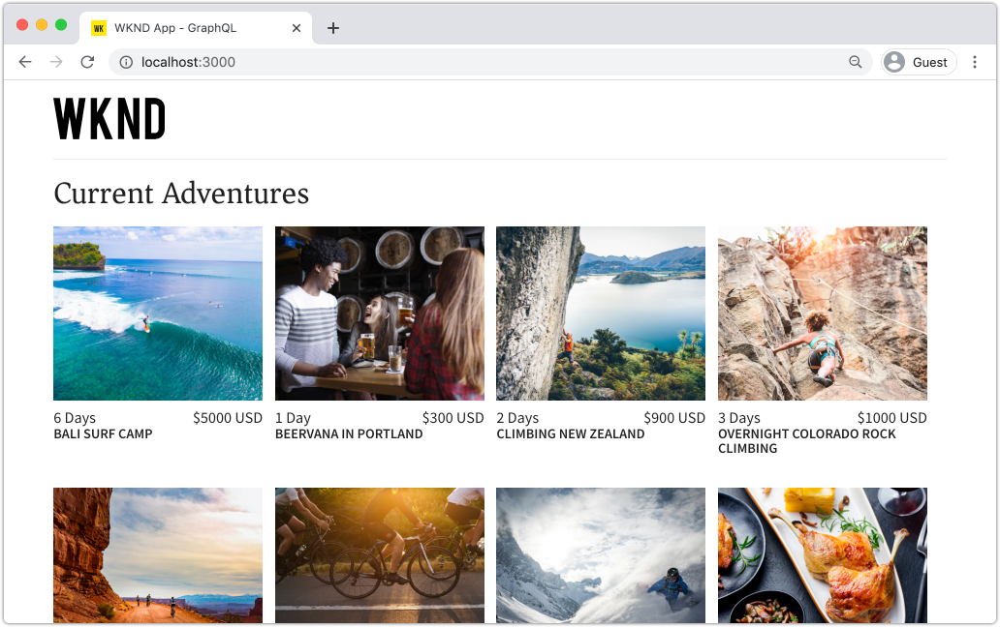

# 快速设置 {#setup}

本章提供了本地环境的快速设置，以查看外部应用程序使用AEM GraphQL API从AEM中使用内容的情况。 本教程的后续章节将基于此设置进行构建。

## 前提条件 {#prerequisites}

应在本地安装以下工具：

* [JDK 11](https://experience.adobe.com/#/downloads/content/software-distribution/en/general.html?1_group.propertyvalues.property=.%2Fjcr%3Acontent%2Fmetadata%2Fdc%3AsoftwareType&amp;1_group.propertyvalues.operation=equals&amp;1_group.propertyvalues.0_values=software-type%3Atoling&amp;fulltext=Oracle%7E+JDK%7E+11%7E&amp;orderby=%40jcr%3Cont%2Fjcr%3Alast&amp;by.sort=desc&amp;list=0&amp;p.offset=14)
* [Node.js v10+](https://nodejs.org/en/)
* [npm 6+](https://www.npmjs.com/)
* [Git](https://git-scm.com/)

## 目标 {#objectives}

1. 下载并安装AEM SDK。
1. 从WKND参考站点下载并安装示例内容。
1. 下载并安装示例应用程序，以使用GraphQL API使用内容。

## 安装AEM SDK {#aem-sdk}

本教程使用[AEM作为Cloud ServiceSDK](https://experienceleague.adobe.com/docs/experience-manager-cloud-service/implementing/developing/aem-as-a-cloud-service-sdk.html?lang=en#aem-as-a-cloud-service-sdk)来浏览AEM GraphQL API。 本节提供了有关安装AEM SDK并在创作模式下运行该SDK的快速指南。 有关设置本地开发环境[的更详细指南，请参阅此处](https://experienceleague.adobe.com/docs/experience-manager-learn/cloud-service/local-development-environment-set-up/overview.html?lang=en#local-development-environment-set-up)。

>[!NOTE]
>
> 您还可以在本教程后面使用AEM as a Cloud Service环境。 整个教程中都包含有关使用云环境的其他说明。

1. 导航到&#x200B;**[软件分发门户](https://experience.adobe.com/#/downloads/content/software-distribution/en/aemcloud.html)** > **AEM as a Cloud Service**&#x200B;并下载最新版本的&#x200B;**AEM SDK**。

   

   >[!CAUTION]
   >
   > 默认情况下，仅在2021-02-04或更高版本的AEM SDK上启用GraphQL功能。

1. 解压缩下载并将快速入门Jar(`aem-sdk-quickstart-XXX.jar`)复制到专用文件夹，即`~/aem-sdk/author`。
1. 将jar文件重新命名为`aem-author-p4502.jar`。

   `author`名称指定快速入门Jar将以“创作”模式启动。 `p4502`指定快速启动服务器将在端口4502上运行。

1. 打开新的“终端”窗口，然后导航到包含jar文件的文件夹。 运行以下命令以安装和启动AEM实例：

   ```shell
   $ cd ~/aem-sdk/author
   $ java -jar aem-author-p4502.jar
   ```

1. 提供管理员密码作为`admin`。 可接受任何管理员密码，但建议将默认密码用于本地开发，以减少重新配置的需要。
1. 几分钟后，AEM实例将完成安装，并且新的浏览器窗口应会在[http://localhost:4502](http://localhost:4502)中打开。
1. 使用用户名`admin`和密码`admin`登录。

## 安装示例内容和GraphQL端点 {#wknd-site-content-endpoints}

将安装&#x200B;**WKND引用站点**&#x200B;中的示例内容以加速教程。 WKND是一个虚构的生命风格品牌，通常与AEM培训结合使用。

WKND引用站点包含公开[GraphQL端点](https://experienceleague.adobe.com/docs/experience-manager-cloud-service/assets/admin/graphql-api-content-fragments.html?lang=en#graphql-aem-endpoint)所需的配置。 在实际实施中，按照文档中的步骤，[将GraphQL端点](https://experienceleague.adobe.com/docs/experience-manager-cloud-service/assets/admin/graphql-api-content-fragments.html?lang=en#graphql-aem-endpoint)包含在您的客户项目中。 [CORS](#cors-config)也已打包为WKND站点的一部分。 需要CORS配置才能授予对外部应用程序的访问权限，有关[CORS](#cors-config)的更多信息，请参阅下文。

1. 下载适用于WKND站点的最新编译的AEM包：[aem-guides-wknd.all-x.x.x.zip](https://github.com/adobe/aem-guides-wknd/releases/latest)。

   >[!NOTE]
   >
   > 确保下载与AEM as a Cloud Service兼容的标准版本，而&#x200B;**不**&#x200B;的`classic`版本。

1. 从&#x200B;**AEM开始**&#x200B;菜单导航到&#x200B;**工具** > **部署** > **包**。

   

1. 单击&#x200B;**上传包** ，然后选择在上一步骤中下载的WKND包。 单击&#x200B;**Install**&#x200B;以安装包。

1. 从&#x200B;**AEM Start**&#x200B;菜单中，导航到&#x200B;**Assets** > **Files**。
1. 单击文件夹可导航到&#x200B;**WKND Site** > **English** > **Adventures**。

   

   这是构成WKND品牌促销的各种Adventures的所有资产的文件夹。 这包括传统媒体类型（如图像和视频），以及特定于AEM的媒体（如&#x200B;**内容片段**）。

1. 单击&#x200B;**Sywand Skiing Wyoming**&#x200B;文件夹，然后单击&#x200B;**Sywand Skiing Wyoming内容片段**&#x200B;卡：

   

1. 内容片段编辑器UI将打开，用于怀俄明州下山滑雪探险。

   

   请注意各种字段（如&#x200B;**Title**、**Description**&#x200B;和&#x200B;**Activity**）定义片段。

   **内** 容片段是在AEM中管理内容的一种方式。内容片段是可重用的、与呈现形式无关的内容，由结构化数据元素（如文本、富文本、日期或对其他内容片段的引用）组成。 在教程的后面部分，将更详细地探索内容片段。

1. 单击&#x200B;**取消**&#x200B;以关闭片段。 您可以随意导航到其他一些文件夹，并浏览其他Adventure内容。

>[!NOTE]
>
> 如果使用Cloud Service环境，请参阅有关如何[将代码库（如WKND引用站点）部署到Cloud Service环境](https://experienceleague.adobe.com/docs/experience-manager-cloud-service/implementing/deploying/overview.html?lang=en#deploying)的文档。

## 安装示例应用程序{#sample-app}

本教程的目标之一是演示如何使用GraphQL API从外部应用程序中使用AEM内容。 本教程使用已部分完成的React应用程序示例来加速教程。 同样的课程和概念也适用于使用iOS、Android或任何其他平台构建的应用程序。 React应用程序特意简单，以避免不必要的复杂性；它不是引用实施。

1. 使用Git打开新的终端窗口和克隆教程启动器分支：

   ```shell
   $ git clone --branch tutorial/react git@github.com:adobe/aem-guides-wknd-graphql.git
   ```

1. 在选择的IDE中，在`aem-guides-wknd-graphql/react-app/.env.development`处打开文件`.env.development`。 确认`REACT_APP_AUTHORIZATION`行未注释，且文件如下所示：

   ```plain
   REACT_APP_HOST_URI=http://localhost:4502
   REACT_APP_GRAPHQL_ENDPOINT=/content/graphql/global/endpoint.json
   # Use Authorization when connecting to an AEM Author environment
   REACT_APP_AUTHORIZATION=admin:admin
   ```

   确保`React_APP_HOST_URI`与您的本地AEM实例匹配。 在本章中，我们将React应用程序直接连接到AEM **Author**&#x200B;环境。 **** 默认情况下，授权需要进行身份验证，因此我们的应用程序将以用户身份 `admin` 连接。这是开发过程中的常见做法，因为它允许我们快速在AEM环境中进行更改，并立即在应用程序中反映这些更改。

   >[!NOTE]
   >
   > 在生产方案中，应用程序将连接到AEM **Publish**&#x200B;环境。 [生产部署](production-deployment.md)章节中更详细地介绍了此内容。

1. 导航到`aem-guides-wknd-graphql/react-app`文件夹。 安装并启动应用程序：

   ```shell
   $ cd aem-guides-wknd-graphql/react-app
   $ npm install
   $ npm start
   ```

1. 新的浏览器窗口应会自动启动位于[http://localhost:3000](http://localhost:3000)的应用程序。

   

   应显示AEM中当前Adventure内容的列表。

1. 单击其中一张冒险图像可查看冒险详细信息。 系统会向AEM发出请求，以返回冒险的详细信息。

   

1. 使用浏览器的开发人员工具检查&#x200B;**Network**&#x200B;请求。 查看&#x200B;**XHR**&#x200B;请求，并观察对为AEM配置的GraphQL端点`/content/graphql/global/endpoint.json`的多个POST请求。

   

1. 您还可以通过检查网络请求来查看参数和JSON响应。 为Chrome安装诸如[GraphQL Network Inspector](https://chrome.google.com/webstore/detail/graphql-network-inspector/ndlbedplllcgconngcnfmkadhokfaaln)之类的浏览器扩展，以更好地了解查询和响应，可能会有所帮助。

## 修改内容片段

现在，React应用程序正在运行，请更新AEM中的内容，并查看应用程序中反映的更改。

1. 导航到AEM [http://localhost:4502](http://localhost:4502)。
1. 导航至&#x200B;**Assets** > **文件** > **WKND Site** > **英语** > **Adventures** > **[Bali Surf Camp](http://localhost:4502/assets.html/content/dam/wknd/en/adventures/bali-surf-camp)**。

   

1. 单击&#x200B;**Bali Surf Camp**&#x200B;内容片段以打开内容片段编辑器。
1. 修改&#x200B;**标题**&#x200B;和&#x200B;**描述**&#x200B;探险

   

1. 单击&#x200B;**Save**&#x200B;以保存更改。
1. 导航回位于[http://localhost:3000](http://localhost:3000)的React应用程序，然后刷新以查看所做的更改：

   

## 安装GraphiQL工具 {#install-graphiql}

[](https://github.com/graphql/graphiql) GraphiQL是一款开发工具，仅在开发或本地实例等较低级别环境中需要它。GraphiQL IDE允许您快速测试和优化返回的查询和数据。 GraphiQL还提供对文档的轻松访问，从而便于学习和了解可用的方法。

1. 导航到&#x200B;**[软件分发门户](https://experience.adobe.com/#/downloads/content/software-distribution/en/aemcloud.html)** > **AEM as a Cloud Service**。
1. 搜索“GraphiQL”(请务必在&#x200B;**GraphiQL**&#x200B;中包含&#x200B;**i**。
1. 下载最新的&#x200B;**GraphiQL内容包v.x.x.x**

   

   zip文件是可直接安装的AEM包。

1. 从&#x200B;**AEM开始**&#x200B;菜单导航到&#x200B;**工具** > **部署** > **包**。
1. 单击&#x200B;**上载包**，然后选择在上一步骤中下载的包。 单击&#x200B;**Install**&#x200B;以安装包。

   
1. 导航到位于[http://localhost:4502/content/graphiql.html](http://localhost:4502/content/graphiql.html)的GraphiQL IDE，然后开始浏览GraphQL API。

   >[!NOTE]
   >
   > GraphiQL工具和GraphQL API将在教程](./explore-graphql-api.md)的后面更详细地介绍。[

## 恭喜！ {#congratulations}

恭喜，您现在有一个外部应用程序使用GraphQL的AEM内容。 您可以随时在React应用程序中检查代码，并继续尝试修改现有的内容片段。

## 后续步骤 {#next-steps}

在下一章[定义内容片段模型](content-fragment-models.md)中，了解如何使用&#x200B;**内容片段模型**&#x200B;对内容建模和构建架构。 您将检查现有模型并创建新模型。 您还将了解可用于定义模式作为模型一部分的不同数据类型。

## （附加）CORS配置 {#cors-config}

AEM在默认情况下是安全的，它会阻止跨域请求，从而阻止未经授权的应用程序连接到并显示其内容。

为了允许本教程的React应用程序与AEM GraphQL API端点进行交互，已在WKND站点引用项目中定义了跨源资源共享配置。


要查看已部署的配置，请执行以下操作：

1. 导航到AEM SDK的Web控制台，其位于[http://localhost:4502/system/console](http://localhost:4502/system/console)。

   >[!NOTE]
   >
   > Web控制台仅在SDK上可用。 在AEM as a Cloud Service环境中，可以通过[开发人员控制台](https://experienceleague.adobe.com/docs/experience-manager-learn/cloud-service/debugging/debugging-aem-as-a-cloud-service/developer-console.html)查看此信息。

1. 在顶部菜单中，单击&#x200B;**OSGi** > **Configuration**&#x200B;以调出所有[OSGi配置](http://localhost:4502/system/console/configMgr)。
1. 向下滚动页面&#x200B;**AdobeGranite跨源资源共享**。
1. 单击`com.adobe.granite.cors.impl.CORSPolicyImpl~wknd-graphql`的配置。
1. 以下字段已更新：
   * 允许的源(Regex):`http://localhost:.*`
      * 允许所有本地主机连接。
   * 允许的路径: `/content/graphql/global/endpoint.json`
      * 这是当前配置的唯一GraphQL端点。 作为最佳做法，COR的配置应尽可能严格。
   * 允许的方法：`GET`、`HEAD`、`POST`
      * GraphQL只需`POST`，但是，在以无头方式与AEM交互时，其他方法可能很有用。
   * 支持的标头：添加了&#x200B;**authorization**&#x200B;以在创作环境中传递基本身份验证。
   * 支持凭据：`Yes`
      * 这是必需的，因为我们的React应用程序将与AEM创作服务上受保护的GraphQL端点通信。

此配置和GraphQL端点是AEM WKND项目的一部分。 您可以在此处](https://github.com/adobe/aem-guides-wknd/tree/master/ui.config/src/main/content/jcr_root/apps/wknd/osgiconfig)查看所有[OSGi配置。
