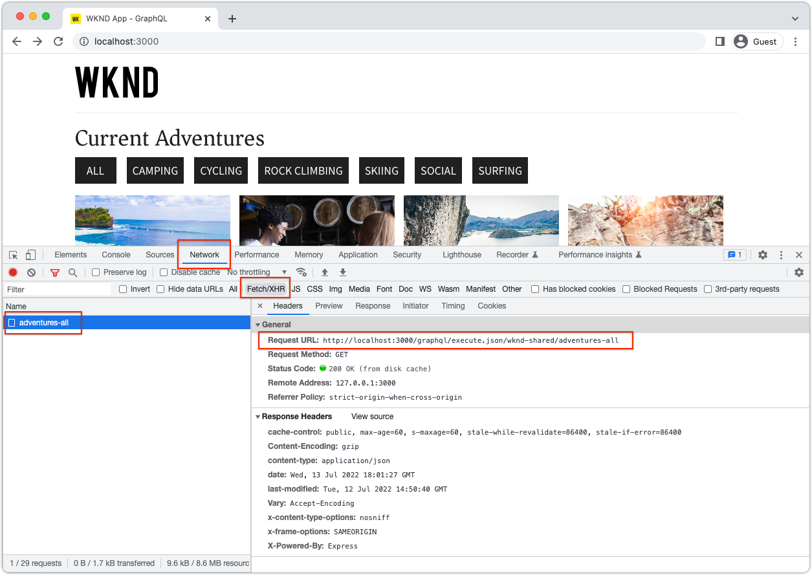
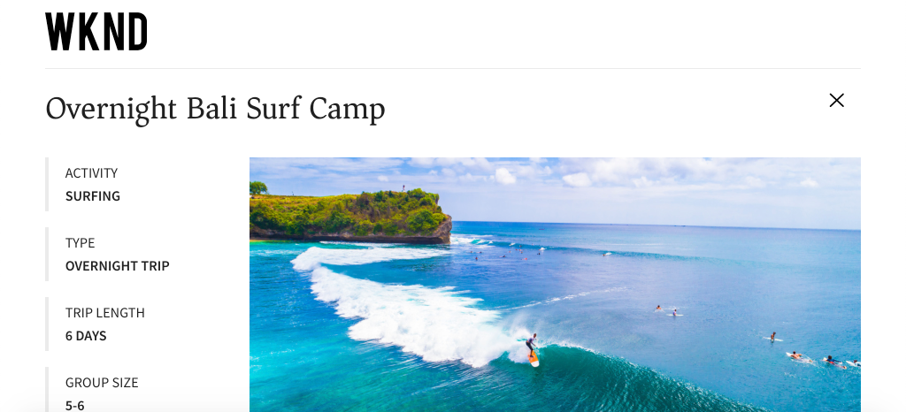

# 使用本地AEM SDK快速设置AEM Headless {#setup}

AEM Headless快速设置使用WKND Site示例项目中的内容以及一个通过AEM Headless GraphQL API使用内容的示例React应用程序(SPA)，帮助您实际操作AEM Headless。 本指南使用[AEM as a Cloud Service SDK](https://experienceleague.adobe.com/docs/experience-manager-cloud-service/content/implementing/developing/aem-as-a-cloud-service-sdk.html?lang=zh-Hans)。

## 先决条件 {#prerequisites}

应在本地安装以下工具：

* [JDK 11](https://experience.adobe.com/#/downloads/content/software-distribution/en/general.html?1_group.propertyvalues.property=.%2Fjcr%3Acontent%2Fmetadata%2Fdc%3AsoftwareType&1_group.propertyvalues.operation=equals&1_group.propertyvalues.0_values=software-type%3Atooling&fulltext=Oracle%7E+JDK%7E+11%7E&orderby=%40jcr%3Acontent%2Fjcr%3AlastModified&orderby.sort=desc&layout=list&p.offset=list&p.offset=0&p.limit=14&p.limit=144)
* [Node.js v18](https://nodejs.org/en/)
* [Git](https://git-scm.com/)

## 1.安装AEM SDK {#aem-sdk}

此设置使用[AEM as a Cloud Service SDK](https://experienceleague.adobe.com/docs/experience-manager-cloud-service/implementing/developing/aem-as-a-cloud-service-sdk.html?lang=zh-Hans&#aem-as-a-cloud-service-sdk)来探索AEM的GraphQL API。 本节提供了有关安装AEM SDK并以创作模式运行该软件的快速指南。 有关设置本地开发环境[的更详细指南，请参阅此处](https://experienceleague.adobe.com/docs/experience-manager-learn/cloud-service/local-development-environment-set-up/overview.html?lang=zh-Hans#local-development-environment-set-up)。

>[!NOTE]
>
> 也可以使用[AEM as a Cloud Service环境](./cloud-service.md)来学习本教程。 在本教程中，还包含有关使用云环境的其他说明。

1. 导航到&#x200B;**[软件分发门户](https://experience.adobe.com/#/downloads/content/software-distribution/en/aemcloud.html?fulltext=AEM*+SDK*&amp;orderby=%40jcr%3Acontent%2Fjcr%3AlastModified&amp;orderby.sort=desc&amp;layout=list&amp;p.offset=0&amp;p.limit=1)** > **AEM as a Cloud Service**&#x200B;并下载最新版本的&#x200B;**AEM SDK**。

   

1. 解压缩下载内容并将快速入门jar (`aem-sdk-quickstart-XXX.jar`)复制到专用文件夹，即`~/aem-sdk/author`。
1. 将jar文件重命名为`aem-author-p4502.jar`。

   `author`名称指定快速入门Jar以创作模式启动。 `p4502`指定快速入门在端口4502上运行。

1. 要安装和启动AEM实例，请在包含jar文件的文件夹下打开命令提示符，然后运行以下命令：

   ```shell
   $ cd ~/aem-sdk/author
   $ java -jar aem-author-p4502.jar
   ```

1. 提供管理员密码作为`admin`。 可接受任何管理员密码，但建议使用`admin`进行本地开发，以减少重新配置的需要。
1. AEM服务安装完毕后，应在[http://localhost:4502](http://localhost:4502)处打开一个新的浏览器窗口。
1. 使用用户名`admin`和在AEM初始启动期间选择的密码（通常为`admin`）登录。

## 2.安装示例内容 {#install-sample-content}

**WKND引用站点**&#x200B;中的示例内容用于加速教程。 WKND是一个虚构的生活风格品牌，通常与AEM培训一起使用。

WKND站点包含公开[GraphQL端点](https://experienceleague.adobe.com/docs/experience-manager-cloud-service/content/headless/graphql-api/content-fragments.html?lang=zh-Hans)所需的配置。 在真实实施中，按照记录的步骤，将GraphQL端点[&#128279;](https://experienceleague.adobe.com/docs/experience-manager-cloud-service/content/headless/graphql-api/content-fragments.html?lang=zh-Hans)包含在您的客户项目中。 [CORS](#cors-config)也已打包为WKND站点的一部分。 需要CORS配置才能授予对外部应用程序的访问权限，可在下面找到有关[CORS](#cors-config)的详细信息。

1. 下载适用于WKND站点的最新编译的AEM包： [aem-guides-wknd.all-x.x.x.zip](https://github.com/adobe/aem-guides-wknd/releases/latest)。

   >[!NOTE]
   >
   > 请确保下载与AEM as a Cloud Service兼容的标准版本，并且&#x200B;**不** `classic`版本。

1. 从&#x200B;**AEM开始**&#x200B;菜单，导航到&#x200B;**工具** > **部署** > **包**。

   

1. 单击&#x200B;**上传包**，然后选择在上一步中下载的WKND包。 单击&#x200B;**安装**&#x200B;可安装软件包。

1. 从&#x200B;**AEM开始**&#x200B;菜单中，导航到&#x200B;**Assets** > **文件** > **WKND已共享** > **英语** > **冒险**。

   

   这是构成WKND品牌推广的各种冒险的所有资产的文件夹。 这包括传统媒体类型（如图像和视频）以及特定于AEM的媒体（如&#x200B;**内容片段**）。

1. 单击&#x200B;**Downhill Sking Wyoming**&#x200B;文件夹，然后单击&#x200B;**Downhill Sking Wyoming内容片段**&#x200B;卡：

   

1. 内容片段编辑器将打开，以显示怀俄明州下滑山滑雪探险活动。

   

   观察各种字段（如&#x200B;**标题**、**描述**&#x200B;和&#x200B;**活动**）定义片段。

   **内容片段**&#x200B;是在AEM中管理内容的一种方式。 内容片段是可重复使用的、与呈现无关的内容，由结构化数据元素（如文本、富文本、日期或对其他内容片段的引用）组成。 稍后在快速设置中会更详细地探讨内容片段。

1. 单击&#x200B;**取消**&#x200B;关闭片段。 您可以随意导航到其他某些文件夹，并探索其他冒险内容。

>[!NOTE]
>
> 如果使用Cloud Service环境，请参阅有关如何将代码库（如WKND引用站点）部署到Cloud Service环境[&#128279;](https://experienceleague.adobe.com/docs/experience-manager-cloud-service/implementing/deploying/overview.html?lang=zh-Hans#coding-against-the-right-aem-version)的文档。

## 3.下载并运行WKND React应用程序 {#sample-app}

本教程的目标之一是演示如何使用AEM API从外部应用程序使用GraphQL内容。 本教程使用示例React应用程序。 React应用程序可随意简化，以专门实现与AEM的GraphQL API的集成。

1. 打开新的命令提示符并从GitHub克隆示例React应用程序：

   ```shell
   $ git clone git@github.com:adobe/aem-guides-wknd-graphql.git
   $ cd aem-guides-wknd-graphql/react-app
   ```

1. 在您选择的IDE中的`aem-guides-wknd-graphql/react-app`中打开React应用程序。
1. 在IDE中，打开位于`/.env.development`的文件`.env.development`。 验证`REACT_APP_AUTHORIZATION`行是否取消注释，并且文件声明以下变量：

   ```plain
   REACT_APP_HOST_URI=http://localhost:4502
   REACT_APP_GRAPHQL_ENDPOINT=/content/graphql/global/endpoint.json
   # Use Authorization when connecting to an AEM Author environment
   REACT_APP_AUTHORIZATION=admin:admin
   ```

   确保`REACT_APP_HOST_URI`指向您的本地AEM SDK。 为方便起见，此快速入门将React应用程序连接到&#x200B;**AEM作者**。 **作者**&#x200B;服务需要身份验证，因此应用程序使用`admin`用户建立其连接。 将应用程序连接到AEM Author是开发过程中的常见做法，因为它有助于在不发布更改的情况下快速迭代内容。

   >[!NOTE]
   >
   > 在生产方案中，应用程序将连接到AEM **发布**&#x200B;环境。 _生产部署_&#x200B;部分中对此进行了详细介绍。


1. 安装和启动React应用程序：

   ```shell
   $ cd aem-guides-wknd-graphql/react-app
   $ npm install
   $ npm start
   ```

1. 新的浏览器窗口会在[http://localhost:3000](http://localhost:3000)上自动打开应用程序。

   

   此时将显示AEM中的冒险内容列表。

1. 单击其中一个冒险图像以查看冒险详细信息。 系统会向AEM发出请求，要求它返回冒险的细节。

   

1. 使用浏览器的开发人员工具检查&#x200B;**网络**&#x200B;请求。 查看&#x200B;**XHR**&#x200B;请求并观察到`/graphql/execute.json/...`的多个GET请求。 此路径前缀将调用AEM的持久查询端点，并选取要使用前缀后的名称和编码参数执行的持久查询。

   

## 4.在AEM中编辑内容

在React应用程序运行时，对AEM中的内容进行更新，并查看更改是否在应用程序中反映。

1. 导航到AEM [http://localhost:4502](http://localhost:4502)。
1. 导航到&#x200B;**Assets** > **文件** > **共享的WKND** > **英语** > **冒险** > **[巴厘岛冲浪营](http://localhost:4502/assets.html/content/dam/wknd-shared/en/adventures/bali-surf-camp)**。

   

1. 单击&#x200B;**巴厘岛冲浪营**&#x200B;内容片段以打开内容片段编辑器。
1. 修改冒险的&#x200B;**标题**&#x200B;和&#x200B;**描述**。

   

1. 点击&#x200B;**保存**&#x200B;即可保存更改。
1. 刷新[http://localhost:3000](http://localhost:3000)上的React应用程序以查看更改内容：

   

## 5.浏览GraphiQL {#graphiql}

1. 导航到&#x200B;**工具** > **常规** > **GraphQL查询编辑器**&#x200B;以打开[GraphiQL](http://localhost:4502/aem/graphiql.html)
1. 选择左侧的现有持久查询，然后运行它们以查看结果。

   >[!NOTE]
   >
   > GraphiQL工具和GraphQL API将在教程[&#128279;](../multi-step/explore-graphql-api.md)的后面部分进行更详细的探讨。

## 恭喜！{#congratulations}

恭喜，您现在有一个外部应用程序使用GraphQL的AEM内容。 欢迎在React应用程序中检查代码，并继续尝试修改现有内容片段。

### 后续步骤

* [启动AEM Headless教程](../multi-step/overview.md)
