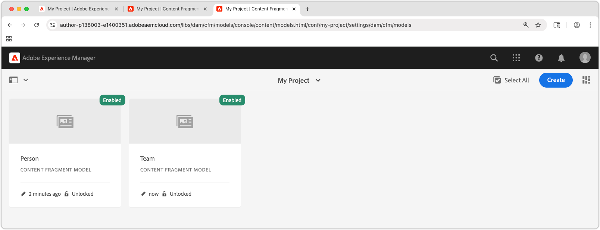

# 创建内容片段模型

在本章中，了解如何使用&#x200B;**内容片段模型**&#x200B;为内容建模并构建架构，以及有关定义内容片段模型的不同数据类型。

在本教程中，您创建了两个简单模型，**团队**&#x200B;和&#x200B;**人员**。 **团队**&#x200B;数据模型具有名称、简短名称和描述，并引用&#x200B;**人员**&#x200B;数据模型，该模型具有全名、个人资料详细信息、个人资料图片和职业列表。

## 目标

* 创建内容片段模型。
* 探索用于构建模型的可用数据类型和验证选项。
* 了解内容片段模型如何定义&#x200B;**数据架构和内容片段创作模板**。

## 创建项目配置

项目配置包含与特定项目关联的所有内容片段模型，并提供组织模型的方法。 在创建内容片段模型之前&#x200B;**至少创建一个项目**。

1. 登录到AEM **创作**&#x200B;环境（例如`https://author-p<PROGRAM_ID>-e<ENVIRONMENT_ID>.adobeaemcloud.com/`）
1. 从AEM开始屏幕中，导航到&#x200B;**工具** > **常规** > **配置浏览器**。
1. 单击顶部操作栏中的&#x200B;**创建**，然后输入以下配置详细信息：
   * 标题： **我的项目**
   * 名称： **my-project**
   * 内容片段模型： **已选中**

   

1. 选择&#x200B;**创建**&#x200B;以创建项目配置。

## 创建内容片段模型

接下来，为&#x200B;**团队**&#x200B;和&#x200B;**人员**&#x200B;创建内容片段模型。 这些将充当数据模型或架构，表示团队和团队成员，并定义作者根据这些模型创建和编辑内容片段的界面。

### 创建人员内容片段模型

为&#x200B;**Person**&#x200B;创建内容片段模型，它是表示属于某个团队的人员的数据模型或架构。

1. 从AEM开始屏幕中，导航到&#x200B;**工具** > **常规** > **内容片段模型**。
1. 导航到&#x200B;**我的项目**&#x200B;文件夹。
1. 选择右上角的&#x200B;**创建**&#x200B;以显示&#x200B;**创建模型**&#x200B;向导。
1. 使用以下属性创建内容片段模型：

   * 模型标题： **人员**
   * 启用模型： **已选中**

   选择&#x200B;**创建**。在生成的对话框中，选择&#x200B;**打开**&#x200B;以构建模型。

1. 将&#x200B;**单行文本**&#x200B;元素拖放到主面板上。 在&#x200B;**属性**&#x200B;选项卡上输入以下属性：

   * 字段标签：**全名**
   * 属性名称： `fullName`
   * 检查&#x200B;**必需**

   **属性名称**&#x200B;定义编写的值存储在AEM中的属性的名称。 **属性名称**&#x200B;还将此属性的&#x200B;**键**&#x200B;名称定义为数据架构的一部分，并在通过AEM的OpenAPI交付内容片段时用作JSON响应中的键。

1. 选择&#x200B;**数据类型**&#x200B;选项卡，并将&#x200B;**多行文本**&#x200B;字段拖放到&#x200B;**全名**&#x200B;字段下。 输入以下属性：

   * 字段标签：**个人简历**
   * 属性名称： `biographyText`
   * 默认类型： **富文本**

1. 单击&#x200B;**数据类型**&#x200B;选项卡并拖放&#x200B;**内容引用**&#x200B;字段。 输入以下属性：

   * 字段标签：**个人资料图片**
   * 属性名称： `profilePicture`
   * 根路径： `/content/dam`

     配置&#x200B;**根路径**&#x200B;时，您可以单击&#x200B;**文件夹**&#x200B;图标以调出模式窗口来选择路径。 这会限制作者可以使用哪些文件夹填充路径。 `/content/dam`是存储所有AEM Assets（图像、视频、其他内容片段）的根。

   * 仅接受特定内容类型： **图像**

     向&#x200B;**图片引用**&#x200B;添加验证，以便只有&#x200B;**图像**&#x200B;的内容类型可用于填充该字段。

   * 显示缩略图： **已选中**

1. 单击&#x200B;**数据类型**&#x200B;选项卡，并将&#x200B;**枚举**&#x200B;数据类型拖放到&#x200B;**图片引用**&#x200B;字段下。 输入以下属性：

   * 呈现为：**复选框**
   * 字段标签： **职业**
   * 属性名称： `occupation`
   * 选项:
      * **艺人**
      * **影响者**
      * **摄影师**
      * **旅客**
      * **作者**
      * **YouTuber**

   将“选项”标签和值都设置为相同的值。

1. 最终&#x200B;**人员**&#x200B;模型应如下所示：

   

1. 单击&#x200B;**保存**&#x200B;即可保存更改。

### 创建团队内容片段模型

为&#x200B;**团队**&#x200B;创建内容片段模型，它是人员团队的数据模型。 团队模型引用人员内容片段，表示团队成员。

1. 在&#x200B;**我的项目**&#x200B;文件夹中，选择右上角的&#x200B;**创建**&#x200B;以显示&#x200B;**创建模型**&#x200B;向导。
1. 在&#x200B;**模型标题**&#x200B;字段中，输入&#x200B;**团队**&#x200B;并选择&#x200B;**创建**。

   在生成的对话框中选择&#x200B;**打开**&#x200B;以打开新创建的模型。

1. 将&#x200B;**单行文本**&#x200B;元素拖放到主面板上。 在&#x200B;**属性**&#x200B;选项卡上输入以下属性：

   * 字段标签： **标题**
   * 属性名称： `title`
   * 检查&#x200B;**必需**

1. 选择&#x200B;**数据类型**&#x200B;选项卡，并将&#x200B;**多行文本**&#x200B;字段拖放到&#x200B;**短名称**&#x200B;字段下。 输入以下属性：

   * 字段标签： **描述**
   * 属性名称： `description`
   * 默认类型： **富文本**

1. 单击&#x200B;**数据类型**&#x200B;选项卡并拖放&#x200B;**片段引用**&#x200B;字段。 输入以下属性：

   * 呈现为：**多个字段**
   * 最小项目数： **2**
   * 字段标签：**团队成员**
   * 属性名称： `teamMembers`
   * 允许的内容片段模型：使用文件夹图标选择&#x200B;**人员**&#x200B;模型。

1. 最终&#x200B;**团队**&#x200B;模型应如下所示：

   

1. 单击&#x200B;**保存**&#x200B;即可保存更改。

1. 您现在应该可以从以下两个模型工作：

   

## 恭喜！

恭喜，您刚刚创建了您的第一个内容片段模型！

## 后续步骤

在下一章[创作内容片段模型](2-author-content-fragments.md)中，您将基于内容片段模型创建和编辑新的内容片段。 您还将了解如何创建内容片段的变体。

## 相关文档

* [内容片段模型](https://experienceleague.adobe.com/docs/experience-manager-cloud-service/content/assets/content-fragments/content-fragments-models.html)

