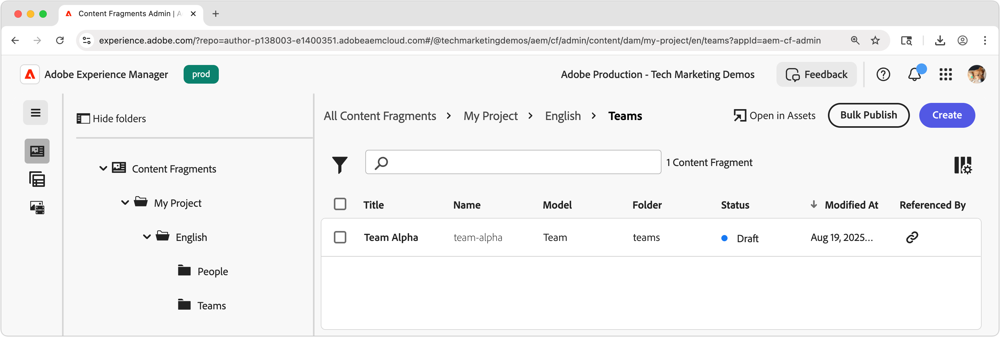
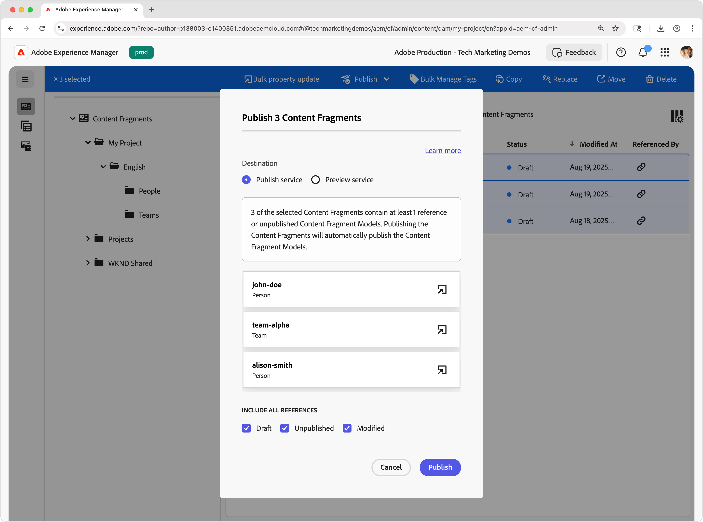

# 创作内容片段

在本章中，您将根据[团队和人员内容片段模型](./1-content-fragment-models.md)创建和编辑新的内容片段。 这些内容片段将是由React应用程序使用带有OpenAPI的AEM内容片段投放使用的内容。

## 先决条件

这是一个多部分教程，并假定已完成[定义内容片段模型](./1-content-fragment-models.md)中概述的步骤。

## 目标

* 根据内容片段模型创建内容片段。
* 创作内容片段。
* 发布内容片段。

## 为内容片段创建资源文件夹

内容片段存储在AEM Assets的文件夹中。 要根据上一章中创建的内容片段模型创建内容片段，必须存在文件夹才能存储这些内容片段。 需要对该文件夹进行配置才能从特定内容片段模型创建内容片段。

AEM支持“平面”文件夹组织，这意味着不同内容片段模型的内容片段将在单个文件夹中混合在一起。 但是，在本教程中，部分使用了与内容片段模型一致的文件夹结构来浏览&#x200B;**下一章**&#x200B;中的[List all Content Fragments by folder](./3-explore-openapis.md) API。 在确定内容片段组织时，请考虑您希望如何创作和管理内容片段，以及如何通过带OpenAPI的AEM内容片段交付和使用内容片段。

1. 从AEM“开始”屏幕中，导航到&#x200B;**Assets** > **文件**。
1. 选择右上角的&#x200B;**创建**，然后选择&#x200B;**文件夹**。 输入：

   * 标题： **我的项目**
   * 名称： **my-project**

   选择&#x200B;**创建**&#x200B;以创建文件夹。

1. 打开新的&#x200B;**我的项目**&#x200B;文件夹，并在新的&#x200B;**我的项目**&#x200B;文件夹下创建一个包含以下值的子文件夹：

   * 标题： **英语**
   * 名称： **en**

   将创建一个根语言文件夹来定位项目，以支持AEM的本机本地化功能。 最佳做法是为多语言支持设置项目，即使您现在不需要本地化。 有关详细信息，请参阅[以下文档页面](https://experienceleague.adobe.com/docs/experience-manager-cloud-service/content/assets/admin/translate-assets.html)。

1. 在新的&#x200B;**我的项目>英语**&#x200B;文件夹下创建两个子文件夹，其值如下：

   包含`teams`团队&#x200B;**内容片段的**&#x200B;文件夹

   * 标题： **团队**
   * 名称： **团队**

   ...和一个包含`people`人员&#x200B;**内容片段的**&#x200B;文件夹。

   * 标题： **人员**
   * 名称： **人员**

1. 导航回&#x200B;**我的项目>英语**&#x200B;文件夹，并确保创建了两个新文件夹。
1. 选择&#x200B;**团队**&#x200B;文件夹，然后在顶部操作栏中选择&#x200B;**属性**。
1. 选择&#x200B;**策略**&#x200B;选项卡，并取消选中&#x200B;**继承自`/content/dam/my-project`**。
1. 在&#x200B;**策略**&#x200B;选项卡上，在&#x200B;**允许的内容片段模型（按路径**）字段中选择&#x200B;**团队**&#x200B;内容片段模型。

   

   这些策略由子文件夹自动继承，但可以覆盖。 标记可以允许内容片段模型，也可以从其他项目配置启用内容片段模型。 此机制提供了一种管理内容层次结构的强大方法。

1. 选择&#x200B;**保存并关闭**&#x200B;以保存对文件夹属性所做的更改。
1. 以相同方式更新&#x200B;**人员**&#x200B;文件夹的&#x200B;**策略**，但改为选择&#x200B;**人员**&#x200B;内容片段模型。

## 创建人员内容片段

在&#x200B;**我的项目>英语>人员**&#x200B;文件夹中基于&#x200B;**人员**&#x200B;内容片段模型创建内容片段。

1. 从AEM开始屏幕中，选择&#x200B;**内容片段**&#x200B;以打开内容片段控制台。
1. 选择&#x200B;**显示文件夹**&#x200B;按钮以打开文件夹浏览器。
1. 选择&#x200B;**我的项目>英语>人员**&#x200B;文件夹。
1. 选择&#x200B;**创建>内容片段**&#x200B;并输入以下值：

   * 位置： `/content/dam/my-project/en/people`
   * 内容片段模型： **人员**
   * 标题： **John Doe**
   * 名称：`john-doe`

   请记住，**新建内容片段**&#x200B;对话框中的这些&#x200B;**标题**、**名称**&#x200B;和&#x200B;**描述**&#x200B;字段存储为有关内容片段的元数据，而不是内容片段数据的一部分。

   

1. 选择&#x200B;**创建并打开**。
1. 填写&#x200B;**John Doe**&#x200B;片段的字段：

   * 全名： **John Doe**
   * 自传：**John Doe喜爱社交媒体和旅游爱好者。**
   * 配置文件图片：从`/content/dam`中选择图像或上传新图像。
   * 职业： **影响者**，**旅行者**

   这些字段和值定义将通过OpenAPI的AEM内容片段投放使用的内容片段的内容。

   

1. 内容片段更改会自动保存，因此没有&#x200B;**保存**&#x200B;按钮。
1. 返回内容片段控制台，然后选择&#x200B;**我的项目>英语>人员**&#x200B;以查看您的新内容片段。

### 创建其他人员内容片段

重复上述步骤以创建其他&#x200B;**人员**&#x200B;片段。

1. 使用以下属性为&#x200B;**Alison Smith**&#x200B;创建人员内容片段：

   * 位置： `/content/dam/my-project/en/people`
   * 内容片段模型： **人员**
   * 标题： **Alison Smith**
   * 名称：`alison-smith`

   选择&#x200B;**创建并打开**&#x200B;并创作以下值：

   * 全名： **Alison Smith**
   * 传记：**Alison是一名摄影师，她喜欢写她的旅行经历。**
   * 配置文件图片：从`/content/dam`中选择图像或上传新图像。
   * 职业： **摄影师**，**旅行者**，**作者**。

现在，在&#x200B;**我的项目>英语>人员**&#x200B;文件夹中应该有两个内容片段：

您可以选择制作多个人员内容片段来表示其他人员。

## 创建团队内容片段

使用相同的方法，在&#x200B;**我的项目>英语>团队**&#x200B;文件夹中基于&#x200B;**团队**&#x200B;内容片段模型创建一个&#x200B;**团队**&#x200B;片段。

1. 创建表示&#x200B;**团队Alpha**&#x200B;的&#x200B;**团队**&#x200B;片段，该片段具有以下属性：

   * 位置： `/content/dam/my-project/en`
   * 内容片段模型： **团队**
   * 标题： **Alpha团队**
   * 名称：`team-alpha`

   选择&#x200B;**创建并打开**&#x200B;并创作以下值：

   * 标题： **Alpha团队**
   * 描述： **Alpha团队是一个旅游内容团队，专门从事摄影和旅游写作。**
   * **团队成员**：选择&#x200B;**John Doe**&#x200B;和&#x200B;**Alison Smith**&#x200B;内容片段以填充&#x200B;**团队成员**&#x200B;字段。

   

1. 选择&#x200B;**创建并打开**&#x200B;以创建团队内容片段
1. **我的项目>英语>团队**&#x200B;下应该有一个内容片段：

您现在应在&#x200B;**我的项目>英语>团队**&#x200B;文件夹中包含&#x200B;**团队Alpha**&#x200B;内容片段：

或者，创建包含一组不同人员的&#x200B;**团队Omega**。

## 发布内容片段

要通过OpenAPI提供内容片段，请发布它们。 发布后，可通过以下方式访问内容片段：

* **发布服务** — 为生产应用程序提供内容
* **预览服务** — 提供内容以预览应用程序

通常，内容先发布到&#x200B;**预览服务**，并在预览应用程序上进行审核，然后再发布到&#x200B;**发布服务**。 发布到&#x200B;**发布服务**&#x200B;并不会同时发布到&#x200B;**预览服务**。 您必须单独发布到&#x200B;**预览服务**。

在本教程中，我们将发布到AEM Publish服务，但使用AEM Preview服务就像在React应用程序中更改[AEM服务的URL一样简单](./4-react-app.md)

1. 在内容片段控制台中，找到&#x200B;**我的项目>英语**&#x200B;文件夹。
1. 选择&#x200B;**英语**&#x200B;文件夹（显示所有子文件夹中的所有内容片段）中的所有内容片段，然后从顶部操作栏中选择&#x200B;**发布>立即**。

   

1. 选择&#x200B;**发布服务**，在&#x200B;**包含所有引用**&#x200B;下，选择&#x200B;**已取消发布**&#x200B;和&#x200B;**已修改**，然后选择&#x200B;**发布**。

   

现在，内容片段、团队内容片段引用的所有人员内容片段以及任何引用的资产都已发布到&#x200B;**发布服务**。

您可以按相同方式发布到&#x200B;**预览服务**。

## 恭喜！

恭喜，您已成功创作基于AEM中内容片段模型的内容片段。 您已创建一个&#x200B;**人员**&#x200B;内容片段模型，创建了多个&#x200B;**人员**&#x200B;内容片段，并创建了一个引用多个&#x200B;**人员**&#x200B;内容片段的&#x200B;**团队**&#x200B;内容片段。

发布内容片段后，您现在可以通过OpenAPI的AEM内容片段交付访问它们。

## 后续步骤

在下一章[浏览OpenAPI](3-explore-openapis.md)中，您将使用API文档中内置的&#x200B;**尝试使用**&#x200B;功能来浏览OpenAPI的AEM内容片段交付。

