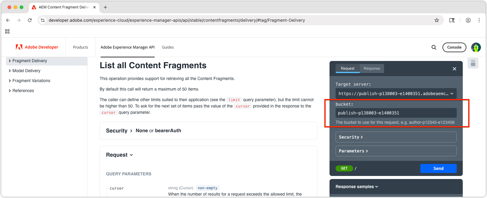

# 探索基于AEM OpenAPI的内容片段投放API

AEM中的使用OpenAPI API的[AEM内容片段交付](https://developer.adobe.com/experience-cloud/experience-manager-apis/api/stable/contentfragments/delivery/)提供了一种强大的方式，可以将结构化内容交付到任何应用程序或渠道。 在本章中，我们探索如何使用OpenAPI通过文档的&#x200B;**尝试**&#x200B;功能检索内容片段。

## 先决条件 {#prerequisites}

这是一个多部分教程，并假定已完成[创作内容片段](./2-author-content-fragments.md)中概述的步骤。

确保具备以下各项：

* AEM发布服务（例如，`https://publish-<PROGRAM_ID>-e<ENVIRONMENT_ID >.adobeaemcloud.com/`） [内容片段的主机名已发布到](./2-author-content-fragments.md#publish-content-fragments)。 如果要发布AEM Preview服务，请使用该主机名（例如`https://preview-<PROGRAM_ID>-e<ENVIRONMENT_ID>.adobeaemcloud.com/`）。

## 目标 {#objectives}

* 熟悉[AEM内容片段的OpenAPI投放](https://developer.adobe.com/experience-cloud/experience-manager-apis/api/stable/contentfragments/delivery/)。
* 使用API文档&#x200B;**调用API尝试它**&#x200B;功能。

## 传递 API

使用OpenAPI的AEM内容片段投放提供了一个RESTful界面来检索内容片段。 本教程中讨论的API仅在AEM Publish和Preview服务中可用，在Author服务中不可用。 [存在与AEM创作服务](https://developer.adobe.com/experience-cloud/experience-manager-apis/api/stable/sites/)上的内容片段交互的其他OpenAPI。

## 探索API

[使用OpenAPI API的AEM内容片段投放文档](https://developer.adobe.com/experience-cloud/experience-manager-apis/api/stable/contentfragments/delivery/)具有“试用”功能，允许您浏览这些API并直接从浏览器测试它们。 这是熟悉API端点及其功能的好方法。

在浏览器中打开[AEM Sites API文档](https://developer.adobe.com/experience-cloud/experience-manager-apis/api/stable/contentfragments/delivery/)。

API列在左侧导航的&#x200B;**片段投放**&#x200B;部分下。 您可以展开此部分以查看可用的API。 选择API会在主面板中显示API详细信息，右边栏中会显示&#x200B;**试用**&#x200B;部分，该部分允许您直接从浏览器测试和浏览API。


## 列出内容片段

1. 在浏览器中使用OpenAPI开发人员文档[打开](https://developer.adobe.com/experience-cloud/experience-manager-apis/api/stable/contentfragments/delivery/)AEM内容片段投放。
1. 在左侧导航中，展开&#x200B;**片段投放**&#x200B;部分，然后选择&#x200B;**列出所有内容片段** API

此API允许您按文件夹从AEM中检索所有内容片段的分页列表。 使用此API最简单的方法是提供包含内容片段的文件夹的路径。

1. 在右边栏的顶部选择&#x200B;**尝试它**。
1. 输入API将连接以检索内容片段的AEM服务的标识符。 存储段是AEM Publish（或预览）服务URL的第一部分，格式通常为： `publish-p<PROGRAM_ID>-e<ENVIRONMENT_ID>`或`preview-p<PROGRAM_ID>-e<ENVIRONMENT_ID>`。

由于我们使用的是AEM Publish服务，请将存储段设置为AEM Publish服务标识符。 例如：

* **分段**： `publish-p138003-e1400351`



设置存储段后，**Target服务器**&#x200B;字段会自动更新为AEM发布服务的完整API URL，例如： `https://publish-p138003-e1400351.adobeaemcloud.com/adobe/contentFragments`

1. 展开&#x200B;**安全**&#x200B;部分并将&#x200B;**安全方案**&#x200B;设置为&#x200B;**无**。 这是因为AEM Publish服务（和预览服务）不需要使用OpenAPI进行AEM内容片段投放的身份验证。

1. 展开&#x200B;**参数**&#x200B;部分以提供要获取的内容片段的详细信息。

* **cursor**：留空，用于分页，这是初始请求。
* **limit**：留空，用于限制每页结果返回的结果数。
* **路径**： `/content/dam/my-project/en`

  >[!TIP]
  > 输入路径时，请确保其前缀为`/content/dam/`且&#x200B;**不是**&#x200B;以尾随斜杠`/`结尾。

  

1. 选择&#x200B;**发送**&#x200B;按钮以执行API调用。
1. 在&#x200B;**尝试它**&#x200B;面板的&#x200B;**响应**&#x200B;选项卡中，您应该会看到一个包含指定文件夹中的内容片段列表的JSON响应。 响应将类似于以下内容：

   

1. 响应包含`path`参数的`/content/dam/my-project`文件夹下的所有内容片段，包括子文件夹，包括&#x200B;**人员**&#x200B;和&#x200B;**团队**&#x200B;内容片段。
1. 点击`items`数组并找到`Team Alpha`项的`id`值。 该ID在下一部分中用于检索单个内容片段的详细信息。
1. 在&#x200B;**尝试它**&#x200B;面板的顶部选择&#x200B;**编辑请求**&#x200B;以及API调用中的各种参数，以查看响应的变化。 例如，您可以将路径更改为包含内容片段的其他文件夹，也可以添加查询参数以筛选结果。 例如，将`path`参数更改为`/content/dam/my-project/teams`以仅显示该文件夹（和子文件夹）中的内容片段。

## 获取内容片段详细信息

与&#x200B;**List all Content Fragments** API类似，**Get a Content Fragment** API通过其ID以及任何可选引用来检索单个内容片段。 要探索此API，我们将请求引用多个人员内容片段的团队内容片段。

1. 展开左边栏中的&#x200B;**片段投放**&#x200B;部分，然后选择&#x200B;**获取内容片段** API。
1. 在右边栏的顶部选择&#x200B;**尝试它**。
1. 验证`bucket`是否指向您的AEM as a Cloud Service发布或预览服务。
1. 展开&#x200B;**安全**&#x200B;部分并将&#x200B;**安全方案**&#x200B;设置为&#x200B;**无**。 这是因为AEM Publish服务不需要对OpenAPI的AEM内容片段投放进行身份验证。
1. 展开&#x200B;**参数**&#x200B;部分以提供要获取的内容片段的详细信息：

在此示例中，使用在上一节中检索的团队内容片段的ID。 例如，对于&#x200B;**列出所有内容片段**&#x200B;中的此内容片段响应，使用`id`的`b954923a-0368-4fa2-93ea-2845f599f512`字段中的值。 （您的`id`将与教程中使用的值不同。）

```json
{
    "path": "/content/dam/my-project/teams/team-alpha",
    "name": "",
    "title": "Team Alpha",
    "id": "50f28a14-fec7-4783-a18f-2ce2dc017f55", // This is the Content Fragment ID
    "description": "",
    "model": {},
    "fields": {} 
}
```

* **fragmentId**： `50f28a14-fec7-4783-a18f-2ce2dc017f55`
* **个引用**： `none`
* **depth**：留空，**references**&#x200B;参数将指定所引用片段的深度。
* **水合**：留空，**引用**&#x200B;参数将指定所引用片段的水合。
* **If-None-Match**：留空

1. 选择&#x200B;**发送**&#x200B;按钮以执行API调用。
1. 在&#x200B;**尝试**&#x200B;面板的&#x200B;**响应**&#x200B;选项卡中查看响应。 您应该会看到一个JSON响应，其中包含内容片段的详细信息，包括其属性和任何引用。
1. 在&#x200B;**尝试它**&#x200B;面板的顶部选择&#x200B;**编辑请求**，并在&#x200B;**参数**&#x200B;部分中，将`references`参数调整为`all-hydrated`，使所有引用的内容片段的内容包含在API调用中。

   * **fragmentId**： `50f28a14-fec7-4783-a18f-2ce2dc017f55`
   * **个引用**： `all-hydrated`
   * **depth**：留空，**references**&#x200B;参数将指定所引用片段的深度。
   * **水合**：留空，**引用**&#x200B;参数将指定所引用片段的水合。
   * **If-None-Match**：留空

1. 选择&#x200B;**重新发送**&#x200B;按钮以再次执行API调用。
1. 在&#x200B;**尝试**&#x200B;面板的&#x200B;**响应**&#x200B;选项卡中查看响应。 您应该会看到一个JSON响应，其中包含内容片段的详细信息，包括其属性和引用的人员内容片段的属性。

请注意，`teamMembers`数组现在包含引用的人员内容片段的详细信息。 通过水化引用，可在单个API调用中检索所有必需的数据，这对于减少客户端应用程序发出的请求数量尤其有用。

## 恭喜！

恭喜，您已使用AEM文档的&#x200B;**试用**&#x200B;功能，通过OpenAPI API调用创建并执行了多个AEM内容片段交付。

## 后续步骤

在下一章[构建React应用程序](./4-react-app.md)中，您将探索外部应用程序如何通过OpenAPI API与AEM内容片段投放交互。

