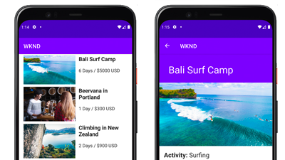

# AEM 中的 Headless 教程{#aem-headless-tutorials}

Adobe Experience Manager (AEM) 有多个选项可用于定义 Headless 端点，并以 JSON 格式投放其内容。通过动手实践的教程，探索如何使用各种选项，并选择适合自己的选项。

>[!TIP]
>
>本系列教程专为那些喜欢&#x200B;**边做边学**&#x200B;的人员设计。如果您喜欢从头开始学习概念，可以查看 [AEM Headless 开发人员历程](https://experienceleague.adobe.com/docs/experience-manager-cloud-service/content/headless/journeys/developer/overview.html)。这套教程和该历程相辅相成。

## 按 API 分类的教程

<table>
<tr>
  <td>
    
    

      <a href="https://experienceleague.adobe.com/docs/experience-manager-learn/getting-started-with-aem-headless/graphql/overview.html">
    <strong>GraphQL API</strong>
    </a>
    

    

    <em>了解应用程序如何使用 AEM 的 GraphQL API 来查询内容。</em>
    

  </td>
  <td>
    
     

      <a href="./open-api/basic/overview.md">
        <strong>OpenAPI</strong>
      </a>
    

    

    <em>了解应用程序如何使用基于OpenAPI的REST API来使用内容。</em>
    

  </td>
  <td>
    
    

    <a href="https://experienceleague.adobe.com/docs/experience-manager-learn/getting-started-with-aem-headless/authentication/overview.html">
    <strong>令牌身份验证</strong>
    </a>
    

    

    <em>了解应用程序如何通过 AEM 安全地进行身份验证。</em>
    

  </td>  
</tr>
</table>

## 示例应用程序

示例应用程序是探索 Adobe Experience Manager (AEM) 的 Headless 功能的好方法。下载并安装这些完成的示例即可立即开始使用。

<table>
<tr>
  <td>
    
    

      <a href="https://experienceleague.adobe.com/docs/experience-manager-learn/getting-started-with-aem-headless/graphql/example-apps/ios-swiftui-app.html">
    <strong>iOS SwiftUI 示例</strong>
    </a>
    

    

    <em>由 AEM 的 GraphQL API 提供支持的 iOS 应用程序。</em>
    

  </td>
  <td>
    
    

    <a href="https://experienceleague.adobe.com/docs/experience-manager-learn/getting-started-with-aem-headless/graphql/example-apps/android-app.html">
    <strong>Android™ 示例</strong>
    </a>
    

    

    <em>由 AEM 的 GraphQL API 提供支持的 Android™ 应用程序。</em>
    

  </td>
  <td>
    
     

      <a href="https://experienceleague.adobe.com/docs/experience-manager-learn/getting-started-with-aem-headless/graphql/example-apps/react-app.html">
        <strong>React 示例</strong>
      </a>
    

    

    <em>由 AEM 的 GraphQL API 提供支持的 React 应用程序。</em>
    

  </td>
</tr>
</table>

## 教程

根据所使用的技术浏览以下教程。了解 AEM 如何超越纯粹的 Headless 用例，并提供上下文创作和体验管理选项。

<table>
<tr>
  <td>
    
    

      <a href="https://experienceleague.adobe.com/docs/experience-manager-learn/getting-started-with-aem-headless/graphql/overview.html">
    <strong>React - Headless</strong>
    </a>
    

    

    <em>在纯 Headless 场景中使用 GraphQL 构建 React JS 应用程序。</em>
    

  </td>
  <td>
    
     

      <a href="https://experienceleague.adobe.com/zh-hans/docs/experience-manager-learn/cloud-service/developing/universal-editor/react-app-editing/overview">
        <strong>React - 通过通用编辑器编辑内容</strong>
      </a>
    

    

    <em>使用通用编辑器编辑 React 应用程序的内容。</em>
    

  </td>  
  <td>
    
    

    <a href="https://experienceleague.adobe.com/docs/experience-manager-learn/getting-started-with-aem-headless/spa-editor/remote-spa/overview.html">
    <strong>React - 远程编辑器</strong>
    </a>
    

    

    <em>在上下文中创作远程托管的 React 应用程序的一部分。</em>
    

  </td>
</tr>
<tr>  
  <td>
    
     

      <a href="https://experienceleague.adobe.com/docs/experience-manager-learn/getting-started-with-aem-headless/spa-editor/react/overview.html">
        <strong>React - SPA 编辑器</strong>
      </a>
    

    

    <em>使用 AEM SPA 编辑器来管理完整的 React 应用程序体验。</em>
    

  </td>
  <td>
    
    

    <a href="https://experienceleague.adobe.com/docs/experience-manager-learn/getting-started-with-aem-headless/content-services/overview.html">
    <strong>Android - 内容服务</strong>
    </a>
    

    

    <em>使用内容服务和 REST 为移动 Android™ 应用程序提供支持。</em>
    

  </td>
  <td>
    
     

      <a href="https://experienceleague.adobe.com/docs/experience-manager-learn/getting-started-with-aem-headless/authentication/overview.html">
        <strong>Node.js 身份验证</strong>
      </a>
    

    

    <em>使用开发人员和服务令牌进行身份验证，构建一个 Node.js 应用程序。</em>
    

  </td>
</tr>
</table>
