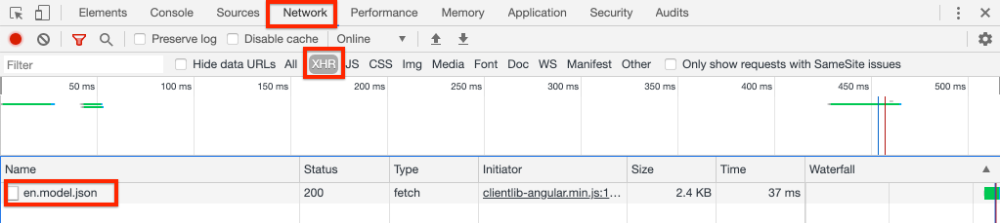

# SPA编辑器项目 {#create-project}

{{spa-editor-deprecation}}

了解如何使用Adobe Experience Manager (AEM) Maven项目作为与AEM SPA编辑器集成的Angular应用程序的起点。

## 目标

1. 了解从Maven原型构建的新AEM SPA Editor项目的结构。
2. 将起始项目部署到AEM的本地实例。

## 您将构建的内容

在本章中，将基于[AEM项目原型](https://github.com/adobe/aem-project-archetype)部署新的AEM项目。 AEM项目通过非常简单的Angular SPA起点引导。 本章中使用的项目将作为WKND SPA实施的基础，并在以后的章节中构建该项目。


*经典的Hello World消息。*

## 先决条件

查看设置[本地开发环境](overview.md#local-dev-environment)所需的工具和说明。 请确保以&#x200B;**创作**&#x200B;模式启动的Adobe Experience Manager的新实例正在本地运行。

## 获取项目

有多个选项可为AEM创建Maven Multi-module项目。 本教程使用最新的[AEM项目原型](https://github.com/adobe/aem-project-archetype)作为教程代码的基础。 为了支持多个AEM版本，已对项目代码进行了修改。 请查阅[关于向后兼容性的说明](overview.md#compatibility)。

>[!CAUTION]
>
>最佳实践是使用[原型](https://github.com/adobe/aem-project-archetype)的&#x200B;**最新**&#x200B;版本生成用于实际实施的新项目。 AEM项目应使用原型的`aemVersion`属性定位单一版本的AEM。

1. 通过Git下载本教程的起点：

   ```shell
   $ git clone git@github.com:adobe/aem-guides-wknd-spa.git
   $ cd aem-guides-wknd-spa
   $ git checkout Angular/create-project-start
   ```

2. 以下文件夹和文件结构表示由本地文件系统上的Maven原型生成的AEM项目：

   ```plain
   |--- aem-guides-wknd-spa
       |--- all/
       |--- core/
       |--- dispatcher/
       |--- ui.apps/
       |--- ui.apps.structure/
       |--- ui.content/
       |--- ui.frontend /
       |--- it.tests/
       |--- pom.xml
       |--- README.md
       |--- .gitignore
       |--- archetype.properties
   ```

3. 从[AEM项目原型](https://github.com/Adobe-Marketing-Cloud/aem-project-archetype/releases/tag/aem-project-archetype-14)生成AEM项目时，使用了以下属性：

   | 属性 | 值 |
   |-----------------|---------------------------------------|
   | aemVersion | 云 |
   | appTitle | WKND SPA ANGULAR |
   | appId | wknd-spa-angular |
   | groupId | com.adobe.aem.guides |
   | frontendmodule | 角度 |
   | 包 | com.adobe.aem.guides.wknd.spa.angular |
   | includeExamples | n |

   >[!NOTE]
   >
   > 注意`frontendModule=angular`属性。 这会告知AEM项目原型使用要与AEM SPA编辑器一起使用的启动程序[Angular代码库](https://experienceleague.adobe.com/docs/experience-manager-core-components/using/developing/archetype/uifrontend-angular.html?lang=zh-Hans)引导项目。

## 构建项目

接下来，使用Maven编译、构建项目代码并将其部署到AEM的本地实例。

1. 确保AEM的实例在端口&#x200B;**4502**&#x200B;上本地运行。
2. 从命令行终端验证Maven是否已安装：

   ```shell
   $ mvn --version
   Apache Maven 3.6.2
   Maven home: /Library/apache-maven-3.6.2
   Java version: 11.0.4, vendor: Oracle Corporation, runtime: /Library/Java/JavaVirtualMachines/jdk-11.0.4.jdk/Contents/Home
   ```

3. 从`aem-guides-wknd-spa`目录运行以下Maven命令以生成项目并将其部署到AEM：

   ```shell
   $ mvn -PautoInstallSinglePackage clean install
   ```

   如果使用[AEM 6.x](overview.md#compatibility)：

   ```shell
   $ mvn clean install -PautoInstallSinglePackage -Pclassic
   ```

   应编译项目的多个模块并将其部署到AEM。

   ```plain
   [INFO] ------------------------------------------------------------------------
   [INFO] Reactor Summary for wknd-spa-angular 1.0.0-SNAPSHOT:
   [INFO] 
   [INFO] wknd-spa-angular ................................... SUCCESS [  0.473 s]
   [INFO] WKND SPA Angular - Core ............................ SUCCESS [ 54.866 s]
   [INFO] wknd-spa-angular.ui.frontend - UI Frontend ......... SUCCESS [02:10 min]
   [INFO] WKND SPA Angular - Repository Structure Package .... SUCCESS [  0.694 s]
   [INFO] WKND SPA Angular - UI apps ......................... SUCCESS [  6.351 s]
   [INFO] WKND SPA Angular - UI content ...................... SUCCESS [  2.885 s]
   [INFO] WKND SPA Angular - All ............................. SUCCESS [  1.736 s]
   [INFO] WKND SPA Angular - Integration Tests Bundles ....... SUCCESS [  2.563 s]
   [INFO] WKND SPA Angular - Integration Tests Launcher ...... SUCCESS [  1.846 s]
   [INFO] WKND SPA Angular - Dispatcher ...................... SUCCESS [  0.270 s]
   [INFO] ------------------------------------------------------------------------
   [INFO] BUILD SUCCESS
   [INFO] ------------------------------------------------------------------------
   ```

   Maven配置文件&#x200B;***autoInstallSinglePackage***&#x200B;编译项目的各个模块并将单个包部署到AEM实例。 默认情况下，此包将部署到在端口&#x200B;**4502**&#x200B;上本地运行的AEM实例，并使用&#x200B;**admin：admin**&#x200B;的凭据。

4. 导航到本地AEM实例上的&#x200B;**[!UICONTROL 包管理器]**： [http://localhost:4502/crx/packmgr/index.jsp](http://localhost:4502/crx/packmgr/index.jsp)。

5. 您应该看到`wknd-spa-angular.all`、`wknd-spa-angular.ui.apps`和`wknd-spa-angular.ui.content`的三个包。

   

   项目所需的所有自定义代码将捆绑在这些包中，并安装在AEM运行时中。

6. 您还应该看到`spa.project.core`和`core.wcm.components`的多个包。 这些是原型自动包含的依赖项。 有关[AEM核心组件的详细信息见此处](https://experienceleague.adobe.com/docs/experience-manager-core-components/using/introduction.html?lang=zh-Hans)。

## 创作内容

接下来，打开原型生成的入门SPA并更新某些内容。

1. 导航到&#x200B;**[!UICONTROL 站点]**&#x200B;控制台： [http://localhost:4502/sites.html/content](http://localhost:4502/sites.html/content)。

   WKND SPA包括基本站点结构，其中包含国家/地区、语言和主页。 此层次结构基于原型`language_country`和`isSingleCountryWebsite`的默认值。 生成项目时，可通过更新[可用属性](https://github.com/adobe/aem-project-archetype#available-properties)来覆盖这些值。

2. 选择页面，然后单击菜单栏中的&#x200B;**[!UICONTROL 编辑]**&#x200B;按钮，打开&#x200B;**[!DNL us]** > **[!DNL en]** > **[!DNL WKND SPA Angular Home Page]**&#x200B;页面：

   

3. **[!UICONTROL Text]**&#x200B;组件已添加到该页面。 您可以像在AEM中编辑任何其他组件一样编辑此组件。

   

4. 向页面添加额外的&#x200B;**[!UICONTROL Text]**&#x200B;组件。

   请注意，创作体验类似于传统AEM Sites页面的创作体验。 当前可用的组件数量有限。 在本教程中会添加更多内容。

## 检查单页应用程序

接下来，验证这是使用浏览器的开发人员工具的单页应用程序。

1. 在&#x200B;**[!UICONTROL 页面编辑器]**&#x200B;中，单击&#x200B;**[!UICONTROL 页面信息]**&#x200B;菜单> **[!UICONTROL 以发布的形式查看]**：

   

   这将使用查询参数`?wcmmode=disabled`打开一个新选项卡，从而有效地关闭AEM编辑器： [http://localhost:4502/content/wknd-spa-angular/us/en/home.html?wcmmode=disabled](http://localhost:4502/content/wknd-spa-angular/us/en/home.html?wcmmode=disabled)

2. 查看页面的源，并注意找不到文本内容&#x200B;**[!DNL Hello World]**&#x200B;或任何其他内容。 您应该会看到如下所示的HTML：

   ```html
   ...
   <body>
       <noscript>You need to enable JavaScript to run this app.</noscript>
       <div id="spa-root"></div>
       <script type="text/javascript" src="/etc.clientlibs/wknd-spa-angular/clientlibs/clientlib-angular.min.js"></script>
       ...
   </body>
   ...
   ```

   `clientlib-angular.min.js`是加载到页面并负责呈现内容的Angular SPA。

   *内容来自何处？*

3. 返回选项卡： [http://localhost:4502/content/wknd-spa-angular/us/en/home.html?wcmmode=disabled](http://localhost:4502/content/wknd-spa-angular/us/en/home.html?wcmmode=disabled)
4. 打开浏览器的开发人员工具，并在刷新期间检查页面的网络流量。 查看&#x200B;**XHR**&#x200B;请求：

   

   应向[http://localhost:4502/content/wknd-spa-angular/us/en.model.json](http://localhost:4502/content/wknd-spa-angular/us/en.model.json)发出请求。 其中包含将驱动SPA的所有内容（以JSON格式）。

5. 在新选项卡中，打开[http://localhost:4502/content/wknd-spa-angular/us/en.model.json](http://localhost:4502/content/wknd-spa-angular/us/en.model.json)

   请求`en.model.json`表示将驱动应用程序的内容模型。 检查JSON输出，您应该能够找到表示&#x200B;**[!UICONTROL Text]**&#x200B;组件的代码片段。

   ```json
   ...
   ":items": {
       "text": {
           "text": "<p>Hello World! Updated content!</p>\r\n",
           "richText": true,
           ":type": "wknd-spa-angular/components/text"
       },
       "text_98796435": {
           "text": "<p>A new text component.</p>\r\n",
           "richText": true,
           ":type": "wknd-spa-angular/components/text"
   },
   ...
   ```

   在下一章中，我们将检查JSON内容如何从AEM组件映射到SPA组件，以便构成AEM SPA编辑器体验的基础。

   >[!NOTE]
   >
   > 安装浏览器扩展以自动格式化JSON输出可能会有所帮助。

## 恭喜！ {#congratulations}

恭喜，您刚刚创建了第一个AEM SPA Editor项目！

现在操作很简单，但在接下来的几个章节中添加了更多功能。

### 后续步骤 {#next-steps}

[集成SPA](integrate-spa.md) — 了解SPA源代码如何与AEM项目集成，并了解可用于快速开发SPA的工具。
