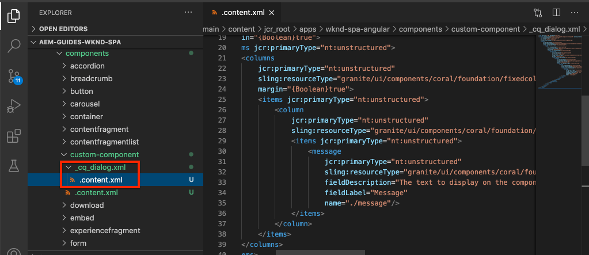

# 创建自定义组件 {#custom-component}

了解如何创建要与AEM SPA编辑器一起使用的自定义组件。 了解如何开发创作对话框和Sling模型以扩展JSON模型以填充自定义组件。

## 目标

1. 了解Sling模型在处理AEM提供的JSON模型API中的角色。
2. 了解如何创建新的AEM组件对话框。
3. 了解如何创建与SPA编辑器框架兼容的&#x200B;**custom** AEM组件。

## 将构建的内容

以前各章的重点是开发SPA组件，并将它们映射到&#x200B;*现有* AEM核心组件。 本章将重点介绍如何创建和扩展新的&#x200B;** AEM组件，以及如何处理AEM提供的JSON模型。

一个简单的`Custom Component`说明创建新AEM组件所需的步骤。


## 前提条件

查看设置[本地开发环境](overview.md#local-dev-environment)所需的工具和说明。

### 获取代码

1. 通过Git下载本教程的起点：

   ```shell
   $ git clone git@github.com:adobe/aem-guides-wknd-spa.git
   $ cd aem-guides-wknd-spa
   $ git checkout Angular/custom-component-start
   ```

2. 使用Maven将代码库部署到本地AEM实例：

   ```shell
   $ mvn clean install -PautoInstallSinglePackage
   ```

   如果使用[AEM 6.x](overview.md#compatibility)添加`classic`配置文件：

   ```shell
   $ mvn clean install -PautoInstallSinglePackage -Pclassic
   ```

3. 为传统[WKND引用站点](https://github.com/adobe/aem-guides-wknd/releases/latest)安装完成的包。 [WKND引用站点](https://github.com/adobe/aem-guides-wknd/releases/latest)提供的图像将在WKND SPA上重新使用。 可以使用[AEM Package Manager](http://localhost:4502/crx/packmgr/index.jsp)安装包。

   

您始终可以在[GitHub](https://github.com/adobe/aem-guides-wknd-spa/tree/Angular/custom-component-solution)上查看完成的代码，或通过切换到分支`Angular/custom-component-solution`在本地签出代码。

## 定义AEM组件

AEM组件被定义为节点和属性。 在项目中，这些节点和属性在`ui.apps`模块中表示为XML文件。 接下来，在`ui.apps`模块中创建AEM组件。

>[!NOTE]
>
> 有关AEM组件[基础知识的快速刷新器可能](https://experienceleague.adobe.com/docs/experience-manager-learn/getting-started-wknd-tutorial-develop/project-archetype/component-basics.html)很有用。

1. 在选择的IDE中，打开`ui.apps`文件夹。
2. 导航到`ui.apps/src/main/content/jcr_root/apps/wknd-spa-angular/components`并创建一个名为`custom-component`的新文件夹。
3. 在`custom-component`文件夹下创建一个名为`.content.xml`的新文件。 使用以下内容填充`custom-component/.content.xml`:

   ```xml
   <?xml version="1.0" encoding="UTF-8"?>
   <jcr:root xmlns:sling="http://sling.apache.org/jcr/sling/1.0" xmlns:cq="http://www.day.com/jcr/cq/1.0" xmlns:jcr="http://www.jcp.org/jcr/1.0"
       jcr:primaryType="cq:Component"
       jcr:title="Custom Component"
       componentGroup="WKND SPA Angular - Content"/>
   ```

   

   `jcr:primaryType="cq:Component"`  — 标识此节点将是AEM组件。

   `jcr:title` 是将显示给内容作者的值，它可确 `componentGroup` 定创作UI中的组件分组。

4. 在`custom-component`文件夹下，创建另一个名为`_cq_dialog`的文件夹。
5. 在`_cq_dialog`文件夹下，创建一个名为`.content.xml`的新文件，并在其中填充以下内容：

   ```xml
   <?xml version="1.0" encoding="UTF-8"?>
   <jcr:root xmlns:sling="http://sling.apache.org/jcr/sling/1.0" xmlns:granite="http://www.adobe.com/jcr/granite/1.0" xmlns:cq="http://www.day.com/jcr/cq/1.0" xmlns:jcr="http://www.jcp.org/jcr/1.0" xmlns:nt="http://www.jcp.org/jcr/nt/1.0"
       jcr:primaryType="nt:unstructured"
       jcr:title="Custom Component"
       sling:resourceType="cq/gui/components/authoring/dialog">
       <content
           jcr:primaryType="nt:unstructured"
           sling:resourceType="granite/ui/components/coral/foundation/container">
           <items jcr:primaryType="nt:unstructured">
               <tabs
                   jcr:primaryType="nt:unstructured"
                   sling:resourceType="granite/ui/components/coral/foundation/tabs"
                   maximized="{Boolean}true">
                   <items jcr:primaryType="nt:unstructured">
                       <properties
                           jcr:primaryType="nt:unstructured"
                           jcr:title="Properties"
                           sling:resourceType="granite/ui/components/coral/foundation/container"
                           margin="{Boolean}true">
                           <items jcr:primaryType="nt:unstructured">
                               <columns
                                   jcr:primaryType="nt:unstructured"
                                   sling:resourceType="granite/ui/components/coral/foundation/fixedcolumns"
                                   margin="{Boolean}true">
                                   <items jcr:primaryType="nt:unstructured">
                                       <column
                                           jcr:primaryType="nt:unstructured"
                                           sling:resourceType="granite/ui/components/coral/foundation/container">
                                           <items jcr:primaryType="nt:unstructured">
                                               <message
                                                   jcr:primaryType="nt:unstructured"
                                                   sling:resourceType="granite/ui/components/coral/foundation/form/textfield"
                                                   fieldDescription="The text to display on the component."
                                                   fieldLabel="Message"
                                                   name="./message"/>
                                           </items>
                                       </column>
                                   </items>
                               </columns>
                           </items>
                       </properties>
                   </items>
               </tabs>
           </items>
       </content>
   </jcr:root>
   ```

   

   上述XML文件为`Custom Component`生成一个非常简单的对话框。 文件的关键部分是内部`<message>`节点。 此对话框将包含一个名为`Message`的简单`textfield`，并将文本字段的值保留为名为`message`的属性。

   随后将创建一个Sling模型，以通过JSON模型显示`message`属性的值。

   >[!NOTE]
   >
   > 您可以通过查看核心组件定义](https://github.com/adobe/aem-core-wcm-components/tree/master/content/src/content/jcr_root/apps/core/wcm/components)来查看更多[对话框示例。 您还可以查看其他表单字段，如`select`、`textarea`、`pathfield`，它们位于[CRXDE-Lite](http://localhost:4502/crx/de/index.jsp#/libs/granite/ui/components/coral/foundation/form)中`/libs/granite/ui/components/coral/foundation/form`下方。

   对于传统AEM组件，通常需要[HTL](https://experienceleague.adobe.com/docs/experience-manager-htl/using/overview.html?lang=zh-Hans)脚本。 由于SPA将渲染组件，因此无需HTL脚本。

## 创建Sling模型

Sling模型是注释驱动的Java“POJO”（纯旧Java对象），有助于将数据从JCR映射到Java变量。 [Sling Models](https://experienceleague.adobe.com/docs/experience-manager-learn/getting-started-wknd-tutorial-develop/project-archetype/component-basics.html#sling-models) 通常可以函数为AEM组件封装复杂的服务器端业务逻辑。

在SPA编辑器的上下文中，Sling模型通过使用[Sling模型导出器](https://experienceleague.adobe.com/docs/experience-manager-learn/foundation/development/develop-sling-model-exporter.html)的功能，通过JSON模型公开组件的内容。

1. 在选择的IDE中，打开`core`模块。 `CustomComponent.java` 和已 `CustomComponentImpl.java` 作为章节起始代码的一部分创建和停用。

   >[!NOTE]
   >
   > 如果使用Visual Studio代码IDE，则安装Java的[扩展可能会很有帮助。](https://code.visualstudio.com/docs/java/extensions)

2. 在`core/src/main/java/com/adobe/aem/guides/wknd/spa/angular/core/models/CustomComponent.java`处打开Java接口`CustomComponent.java`:

   

   这是将由Sling模型实施的Java界面。

3. 更新`CustomComponent.java`，以便扩展`ComponentExporter`接口：

   ```java
   package com.adobe.aem.guides.wknd.spa.angular.core.models;
   import com.adobe.cq.export.json.ComponentExporter;
   
   public interface CustomComponent extends ComponentExporter {
   
       public String getMessage();
   
   }
   ```

   实施`ComponentExporter`接口是JSON模型API自动选取Sling模型的要求。

   `CustomComponent`接口包括单个getter方法`getMessage()`。 这是通过JSON模型公开创作对话框值的方法。 在JSON模型中，将只导出参数为`()`的空getter方法。

4. 在`core/src/main/java/com/adobe/aem/guides/wknd/spa/angular/core/models/impl/CustomComponentImpl.java`处打开`CustomComponentImpl.java`。

   这是`CustomComponent`接口的实现。 `@Model`注释将Java类标识为Sling模型。 `@Exporter`注释允许通过Sling模型导出器序列化和导出Java类。

5. 更新静态变量`RESOURCE_TYPE`，以指向在上一个练习中创建的AEM组件`wknd-spa-angular/components/custom-component`。

   ```java
   static final String RESOURCE_TYPE = "wknd-spa-angular/components/custom-component";
   ```

   组件的资源类型是将Sling模型绑定到AEM组件，并最终映射到Angular组件的资源类型。

6. 将`getExportedType()`方法添加到`CustomComponentImpl`类以返回组件资源类型：

   ```java
   @Override
   public String getExportedType() {
       return CustomComponentImpl.RESOURCE_TYPE;
   }
   ```

   实现`ComponentExporter`接口时需要此方法，该方法将公开允许映射到Angular组件的资源类型。

7. 更新`getMessage()`方法，以返回创作对话框保留的`message`属性的值。 使用`@ValueMap`注释将JCR值`message`映射到Java变量：

   ```java
   import org.apache.commons.lang3.StringUtils;
   ...
   
   @ValueMapValue
   private String message;
   
   @Override
   public String getMessage() {
       return StringUtils.isNotBlank(message) ? message.toUpperCase() : null;
   }
   ```

   添加了一些额外的“业务逻辑”，以返回消息的值作为大写。 这将允许我们查看创作对话框存储的原始值与Sling模型公开的值之间的差异。

   >[!NOTE]
   >
   > 您可以在此处](https://github.com/adobe/aem-guides-wknd-spa/blob/Angular/custom-component-solution/core/src/main/java/com/adobe/aem/guides/wknd/spa/angular/core/models/impl/CustomComponentImpl.java)查看[完成的CustomComponentImpl.java。

## 更新Angular组件

已创建自定义组件的Angular代码。 接下来，进行一些更新，以将Angular组件映射到AEM组件。

1. 在`ui.frontend`模块中，打开文件`ui.frontend/src/app/components/custom/custom.component.ts`
2. 观察`@Input() message: string;`行。 转换后的大写值应会映射到此变量。
3. 从AEM SPA Editor JS SDK导入`MapTo`对象，并使用它映射到AEM组件：

   ```diff
   + import {MapTo} from '@adobe/cq-angular-editable-components';
   
    ...
    export class CustomComponent implements OnInit {
        ...
    }
   
   + MapTo('wknd-spa-angular/components/custom-component')(CustomComponent, CustomEditConfig);
   ```

4. 打开`cutom.component.html`并观察`{{message}}`的值将显示在`<h2>`标记的旁边。
5. 打开`custom.component.css`并添加以下规则：

   ```css
   :host-context {
       display: block;
   }
   ```

   为了在组件为空时正确显示AEM编辑器占位符，需要将`:host-context`或其他`<div>`设置为`display: block;`。

6. 使用您的Maven技能，从项目目录的根目录将所有更新部署到本地AEM环境：

   ```shell
   $ cd aem-guides-wknd-spa
   $ mvn clean install -PautoInstallSinglePackage
   ```

## 更新模板策略

接下来，导航到AEM以验证更新并允许将`Custom Component`添加到SPA。

1. 导航到[http://localhost:4502/system/console/status-slingmodels](http://localhost:4502/system/console/status-slingmodels)，以验证新Sling模型的注册情况。

   ```plain
   com.adobe.aem.guides.wknd.spa.angular.core.models.impl.CustomComponentImpl - wknd-spa-angular/components/custom-component
   
   com.adobe.aem.guides.wknd.spa.angular.core.models.impl.CustomComponentImpl exports 'wknd-spa-angular/components/custom-component' with selector 'model' and extension '[Ljava.lang.String;@6fb4a693' with exporter 'jackson'
   ```

   您应会看到以上两行代码，指示`CustomComponentImpl`与`wknd-spa-angular/components/custom-component`组件关联，并且已通过Sling模型导出程序进行注册。

2. 导航到位于[http://localhost:4502/editor.html/conf/wknd-spa-angular/settings/wcm/templates/spa-page-template/structure.html](http://localhost:4502/editor.html/conf/wknd-spa-angular/settings/wcm/templates/spa-page-template/structure.html)的SPA页面模板。
3. 更新布局容器的策略，将新的`Custom Component`添加为允许的组件：

   

   保存对策略所做的更改，并将`Custom Component`作为允许的组件进行观察：

   

## 创作自定义组件

接下来，使用AEM SPA编辑器创作`Custom Component`。

1. 导航到[http://localhost:4502/editor.html/content/wknd-spa-angular/us/en/home.html](http://localhost:4502/editor.html/content/wknd-spa-angular/us/en/home.html)。
2. 在`Edit`模式下，将`Custom Component`添加到`Layout Container`:

   

3. 打开组件的对话框，然后输入一条包含一些小写字母的消息。

   

   这是基于章节前面的XML文件创建的对话框。

4. 保存更改。请注意显示的消息全部大写。

   

5. 通过导航到[http://localhost:4502/content/wknd-spa-angular/us/en.model.json](http://localhost:4502/content/wknd-spa-angular/us/en.model.json)，查看JSON模型。 搜索 `wknd-spa-angular/components/custom-component`:

   ```json
   "custom_component_208183317": {
       "message": "HELLO WORLD",
       ":type": "wknd-spa-angular/components/custom-component"
   }
   ```

   请注意，JSON值会根据添加到Sling模型的逻辑设置为所有大写字母。

## 恭喜！ {#congratulations}

恭喜，您学习了如何创建自定义AEM组件，以及Sling模型和对话框如何与JSON模型一起使用。

您始终可以在[GitHub](https://github.com/adobe/aem-guides-wknd-spa/tree/Angular/custom-component-solution)上查看完成的代码，或通过切换到分支`Angular/custom-component-solution`在本地签出代码。

### 后续步骤 {#next-steps}

[扩展核心组件](extend-component.md)  — 了解如何扩展要与AEM SPA编辑器一起使用的现有核心组件。了解如何向现有组件添加属性和内容是一项功能强大的技术，可扩展AEM SPA Editor实施的功能。
