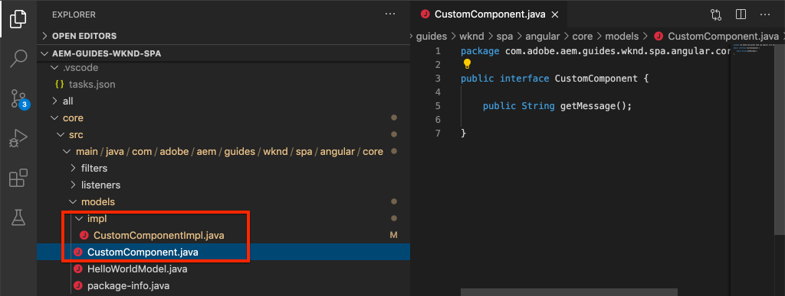

# 创建自定义组件 {#custom-component}

{{spa-editor-deprecation}}

了解如何创建要与AEM SPA Editor一起使用的自定义组件。 了解如何开发创作对话框和Sling模型，以扩展JSON模型来填充自定义组件。

## 目标

1. 了解Sling模型在操作AEM提供的JSON模型API方面的作用。
2. 了解如何创建AEM组件对话框。
3. 了解如何创建与SPA编辑器框架兼容的&#x200B;**自定义** AEM组件。

## 您将构建的内容

上一章的重点是开发SPA组件并将它们映射到&#x200B;*现有*&#x200B;个AEM核心组件。 本章重点介绍如何创建和扩展&#x200B;*新的* AEM组件以及处理AEM提供的JSON模型。

简单的`Custom Component`说明了创建全新AEM组件所需的步骤。


## 先决条件

查看设置[本地开发环境](overview.md#local-dev-environment)所需的工具和说明。

### 获取代码

1. 通过Git下载本教程的起点：

   ```shell
   $ git clone git@github.com:adobe/aem-guides-wknd-spa.git
   $ cd aem-guides-wknd-spa
   $ git checkout Angular/custom-component-start
   ```

2. 使用Maven将代码库部署到本地AEM实例：

   ```shell
   $ mvn clean install -PautoInstallSinglePackage
   ```

   如果使用[AEM 6.x](overview.md#compatibility)，请添加`classic`配置文件：

   ```shell
   $ mvn clean install -PautoInstallSinglePackage -Pclassic
   ```

3. 为传统[WKND引用站点](https://github.com/adobe/aem-guides-wknd/releases/latest)安装完成的包。 由[WKND引用站点](https://github.com/adobe/aem-guides-wknd/releases/latest)提供的图像在WKND SPA上重用。 可以使用[AEM的包管理器](http://localhost:4502/crx/packmgr/index.jsp)安装该包。

   

您始终可以在[GitHub](https://github.com/adobe/aem-guides-wknd-spa/tree/Angular/custom-component-solution)上查看完成的代码，或通过切换到分支`Angular/custom-component-solution`在本地签出代码。

## 定义AEM组件

AEM组件被定义为节点和属性。 在项目中，这些节点和属性在`ui.apps`模块中表示为XML文件。 接下来，在`ui.apps`模块中创建AEM组件。

>[!NOTE]
>
> 有关AEM组件[基础知识的快速刷新可能有所帮助](https://experienceleague.adobe.com/docs/experience-manager-learn/getting-started-wknd-tutorial-develop/project-archetype/component-basics.html)。

1. 在您选择的IDE中打开`ui.apps`文件夹。
2. 导航到`ui.apps/src/main/content/jcr_root/apps/wknd-spa-angular/components`并创建名为`custom-component`的文件夹。
3. 在`custom-component`文件夹下创建名为`.content.xml`的文件。 使用以下内容填充`custom-component/.content.xml`：

   ```xml
   <?xml version="1.0" encoding="UTF-8"?>
   <jcr:root xmlns:sling="http://sling.apache.org/jcr/sling/1.0" xmlns:cq="http://www.day.com/jcr/cq/1.0" xmlns:jcr="http://www.jcp.org/jcr/1.0"
       jcr:primaryType="cq:Component"
       jcr:title="Custom Component"
       componentGroup="WKND SPA Angular - Content"/>
   ```

   

   `jcr:primaryType="cq:Component"` — 标识此节点是AEM组件。

   `jcr:title`是向内容作者显示的值，`componentGroup`确定创作UI中的组件分组。

4. 在`custom-component`文件夹下，创建另一个名为`_cq_dialog`的文件夹。
5. 在`_cq_dialog`文件夹下创建名为`.content.xml`的文件，然后使用以下内容填充该文件：

   ```xml
   <?xml version="1.0" encoding="UTF-8"?>
   <jcr:root xmlns:sling="http://sling.apache.org/jcr/sling/1.0" xmlns:granite="http://www.adobe.com/jcr/granite/1.0" xmlns:cq="http://www.day.com/jcr/cq/1.0" xmlns:jcr="http://www.jcp.org/jcr/1.0" xmlns:nt="http://www.jcp.org/jcr/nt/1.0"
       jcr:primaryType="nt:unstructured"
       jcr:title="Custom Component"
       sling:resourceType="cq/gui/components/authoring/dialog">
       <content
           jcr:primaryType="nt:unstructured"
           sling:resourceType="granite/ui/components/coral/foundation/container">
           <items jcr:primaryType="nt:unstructured">
               <tabs
                   jcr:primaryType="nt:unstructured"
                   sling:resourceType="granite/ui/components/coral/foundation/tabs"
                   maximized="{Boolean}true">
                   <items jcr:primaryType="nt:unstructured">
                       <properties
                           jcr:primaryType="nt:unstructured"
                           jcr:title="Properties"
                           sling:resourceType="granite/ui/components/coral/foundation/container"
                           margin="{Boolean}true">
                           <items jcr:primaryType="nt:unstructured">
                               <columns
                                   jcr:primaryType="nt:unstructured"
                                   sling:resourceType="granite/ui/components/coral/foundation/fixedcolumns"
                                   margin="{Boolean}true">
                                   <items jcr:primaryType="nt:unstructured">
                                       <column
                                           jcr:primaryType="nt:unstructured"
                                           sling:resourceType="granite/ui/components/coral/foundation/container">
                                           <items jcr:primaryType="nt:unstructured">
                                               <message
                                                   jcr:primaryType="nt:unstructured"
                                                   sling:resourceType="granite/ui/components/coral/foundation/form/textfield"
                                                   fieldDescription="The text to display on the component."
                                                   fieldLabel="Message"
                                                   name="./message"/>
                                           </items>
                                       </column>
                                   </items>
                               </columns>
                           </items>
                       </properties>
                   </items>
               </tabs>
           </items>
       </content>
   </jcr:root>
   ```

   

   上述XML文件为`Custom Component`生成一个简单的对话框。 文件的关键部分是内部`<message>`节点。 此对话框包含一个名为`Message`的简单`textfield`，并将textifeld的值保留到名为`message`的属性。

   随后创建了一个Sling模型以通过JSON模型公开`message`属性的值。

   >[!NOTE]
   >
   > 通过查看核心组件定义[&#128279;](https://github.com/adobe/aem-core-wcm-components/tree/master/content/src/content/jcr_root/apps/core/wcm/components)，您可以查看更多对话框示例。 您还可以在[CRXDE-Lite](http://localhost:4502/crx/de/index.jsp#/libs/granite/ui/components/coral/foundation/form)的`/libs/granite/ui/components/coral/foundation/form`下查看其他表单字段，如`select`、`textarea`、`pathfield`。

   对于传统AEM组件，通常需要[HTL](https://experienceleague.adobe.com/docs/experience-manager-htl/content/overview.html)脚本。 由于SPA呈现组件，因此不需要HTL脚本。

## 创建Sling模型

Sling模型是注释驱动的Java™“POJO”(纯旧Java™对象)，便于将数据从JCR映射到Java™变量。 [Sling模型](https://experienceleague.adobe.com/docs/experience-manager-learn/getting-started-wknd-tutorial-develop/project-archetype/component-basics.html#sling-models)通常用于为AEM组件封装复杂的服务器端业务逻辑。

在SPA编辑器的上下文中，Sling模型使用[Sling模型导出器](https://experienceleague.adobe.com/docs/experience-manager-learn/foundation/development/develop-sling-model-exporter.html?lang=zh-hans)通过功能通过JSON模型公开组件的内容。

1. 在您选择的IDE中，打开`core`模块。 `CustomComponent.java`和`CustomComponentImpl.java`已作为章节开始程序代码的一部分创建和清除。

   >[!NOTE]
   >
   > 如果使用Visual Studio Code IDE，则安装适用于Java™[&#128279;](https://code.visualstudio.com/docs/java/extensions)的扩展可能会有帮助。

2. 在`core/src/main/java/com/adobe/aem/guides/wknd/spa/angular/core/models/CustomComponent.java`处打开Java™接口`CustomComponent.java`：

   

   这是由Sling模型实现的Java™接口。

3. 更新`CustomComponent.java`以扩展`ComponentExporter`接口：

   ```java
   package com.adobe.aem.guides.wknd.spa.angular.core.models;
   import com.adobe.cq.export.json.ComponentExporter;
   
   public interface CustomComponent extends ComponentExporter {
   
       public String getMessage();
   
   }
   ```

   实现`ComponentExporter`接口要求Sling模型由JSON模型API自动提取。

   `CustomComponent`接口包含单个getter方法`getMessage()`。 这是通过JSON模型公开作者对话框值的方法。 在JSON模型中只导出具有空参数`()`的getter方法。

4. 在`core/src/main/java/com/adobe/aem/guides/wknd/spa/angular/core/models/impl/CustomComponentImpl.java`处打开`CustomComponentImpl.java`。

   这是`CustomComponent`接口的实现。 `@Model`注释将Java™类标识为Sling模型。 `@Exporter`注释允许通过Sling模型导出器序列化和导出Java™类。

5. 更新静态变量`RESOURCE_TYPE`以指向在上一个练习中创建的AEM组件`wknd-spa-angular/components/custom-component`。

   ```java
   static final String RESOURCE_TYPE = "wknd-spa-angular/components/custom-component";
   ```

   组件的资源类型是将Sling模型绑定到AEM组件并最终映射到Angular组件的类型。

6. 将`getExportedType()`方法添加到`CustomComponentImpl`类以返回组件资源类型：

   ```java
   @Override
   public String getExportedType() {
       return CustomComponentImpl.RESOURCE_TYPE;
   }
   ```

   实现`ComponentExporter`接口并公开允许映射到Angular组件的资源类型时需要此方法。

7. 更新`getMessage()`方法以返回作者对话框保留的`message`属性的值。 使用`@ValueMap`注释将JCR值`message`映射到Java™变量：

   ```java
   import org.apache.commons.lang3.StringUtils;
   ...
   
   @ValueMapValue
   private String message;
   
   @Override
   public String getMessage() {
       return StringUtils.isNotBlank(message) ? message.toUpperCase() : null;
   }
   ```

   添加了一些附加的“业务逻辑”，以返回消息值作为大写。 这允许我们查看创作对话框存储的原始值与Sling模型公开的值之间的差异。

   >[!NOTE]
   >
   > 您可以在此处[&#128279;](https://github.com/adobe/aem-guides-wknd-spa/blob/Angular/custom-component-solution/core/src/main/java/com/adobe/aem/guides/wknd/spa/angular/core/models/impl/CustomComponentImpl.java)查看已完成的CustomComponentImpl.java。

## 更新Angular组件

已创建自定义组件的Angular代码。 接下来，进行一些更新以将Angular组件映射到AEM组件。

1. 在`ui.frontend`模块中，打开文件`ui.frontend/src/app/components/custom/custom.component.ts`
2. 观察`@Input() message: string;`行。 需要将该转换后的大写值映射到此变量。
3. 从AEM SPA Editor JS SDK导入`MapTo`对象，并使用它映射到AEM组件：

   ```diff
   + import {MapTo} from '@adobe/cq-angular-editable-components';
   
    ...
    export class CustomComponent implements OnInit {
        ...
    }
   
   + MapTo('wknd-spa-angular/components/custom-component')(CustomComponent, CustomEditConfig);
   ```

4. 打开`cutom.component.html`并观察到`{{message}}`的值显示在`<h2>`标记的一侧。
5. 打开`custom.component.css`并添加以下规则：

   ```css
   :host-context {
       display: block;
   }
   ```

   为了在组件为空时正确显示AEM编辑器占位符，需要将`:host-context`或其他`<div>`设置为`display: block;`。

6. 使用您的Maven技能，从项目目录的根将更新部署到本地AEM环境：

   ```shell
   $ cd aem-guides-wknd-spa
   $ mvn clean install -PautoInstallSinglePackage
   ```

## 更新模板策略

接下来，导航到AEM以验证更新，并允许将`Custom Component`添加到SPA。

1. 通过导航到[http://localhost:4502/system/console/status-slingmodels](http://localhost:4502/system/console/status-slingmodels)验证新Sling模型的注册。

   ```plain
   com.adobe.aem.guides.wknd.spa.angular.core.models.impl.CustomComponentImpl - wknd-spa-angular/components/custom-component
   
   com.adobe.aem.guides.wknd.spa.angular.core.models.impl.CustomComponentImpl exports 'wknd-spa-angular/components/custom-component' with selector 'model' and extension '[Ljava.lang.String;@6fb4a693' with exporter 'jackson'
   ```

   您应该看到以上两行，其中表示`CustomComponentImpl`与`wknd-spa-angular/components/custom-component`组件相关联，并已通过Sling模型导出程序注册。

2. 导航到[http://localhost:4502/editor.html/conf/wknd-spa-angular/settings/wcm/templates/spa-page-template/structure.html](http://localhost:4502/editor.html/conf/wknd-spa-angular/settings/wcm/templates/spa-page-template/structure.html)上的SPA页面模板。
3. 更新布局容器的策略以将新`Custom Component`添加为允许的组件：

   

   将更改保存到策略，并将`Custom Component`作为允许的组件观看：

   

## 创作自定义组件

接下来，使用AEM SPA编辑器创作`Custom Component`。

1. 导航到[http://localhost:4502/editor.html/content/wknd-spa-angular/us/en/home.html](http://localhost:4502/editor.html/content/wknd-spa-angular/us/en/home.html)。
2. 在`Edit`模式下，将`Custom Component`添加到`Layout Container`：

   

3. 打开组件的对话框，然后输入包含一些小写字母的消息。

   

   这是本章前面基于XML文件创建的对话框。

4. 保存更改。 请注意，显示的消息全部大写。

   

5. 导航到[http://localhost:4502/content/wknd-spa-angular/us/en.model.json](http://localhost:4502/content/wknd-spa-angular/us/en.model.json)以查看JSON模型。 搜索`wknd-spa-angular/components/custom-component`：

   ```json
   "custom_component_208183317": {
       "message": "HELLO WORLD",
       ":type": "wknd-spa-angular/components/custom-component"
   }
   ```

   请注意，根据添加到Sling模型的逻辑，JSON值设置为所有大写字母。

## 恭喜！ {#congratulations}

恭喜，您已了解如何创建自定义AEM组件以及Sling模型和对话框如何与JSON模型一起使用。

您始终可以在[GitHub](https://github.com/adobe/aem-guides-wknd-spa/tree/Angular/custom-component-solution)上查看完成的代码，或通过切换到分支`Angular/custom-component-solution`在本地签出代码。

### 后续步骤 {#next-steps}

[扩展核心组件](extend-component.md) — 了解如何扩展要与AEM SPA编辑器一起使用的现有核心组件。 了解如何将属性和内容添加到现有组件是一种强大的技术，可扩展AEM SPA Editor实施的功能。
