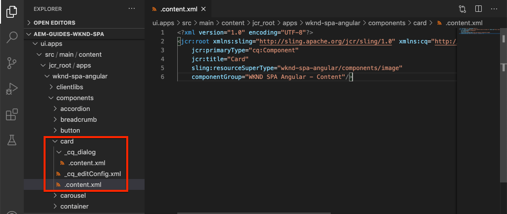

# 扩展核心组件 {#extend-component}

了解如何扩展要与AEM SPA编辑器一起使用的现有核心组件。 了解如何扩展现有组件是一项功能强大的技术，可用于自定义和扩展AEM SPA Editor实施的功能。

## 目标

1. 扩展现有的核心组件以包含其他属性和内容。
2. 了解使用的组件继承的基本内容 `sling:resourceSuperType`.
3. 了解如何使用 [委派模式](https://github.com/adobe/aem-core-wcm-components/wiki/Delegation-Pattern-for-Sling-Models) 以便Sling模型重复使用现有逻辑和功能。

## 将构建的内容

在本章中，新增了 `Card` 组件。 的 `Card` 组件 [图像核心组件](https://experienceleague.adobe.com/docs/experience-manager-core-components/using/components/image.html) 添加其他内容字段（如标题和行动动员按钮），以对SPA中的其他内容执行teaser的角色。


>[!NOTE]
>
> 在实际实施中，更宜简单地使用 [Teaser组件](https://experienceleague.adobe.com/docs/experience-manager-core-components/using/components/teaser.html) 而不是扩展 [图像核心组件](https://experienceleague.adobe.com/docs/experience-manager-core-components/using/components/image.html) 做 `Card` 组件，具体取决于项目要求。 始终建议使用 [核心组件](https://experienceleague.adobe.com/docs/experience-manager-core-components/using/introduction.html?lang=zh-Hans) 直接访问。

## 前提条件

查看设置 [本地开发环境](overview.md#local-dev-environment).

### 获取代码

1. 通过Git下载本教程的起点：

   ```shell
   $ git clone git@github.com:adobe/aem-guides-wknd-spa.git
   $ cd aem-guides-wknd-spa
   $ git checkout Angular/extend-component-start
   ```

2. 使用Maven将代码库部署到本地AEM实例：

   ```shell
   $ mvn clean install -PautoInstallSinglePackage
   ```

   如果使用 [AEM 6.x](overview.md#compatibility) 添加 `classic` 用户档案：

   ```shell
   $ mvn clean install -PautoInstallSinglePackage -Pclassic
   ```

3. 为传统 [WKND参考站点](https://github.com/adobe/aem-guides-wknd/releases/tag/aem-guides-wknd-2.1.0). 提供的图像 [WKND参考站点](https://github.com/adobe/aem-guides-wknd/releases/latest) 在WKND SPA上重复使用。 可以使用 [AEM包管理器](http://localhost:4502/crx/packmgr/index.jsp).

   

您始终可以在 [GitHub](https://github.com/adobe/aem-guides-wknd-spa/tree/Angular/extend-component-solution) 或通过切换到分支在本地签出代码 `Angular/extend-component-solution`.

## Inspect初始卡实施

章节起始代码提供了初始卡组件。 Inspect：卡实施的起点。

1. 在选择的IDE中，打开 `ui.apps` 模块。
2. 导航到 `ui.apps/src/main/content/jcr_root/apps/wknd-spa-angular/components/card` 查看 `.content.xml` 文件。

   

   ```xml
   <?xml version="1.0" encoding="UTF-8"?>
   <jcr:root xmlns:sling="http://sling.apache.org/jcr/sling/1.0" xmlns:cq="http://www.day.com/jcr/cq/1.0" xmlns:jcr="http://www.jcp.org/jcr/1.0"
       jcr:primaryType="cq:Component"
       jcr:title="Card"
       sling:resourceSuperType="wknd-spa-angular/components/image"
       componentGroup="WKND SPA Angular - Content"/>
   ```

   资产 `sling:resourceSuperType` 指向 `wknd-spa-angular/components/image` 表示 `Card` 组件会继承WKND SPA图像组件的功能。

3. Inspect文件 `ui.apps/src/main/content/jcr_root/apps/wknd-spa-angular/components/image/.content.xml`:

   ```xml
   <?xml version="1.0" encoding="UTF-8"?>
   <jcr:root xmlns:sling="http://sling.apache.org/jcr/sling/1.0" xmlns:cq="http://www.day.com/jcr/cq/1.0" xmlns:jcr="http://www.jcp.org/jcr/1.0"
       jcr:primaryType="cq:Component"
       jcr:title="Image"
       sling:resourceSuperType="core/wcm/components/image/v2/image"
       componentGroup="WKND SPA Angular - Content"/>
   ```

   请注意， `sling:resourceSuperType` 指向 `core/wcm/components/image/v2/image`. 这表示WKND SPA图像组件继承核心组件图像的功能。

   也称为 [代理模式](https://experienceleague.adobe.com/docs/experience-manager-core-components/using/developing/guidelines.html#proxy-component-pattern) Sling资源继承是一种功能强大的设计模式，它允许子组件在需要时继承功能并扩展/覆盖行为。 Sling继承支持多个级别的继承，因此最终，新 `Card` 组件会继承核心组件图像的功能。

   许多开发团队都努力成为DRY（不要重复自己）。 Sling继承使AEM能够实现此目的。

4. 在 `card` 文件夹，打开文件 `_cq_dialog/.content.xml`.

   此文件是的组件对话框定义 `Card` 组件。 如果使用Sling继承，则可以使用 [Sling资源合并器](https://experienceleague.adobe.com/docs/experience-manager-65/developing/platform/sling-resource-merger.html) 覆盖或扩展对话框的各个部分。 在此示例中，向对话框中添加了一个新选项卡，用于从作者那里捕获用于填充卡片组件的其他数据。

   属性，如 `sling:orderBefore` 允许开发人员选择插入新选项卡或表单字段的位置。 在本例中， `Text` 选项卡 `asset` 选项卡。 为了充分利用Sling资源合并器，必须了解 [图像组件对话框](https://github.com/adobe/aem-core-wcm-components/blob/master/content/src/content/jcr_root/apps/core/wcm/components/image/v2/image/_cq_dialog/.content.xml).

5. 在 `card` 文件夹，打开文件 `_cq_editConfig.xml`. 此文件指示了AEM创作UI中的拖放行为。 扩展图像组件时，资源类型必须与组件本身匹配，这一点很重要。 查看 `<parameters>` 节点：

   ```xml
   <parameters
       jcr:primaryType="nt:unstructured"
       sling:resourceType="wknd-spa-angular/components/card"
       imageCrop=""
       imageMap=""
       imageRotate=""/>
   ```

   大多数组件不需要 `cq:editConfig`、图像组件的子代和子代是例外。

6. 在IDE的 `ui.frontend` 模块，导航到 `ui.frontend/src/app/components/card`:

   

7. Inspect文件 `card.component.ts`.

   组件已被剪切以映射到AEM `Card` 使用标准 `MapTo` 函数。

   ```js
   MapTo('wknd-spa-angular/components/card')(CardComponent, CardEditConfig);
   ```

   回顾三个 `@Input` 类中的参数 `src`, `alt`和 `title`. 这些是映射到AEM组件的Angular组件中的预期JSON值。

8. 打开文件 `card.component.html`:

   ```html
   <div class="card"  *ngIf="hasContent">
       <app-image class="card__image" [src]="src" [alt]="alt" [title]="title"></app-image>
   </div>
   ```

   在此示例中，我们选择重复使用现有Angular图像组件 `app-image` 通过 `@Input` 参数 `card.component.ts`. 稍后在教程中，将添加和显示其他属性。

## 更新模板策略

使用此初始 `Card` 实施可查看AEM SPA编辑器中的功能。 查看初始 `Card` 组件需要更新模板策略。

1. 将起始代码部署到AEM的本地实例（如果尚未部署）：

   ```shell
   $ cd aem-guides-wknd-spa
   $ mvn clean install -PautoInstallSinglePackage
   ```

2. 导航到SPA页面模板(位于 [http://localhost:4502/editor.html/conf/wknd-spa-angular/settings/wcm/templates/spa-page-template/structure.html](http://localhost:4502/editor.html/conf/wknd-spa-angular/settings/wcm/templates/spa-page-template/structure.html).
3. 更新布局容器的策略以添加新 `Card` 组件：

   

   保存对策略所做的更改，并观察 `Card` 组件：

   

## 创作初始卡片组件

接下来，创作 `Card` 组件。 AEM SPA Editor

1. 导航到 [http://localhost:4502/editor.html/content/wknd-spa-angular/us/en/home.html](http://localhost:4502/editor.html/content/wknd-spa-angular/us/en/home.html).
2. 在 `Edit` 模式，添加 `Card` 组件 `Layout Container`:

   

3. 将图像从资产查找器拖放到 `Card` 组件：

   

4. 打开 `Card` 组件对话框，并注意添加了 **文本** 选项卡。
5. 在 **文本** 选项卡：

   

   **卡片路径**  — 在SPA主页下方选择一个页面。

   **CTA文本** - “了解更多”

   **卡片标题**  — 留空

   **从链接的页面获取标题**  — 选中复选框以指示true。

6. 更新 **资产元数据** 选项卡，为 **替换文本** 和 **题注**.

   当前，更新对话框后不显示其他更改。 要向Angular组件显示新字段，我们需要更新 `Card` 组件。

7. 打开新选项卡并导航到 [CRXDE-Lite](http://localhost:4502/crx/de/index.jsp#/content/wknd-spa-angular/us/en/home/jcr%3Acontent/root/responsivegrid/card). Inspect下的内容节点 `/content/wknd-spa-angular/us/en/home/jcr:content/root/responsivegrid` 查找 `Card` 组件内容。

   

   观察属性 `cardPath`, `ctaText`, `titleFromPage` 对话框保留。

## 更新卡片Sling模型

要最终将组件对话框中的值显示给Angular组件，我们需要更新用于填充 `Card` 组件。 我们还有机会实施两个业务逻辑：

* 如果 `titleFromPage` to **true**，返回指定的页面标题 `cardPath` 否则，返回 `cardTitle` 文本字段。
* 返回指定的页面的上次修改日期 `cardPath`.

返回到您选择的IDE并打开 `core` 模块。

1. 打开文件 `Card.java` at `core/src/main/java/com/adobe/aem/guides/wknd/spa/angular/core/models/Card.java`.

   请注意 `Card` 当前扩展的接口 `com.adobe.cq.wcm.core.components.models.Image` 因此会继承 `Image` 界面。 的 `Image` 接口已扩展 `ComponentExporter` 界面，该界面允许将Sling模型导出为JSON并由SPA编辑器映射。 因此，我们不需要显式扩展 `ComponentExporter` 界面，就象我们在 [“自定义组件”章节](custom-component.md).

2. 在界面中添加以下方法：

   ```java
   @ProviderType
   public interface Card extends Image {
   
       /***
       * The URL to populate the CTA button as part of the card.
       * The link should be based on the cardPath property that points to a page.
       * @return String URL
       */
       public String getCtaLinkURL();
   
       /***
       * The text to display on the CTA button of the card.
       * @return String CTA text
       */
       public String getCtaText();
   
   
   
       /***
       * The date to be displayed as part of the card.
       * This is based on the last modified date of the page specified by the cardPath
       * @return
       */
       public Calendar getCardLastModified();
   
   
       /**
       * Return the title of the page specified by cardPath if `titleFromPage` is set to true.
       * Otherwise return the value of `cardTitle`
       * @return
       */
       public String getCardTitle();
   }
   ```

   这些方法将通过JSON模型API公开，并传递到Angular组件。

3. 打开 `CardImpl.java`. 这是 `Card.java` 界面。 此实施已部分停用，以加快教程的进度。  请注意 `@Model` 和 `@Exporter` 进行注释，以确保能够通过Sling模型导出程序将Sling模型序列化为JSON。

   `CardImpl.java` 也使用 [Sling模型的委派模式](https://github.com/adobe/aem-core-wcm-components/wiki/Delegation-Pattern-for-Sling-Models) 以避免从图像核心组件重写逻辑。

4. 请遵循以下行：

   ```java
   @Self
   @Via(type = ResourceSuperType.class)
   private Image image;
   ```

   上述注释可实例化名为 `image` 基于 `sling:resourceSuperType` 继承 `Card` 组件。

   ```java
   @Override
   public String getSrc() {
       return null != image ? image.getSrc() : null;
   }
   ```

   然后，可以简单地使用 `image` 用于实现由定义的方法的对象 `Image` 界面，无需自己编写逻辑。 此技术用于 `getSrc()`, `getAlt()`和 `getTitle()`.

5. 接下来，实施 `initModel()` 启动专用变量的方法 `cardPage` 根据 `cardPath`

   ```java
   @PostConstruct
   public void initModel() {
       if(StringUtils.isNotBlank(cardPath) && pageManager != null) {
           cardPage = pageManager.getPage(this.cardPath);
       }
   }
   ```

   的 `@PostConstruct initModel()` 在初始化Sling模型时调用，因此，这是初始化模型中其他方法可能使用的对象的良机。 的 `pageManager` 是 [Java™支持的全局对象](https://experienceleague.adobe.com/docs/experience-manager-htl/content/global-objects.html) 通过 `@ScriptVariable` 注释。 的 [getPage](https://developer.adobe.com/experience-manager/reference-materials/cloud-service/javadoc/com/day/cq/wcm/api/PageManager.html) 方法进入路径并返回AEM [页面](https://developer.adobe.com/experience-manager/reference-materials/cloud-service/javadoc/com/day/cq/wcm/api/Page.html) 对象，或者如果路径未指向有效页面，则为null。

   这将初始化 `cardPage` 变量，其他新方法使用该变量来返回有关基础链接页面的数据。

6. 查看已映射到保存了创作对话框的JCR属性的全局变量。 的 `@ValueMapValue` 注释用于自动执行映射。

   ```java
   @ValueMapValue
   private String cardPath;
   
   @ValueMapValue
   private String ctaText;
   
   @ValueMapValue
   private boolean titleFromPage;
   
   @ValueMapValue
   private String cardTitle;
   ```

   这些变量用于为 `Card.java` 界面。

7. 实施在 `Card.java` 界面：

   ```java
   @Override
   public String getCtaLinkURL() {
       if(cardPage != null) {
           return cardPage.getPath() + ".html";
       }
       return null;
   }
   
   @Override
   public String getCtaText() {
       return ctaText;
   }
   
   @Override
   public Calendar getCardLastModified() {
      if(cardPage != null) {
          return cardPage.getLastModified();
      }
      return null;
   }
   
   @Override
   public String getCardTitle() {
       if(titleFromPage) {
           return cardPage != null ? cardPage.getTitle() : null;
       }
       return cardTitle;
   }
   ```

   >[!NOTE]
   >
   > 您可以查看 [已在此处完成CardImpl.java](https://github.com/adobe/aem-guides-wknd-spa/blob/Angular/extend-component-solution/core/src/main/java/com/adobe/aem/guides/wknd/spa/angular/core/models/impl/CardImpl.java).

8. 打开终端窗口，并仅部署 `core` 使用Maven的模块 `autoInstallBundle` 用户档案 `core` 目录访问Advertising Cloud的帮助。

   ```shell
   $ cd core/
   $ mvn clean install -PautoInstallBundle
   ```

   如果使用 [AEM 6.x](overview.md#compatibility) 添加 `classic` 配置文件。

9. 在以下位置查看JSON模型响应： [http://localhost:4502/content/wknd-spa-angular/us/en.model.json](http://localhost:4502/content/wknd-spa-angular/us/en.model.json) 搜索 `wknd-spa-angular/components/card`:

   ```json
   "card": {
       "ctaText": "Read More",
       "cardTitle": "Page 1",
       "title": "Woman chillaxing with river views in Australian bushland",
       "src": "/content/wknd-spa-angular/us/en/home/_jcr_content/root/responsivegrid/card.coreimg.jpeg/1595190732886/adobestock-216674449.jpeg",
       "alt": "Female sitting on a large rock relaxing in afternoon dappled light the Australian bushland with views over the river",
       "cardLastModified": 1591360492414,
       "ctaLinkURL": "/content/wknd-spa-angular/us/en/home/page-1.html",
       ":type": "wknd-spa-angular/components/card"
   }
   ```

   请注意，在更新 `CardImpl` Sling模型。

## 更新Angular组件

现在，JSON模型中已填充了 `ctaLinkURL`, `ctaText`, `cardTitle`和 `cardLastModified` 我们可以更新Angular组件以显示这些组件。

1. 返回到IDE并打开 `ui.frontend` 模块。 或者，也可以从新的终端窗口启动Webpack开发服务器，以实时查看更改：

   ```shell
   $ cd ui.frontend
   $ npm install
   $ npm start
   ```

2. 打开 `card.component.ts` at `ui.frontend/src/app/components/card/card.component.ts`. 添加 `@Input` 用于捕获新模型的注释：

   ```diff
   export class CardComponent implements OnInit {
   
        @Input() src: string;
        @Input() alt: string;
        @Input() title: string;
   +    @Input() cardTitle: string;
   +    @Input() cardLastModified: number;
   +    @Input() ctaLinkURL: string;
   +    @Input() ctaText: string;
   ```

3. 添加方法，用于检查行动动员是否就绪，以及根据 `cardLastModified` 输入：

   ```js
   export class CardComponent implements OnInit {
       ...
       get hasCTA(): boolean {
           return this.ctaLinkURL && this.ctaLinkURL.trim().length > 0 && this.ctaText && this.ctaText.trim().length > 0;
       }
   
       get lastModifiedDate(): string {
           const lastModifiedDate = this.cardLastModified ? new Date(this.cardLastModified) : null;
   
           if (lastModifiedDate) {
           return lastModifiedDate.toLocaleDateString();
           }
           return null;
       }
       ...
   }
   ```

4. 打开 `card.component.html` 并添加以下标记以显示标题、行动动员和上次修改日期：

   ```html
   <div class="card"  *ngIf="hasContent">
       <app-image class="card__image" [src]="src" [alt]="alt" [title]="title"></app-image>
       <div class="card__content">
           <h2 class="card__title">
               {{cardTitle}}
               <span class="card__lastmod" *ngIf="lastModifiedDate">{{lastModifiedDate}}</span>
           </h2>
           <div class="card__action-container" *ngIf="hasCTA">
               <a [routerLink]="ctaLinkURL" class="card__action-link" [title]="ctaText">
                   {{ctaText}}
               </a>
           </div>
       </div>
   </div>
   ```

   已在 `card.component.scss` 要设置标题样式，请执行操作并选择上次修改日期。

   >[!NOTE]
   >
   > 您可以查看已完成的 [Angular卡组件代码，请单击此处](https://github.com/adobe/aem-guides-wknd-spa/tree/Angular/extend-component-solution/ui.frontend/src/app/components/card).

5. 使用Maven从项目的根部署对AEM的完整更改：

   ```shell
   $ cd aem-guides-wknd-spa
   $ mvn clean install -PautoInstallSinglePackage
   ```

6. 导航到 [http://localhost:4502/editor.html/content/wknd-spa-angular/us/en/home.html](http://localhost:4502/editor.html/content/wknd-spa-angular/us/en/home.html) 要查看更新的组件，请执行以下操作：

   

7. 您应该能够重新创作现有内容，以创建类似于以下内容的页面：

   

## 恭喜！ {#congratulations}

恭喜，您学习了如何扩展AEM组件，以及Sling模型和对话框如何与JSON模型一起使用。

您始终可以在 [GitHub](https://github.com/adobe/aem-guides-wknd-spa/tree/Angular/extend-component-solution) 或通过切换到分支在本地签出代码 `Angular/extend-component-solution`.
