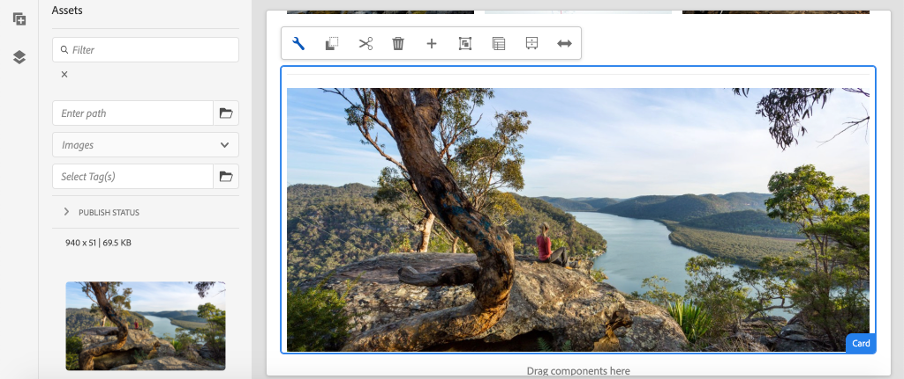

# 扩展核心组件 {#extend-component}

了解如何扩展要与AEM SPA Editor一起使用的现有核心组件。 了解如何扩展现有组件是一种强大的技术，可用于自定义和扩展AEM SPA Editor实施的功能。

## 目标

1. 使用其他属性和内容扩展现有核心组件。
2. 了解使用`sling:resourceSuperType`的组件继承的基本内容。
3. 了解如何为Sling模型使用[委派模式](https://github.com/adobe/aem-core-wcm-components/wiki/Delegation-Pattern-for-Sling-Models)以重用现有逻辑和功能。

## 您将构建的内容

在本章中，创建了一个新的`Card`组件。 `Card`组件扩展了[图像核心组件](https://experienceleague.adobe.com/docs/experience-manager-core-components/using/components/image.html)，添加了其他内容字段（如“标题”和“行动号召”按钮）来为SPA中的其他内容执行Teaser角色。

卡组件

>[!NOTE]
>
> 在现实实施中，简单地使用[Teaser组件](https://experienceleague.adobe.com/docs/experience-manager-core-components/using/components/teaser.html)可能比扩展[图像核心组件](https://experienceleague.adobe.com/docs/experience-manager-core-components/using/components/image.html)来创建`Card`组件更合适，具体取决于项目要求。 始终建议尽可能直接使用[核心组件](https://experienceleague.adobe.com/docs/experience-manager-core-components/using/introduction.html?lang=zh-hans)。

## 先决条件

查看设置[本地开发环境](overview.md#local-dev-environment)所需的工具和说明。

### 获取代码

1. 通过Git下载本教程的起点：

   ```shell
   $ git clone git@github.com:adobe/aem-guides-wknd-spa.git
   $ cd aem-guides-wknd-spa
   $ git checkout Angular/extend-component-start
   ```

2. 使用Maven将代码库部署到本地AEM实例：

   ```shell
   $ mvn clean install -PautoInstallSinglePackage
   ```

   如果使用[AEM 6.x](overview.md#compatibility)，请添加`classic`配置文件：

   ```shell
   $ mvn clean install -PautoInstallSinglePackage -Pclassic
   ```

3. 为传统[WKND引用站点](https://github.com/adobe/aem-guides-wknd/releases/tag/aem-guides-wknd-2.1.0)安装完成的包。 由[WKND引用站点](https://github.com/adobe/aem-guides-wknd/releases/latest)提供的图像在WKND SPA上重用。 可以使用[AEM的包管理器](http://localhost:4502/crx/packmgr/index.jsp)安装该包。

   

您始终可以在[GitHub](https://github.com/adobe/aem-guides-wknd-spa/tree/Angular/extend-component-solution)上查看完成的代码，或通过切换到分支`Angular/extend-component-solution`在本地签出代码。

## 检查初始卡实施

章节起始代码提供了初始卡组件。 检查卡实施的起点。

1. 在您选择的IDE中，打开`ui.apps`模块。
2. 导航到`ui.apps/src/main/content/jcr_root/apps/wknd-spa-angular/components/card`并查看`.content.xml`文件。

   

   ```xml
   <?xml version="1.0" encoding="UTF-8"?>
   <jcr:root xmlns:sling="http://sling.apache.org/jcr/sling/1.0" xmlns:cq="http://www.day.com/jcr/cq/1.0" xmlns:jcr="http://www.jcp.org/jcr/1.0"
       jcr:primaryType="cq:Component"
       jcr:title="Card"
       sling:resourceSuperType="wknd-spa-angular/components/image"
       componentGroup="WKND SPA Angular - Content"/>
   ```

   属性`sling:resourceSuperType`指向`wknd-spa-angular/components/image`，表示`Card`组件继承了WKND SPA图像组件的功能。

3. 检查文件`ui.apps/src/main/content/jcr_root/apps/wknd-spa-angular/components/image/.content.xml`：

   ```xml
   <?xml version="1.0" encoding="UTF-8"?>
   <jcr:root xmlns:sling="http://sling.apache.org/jcr/sling/1.0" xmlns:cq="http://www.day.com/jcr/cq/1.0" xmlns:jcr="http://www.jcp.org/jcr/1.0"
       jcr:primaryType="cq:Component"
       jcr:title="Image"
       sling:resourceSuperType="core/wcm/components/image/v2/image"
       componentGroup="WKND SPA Angular - Content"/>
   ```

   请注意，`sling:resourceSuperType`指向`core/wcm/components/image/v2/image`。 这表明WKND SPA图像组件继承了核心组件图像的功能。

   也称为[代理模式](https://experienceleague.adobe.com/docs/experience-manager-core-components/using/developing/guidelines.html#proxy-component-pattern) Sling资源继承是一种强大的设计模式，它允许子组件继承功能并在需要时扩展/覆盖行为。 Sling继承支持多个继承级别，因此最终，新`Card`组件会继承核心组件图像的功能。

   许多开发团队都努力做到自我（不要重复自己）。 通过Sling继承，可在AEM中实现这一点。

4. 在`card`文件夹下，打开文件`_cq_dialog/.content.xml`。

   此文件是`Card`组件的组件对话框定义。 如果使用Sling继承，则可以使用[Sling资源合并器](https://experienceleague.adobe.com/docs/experience-manager-65/developing/platform/sling-resource-merger.html)的功能覆盖或扩展对话框的各个部分。 在此示例中，向对话框添加了一个新选项卡，用于从作者捕获其他数据以填充卡组件。

   `sling:orderBefore`等属性允许开发人员选择插入新选项卡或表单字段的位置。 在这种情况下，`Text`选项卡插入到`asset`选项卡之前。 要充分利用Sling资源合并器，请务必了解[图像组件对话框](https://github.com/adobe/aem-core-wcm-components/blob/master/content/src/content/jcr_root/apps/core/wcm/components/image/v2/image/_cq_dialog/.content.xml)的原始对话框节点结构。

5. 在`card`文件夹下，打开文件`_cq_editConfig.xml`。 此文件指示AEM创作UI中的拖放行为。 扩展图像组件时，资源类型必须与组件本身匹配，这一点很重要。 查看`<parameters>`节点：

   ```xml
   <parameters
       jcr:primaryType="nt:unstructured"
       sling:resourceType="wknd-spa-angular/components/card"
       imageCrop=""
       imageMap=""
       imageRotate=""/>
   ```

   大多数组件不需要`cq:editConfig`，图像以及图像组件的子后代是例外。

6. 在IDE切换到`ui.frontend`模块中，导航到`ui.frontend/src/app/components/card`：

   

7. 检查文件`card.component.ts`。

   已用标准`MapTo`函数对组件进行截断，以便映射到AEM `Card`组件。

   ```js
   MapTo('wknd-spa-angular/components/card')(CardComponent, CardEditConfig);
   ```

   查看`src`、`alt`和`title`的类中的三个`@Input`参数。 这些是AEM组件中映射到Angular组件的JSON值。

8. 打开文件`card.component.html`：

   ```html
   <div class="card"  *ngIf="hasContent">
       <app-image class="card__image" [src]="src" [alt]="alt" [title]="title"></app-image>
   </div>
   ```

   在此示例中，我们选择通过简单地从`card.component.ts`传递`@Input`参数来重用现有的Angular图像组件`app-image`。 稍后，在本教程中添加和显示了其他属性。

## 更新模板策略

对于此初始`Card`实施，检查AEM SPA编辑器中的功能。 要查看初始`Card`组件，需要更新模板策略。

1. 将起始代码部署到AEM的本地实例（如果尚未部署）：

   ```shell
   $ cd aem-guides-wknd-spa
   $ mvn clean install -PautoInstallSinglePackage
   ```

2. 导航到[http://localhost:4502/editor.html/conf/wknd-spa-angular/settings/wcm/templates/spa-page-template/structure.html](http://localhost:4502/editor.html/conf/wknd-spa-angular/settings/wcm/templates/spa-page-template/structure.html)上的SPA页面模板。
3. 更新布局容器的策略以将新的`Card`组件添加为允许的组件：

   

   将更改保存到策略，并将`Card`组件作为允许的组件观看：

   

## 创作初始卡组件

接下来，使用AEM SPA编辑器创作`Card`组件。

1. 导航到[http://localhost:4502/editor.html/content/wknd-spa-angular/us/en/home.html](http://localhost:4502/editor.html/content/wknd-spa-angular/us/en/home.html)。
2. 在`Edit`模式下，将`Card`组件添加到`Layout Container`：

   

3. 将图像从资产查找器拖放到`Card`组件上：

   

4. 打开`Card`组件对话框，并注意添加了&#x200B;**文本**&#x200B;选项卡。
5. 在&#x200B;**文本**&#x200B;选项卡上输入以下值：

   

   **卡路径** — 在SPA主页下选择一个页面。

   **CTA文本** — “了解更多”

   **卡片标题** — 留空

   **从链接的页面获取标题** — 选中此复选框表示true。

6. 更新&#x200B;**资产元数据**&#x200B;选项卡以添加&#x200B;**替换文本**&#x200B;和&#x200B;**字幕**&#x200B;的值。

   更新对话框后，当前未显示其他更改。 要将新字段公开给Angular组件，我们需要更新`Card`组件的Sling模型。

7. 打开新选项卡并导航到[CRXDE-Lite](http://localhost:4502/crx/de/index.jsp#/content/wknd-spa-angular/us/en/home/jcr%3Acontent/root/responsivegrid/card)。 检查`/content/wknd-spa-angular/us/en/home/jcr:content/root/responsivegrid`下的内容节点以查找`Card`组件内容。

   

   观察对话框是否保留属性`cardPath`、`ctaText`、`titleFromPage`。

## 更新卡片Sling模型

要最终将组件对话框中的值公开给Angular组件，我们需要更新为`Card`组件填充JSON的Sling模型。 我们还有机会实施两种业务逻辑：

* 如果`titleFromPage`到&#x200B;**true**，则返回`cardPath`指定的页标题，否则返回`cardTitle`文本字段的值。
* 返回`cardPath`指定的页面的上次修改日期。

返回您选择的IDE并打开`core`模块。

1. 在`core/src/main/java/com/adobe/aem/guides/wknd/spa/angular/core/models/Card.java`处打开文件`Card.java`。

   请注意，`Card`接口当前扩展`com.adobe.cq.wcm.core.components.models.Image`，因此继承`Image`接口的方法。 `Image`接口已扩展`ComponentExporter`接口，该接口允许将Sling模型导出为JSON并由SPA编辑器映射。 因此，我们不需要像在[自定义组件一章](custom-component.md)中那样显式扩展`ComponentExporter`接口。

2. 将以下方法添加到接口：

   ```java
   @ProviderType
   public interface Card extends Image {
   
       /***
       * The URL to populate the CTA button as part of the card.
       * The link should be based on the cardPath property that points to a page.
       * @return String URL
       */
       public String getCtaLinkURL();
   
       /***
       * The text to display on the CTA button of the card.
       * @return String CTA text
       */
       public String getCtaText();
   
   
   
       /***
       * The date to be displayed as part of the card.
       * This is based on the last modified date of the page specified by the cardPath
       * @return
       */
       public Calendar getCardLastModified();
   
   
       /**
       * Return the title of the page specified by cardPath if `titleFromPage` is set to true.
       * Otherwise return the value of `cardTitle`
       * @return
       */
       public String getCardTitle();
   }
   ```

   这些方法通过JSON模型API公开，并传递到Angular组件。

3. 打开`CardImpl.java`。 这是`Card.java`接口的实现。 为加速教程，已部分修剪此实施。  请注意使用的是`@Model`和`@Exporter`注释，以确保可以通过Sling模型导出器将Sling模型序列化为JSON。

   `CardImpl.java`还对Sling模型使用[委派模式](https://github.com/adobe/aem-core-wcm-components/wiki/Delegation-Pattern-for-Sling-Models)以避免重写图像核心组件中的逻辑。

4. 请注意以下行：

   ```java
   @Self
   @Via(type = ResourceSuperType.class)
   private Image image;
   ```

   上述注释基于`Card`组件的`sling:resourceSuperType`继承实例化名为`image`的图像对象。

   ```java
   @Override
   public String getSrc() {
       return null != image ? image.getSrc() : null;
   }
   ```

   然后，可以简单地使用`image`对象实现`Image`接口定义的方法，而不必自己编写逻辑。 此技术用于`getSrc()`、`getAlt()`和`getTitle()`。

5. 接下来，实施`initModel()`方法以根据`cardPath`的值启动私有变量`cardPage`

   ```java
   @PostConstruct
   public void initModel() {
       if(StringUtils.isNotBlank(cardPath) && pageManager != null) {
           cardPage = pageManager.getPage(this.cardPath);
       }
   }
   ```

   初始化Sling模型时调用`@PostConstruct initModel()`，因此可以借此机会初始化模型中其他方法可能使用的对象。 `pageManager`是通过`@ScriptVariable`注释提供给Sling模型的多个[Java™支持的全局对象](https://experienceleague.adobe.com/docs/experience-manager-htl/content/global-objects.html)之一。 [getPage](https://developer.adobe.com/experience-manager/reference-materials/cloud-service/javadoc/com/day/cq/wcm/api/PageManager.html)方法接受路径并返回AEM [Page](https://developer.adobe.com/experience-manager/reference-materials/cloud-service/javadoc/com/day/cq/wcm/api/Page.html)对象，如果路径未指向有效页面，则返回null。

   这会初始化`cardPage`变量，其他新方法使用该变量返回有关基础链接页面的数据。

6. 查看已映射到JCR属性的全局变量，该属性保存了“作者”对话框。 `@ValueMapValue`批注用于自动执行映射。

   ```java
   @ValueMapValue
   private String cardPath;
   
   @ValueMapValue
   private String ctaText;
   
   @ValueMapValue
   private boolean titleFromPage;
   
   @ValueMapValue
   private String cardTitle;
   ```

   这些变量用于实现`Card.java`接口的其他方法。

7. 实施`Card.java`接口中定义的其他方法：

   ```java
   @Override
   public String getCtaLinkURL() {
       if(cardPage != null) {
           return cardPage.getPath() + ".html";
       }
       return null;
   }
   
   @Override
   public String getCtaText() {
       return ctaText;
   }
   
   @Override
   public Calendar getCardLastModified() {
      if(cardPage != null) {
          return cardPage.getLastModified();
      }
      return null;
   }
   
   @Override
   public String getCardTitle() {
       if(titleFromPage) {
           return cardPage != null ? cardPage.getTitle() : null;
       }
       return cardTitle;
   }
   ```

   >[!NOTE]
   >
   > 您可以在此处[&#128279;](https://github.com/adobe/aem-guides-wknd-spa/blob/Angular/extend-component-solution/core/src/main/java/com/adobe/aem/guides/wknd/spa/angular/core/models/impl/CardImpl.java)查看已完成的CardImpl.java。

8. 打开终端窗口，然后使用`core`目录中的Maven `autoInstallBundle`配置文件仅部署`core`模块的更新。

   ```shell
   $ cd core/
   $ mvn clean install -PautoInstallBundle
   ```

   如果使用[AEM 6.x](overview.md#compatibility)，请添加`classic`配置文件。

9. 在[http://localhost:4502/content/wknd-spa-angular/us/en.model.json](http://localhost:4502/content/wknd-spa-angular/us/en.model.json)查看JSON模型响应并搜索`wknd-spa-angular/components/card`：

   ```json
   "card": {
       "ctaText": "Read More",
       "cardTitle": "Page 1",
       "title": "Woman chillaxing with river views in Australian bushland",
       "src": "/content/wknd-spa-angular/us/en/home/_jcr_content/root/responsivegrid/card.coreimg.jpeg/1595190732886/adobestock-216674449.jpeg",
       "alt": "Female sitting on a large rock relaxing in afternoon dappled light the Australian bushland with views over the river",
       "cardLastModified": 1591360492414,
       "ctaLinkURL": "/content/wknd-spa-angular/us/en/home/page-1.html",
       ":type": "wknd-spa-angular/components/card"
   }
   ```

   请注意，在`CardImpl` Sling模型中更新方法后，使用其他键/值对更新了JSON模型。

## 更新Angular组件

现在，JSON模型已为`ctaLinkURL`、`ctaText`、`cardTitle`和`cardLastModified`填充新属性，我们可以更新Angular组件以显示这些属性。

1. 返回到IDE并打开`ui.frontend`模块。 （可选）从新终端窗口启动webpack开发服务器以实时查看更改：

   ```shell
   $ cd ui.frontend
   $ npm install
   $ npm start
   ```

2. 在`ui.frontend/src/app/components/card/card.component.ts`处打开`card.component.ts`。 添加其他`@Input`注释以捕获新模型：

   ```diff
   export class CardComponent implements OnInit {
   
        @Input() src: string;
        @Input() alt: string;
        @Input() title: string;
   +    @Input() cardTitle: string;
   +    @Input() cardLastModified: number;
   +    @Input() ctaLinkURL: string;
   +    @Input() ctaText: string;
   ```

3. 添加用于检查行动号召是否准备就绪以及根据`cardLastModified`输入返回日期/时间字符串的方法：

   ```js
   export class CardComponent implements OnInit {
       ...
       get hasCTA(): boolean {
           return this.ctaLinkURL && this.ctaLinkURL.trim().length > 0 && this.ctaText && this.ctaText.trim().length > 0;
       }
   
       get lastModifiedDate(): string {
           const lastModifiedDate = this.cardLastModified ? new Date(this.cardLastModified) : null;
   
           if (lastModifiedDate) {
           return lastModifiedDate.toLocaleDateString();
           }
           return null;
       }
       ...
   }
   ```

4. 打开`card.component.html`并添加以下标记以显示标题、行动要求和上次修改日期：

   ```html
   <div class="card"  *ngIf="hasContent">
       <app-image class="card__image" [src]="src" [alt]="alt" [title]="title"></app-image>
       <div class="card__content">
           <h2 class="card__title">
               {{cardTitle}}
               <span class="card__lastmod" *ngIf="lastModifiedDate">{{lastModifiedDate}}</span>
           </h2>
           <div class="card__action-container" *ngIf="hasCTA">
               <a [routerLink]="ctaLinkURL" class="card__action-link" [title]="ctaText">
                   {{ctaText}}
               </a>
           </div>
       </div>
   </div>
   ```

   已在`card.component.scss`添加Sass规则以设置标题、行动要求和上次修改日期的样式。

   >[!NOTE]
   >
   > 您可以在此处[&#128279;](https://github.com/adobe/aem-guides-wknd-spa/tree/Angular/extend-component-solution/ui.frontend/src/app/components/card)查看已完成的Angular卡组件代码。

5. 使用Maven从项目的根目录中部署对AEM的完整更改：

   ```shell
   $ cd aem-guides-wknd-spa
   $ mvn clean install -PautoInstallSinglePackage
   ```

6. 导航到[http://localhost:4502/editor.html/content/wknd-spa-angular/us/en/home.html](http://localhost:4502/editor.html/content/wknd-spa-angular/us/en/home.html)查看更新的组件：

   

7. 您应该能够重新创作现有内容以创建类似于以下内容的页面：

   卡组件

## 恭喜！ {#congratulations}

恭喜，您已了解如何扩展AEM组件以及Sling模型和对话框如何与JSON模型一起使用。

您始终可以在[GitHub](https://github.com/adobe/aem-guides-wknd-spa/tree/Angular/extend-component-solution)上查看完成的代码，或通过切换到分支`Angular/extend-component-solution`在本地签出代码。
