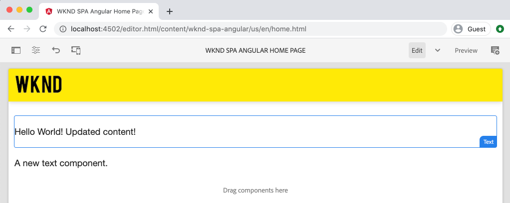

# 集成SPA {#integrate-spa}

了解如何将以Angular编写的单页应用程序(SPA)的源代码与Adobe Experience Manager(AEM)项目集成。 了解如何使用现代前端工具（如WebPack开发服务器）来针对AEM JSON模型API快速开发SPA。

## 目标

1. 了解SPA项目如何与AEM与客户端库集成。
2. 了解如何使用本地开发服务器进行专用的前端开发。
3. 探索 **代理** 静态 **模拟** 用于针对AEM JSON模型API进行开发的文件

## 将构建的内容

本章将添加一个简单 `Header` 组件添加到SPA。 在构建此静态 `Header` 组件使用了多种AEM SPA开发方法。



*扩展了SPA以添加静态 `Header` 组件*

## 前提条件

查看设置 [本地开发环境](overview.md#local-dev-environment).

### 获取代码

1. 通过Git下载本教程的起点：

   ```shell
   $ git clone git@github.com:adobe/aem-guides-wknd-spa.git
   $ cd aem-guides-wknd-spa
   $ git checkout Angular/integrate-spa-start
   ```

2. 使用Maven将代码库部署到本地AEM实例：

   ```shell
   $ mvn clean install -PautoInstallSinglePackage
   ```

   如果使用 [AEM 6.x](overview.md#compatibility) 添加 `classic` 用户档案：

   ```shell
   $ mvn clean install -PautoInstallSinglePackage -Pclassic
   ```

您始终可以在 [GitHub](https://github.com/adobe/aem-guides-wknd-spa/tree/Angular/integrate-spa-solution) 或通过切换到分支在本地检出代码 `Angular/integrate-spa-solution`.

## 集成方法 {#integration-approach}

在AEM项目中创建了两个模块： `ui.apps` 和 `ui.frontend`.

的 `ui.frontend` 模块是 [webpack](https://webpack.js.org/) 包含所有SPA源代码的项目。 大多数SPA开发和测试都是在WebPack项目中完成的。 触发生产内部版本后，将使用WebPack构建和编译SPA。 编译的工件（CSS和Javascript）将会复制到 `ui.apps` 模块，然后将其部署到AEM运行时。


*对SPA集成的高级描述。*

有关前端内部版本的其他信息可以 [此处](https://experienceleague.adobe.com/docs/experience-manager-core-components/using/developing/archetype/uifrontend-angular.html).

## Inspect SPA集成 {#inspect-spa-integration}

接下来，检查 `ui.frontend` 模块，用于了解由 [AEM项目原型](https://experienceleague.adobe.com/docs/experience-manager-core-components/using/developing/archetype/uifrontend-angular.html).

1. 在选择的IDE中，打开WKND SPA的AEM项目。 本教程将使用 [Visual Studio代码IDE](https://experienceleague.adobe.com/docs/experience-manager-learn/cloud-service/local-development-environment-set-up/development-tools.html#microsoft-visual-studio-code).

   

2. 展开并检查 `ui.frontend` 文件夹。 打开文件 `ui.frontend/package.json`

3. 在 `dependencies` 您应会看到与 `@angular`:

   ```json
   "@angular/animations": "~9.1.11",
   "@angular/common": "~9.1.11",
   "@angular/compiler": "~9.1.11",
   "@angular/core": "~9.1.11",
   "@angular/forms": "~9.1.10",
   "@angular/platform-browser": "~9.1.10",
   "@angular/platform-browser-dynamic": "~9.1.10",
   "@angular/router": "~9.1.10",
   ```

   的 `ui.frontend` 模块是 [Angular应用程序](https://angular.io) 使用 [AngularCLI工具](https://angular.io/cli) 包括路由。

4. 还有三个以为前缀的依赖项 `@adobe`:

   ```json
   "@adobe/cq-angular-editable-components": "^2.0.2",
   "@adobe/cq-spa-component-mapping": "^1.0.3",
   "@adobe/cq-spa-page-model-manager": "^1.1.3",
   ```

   以上模块构成 [AEM SPA Editor JS SDK](https://experienceleague.adobe.com/docs/experience-manager-65/developing/headless/spas/spa-blueprint.html) 和提供的功能可将SPA组件映射到AEM组件。

5. 在 `package.json` 多个 `scripts` 已定义：

   ```json
   "scripts": {
       "start": "ng serve --open --proxy-config ./proxy.conf.json",
       "build": "ng lint && ng build && clientlib",
       "build:production": "ng lint && ng build --prod && clientlib",
       "test": "ng test",
       "sync": "aemsync -d -w ../ui.apps/src/main/content"
   }
   ```

   这些脚本基于通用 [AngularCLI命令](https://angular.io/cli/build) 但稍有修改，以便与更大的AEM项目配合使用。

   `start`  — 使用本地web服务器在本地运行Angular应用程序。 更新了该插件以代理本地AEM实例的内容。

   `build`  — 编译用于生产分发的Angular应用程序。 添加了 `&& clientlib` 负责将编译的SPA复制到 `ui.apps` 模块作为客户端库。 npm模块 [aem-clientlib-generator](https://github.com/wcm-io-frontend/aem-clientlib-generator) 用于促进此操作。

   有关可用脚本的更多详细信息，请参阅 [此处](https://experienceleague.adobe.com/docs/experience-manager-core-components/using/developing/archetype/uifrontend-angular.html).

6. Inspect文件 `ui.frontend/clientlib.config.js`. 此配置文件由 [aem-clientlib-generator](https://github.com/wcm-io-frontend/aem-clientlib-generator#clientlibconfigjs) 以确定如何生成客户端库。

7. Inspect文件 `ui.frontend/pom.xml`. 此文件将转换 `ui.frontend` 文件夹 [Maven模块](https://maven.apache.org/guides/mini/guide-multiple-modules.html). 的 `pom.xml` 文件已更新为使用 [frontend-maven-plugin](https://github.com/eirslett/frontend-maven-plugin) to **测试** 和 **构建** Maven生成期间的SPA。

8. Inspect文件 `app.component.ts` at `ui.frontend/src/app/app.component.ts`:

   ```js
   import { Constants } from '@adobe/cq-angular-editable-components';
   import { ModelManager } from '@adobe/cq-spa-page-model-manager';
   import { Component } from '@angular/core';
   
   @Component({
   selector: '#spa-root', // tslint:disable-line
   styleUrls: ['./app.component.css'],
   templateUrl: './app.component.html'
   })
   export class AppComponent {
       ...
   
       constructor() {
           ModelManager.initialize().then(this.updateData);
       }
   
       private updateData = pageModel => {
           this.path = pageModel[Constants.PATH_PROP];
           this.items = pageModel[Constants.ITEMS_PROP];
           this.itemsOrder = pageModel[Constants.ITEMS_ORDER_PROP];
       }
   }
   ```

   `app.component.js` 是SPA的入口点。 `ModelManager` 由AEM SPA Editor JS SDK提供。 负责呼叫和注入 `pageModel` （JSON内容）。

## 添加标题组件 {#header-component}

接下来，向SPA中添加新组件，并将更改部署到本地AEM实例以查看集成。

1. 打开新的终端窗口并导航到 `ui.frontend` 文件夹：

   ```shell
   $ cd aem-guides-wknd-spa/ui.frontend
   ```

2. 安装 [AngularCLI](https://angular.io/cli#installing-angular-cli) 全局而言，它用于生成Angular组件，以及通过构建和提供Angular应用程序 **ng** 命令。

   ```shell
   $ npm install -g @angular/cli
   ```

   >[!CAUTION]
   >
   > 的版本 **@angular/cli** 由此项目使用 **9.1.7**. 建议保持AngularCLI版本同步。

3. 新建 `Header` 组件(通过运行AngularCLI) `ng generate component` 命令 `ui.frontend` 文件夹。

   ```shell
   $ ng generate component components/header
   
   CREATE src/app/components/header/header.component.css (0 bytes)
   CREATE src/app/components/header/header.component.html (21 bytes)
   CREATE src/app/components/header/header.component.spec.ts (628 bytes)
   CREATE src/app/components/header/header.component.ts (269 bytes)
   UPDATE src/app/app.module.ts (1809 bytes)
   ```

   这将为新的Angular头组件创建骨架，位于 `ui.frontend/src/app/components/header`.

4. 打开 `aem-guides-wknd-spa` 项目。 导航到 `ui.frontend/src/app/components/header` 文件夹。

   

5. 打开文件 `header.component.html` 并将内容替换为：

   ```html
   <!--/* header.component.html */-->
   <header className="header">
       <div className="header-container">
           <h1>WKND</h1>
       </div>
   </header>
   ```

   请注意，这会显示静态内容，因此此Angular组件不需要对生成的默认内容进行任何调整 `header.component.ts`.

6. 打开文件 **app.component.html** at  `ui.frontend/src/app/app.component.html`. 添加 `app-header`:

   ```html
   <app-header></app-header>
   <router-outlet></router-outlet>
   ```

   这将包括 `header` 组件。

7. 打开新终端并导航到 `ui.frontend` 文件夹并运行 `npm run build` 命令：

   ```shell
   $ cd ui.frontend
   $ npm run build
   
   Linting "angular-app"...
   All files pass linting.
   Generating ES5 bundles for differential loading...
   ES5 bundle generation complete.
   ```

8. 导航到 `ui.apps` 文件夹。 下 `ui.apps/src/main/content/jcr_root/apps/wknd-spa-angular/clientlibs/clientlib-angular` 您应会看到编译的SPA文件已从`ui.frontend/build` 文件夹。

   

9. 返回到终端并导航到 `ui.apps` 文件夹。 执行以下Maven命令：

   ```shell
   $ cd ../ui.apps
   $ mvn clean install -PautoInstallPackage
   ...
   [INFO] ------------------------------------------------------------------------
   [INFO] BUILD SUCCESS
   [INFO] ------------------------------------------------------------------------
   [INFO] Total time:  9.629 s
   [INFO] Finished at: 2020-05-04T17:48:07-07:00
   [INFO] ------------------------------------------------------------------------
   ```

   这将部署 `ui.apps` 包到AEM的本地运行实例。

10. 打开浏览器选项卡，然后导航到 [http://localhost:4502/editor.html/content/wknd-spa-angular/us/en/home.html](http://localhost:4502/editor.html/content/wknd-spa-angular/us/en/home.html). 此时，您应会看到 `Header` 组件。

   

   步骤 **7-9** 从项目的根触发Maven内部版本时(即， `mvn clean install -PautoInstallSinglePackage`)。 您现在应该了解SPA与AEM客户端库集成的基础知识。 请注意，您仍然可以编辑和添加 `Text` 组件，但是 `Header` 组件不可编辑。

## Webpack开发服务器 — 代理JSON API {#proxy-json}

如前面的练习所示，执行生成操作并将客户端库同步到AEM的本地实例需要几分钟时间。 这对于最终测试是可以接受的，但并不适合大多数SPA开发。

A [WebPack开发服务器](https://webpack.js.org/configuration/dev-server/) 可用于快速开发SPA。 SPA由AEM生成的JSON模型驱动。 在本练习中，来自运行AEM实例的JSON内容是 **代理** 到由 [Angular项目](https://angular.io/guide/build).

1. 返回到IDE并打开文件 **proxy.conf.json** at `ui.frontend/proxy.conf.json`.

   ```json
   [
       {
           "context": [
                       "/content/**/*.(jpg|jpeg|png|model.json)",
                       "/etc.clientlibs/**/*"
                   ],
           "target": "http://localhost:4502",
           "auth": "admin:admin",
           "logLevel": "debug"
       }
   ]
   ```

   的 [Angular应用程序](https://angular.io/guide/build#proxying-to-a-backend-server) 提供了代理API请求的简单机制。 中指定的模式 `context` 被代理 `localhost:4502`，本地AEM快速入门。

2. 打开文件 **index.html** at `ui.frontend/src/index.html`. 这是开发服务器使用的根HTML文件。

   请注意， `base href="/"`. 的 [基本标签](https://angular.io/guide/deployment#the-base-tag) 对于应用程序解析相对URL至关重要。

   ```html
   <base href="/">
   ```

3. 打开终端窗口并导航到 `ui.frontend` 文件夹。 运行命令 `npm start`:

   ```shell
   $ cd ui.frontend
   $ npm start
   
   > wknd-spa-angular@0.1.0 start /Users/dgordon/Documents/code/aem-guides-wknd-spa/ui.frontend
   > ng serve --open --proxy-config ./proxy.conf.json
   
   10% building 3/3 modules 0 active[HPM] Proxy created: [ '/content/**/*.(jpg|jpeg|png|model.json)', '/etc.clientlibs/**/*' ]  ->  http://localhost:4502
   [HPM] Subscribed to http-proxy events:  [ 'error', 'close' ]
   ℹ ｢wds｣: Project is running at http://localhost:4200/webpack-dev-server/
   ℹ ｢wds｣: webpack output is served from /
   ℹ ｢wds｣: 404s will fallback to //index.html
   ```

4. 打开新的浏览器选项卡（如果尚未打开），然后导航到 [http://localhost:4200/content/wknd-spa-angular/us/en/home.html](http://localhost:4200/content/wknd-spa-angular/us/en/home.html).

   

   您应会看到与在AEM中相同的内容，但不启用任何创作功能。

5. 返回到IDE并创建一个名为 `img` at `ui.frontend/src/assets`.
6. 下载以下WKND徽标并将其添加到 `img` 文件夹：

   

7. 打开 **header.component.html** at `ui.frontend/src/app/components/header/header.component.html` 并加上标志：

   ```html
   <header class="header">
       <div class="header-container">
           <div class="logo">
               
           </div>
       </div>
   </header>
   ```

   将更改保存到 **header.component.html**.

8. 返回到浏览器。 您应会立即看到所反映的应用程序更改。

   

   您可以继续在 **AEM** 看到这些 **WebPack开发服务器**，因为我们正在代理内容。 请注意，内容更改仅在 **WebPack开发服务器**.

9. 通过 `ctrl+c` 在终端中。

## Webpack开发服务器 — 模拟JSON API {#mock-json}

快速开发的另一种方法是使用静态JSON文件作为JSON模型。 通过“模拟”JSON，我们删除了对本地AEM实例的依赖关系。 它还允许前端开发人员更新JSON模型，以测试功能并推动对JSON API所做的更改，稍后由后端开发人员实施。

模拟JSON的初始设置会执行 **需要本地AEM实例**.

1. 在浏览器中，导航到 [http://localhost:4502/content/wknd-spa-angular/us/en.model.json](http://localhost:4502/content/wknd-spa-angular/us/en.model.json).

   这是由AEM导出的JSON，用于驱动应用程序。 复制JSON输出。

2. 返回到IDE ，导航到 `ui.frontend/src` 添加名为 **吊床** 和 **json** 要匹配以下文件夹结构：

   ```plain
   |-- ui.frontend
       |-- src
           |-- mocks
               |-- json
   ```

3. 创建名为的新文件 **en.model.json** 下 `ui.frontend/public/mocks/json`. 粘贴 **步骤1** 这里。

   

4. 创建新文件 **proxy.mock.conf.json** 下 `ui.frontend`. 使用以下内容填充文件：

   ```json
   [
       {
       "context": [
           "/content/**/*.model.json"
       ],
       "pathRewrite": { "^/content/wknd-spa-angular/us" : "/mocks/json"} ,
       "target": "http://localhost:4200",
       "logLevel": "debug"
       }
   ]
   ```

   此代理配置将重写以开头的请求 `/content/wknd-spa-angular/us` with `/mocks/json` 和提供相应的静态JSON文件，例如：

   ```plain
   /content/wknd-spa-angular/us/en.model.json -> /mocks/json/en.model.json
   ```

5. 打开文件 **angular.json**. 添加新 **开发** 配置（已更新） **资产** 引用的数组 **吊床** 文件夹。

   ```json
    "dev": {
             "assets": [
               "src/mocks",
               "src/assets",
               "src/favicon.ico",
               "src/logo192.png",
               "src/logo512.png",
               "src/manifest.json"
             ]
       },
   ```

   

   创建专用 **开发** 配置确保 **吊床** 文件夹仅在开发期间使用，从不会部署到生产内部版本中的AEM。

6. 在 **angular.json** 文件，下次更新 **browserTarget** 使用新 **开发** 配置：

   ```diff
     ...
     "serve": {
         "builder": "@angular-devkit/build-angular:dev-server",
         "options": {
   +       "browserTarget": "angular-app:build:dev"
   -       "browserTarget": "angular-app:build"
         },
     ...
   ```

   

7. 打开文件 `ui.frontend/package.json` 并添加新 **开始：模拟** 引用命令 **proxy.mock.conf.json** 文件。

   ```diff
       "scripts": {
           "start": "ng serve --open --proxy-config ./proxy.conf.json",
   +       "start:mock": "ng serve --open --proxy-config ./proxy.mock.conf.json",
           "build": "ng lint && ng build && clientlib",
           "build:production": "ng lint && ng build --prod && clientlib",
           "test": "ng test",
           "sync": "aemsync -d -w ../ui.apps/src/main/content"
       }
   ```

   添加新命令可轻松在代理配置之间切换。

8. 如果当前正在运行，请停止 **WebPack开发服务器**. 启动 **WebPack开发服务器** 使用 **开始：模拟** 脚本：

   ```shell
   $ npm run start:mock
   
   > wknd-spa-angular@0.1.0 start:mock /Users/dgordon/Documents/code/aem-guides-wknd-spa/ui.frontend
   > ng serve --open --proxy-config ./proxy.mock.conf.json
   ```

   导航到 [http://localhost:4200/content/wknd-spa-angular/us/en/home.html](http://localhost:4200/content/wknd-spa-angular/us/en/home.html) 此时您应会看到相同的SPA，但内容正在从 **模拟** JSON文件。

9. 对 **en.model.json** 文件创建时间。 更新的内容应立即反映在 **WebPack开发服务器**.

   

   能够处理JSON模型并查看对实时SPA的影响，有助于开发人员了解JSON模型API。 它还允许同时进行前端和后端开发。

## 使用Sass添加样式

接下来，项目中会添加一些已更新的样式。 此项目将添加 [萨斯](https://sass-lang.com/) 支持一些有用的功能，如变量。

1. 打开终端窗口并停止 **WebPack开发服务器** 。 从内部 `ui.frontend` 文件夹输入以下命令以更新要处理的Angular应用程序 **.scs** 文件。

   ```shell
   $ cd ui.frontend
   $ ng config schematics.@schematics/angular:component.styleext scss
   ```

   这将更新 `angular.json` 文件底部有一个新条目：

   ```json
   "schematics": {
       "@schematics/angular:component": {
       "styleext": "scss"
       }
   }
   ```

2. 安装 `normalize-scss` 要跨浏览器标准化样式，请执行以下操作：

   ```shell
   $ npm install normalize-scss --save
   ```

3. 返回到IDE和下方 `ui.frontend/src` 创建名为 `styles`.
4. 在下面创建新文件 `ui.frontend/src/styles` 已命名 `_variables.scss` 并使用以下变量填充该变量：

   ```scss
   //_variables.scss
   
   //== Colors
   //
   //## Gray and brand colors for use across theme.
   
   $black:                  #202020;
   $gray:                   #696969;
   $gray-light:             #EBEBEB;
   $gray-lighter:           #F7F7F7;
   $white:                  #FFFFFF;
   $yellow:                 #FFEA00;
   $blue:                   #0045FF;
   
   
   //== Typography
   //
   //## Font, line-height, and color for body text, headings, and more.
   
   $font-family-sans-serif:  "Helvetica Neue", Helvetica, Arial, sans-serif;
   $font-family-serif:       Georgia, "Times New Roman", Times, serif;
   $font-family-base:        $font-family-sans-serif;
   $font-size-base:          18px;
   
   $line-height-base:        1.5;
   $line-height-computed:    floor(($font-size-base * $line-height-base));
   
   // Functional Colors
   $brand-primary:             $yellow;
   $body-bg:                   $white;
   $text-color:                $black;
   $text-color-inverse:        $gray-light;
   $link-color:                $blue;
   
   //Layout
   $max-width: 1024px;
   $header-height: 75px;
   
   // Spacing
   $gutter-padding: 12px;
   ```

5. 重新命名文件的扩展名 **styles.css** at `ui.frontend/src/styles.css` to **styles.scss**. 将内容替换为以下内容：

   ```scss
   /* styles.scss * /
   
   /* Normalize */
   @import '~normalize-scss/sass/normalize';
   
   @import './styles/variables';
   
   body {
       background-color: $body-bg;
       font-family: $font-family-base;
       margin: 0;
       padding: 0;
       font-size: $font-size-base;
       text-align: left;
       color: $text-color;
       line-height: $line-height-base;
   }
   
   body.page {
       max-width: $max-width;
       margin: 0 auto;
       padding: $gutter-padding;
       padding-top: $header-height;
   }
   ```

6. 更新 **angular.json** 并重新命名对 **style.css** with **styles.scss**. 应有3个引用。

   ```diff
     "styles": [
   -    "src/styles.css"
   +    "src/styles.scss"
      ],
   ```

## 更新标题样式

接下来，向 **标题** 组件。

1. 启动 **WebPack开发服务器** 要实时查看样式更新，请执行以下操作：

   ```shell
   $ npm run start:mock
   ```

2. 在 `ui.frontend/src/app/components/header` 重命名 **header.component.css** to **header.component.scss**. 使用以下内容填充文件：

   ```scss
   @import "~src/styles/variables";
   
   .header {
       width: 100%;
       position: fixed;
       top: 0;
       left:0;
       z-index: 99;
       background-color: $brand-primary;
       box-shadow: 0px 0px 10px 0px rgba(0, 0, 0, 0.24);
   }
   
   .header-container {
       display: flex;
       max-width: $max-width;
       margin: 0 auto;
       padding-left: $gutter-padding;
       padding-right: $gutter-padding;
   }
   
   .logo {
       z-index: 100;
       display: flex;
       padding-top: $gutter-padding;
       padding-bottom: $gutter-padding;
   }
   
   .logo-img {
       width: 100px;
   }
   ```

3. 更新 **header.component.ts** 引用 **header.component.scss**:

   ```diff
   ...
     @Component({
       selector: 'app-header',
       templateUrl: './header.component.html',
   -   styleUrls: ['./header.component.css']
   +   styleUrls: ['./header.component.scss']
     })
   ...
   ```

4. 返回到浏览器和 **WebPack开发服务器**:

   

   此时，您应会看到已更新的样式已添加到 **标题** 组件。

## 将SPA更新部署到AEM

对 **标题** 当前仅通过 **WebPack开发服务器**. 将更新的SPA部署到AEM以查看更改。

1. 停止 **WebPack开发服务器**.
2. 导航到项目的根 `/aem-guides-wknd-spa` 和使用Maven将项目部署到AEM:

   ```shell
   $ cd ..
   $ mvn clean install -PautoInstallSinglePackage
   ```

3. 导航到 [http://localhost:4502/editor.html/content/wknd-spa-angular/us/en/home.html](http://localhost:4502/editor.html/content/wknd-spa-angular/us/en/home.html). 您应会看到更新的 **标题** 并应用徽标和样式：

   

   现在，更新的SPA已在AEM中，因此创作可以继续。

## 恭喜！ {#congratulations}

恭喜，您已更新SPA并探索与AEM的集成！ 现在，您了解使用 **WebPack开发服务器**.

您始终可以在 [GitHub](https://github.com/adobe/aem-guides-wknd-spa/tree/Angular/integrate-spa-solution) 或通过切换到分支在本地检出代码 `Angular/integrate-spa-solution`.

### 后续步骤 {#next-steps}

[将SPA组件映射到AEM组件](map-components.md)  — 了解如何使用AEM SPA Editor JS SDK将Angular组件映射到Adobe Experience Manager(AEM)组件。 组件映射允许作者在AEM SPA编辑器中对SPA组件进行动态更新，这与传统的AEM创作类似。
