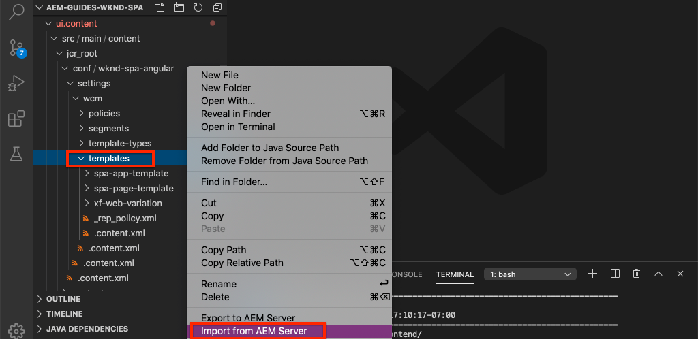

# 将SPA组件映射到AEM组件 {#map-components}

了解如何使用AEM SPA编辑器JS SDK将Angular组件映射到Adobe Experience Manager (AEM)组件。 组件映射使用户能够对AEM SPA编辑器中的SPA组件进行动态更新，这与传统AEM创作类似。

本章更深入地介绍了AEM JSON模型API以及如何将由AEM组件公开的JSON内容作为prop自动插入到Angular组件中。

## 目标

1. 了解如何将AEM组件映射到SPA组件。
2. 了解两者之间的差异 **容器** 组件和 **内容** 组件。
3. 创建映射到现有AEM组件的新Angular组件。

## 您将构建的内容

本章将检查提供的 `Text` SPA组件已映射到AEM `Text`组件。 新 `Image` SPA组件是创建出来的，可以在SPA中使用并在AEM中创作。 开箱即用的 **布局容器** 和 **模板编辑器** 政策还将用于创建外观稍有不同的视图。


## 前提条件

查看所需的工具和设置说明 [本地开发环境](overview.md#local-dev-environment).

### 获取代码

1. 通过Git下载本教程的起点：

   ```shell
   $ git clone git@github.com:adobe/aem-guides-wknd-spa.git
   $ cd aem-guides-wknd-spa
   $ git checkout Angular/map-components-start
   ```

2. 使用Maven将代码库部署到本地AEM实例：

   ```shell
   $ mvn clean install -PautoInstallSinglePackage
   ```

   如果使用 [AEM 6.x](overview.md#compatibility) 添加 `classic` 个人资料：

   ```shell
   $ mvn clean install -PautoInstallSinglePackage -Pclassic
   ```

您始终可以在以下位置查看完成的代码 [GitHub](https://github.com/adobe/aem-guides-wknd-spa/tree/Angular/map-components-solution) 或通过切换到分行在本地签出代码 `Angular/map-components-solution`.

## 映射方法

基本概念是将SPA组件映射到AEM组件。 AEM组件，运行服务器端，将内容导出为JSON模型API的一部分。 JSON内容由SPA使用，在浏览器中运行客户端。 在SPA组件和AEM组件之间创建1:1映射。


*将AEM组件映射到Angular组件的高级概述*

## Inspect文本组件

此 [AEM项目原型](https://github.com/adobe/aem-project-archetype) 提供 `Text` 映射到AEM的组件 [文本组件](https://experienceleague.adobe.com/docs/experience-manager-core-components/using/components/text.html). 以下示例介绍了 **内容** 组件，在中，它渲染 *内容* 来自AEM。

让我们了解组件的工作方式。

### Inspect JSON模型

1. 在跳转到SPA代码之前，请务必了解AEM提供的JSON模型。 导航到 [核心组件库](https://www.aemcomponents.dev/content/core-components-examples/library/core-content/text.html) 和查看文本组件的页面。 核心组件库提供了所有AEM核心组件的示例。
2. 选择 **JSON** 选项卡获取以下示例之一：

   

   您应会看到三个属性： `text`， `richText`、和 `:type`.

   `:type` 是一个保留属性，其中列出了 `sling:resourceType` AEM组件的（或路径）。 的值 `:type` 是用于将AEM组件映射到SPA组件的功能。

   `text` 和 `richText` 是对SPA组件公开的其他属性。

### Inspect文本组件

1. 打开新终端并导航到 `ui.frontend` 个文件夹（位于项目内）。 运行 `npm install` 然后 `npm start` 以启动 **webpack开发服务器**：

   ```shell
   $ cd ui.frontend
   $ npm run start:mock
   ```

   此 `ui.frontend` 模块当前设置为使用 [模拟JSON模型](./integrate-spa.md#mock-json).

2. 您应会看到一个新浏览器窗口打开 [http://localhost:4200/content/wknd-spa-angular/us/en/home.html](http://localhost:4200/content/wknd-spa-angular/us/en/home.html)

   

3. 在您选择的IDE中，打开WKND SPA的AEM项目。 展开 `ui.frontend` 模块并打开文件 **text.component.ts** 下 `ui.frontend/src/app/components/text/text.component.ts`：

   

4. 第一个要检查的区域是 `class TextComponent` 在第35行：

   ```js
   export class TextComponent {
       @Input() richText: boolean;
       @Input() text: string;
       @Input() itemName: string;
   
       @HostBinding('innerHtml') get content() {
           return this.richText
           ? this.sanitizer.bypassSecurityTrustHtml(this.text)
           : this.text;
       }
       @HostBinding('attr.data-rte-editelement') editAttribute = true;
   
       constructor(private sanitizer: DomSanitizer) {}
   }
   ```

   [@Input()](https://angular.io/api/core/Input) decorator用于声明通过映射的JSON对象设置其值的字段，这些字段之前已查看。

   `@HostBinding('innerHtml') get content()` 是一种方法，用于公开所创作的文本内容，其值包括 `this.text`. 如果内容为富文本(取决于 `this.richText` 标志)绕过Angular的内置安全性。 angular [DomSanitizer](https://angular.io/api/platform-browser/DomSanitizer) 用于“清理”原始HTML并防止跨站点脚本漏洞。 方法绑定到 `innerHtml` 属性使用 [@HostBinding](https://angular.io/api/core/HostBinding) 装潢师。

5. 接下来，检查 `TextEditConfig` 在第24行：

   ```js
   const TextEditConfig = {
       emptyLabel: 'Text',
       isEmpty: cqModel =>
           !cqModel || !cqModel.text || cqModel.text.trim().length < 1
   };
   ```

   上述代码负责确定何时在AEM创作环境中呈现占位符。 如果 `isEmpty` 方法返回 **true** 随后将渲染占位符。

6. 最后，查看 `MapTo` 在第53行以下位置调用：

   ```js
   MapTo('wknd-spa-angular/components/text')(TextComponent, TextEditConfig );
   ```

   **映射到** 由AEM SPA编辑器JS SDK提供(`@adobe/cq-angular-editable-components`)。 路径 `wknd-spa-angular/components/text` 表示 `sling:resourceType` AEM组件的。 此路径与 `:type` 由之前观察到的JSON模型公开。 **映射到** 解析JSON模型响应并将正确的值传递给 `@Input()` SPA组件的变量。

   您可以找到AEM `Text` 组件定义位于 `ui.apps/src/main/content/jcr_root/apps/wknd-spa-angular/components/text`.

7. 通过修改 **en.model.json** 文件位置 `ui.frontend/src/mocks/json/en.model.json`.

   在~line 62更新第一个 `Text` 值以使用 **`H1`** 和 **`u`** 标记：

   ```json
       "text": {
           "text": "<h1><u>Hello World!</u></h1>",
           "richText": true,
           ":type": "wknd-spa-angular/components/text"
       }
   ```

   返回浏览器以查看 **webpack开发服务器**：

   

   尝试切换 `richText` 属性介于 **true** / **false** 查看渲染逻辑的实际操作情况。

8. Inspect **text.component.html** 在 `ui.frontend/src/app/components/text/text.component.html`.

   此文件为空，因为组件的全部内容由 `innerHTML` 属性。

9. Inspect **app.module.ts** 在 `ui.frontend/src/app/app.module.ts`.

   ```js
   @NgModule({
   imports: [
       BrowserModule,
       SpaAngularEditableComponentsModule,
       AppRoutingModule
   ],
   providers: [ModelManagerService, { provide: APP_BASE_HREF, useValue: '/' }],
   declarations: [AppComponent, TextComponent, PageComponent, HeaderComponent],
   entryComponents: [TextComponent, PageComponent],
   bootstrap: [AppComponent]
   })
   export class AppModule {}
   ```

   此 **文本组件** 未明确包含，而是动态地通过 **AEMResponsiveGridComponent** 由AEM SPA编辑器JS SDK提供。 因此，必须在 **app.module.ts**‘ [entryComponents](https://angular.io/guide/entry-components) 数组。

## 创建图像组件

接下来，创建 `Image` 映射到AEM的Angular组件 [图像组件](https://experienceleague.adobe.com/docs/experience-manager-core-components/using/components/image.html). 此 `Image` 组件是 **内容** 组件。

### Inspect和JSON

在跳转到SPA代码之前，请检查AEM提供的JSON模型。

1. 导航到 [核心组件库中的图像示例](https://www.aemcomponents.dev/content/core-components-examples/library/core-content/image.html).

   

   属性 `src`， `alt`、和 `title` 用于填充SPA `Image` 组件。

   >[!NOTE]
   >
   > 其他图像属性已公开(`lazyEnabled`， `widths`)允许开发人员创建自适应和延迟加载组件。 本教程中构建的组件非常简单，可以 **非** 使用这些高级属性。

2. 返回IDE并打开 `en.model.json` 在 `ui.frontend/src/mocks/json/en.model.json`. 由于这是我们项目的新组件，因此我们需要“模拟”图像JSON。

   在~line 70 ，为添加一个JSON条目 `image` 模型(不要忘记尾部逗号 `,` 在第二个之后 `text_386303036`)并更新 `:itemsOrder` 数组。

   ```json
   ...
   ":items": {
               ...
               "text_386303036": {
                   "text": "<p>A new text component.</p>\r\n",
                   "richText": true,
                   ":type": "wknd-spa-angular/components/text"
                   },
               "image": {
                   "alt": "Rock Climber in New Zealand",
                   "title": "Rock Climber in New Zealand",
                   "src": "/mocks/images/adobestock-140634652.jpeg",
                   ":type": "wknd-spa-angular/components/image"
               }
           },
           ":itemsOrder": [
               "text",
               "text_386303036",
               "image"
           ],
   ```

   该项目包括一个示例图像，位于 `/mock-content/adobestock-140634652.jpeg` 用于 **webpack开发服务器**.

   您可以查看完整的 [en.model.json此处](https://github.com/adobe/aem-guides-wknd-spa/blob/Angular/map-components-solution/ui.frontend/src/mocks/json/en.model.json).

3. 添加组件要显示的照片库。

   新建一个名为的文件夹 **图像** 下 `ui.frontend/src/mocks`. 下载 [adobestock-140634652.jpeg](assets/map-components/adobestock-140634652.jpeg) 并将其放在新创建的 **图像** 文件夹。 如果需要，可以随意使用您自己的图像。

### 实施图像组件

1. 停止 **webpack开发服务器** 如果已启动。
2. 通过运行AngularCLI创建新的图像组件 `ng generate component` 命令来自内部 `ui.frontend` 文件夹：

   ```shell
   $ ng generate component components/image
   ```

3. 在IDE中，打开 **image.component.ts** 在 `ui.frontend/src/app/components/image/image.component.ts` 并按以下方式更新：

   ```js
   import {Component, Input, OnInit} from '@angular/core';
   import {MapTo} from '@adobe/cq-angular-editable-components';
   
   const ImageEditConfig = {
   emptyLabel: 'Image',
   isEmpty: cqModel =>
       !cqModel || !cqModel.src || cqModel.src.trim().length < 1
   };
   
   @Component({
   selector: 'app-image',
   templateUrl: './image.component.html',
   styleUrls: ['./image.component.scss']
   })
   export class ImageComponent implements OnInit {
   
   @Input() src: string;
   @Input() alt: string;
   @Input() title: string;
   
   constructor() { }
   
   get hasImage() {
       return this.src && this.src.trim().length > 0;
   }
   
   ngOnInit() { }
   }
   
   MapTo('wknd-spa-angular/components/image')(ImageComponent, ImageEditConfig);
   ```

   `ImageEditConfig` 是用于确定是否在AEM中渲染创作占位符的配置，基于 `src` 属性被填充。

   `@Input()` 之 `src`， `alt`、和 `title` 是从JSON API映射的属性。

   `hasImage()` 是一种用于确定是否应渲染图像的方法。

   `MapTo` 将SPA组件映射到位于以下位置的AEM组件： `ui.apps/src/main/content/jcr_root/apps/wknd-spa-angular/components/image`.

4. 打开 **image.component.html** 并按照以下方式更新它：

   ```html
   <ng-container *ngIf="hasImage">
       
   </ng-container>
   ```

   这将呈现 `` 元素if `hasImage` 返回 **true**.

5. 打开 **image.component.scss** 并按照以下方式更新它：

   ```scss
   :host-context {
       display: block;
   }
   
   .image {
       margin: 1rem 0;
       width: 100%;
       border: 0;
   }
   ```

   >[!NOTE]
   >
   > 此 `:host-context` 规则为 **关键** 以使AEM SPA编辑器占位符正常工作。 打算在SPA页面编辑器中创作的所有AEM组件至少都需要此规则。

6. 打开 `app.module.ts` 并添加 `ImageComponent` 到 `entryComponents` 数组：

   ```js
   entryComponents: [TextComponent, PageComponent, ImageComponent],
   ```

   点赞 `TextComponent`，则 `ImageComponent` 动态加载，并且必须包含在 `entryComponents` 数组。

7. 启动 **webpack开发服务器** 以查看 `ImageComponent` 渲染。

   ```shell
   $ npm run start:mock
   ```

   

   *图像已添加到SPA*

   >[!NOTE]
   >
   > **奖励质询**：实施新方法来显示值 `title` 作为图片下方的说明。

## 更新AEM中的策略

此 `ImageComponent` 组件仅在 **webpack开发服务器**. 接下来，将更新后的SPA部署到AEM并更新模板策略。

1. 停止 **webpack开发服务器** 和从 **根** 之后，使用您的Maven技能将更改部署到AEM：

   ```shell
   $ cd aem-guides-wknd-spa
   $ mvn clean install -PautoInstallSinglePackage
   ```

2. 从AEM开始屏幕导航到 **[!UICONTROL 工具]** > **[!UICONTROL 模板]** > **[WKND SPAANGULAR](http://localhost:4502/libs/wcm/core/content/sites/templates.html/conf/wknd-spa-angular)**.

   选择并编辑 **SPA页面**：

   

3. 选择 **布局容器** 单击它是 **策略** 图标以编辑策略：

   

4. 下 **允许的组件** > **WKND SPAAngular — 内容** >检查 **图像** 组件：

   

   下 **默认组件** > **添加映射** 并选择 **图像 — WKND SPAAngular — 内容** 组件：

   

   输入 **mime类型** 之 `image/*`.

   单击 **完成** 以保存策略更新。

5. 在 **布局容器** 单击 **策略** 图标 **文本** 组件：

   

   创建新策略，命名为 **WKND SPA文本**. 下 **插件** > **格式化** >选中所有框以启用其他格式选项：

   

   下 **插件** > **段落样式** >选中复选框 **启用段落样式**：

   

   单击 **完成** 以保存策略更新。

6. 导航到 **主页** [http://localhost:4502/editor.html/content/wknd-spa-angular/us/en/home.html](http://localhost:4502/editor.html/content/wknd-spa-angular/us/en/home.html).

   您还应该能够编辑 `Text` 组件并在中添加其他段落样式 **全屏** 模式。

   

7. 您还应该能够从以下位置拖放图像 **资产查找器**：

   

8. 通过以下方式添加您自己的图像 [AEM Assets](http://localhost:4502/assets.html/content/dam) 或安装完成的标准代码库 [WKND引用站点](https://github.com/adobe/aem-guides-wknd/releases/latest). 此 [WKND引用站点](https://github.com/adobe/aem-guides-wknd/releases/latest) 包括可在WKND SPA上重复使用的许多图像。 可使用以下方式安装软件包 [AEM包管理器](http://localhost:4502/crx/packmgr/index.jsp).

   

## Inspect布局容器

支持 **布局容器** 由AEM SPA编辑器SDK自动提供。 此 **布局容器**&#x200B;如名称所示，是 **容器** 组件。 容器组件是接受JSON结构的组件，表示 *其他* 组件并将其动态实例化。

让我们进一步检查布局容器。

1. 在IDE中打开 **responsive-grid.component.ts** 在 `ui.frontend/src/app/components/responsive-grid`：

   ```js
   import { AEMResponsiveGridComponent,MapTo } from '@adobe/cq-angular-editable-components';
   
   MapTo('wcm/foundation/components/responsivegrid')(AEMResponsiveGridComponent);
   ```

   此 `AEMResponsiveGridComponent` 作为AEM SPA Editor SDK的一部分实施，并通过包含在项目中 `import-components`.

2. 在浏览器中导航到 [http://localhost:4502/content/wknd-spa-angular/us/en.model.json](http://localhost:4502/content/wknd-spa-angular/us/en.model.json)

   

   此 **布局容器** 组件具有 `sling:resourceType` 之 `wcm/foundation/components/responsivegrid` 并由SPA编辑器使用 `:type` 属性，就像 `Text` 和 `Image` 组件。

   使用重新调整组件大小的相同功能 [布局模式](https://experienceleague.adobe.com/docs/experience-manager-65/authoring/siteandpage/responsive-layout.html#defining-layouts-layout-mode) 在SPA编辑器中可用。

3. 返回到 [http://localhost:4502/editor.html/content/wknd-spa-angular/us/en/home.html](http://localhost:4502/editor.html/content/wknd-spa-angular/us/en/home.html). 添加其他 **图像** 组件，然后尝试使用 **版面** 选项：

   

4. 重新打开JSON模型 [http://localhost:4502/content/wknd-spa-angular/us/en.model.json](http://localhost:4502/content/wknd-spa-angular/us/en.model.json) 并观察 `columnClassNames` 作为JSON的一部分：

   

   类名 `aem-GridColumn--default--4` 指示组件应基于12列网格为4列宽。 更多有关 [可在此处找到响应式网格](https://adobe-marketing-cloud.github.io/aem-responsivegrid/).

5. 返回到IDE并在 `ui.apps` 模块有一个客户端库定义于 `ui.apps/src/main/content/jcr_root/apps/wknd-spa-angular/clientlibs/clientlib-grid`. 打开文件 `less/grid.less`.

   此文件确定断点(`default`， `tablet`、和 `phone`)由 **布局容器**. 此文件旨在根据项目规范进行自定义。 当前，断点设置为 `1200px` 和 `650px`.

6. 您应该能够使用的响应式功能和更新的富文本策略 `Text` 用于创作视图的组件，如下所示：

   

## 恭喜！ {#congratulations}

恭喜，您已了解如何将SPA组件映射到AEM组件，并实施了新的 `Image` 组件。 您还有机会探索的响应式功能， **布局容器**.

您始终可以在以下位置查看完成的代码 [GitHub](https://github.com/adobe/aem-guides-wknd-spa/tree/Angular/map-components-solution) 或通过切换到分行在本地签出代码 `Angular/map-components-solution`.

### 后续步骤 {#next-steps}

[导航和路由](navigation-routing.md)  — 了解如何使用SPA编辑器SDK将映射到AEM页面，从而支持SPA中的多个视图。 动态导航使用Angular路由器实现，并添加到现有的标头组件中。

## 附加 — 将配置保留到源代码管理 {#bonus}

在许多情况下，尤其是在刚开始实施AEM项目时，将配置（如模板和相关内容策略）保留到源代码管理中很有价值。 这可确保所有开发人员都针对同一组内容和配置工作，并可确保环境之间获得额外的一致性。 一旦项目达到一定的成熟度，管理模板的操作就可以移交给一组特殊的超级用户。

接下来的几个步骤将使用Visual Studio Code IDE和 [VSCode AEM同步](https://marketplace.visualstudio.com/items?itemName=yamato-ltd.vscode-aem-sync) 但可以使用任何工具和您配置的任何IDE来执行 **提取** 或 **导入** 来自AEM本地实例的内容。

1. 在Visual Studio Code IDE中，确保您具有 **VSCode AEM同步** 通过Marketplace扩展安装：

   

2. 展开 **ui.content** 模块并导航到 `/conf/wknd-spa-angular/settings/wcm/templates`.

3. **右键单击** 此 `templates` 文件夹并选择 **从AEM服务器导入**：

   

4. 重复导入内容的步骤，但选择 **策略** 文件夹位于 `/conf/wknd-spa-angular/settings/wcm/policies`.

5. Inspect `filter.xml` 文件位于 `ui.content/src/main/content/META-INF/vault/filter.xml`.

   ```xml
   <!--ui.content filter.xml-->
   <?xml version="1.0" encoding="UTF-8"?>
    <workspaceFilter version="1.0">
        <filter root="/conf/wknd-spa-angular" mode="merge"/>
        <filter root="/content/wknd-spa-angular" mode="merge"/>
        <filter root="/content/dam/wknd-spa-angular" mode="merge"/>
        <filter root="/content/experience-fragments/wknd-spa-angular" mode="merge"/>
    </workspaceFilter>
   ```

   此 `filter.xml` file负责标识与包一起安装的节点的路径。 请注意 `mode="merge"` 在每个表示现有内容不会被修改的过滤器上，只添加新内容。 由于内容作者可能正在更新这些路径，因此代码部署必须更新 **非** 覆盖内容。 请参阅 [FileVault文档](https://jackrabbit.apache.org/filevault/filter.html) 以了解有关使用筛选条件的更多详细信息。

   比较 `ui.content/src/main/content/META-INF/vault/filter.xml` 和 `ui.apps/src/main/content/META-INF/vault/filter.xml` 了解由每个模块管理的不同节点。
