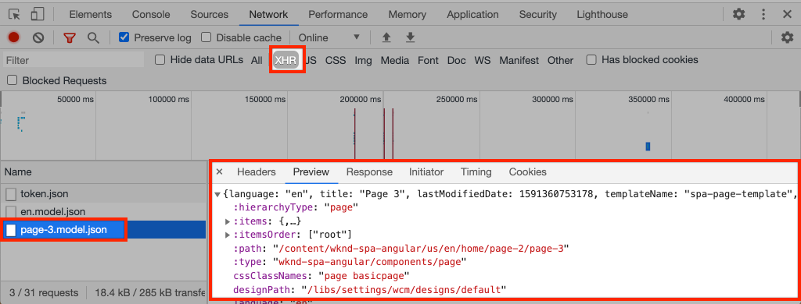

# 添加导航和路由 {#navigation-routing}

了解如何使用SPA页面和AEM编辑器SDK支持SPA中的多个视图。 动态导航是使用Angular路由实现的，并且已添加到现有的标题组件中。

## 目标

1. 了解使用SPA编辑器时可用的SPA模型路由选项。
2. 了解如何使用[Angular路由](https://angular.io/guide/router)在SPA的不同视图之间导航。
3. 实施由AEM页面层次结构驱动的动态导航。

## 您将构建的内容

本章将导航菜单添加到现有`Header`组件。 导航菜单由AEM页面层次结构驱动，并使用[导航核心组件](https://experienceleague.adobe.com/docs/experience-manager-core-components/using/components/navigation.html)提供的JSON模型。

已实施

## 先决条件

查看设置[本地开发环境](overview.md#local-dev-environment)所需的工具和说明。

### 获取代码

1. 通过Git下载本教程的起点：

   ```shell
   $ git clone git@github.com:adobe/aem-guides-wknd-spa.git
   $ cd aem-guides-wknd-spa
   $ git checkout Angular/navigation-routing-start
   ```

2. 使用Maven将代码库部署到本地AEM实例：

   ```shell
   $ mvn clean install -PautoInstallSinglePackage
   ```

   如果使用[AEM 6.x](overview.md#compatibility)，请添加`classic`配置文件：

   ```shell
   $ mvn clean install -PautoInstallSinglePackage -Pclassic
   ```

3. 为传统[WKND引用站点](https://github.com/adobe/aem-guides-wknd/releases/latest)安装完成的包。 由[WKND引用站点](https://github.com/adobe/aem-guides-wknd/releases/latest)提供的图像在WKND SPA上重复使用。 可以使用[AEM包管理器](http://localhost:4502/crx/packmgr/index.jsp)安装包。

   

您始终可以在[GitHub](https://github.com/adobe/aem-guides-wknd-spa/tree/Angular/navigation-routing-solution)上查看完成的代码，或通过切换到分支`Angular/navigation-routing-solution`在本地签出代码。

## Inspect标题组件更新 {#inspect-header}

在前几章中，已通过`app.component.html`将`HeaderComponent`组件添加为纯Angular组件。 在本章中，`HeaderComponent`组件已从应用程序中删除，并通过[模板编辑器](https://experienceleague.adobe.com/docs/experience-manager-learn/sites/page-authoring/template-editor-feature-video-use.html)添加。 这允许用户在AEM中配置`HeaderComponent`的导航菜单。

>[!NOTE]
>
> 已对代码库进行了多次CSS和JavaScript更新，以便开始本章。 为了集中讨论核心概念，未讨论代码更改的&#x200B;**所有**。 您可以在[此处](https://github.com/adobe/aem-guides-wknd-spa/compare/Angular/map-components-solution...Angular/navigation-routing-start)查看全部更改。

1. 在您选择的IDE中，打开本章的SPA入门项目。
2. 在`ui.frontend`模块下，检查文件`header.component.ts`： `ui.frontend/src/app/components/header/header.component.ts`。

   已进行一些更新，包括添加`HeaderEditConfig`和`MapTo`以使该组件能够映射到AEM组件`wknd-spa-angular/components/header`。

   ```js
   /* header.component.ts */
   ...
   const HeaderEditConfig = {
       ...
   };
   
   @Component({
   selector: 'app-header',
   templateUrl: './header.component.html',
   styleUrls: ['./header.component.scss']
   })
   export class HeaderComponent implements OnInit {
   @Input() items: object[];
       ...
   }
   ...
   MapTo('wknd-spa-angular/components/header')(withRouter(Header), HeaderEditConfig);
   ```

   记下`items`的`@Input()`注释。 `items`将包含从AEM传入的导航对象数组。

3. 在`ui.apps`模块中，检查AEM `Header`组件的组件定义： `ui.apps/src/main/content/jcr_root/apps/wknd-spa-angular/components/header/.content.xml`：

   ```xml
   <?xml version="1.0" encoding="UTF-8"?>
   <jcr:root xmlns:sling="http://sling.apache.org/jcr/sling/1.0" xmlns:cq="http://www.day.com/jcr/cq/1.0"
       xmlns:jcr="http://www.jcp.org/jcr/1.0"
       jcr:primaryType="cq:Component"
       jcr:title="Header"
       sling:resourceSuperType="wknd-spa-angular/components/navigation"
       componentGroup="WKND SPA Angular - Structure"/>
   ```

   AEM `Header`组件将通过`sling:resourceSuperType`属性继承[导航核心组件](https://experienceleague.adobe.com/docs/experience-manager-core-components/using/components/navigation.html)的所有功能。

## 将HeaderComponent添加到SPA模板 {#add-header-template}

1. 打开浏览器并登录到AEM，[http://localhost:4502/](http://localhost:4502/)。 应该已经部署了起始代码库。
2. 导航到&#x200B;**[!UICONTROL SPA页面模板]**： [http://localhost:4502/editor.html/conf/wknd-spa-angular/settings/wcm/templates/spa-page-template/structure.html](http://localhost:4502/editor.html/conf/wknd-spa-angular/settings/wcm/templates/spa-page-template/structure.html)。
3. 选择最外层的&#x200B;**[!UICONTROL 根布局容器]**&#x200B;并单击其&#x200B;**[!UICONTROL 策略]**&#x200B;图标。 请注意，**not**&#x200B;选择已解锁的&#x200B;**[!UICONTROL 布局容器]**&#x200B;进行创作。

   

4. 复制当前策略并创建一个名为&#x200B;**[!UICONTROL SPA结构]**&#x200B;的新策略：

   

   在&#x200B;**[!UICONTROL 允许的组件]** > **[!UICONTROL 常规]** >下，选择&#x200B;**[!UICONTROL 布局容器]**&#x200B;组件。

   在&#x200B;**[!UICONTROL 允许的组件]** > **[!UICONTROL WKND SPAANGULAR — 结构]** >选择&#x200B;**[!UICONTROL 标头]**&#x200B;组件下：

   

   在&#x200B;**[!UICONTROL 允许的组件]** > **[!UICONTROL WKND SPAANGULAR- Content]** >下，选择&#x200B;**[!UICONTROL Image]**&#x200B;和&#x200B;**[!UICONTROL Text]**&#x200B;组件。 您总共应选择4个组件。

   单击&#x200B;**[!UICONTROL 完成]**&#x200B;以保存更改。

5. **刷新**&#x200B;页面。 在解锁的&#x200B;**[!UICONTROL 布局容器]**&#x200B;上方添加&#x200B;**[!UICONTROL 标头]**&#x200B;组件：

   

6. 选择&#x200B;**[!UICONTROL 标头]**&#x200B;组件并单击其&#x200B;**策略**&#x200B;图标以编辑策略。

   

7. 使用&#x200B;**&quot;WKND SPA标头&quot;**&#x200B;的&#x200B;**[!UICONTROL 策略标题]**&#x200B;创建新策略。

   在&#x200B;**[!UICONTROL 属性]**&#x200B;下：

   * 将&#x200B;**[!UICONTROL 导航根]**&#x200B;设置为`/content/wknd-spa-angular/us/en`。
   * 将&#x200B;**[!UICONTROL 排除根级别]**&#x200B;设置为&#x200B;**1**。
   * 取消选中&#x200B;**[!UICONTROL 收集所有子页面]**。
   * 将&#x200B;**[!UICONTROL 导航结构深度]**&#x200B;设置为&#x200B;**3**。

   

   这将收集`/content/wknd-spa-angular/us/en`下方的导航2级。

8. 保存更改后，您应该会看到模板中已填充的`Header`：

   

## 创建子页面

接下来，在AEM中创建其他页面，这些页面将用作SPA中的不同视图。 我们还将检查AEM提供的JSON模型的层次结构。

1. 导航到&#x200B;**站点**&#x200B;控制台： [http://localhost:4502/sites.html/content/wknd-spa-angular/us/en/home](http://localhost:4502/sites.html/content/wknd-spa-angular/us/en/home)。 选择&#x200B;**WKND SPAAngular主页**&#x200B;并单击&#x200B;**[!UICONTROL 创建]** > **[!UICONTROL 页面]**：

   

2. 在&#x200B;**[!UICONTROL 模板]**&#x200B;下，选择&#x200B;**[!UICONTROL SPA页面]**。 在&#x200B;**[!UICONTROL 属性]**&#x200B;下，为&#x200B;**[!UICONTROL 标题]**&#x200B;输入&#x200B;**“页面1”**，并将&#x200B;**“页面1”**&#x200B;作为名称。

   

   单击&#x200B;**[!UICONTROL 创建]**，在对话框弹出窗口中单击&#x200B;**[!UICONTROL 打开]**&#x200B;以在AEM SPA编辑器中打开该页面。

3. 将新的&#x200B;**[!UICONTROL Text]**&#x200B;组件添加到主&#x200B;**[!UICONTROL 布局容器]**。 编辑组件并使用RTE和&#x200B;**H1**&#x200B;元素输入文本： **&quot;Page 1&quot;**（您必须进入全屏模式才能更改段落元素）

   

   您可以随意添加其他内容，如图像。

4. 返回到AEM Sites控制台并重复上述步骤，创建名为&#x200B;**“Page 2”**&#x200B;的第二个页面作为&#x200B;**Page 1**&#x200B;的同级。 将内容添加到&#x200B;**第2**&#x200B;页，以便轻松识别它。
5. 最后，创建第三个页面&#x200B;**“第3页”**，但作为&#x200B;**第2**&#x200B;页的&#x200B;**子**。 完成之后，站点层级应如下所示：

   

6. 在新选项卡中，打开AEM提供的JSON模型API： [http://localhost:4502/content/wknd-spa-angular/us/en.model.json](http://localhost:4502/content/wknd-spa-angular/us/en.model.json)。 首次加载SPA时会请求此JSON内容。 外部结构如下所示：

   ```json
   {
   "language": "en",
   "title": "en",
   "templateName": "spa-app-template",
   "designPath": "/libs/settings/wcm/designs/default",
   "cssClassNames": "spa page basicpage",
   ":type": "wknd-spa-angular/components/spa",
   ":items": {},
   ":itemsOrder": [],
   ":hierarchyType": "page",
   ":path": "/content/wknd-spa-angular/us/en",
   ":children": {
       "/content/wknd-spa-angular/us/en/home": {},
       "/content/wknd-spa-angular/us/en/home/page-1": {},
       "/content/wknd-spa-angular/us/en/home/page-2": {},
       "/content/wknd-spa-angular/us/en/home/page-2/page-3": {}
       }
   }
   ```

   在`:children`下，您应该会看到所创建每个页面的条目。 所有页面的内容都包含在此初始JSON请求中。 一旦实现了导航路由，由于内容在客户端已经可用，SPA的后续视图将快速加载。

   在初始JSON请求中加载SPA的&#x200B;**ALL**&#x200B;内容是不明智的，因为这会降低初始页面加载的速度。 接下来，我们来看看如何收集页面的层级深度。

7. 导航到&#x200B;**SPA Root**&#x200B;模板，网址为： [http://localhost:4502/editor.html/conf/wknd-spa-angular/settings/wcm/templates/spa-app-template/structure.html](http://localhost:4502/editor.html/conf/wknd-spa-angular/settings/wcm/templates/spa-app-template/structure.html)。

   单击&#x200B;**[!UICONTROL 页面属性菜单]** > **[!UICONTROL 页面策略]**：

   

8. **SPA根**&#x200B;模板具有额外的&#x200B;**[!UICONTROL 层次结构]**&#x200B;选项卡，用于控制收集的JSON内容。 **[!UICONTROL 结构深度]**&#x200B;确定网站层次结构中收集&#x200B;**根**&#x200B;下子页面的深度。 您还可以使用&#x200B;**[!UICONTROL 结构模式]**&#x200B;字段根据正则表达式筛选出其他页面。

   将&#x200B;**[!UICONTROL 结构深度]**&#x200B;更新为&#x200B;**&quot;2&quot;**：

   

   单击&#x200B;**[!UICONTROL 完成]**&#x200B;以保存对策略所做的更改。

9. 重新打开JSON模型[http://localhost:4502/content/wknd-spa-angular/us/en.model.json](http://localhost:4502/content/wknd-spa-angular/us/en.model.json)。

   ```json
   {
   "language": "en",
   "title": "en",
   "templateName": "spa-app-template",
   "designPath": "/libs/settings/wcm/designs/default",
   "cssClassNames": "spa page basicpage",
   ":type": "wknd-spa-angular/components/spa",
   ":items": {},
   ":itemsOrder": [],
   ":hierarchyType": "page",
   ":path": "/content/wknd-spa-angular/us/en",
   ":children": {
       "/content/wknd-spa-angular/us/en/home": {},
       "/content/wknd-spa-angular/us/en/home/page-1": {},
       "/content/wknd-spa-angular/us/en/home/page-2": {}
       }
   }
   ```

   请注意，**页面3**&#x200B;路径已从初始JSON模型中移除： `/content/wknd-spa-angular/us/en/home/page-2/page-3`。

   稍后，我们将观察AEM SPA Editor SDK如何动态加载其他内容。

## 实施导航

接下来，使用新`NavigationComponent`实施导航菜单。 我们可以直接在`header.component.html`中添加代码，但更好的做法是避免使用大型组件。 相反，实施一个以后可能会重复使用的`NavigationComponent`。

1. 查看[http://localhost:4502/content/wknd-spa-angular/us/en.model.json](http://localhost:4502/content/wknd-spa-angular/us/en.model.json)上的AEM `Header`组件公开的JSON：

   ```json
   ...
   "header": {
       "items": [
       {
       "level": 0,
       "active": true,
       "path": "/content/wknd-spa-angular/us/en/home",
       "description": null,
       "url": "/content/wknd-spa-angular/us/en/home.html",
       "lastModified": 1589062597083,
       "title": "WKND SPA Angular Home Page",
       "children": [
               {
               "children": [],
               "level": 1,
               "active": false,
               "path": "/content/wknd-spa-angular/us/en/home/page-1",
               "description": null,
               "url": "/content/wknd-spa-angular/us/en/home/page-1.html",
               "lastModified": 1589429385100,
               "title": "Page 1"
               },
               {
               "level": 1,
               "active": true,
               "path": "/content/wknd-spa-angular/us/en/home/page-2",
               "description": null,
               "url": "/content/wknd-spa-angular/us/en/home/page-2.html",
               "lastModified": 1589429603507,
               "title": "Page 2",
               "children": [
                   {
                   "children": [],
                   "level": 2,
                   "active": false,
                   "path": "/content/wknd-spa-angular/us/en/home/page-2/page-3",
                   "description": null,
                   "url": "/content/wknd-spa-angular/us/en/home/page-2/page-3.html",
                   "lastModified": 1589430413831,
                   "title": "Page 3"
                   }
               ],
               }
           ]
           }
       ],
   ":type": "wknd-spa-angular/components/header"
   ```

   AEM页面的层次特性在JSON中建模，可用于填充导航菜单。 请注意，`Header`组件继承了[导航核心组件](https://www.aemcomponents.dev/content/core-components-examples/library/core-structure/navigation.html)的所有功能，并且通过JSON公开的内容自动映射到Angular`@Input`注释。

2. 打开新的终端窗口，并导航到SPA项目的`ui.frontend`文件夹。 使用AngularCLI工具创建新`NavigationComponent`：

   ```shell
   $ cd ui.frontend
   $ ng generate component components/navigation
   CREATE src/app/components/navigation/navigation.component.scss (0 bytes)
   CREATE src/app/components/navigation/navigation.component.html (25 bytes)
   CREATE src/app/components/navigation/navigation.component.spec.ts (656 bytes)
   CREATE src/app/components/navigation/navigation.component.ts (286 bytes)
   UPDATE src/app/app.module.ts (2032 bytes)
   ```

3. 接下来，在新创建的`components/navigation`目录中使用AngularCLI创建名为`NavigationLink`的类：

   ```shell
   $ cd src/app/components/navigation/
   $ ng generate class NavigationLink
   CREATE src/app/components/navigation/navigation-link.spec.ts (187 bytes)
   CREATE src/app/components/navigation/navigation-link.ts (32 bytes)
   ```

4. 返回您选择的IDE并在`navigation-link.ts`的`/src/app/components/navigation/navigation-link.ts`处打开文件。

   

5. 使用以下内容填充`navigation-link.ts`：

   ```js
   export class NavigationLink {
   
       title: string;
       path: string;
       url: string;
       level: number;
       children: NavigationLink[];
       active: boolean;
   
       constructor(data) {
           this.path = data.path;
           this.title = data.title;
           this.url = data.url;
           this.level = data.level;
           this.active = data.active;
           this.children = data.children.map( item => {
               return new NavigationLink(item);
           });
       }
   }
   ```

   这是一个简单的类，用于表示单个导航链接。 在类构造函数中，我们希望`data`是从AEM传入的JSON对象。 此类同时在`NavigationComponent`和`HeaderComponent`中使用以轻松填充导航结构。

   不执行数据转换，此类主要是为强键入JSON模型而创建的。 请注意，`this.children`被类型化为`NavigationLink[]`，并且构造函数为`children`数组中的每个项递归创建新的`NavigationLink`对象。 请记住，`Header`的JSON模型是分层的。

6. 打开文件`navigation-link.spec.ts`。 这是`NavigationLink`类的测试文件。 使用以下内容更新它：

   ```js
   import { NavigationLink } from './navigation-link';
   
   describe('NavigationLink', () => {
       it('should create an instance', () => {
           const data = {
               children: [],
               level: 1,
               active: false,
               path: '/content/wknd-spa-angular/us/en/home/page-1',
               description: null,
               url: '/content/wknd-spa-angular/us/en/home/page-1.html',
               lastModified: 1589429385100,
               title: 'Page 1'
           };
           expect(new NavigationLink(data)).toBeTruthy();
       });
   });
   ```

   请注意，`const data`遵循之前针对单个链接检查的相同JSON模型。 这远远不是可靠的单元测试，但应该足以测试`NavigationLink`的构造函数。

7. 打开文件`navigation.component.ts`。 使用以下内容更新它：

   ```js
   import { Component, OnInit, Input } from '@angular/core';
   import { NavigationLink } from './navigation-link';
   
   @Component({
   selector: 'app-navigation',
   templateUrl: './navigation.component.html',
   styleUrls: ['./navigation.component.scss']
   })
   export class NavigationComponent implements OnInit {
   
       @Input() items: object[];
   
       constructor() { }
   
       get navigationLinks(): NavigationLink[] {
   
           if (this.items && this.items.length > 0) {
               return this.items.map(item => {
                   return new NavigationLink(item);
               });
           }
   
           return null;
       }
   
       ngOnInit() {}
   
   }
   ```

   `NavigationComponent`需要一个名为`items`的`object[]`，它是AEM中的JSON模型。 此类公开单个方法`get navigationLinks()`，该方法返回`NavigationLink`对象的数组。

8. 打开文件`navigation.component.html`并使用以下内容更新它：

   ```html
   <ul *ngIf="navigationLinks && navigationLinks.length > 0" class="navigation__group">
       <ng-container *ngTemplateOutlet="recursiveListTmpl; context:{ links: navigationLinks }"></ng-container>
   </ul>
   ```

   这将生成初始`<ul>`并从`navigation.component.ts`调用`get navigationLinks()`方法。 `<ng-container>`用于调用名为`recursiveListTmpl`的模板，并将`navigationLinks`作为名为`links`的变量传递。

   添加下一个`recursiveListTmpl`：

   ```html
   <ng-template #recursiveListTmpl let-links="links">
       <li *ngFor="let link of links" class="{{'navigation__item navigation__item--' + link.level}}">
           <a [routerLink]="link.url" class="navigation__item-link" [title]="link.title" [attr.aria-current]="link.active">
               {{link.title}}
           </a>
           <ul *ngIf="link.children && link.children.length > 0">
               <ng-container *ngTemplateOutlet="recursiveListTmpl; context:{ links: link.children }"></ng-container>
           </ul>
       </li>
   </ng-template>
   ```

   此时将实施导航链接的其余渲染。 请注意，变量`link`的类型为`NavigationLink`，并且该类创建的所有方法/属性均可用。 已使用[`[routerLink]`](https://angular.io/api/router/RouterLink)，而不是正常的`href`属性。 这样，我们便可链接到应用程序中的特定路由，而无需刷新全页。

   如果当前`link`具有非空`children`数组，则通过创建另一个`<ul>`来实现导航的递归部分。

9. 更新`navigation.component.spec.ts`以添加对`RouterTestingModule`的支持：

   ```diff
    ...
   + import { RouterTestingModule } from '@angular/router/testing';
    ...
    beforeEach(async(() => {
       TestBed.configureTestingModule({
   +   imports: [ RouterTestingModule ],
       declarations: [ NavigationComponent ]
       })
       .compileComponents();
    }));
    ...
   ```

   由于该组件使用`[routerLink]`，因此需要添加`RouterTestingModule`。

10. 更新`navigation.component.scss`以向`NavigationComponent`添加一些基本样式：

   ```scss
   @import "~src/styles/variables";
   
   $link-color: $black;
   $link-hover-color: $white;
   $link-background: $black;
   
   :host-context {
       display: block;
       width: 100%;
   }
   
   .navigation__item {
       list-style: none;
   }
   
   .navigation__item-link {
       color: $link-color;
       font-size: $font-size-large;
       text-transform: uppercase;
       padding: $gutter-padding;
       display: flex;
       border-bottom: 1px solid $gray;
   
       &:hover {
           background: $link-background;
           color: $link-hover-color;
       }
   
   }
   ```

## 更新标头组件

现在`NavigationComponent`已实现，必须更新`HeaderComponent`以引用它。

1. 打开终端并导航到SPA项目中的`ui.frontend`文件夹。 启动&#x200B;**webpack开发服务器**：

   ```shell
   $ npm start
   ```

2. 打开浏览器选项卡并导航到[http://localhost:4200/](http://localhost:4200/)。

   应将&#x200B;**webpack开发服务器**&#x200B;配置为从AEM (`ui.frontend/proxy.conf.json`)的本地实例代理JSON模型。 这样，我们就可以直接针对本教程前面介绍的在AEM中创建的内容进行编码。

   

   `HeaderComponent`当前已实施菜单切换功能。 接下来，添加导航组件。

3. 返回您选择的IDE，并在`ui.frontend/src/app/components/header/header.component.ts`处打开文件`header.component.ts`。
4. 更新`setHomePage()`方法以删除硬编码字符串并使用AEM组件传入的动态属性：

   ```js
   /* header.component.ts */
   import { NavigationLink } from '../navigation/navigation-link';
   ...
    setHomePage() {
       if (this.hasNavigation) {
           const rootNavigationLink: NavigationLink = new NavigationLink(this.items[0]);
           this.isHome = rootNavigationLink.path === this.route.snapshot.data.path;
           this.homePageUrl = rootNavigationLink.url;
       }
   }
   ...
   ```

   已基于从AEM传入的导航JSON模型的根目录`items[0]`创建`NavigationLink`的新实例。 `this.route.snapshot.data.path`返回当前Angular路由的路径。 此值用于确定当前路由是否为&#x200B;**主页**。 `this.homePageUrl`用于填充&#x200B;**徽标**&#x200B;上的锚点链接。

5. 打开`header.component.html`并将导航的静态占位符替换为对新创建的`NavigationComponent`的引用：

   ```diff
       <div class="header-navigation">
           <div class="navigation">
   -            Navigation Placeholder
   +           <app-navigation [items]="items"></app-navigation>
           </div>
       </div>
   ```

   `[items]=items`属性将`@Input() items`从`HeaderComponent`传递到将构建导航的`NavigationComponent`。

6. 打开`header.component.spec.ts`并添加`NavigationComponent`的声明：

   ```diff
       /* header.component.spect.ts */
   +   import { NavigationComponent } from '../navigation/navigation.component';
   
       describe('HeaderComponent', () => {
       let component: HeaderComponent;
       let fixture: ComponentFixture<HeaderComponent>;
   
       beforeEach(async(() => {
           TestBed.configureTestingModule({
           imports: [ RouterTestingModule ],
   +       declarations: [ HeaderComponent, NavigationComponent ]
           })
           .compileComponents();
       }));
   ```

   由于`NavigationComponent`现在用作`HeaderComponent`的一部分，因此需要将其声明为测试台的一部分。

7. 保存对任何打开文件的更改并返回&#x200B;**webpack开发服务器**： [http://localhost:4200/](http://localhost:4200/)

   

   通过单击菜单切换打开导航，您应该会看到填充的导航链接。 您应该能够导航到SPA的不同视图。

## 了解SPA路由

现在导航已经实现，请在AEM中检查路由。

1. 在IDE的`ui.frontend/src/app`处打开文件`app-routing.module.ts`。

   ```js
   /* app-routing.module.ts */
   import { AemPageDataResolver, AemPageRouteReuseStrategy } from '@adobe/cq-angular-editable-components';
   import { NgModule } from '@angular/core';
   import { RouteReuseStrategy, RouterModule, Routes, UrlMatchResult, UrlSegment } from '@angular/router';
   import { PageComponent } from './components/page/page.component';
   
   export function AemPageMatcher(url: UrlSegment[]): UrlMatchResult {
       if (url.length) {
           return {
               consumed: url,
               posParams: {
                   path: url[url.length - 1]
               }
           };
       }
   }
   
   const routes: Routes = [
       {
           matcher: AemPageMatcher,
           component: PageComponent,
           resolve: {
               path: AemPageDataResolver
           }
       }
   ];
   @NgModule({
       imports: [RouterModule.forRoot(routes)],
       exports: [RouterModule],
       providers: [
           AemPageDataResolver,
           {
           provide: RouteReuseStrategy,
           useClass: AemPageRouteReuseStrategy
           }
       ]
   })
   export class AppRoutingModule {}
   ```

   `routes: Routes = [];`数组定义Angular组件映射的路由或导航路径。

   `AemPageMatcher`是自定义Angular路由器[UrlMatcher](https://angular.io/api/router/UrlMatcher)，它与AEM中属于此Angular应用程序一部分的页面“看起来”的任何内容相匹配。

   `PageComponent`是AEM中表示页面的Angular组件，用于呈现匹配的路由。 稍后将在教程中查看`PageComponent`。

   `AemPageDataResolver`由AEM SPA编辑器JS SDK提供，是一个自定义[Angular路由器解析程序](https://angular.io/api/router/Resolve)，用于将路由URL(AEM中包含.html扩展名的路径)转换为AEM中的资源路径（页面路径减去扩展名）。

   例如，`AemPageDataResolver`将路由的URL `content/wknd-spa-angular/us/en/home.html`转换为`/content/wknd-spa-angular/us/en/home`的路径。 此标头用于根据JSON模型API中的路径解析页面内容。

   由AEM SPA编辑器JS SDK提供的`AemPageRouteReuseStrategy`是自定义[RouteReuseStrategy](https://angular.io/api/router/RouteReuseStrategy)，它阻止跨路由重用`PageComponent`。 否则，在导航到页面“B”时，可能会显示页面“A”中的内容。

2. 在`ui.frontend/src/app/components/page/`处打开文件`page.component.ts`。

   ```js
   ...
   export class PageComponent {
       items;
       itemsOrder;
       path;
   
       constructor(
           private route: ActivatedRoute,
           private modelManagerService: ModelManagerService
       ) {
           this.modelManagerService
           .getData({ path: this.route.snapshot.data.path })
           .then(data => {
               this.path = data[Constants.PATH_PROP];
               this.items = data[Constants.ITEMS_PROP];
               this.itemsOrder = data[Constants.ITEMS_ORDER_PROP];
           });
       }
   }
   ```

   需要`PageComponent`来处理从AEM检索到的JSON，并将其用作Angular组件以呈现路由。

   由Angular路由器模块提供的`ActivatedRoute`包含指示应将哪个AEM页面的JSON内容加载到此Angular页面组件实例中的状态。

   `ModelManagerService`，基于路由获取JSON数据并将该数据映射到类变量`path`、`items`、`itemsOrder`。 这些组件随后将被传递到[AEMPageComponent](https://www.npmjs.com/package/@adobe/cq-angular-editable-components#aempagecomponent.md)

3. 在`ui.frontend/src/app/components/page/`处打开文件`page.component.html`

   ```html
   <aem-page 
       class="structure-page" 
       [attr.data-cq-page-path]="path" 
       [cqPath]="path" 
       [cqItems]="items" 
       [cqItemsOrder]="itemsOrder">
   </aem-page>
   ```

   `aem-page`包含[AEMPageComponent](https://www.npmjs.com/package/@adobe/cq-angular-editable-components#aempagecomponent.md)。 变量`path`、`items`和`itemsOrder`已传递到`AEMPageComponent`。 通过SPA编辑器JavaScript SDK提供的`AemPageComponent`将对此数据进行迭代，并根据[映射组件教程](./map-components.md)中显示的JSON数据动态实例化Angular组件。

   `PageComponent`实际上只是`AEMPageComponent`的代理，而正是该`AEMPageComponent`完成了大部分繁重的工作以将JSON模型正确映射到Angular组件。

## 在AEM中Inspect SPA路由

1. 如果启动，请打开终端并停止&#x200B;**webpack开发服务器**。 导航到项目的根，然后使用您的Maven技能将该项目部署到AEM：

   ```shell
   $ cd aem-guides-wknd-spa
   $ mvn clean install -PautoInstallSinglePackage
   ```

   >[!CAUTION]
   >
   > angular项目启用了一些非常严格的筛选规则。 如果Maven构建失败，请检查错误并查找在列出的文件中发现的&#x200B;**Lint错误。**。修复过滤器发现的任何问题并重新运行Maven命令。

2. 导航到AEM中的SPA主页： [http://localhost:4502/content/wknd-spa-angular/us/en/home.html](http://localhost:4502/content/wknd-spa-angular/us/en/home.html)，然后打开浏览器的开发人员工具。 以下屏幕截图是从Google Chrome浏览器中捕获的。

   刷新页面，您应该会看到对`/content/wknd-spa-angular/us/en.model.json`(即SPA根)的XHR请求。 请注意，根据教程前面部分对SPA根模板的层级深度配置，只包含三个子页面。 这不包括&#x200B;**第3**&#x200B;页。

   

3. 在开发人员工具打开的情况下，导航到&#x200B;**第3**&#x200B;页：

   

   请注意，已向`/content/wknd-spa-angular/us/en/home/page-2/page-3.model.json`发出新的XHR请求

   

   AEM模型管理器了解&#x200B;**Page 3** JSON内容不可用，因此会自动触发额外的XHR请求。

4. 继续使用各种导航链接在SPA中导航。 请注意，不会发出其他XHR请求，也不会进行全页刷新。 这使得最终用户能够快速使用SPA，并减少返回AEM的不必要请求。

   已实施

5. 通过直接导航到[http://localhost:4502/content/wknd-spa-angular/us/en/home/page-2.html](http://localhost:4502/content/wknd-spa-angular/us/en/home/page-2.html)尝试使用深层链接。 请注意，浏览器的“后退”按钮仍可继续使用。

## 恭喜！ {#congratulations}

恭喜，您已了解如何通过使用SPA编辑器SDK映射到AEM页面来支持SPA中的多个视图。 已使用Angular路由实现动态导航并将其添加到`Header`组件。

您始终可以在[GitHub](https://github.com/adobe/aem-guides-wknd-spa/tree/Angular/navigation-routing-solution)上查看完成的代码，或通过切换到分支`Angular/navigation-routing-solution`在本地签出代码。

### 后续步骤 {#next-steps}

[创建自定义组件](custom-component.md) — 了解如何创建要与AEM SPA编辑器一起使用的自定义组件。 了解如何开发创作对话框和Sling模型，以扩展JSON模型来填充自定义组件。
