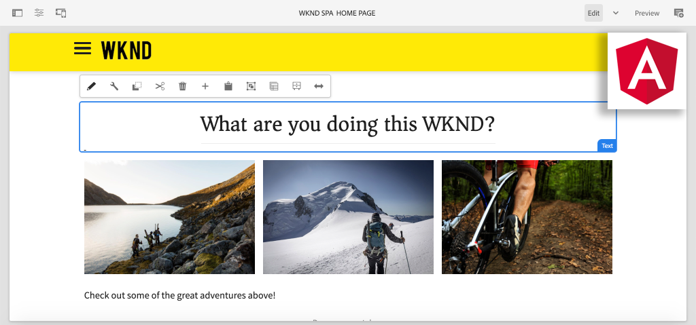

# 在AEM中创建您的第一个AngularSPA {#introduction}

欢迎参加为初次使用 **SPA编辑器** 功能(Adobe Experience Manager(AEM))。 本教程将指导您实施一个Angular应用程序，以打造一个虚构的生活方式品牌WKND。 开发并设计了Angular应用程序，该应用程序可与AEM SPA Editor一起部署，后者将Angular组件映射到AEM组件。 部署到AEM的已完成SPA可以使用AEM的传统在线编辑工具进行动态创作。



*WKND SPA实施*

## 关于

此多部分教程的目标是教开发人员如何实施Angular应用程序以使用AEM的SPA编辑器功能。 在现实世界中，发展活动按角色划分，通常涉及 **前端开发人员** 和 **后端开发人员**. 我们认为，对于AEM SPA Editor项目中涉及的任何开发人员而言，完成本教程都会有所帮助。

本教程旨在与 **AEMas a Cloud Service** 并且向后兼容 **AEM 6.5.4+** 和 **AEM 6.4.8+**. SPA的实施方式如下：

* [Maven AEM项目原型](https://experienceleague.adobe.com/docs/experience-manager-core-components/using/developing/archetype/overview.html)
* [AEM SPA Editor](https://experienceleague.adobe.com/docs/experience-manager-65/developing/headless/spas/spa-walkthrough.html#content-editing-experience-with-spa)
* [核心组件](https://experienceleague.adobe.com/docs/experience-manager-core-components/using/introduction.html?lang=zh-Hans)
* [Angular](https://angular.io/)

*估计需要1-2小时才能完成教程的每个部分。*

## 最新代码

所有教程代码都可以在 [GitHub](https://github.com/adobe/aem-guides-wknd-spa).

的 [最新代码库](https://github.com/adobe/aem-guides-wknd-spa/releases) 可作为可下载的AEM包使用。

## 前提条件

在启动本教程之前，您需要满足以下条件：

* HTML、CSS和JavaScript的基本知识
* 对 [Angular](https://angular.io/)
* [AEMas a Cloud ServiceSDK](https://experienceleague.adobe.com/docs/experience-manager-learn/cloud-service/local-development-environment-set-up/aem-runtime.html#download-the-aem-as-a-cloud-service-sdk), [AEM 6.5.4+](https://helpx.adobe.com/experience-manager/aem-releases-updates.html#65) 或 [AEM 6.4.8+](https://helpx.adobe.com/experience-manager/aem-releases-updates.html#64)
* [Java](https://downloads.experiencecloud.adobe.com/content/software-distribution/en/general.html)
* [阿帕奇·马文](https://maven.apache.org/) （3.3.9或更高版本）
* [Node.js](https://nodejs.org/en/) 和 [npm](https://www.npmjs.com/)

*虽然不需要，但对 [开发传统AEM Sites组件](https://experienceleague.adobe.com/docs/experience-manager-learn/getting-started-wknd-tutorial-develop/overview.html?lang=zh-Hans).*

## 本地开发环境 {#local-dev-environment}

要完成本教程，需要本地开发环境。 屏幕截图和视频是使用在Mac OS环境中运行的AEMas a Cloud ServiceSDK捕获的，该SDK [Visual Studio代码](https://code.visualstudio.com/) 作为IDE。 除非另有说明，否则命令和代码应独立于本地操作系统。

>[!NOTE]
>
> **是AEMas a Cloud Service的新用户？** 查看 [以下使用AEMas a Cloud Service SDK设置本地开发环境的指南](https://experienceleague.adobe.com/docs/experience-manager-learn/cloud-service/local-development-environment-set-up/overview.html).
>
> **AEM 6.5的新增功能？** 查看 [设置本地开发环境的以下指南](https://experienceleague.adobe.com/docs/experience-manager-learn/foundation/development/set-up-a-local-aem-development-environment.html?lang=zh-Hans).

## 后续步骤 {#next-steps}

你在等什么?!通过导航到 [SPA编辑器项目](create-project.md) 章节和了解如何使用SPA项目原型生成启用了AEM的项目。

## 向后兼容性 {#compatibility}

本教程的项目代码是为AEM as a Cloud Service构建的。 为了使项目代码向后兼容 **6.5.4+** 和 **6.4.8+** 已进行多项修改。

的 [UberJar](https://experienceleague.adobe.com/docs/experience-manager-65/developing/devtools/ht-projects-maven.html#what-is-the-uberjar) **v6.4.4** 已作为依赖项包含在内：

```xml
<!-- Adobe AEM 6.x Dependencies -->
<dependency>
    <groupId>com.adobe.aem</groupId>
    <artifactId>uber-jar</artifactId>
    <version>6.4.4</version>
    <classifier>apis</classifier>
    <scope>provided</scope>
</dependency>
```

另一个Maven个人资料，名为 `classic` 已添加以修改到target AEM 6.x环境的内部版本：

```xml
  <!-- AEM 6.x Profile to include Core Components-->
    <profile>
        <id>classic</id>
        <activation>
            <activeByDefault>false</activeByDefault>
        </activation>
        <build>
        ...
    </profile>
```

的 `classic` 配置文件默认处于禁用状态。 如果您遵循AEM 6.x教程，请在 `classic` 配置文件，以执行Maven内部版本：

```shell
$ mvn clean install -PautoInstallSinglePackage -Pclassic
```

为AEM实施生成新项目时，始终使用 [AEM项目原型](https://github.com/adobe/aem-project-archetype) 并更新 `aemVersion` 以定位您的目标AEM版本。
