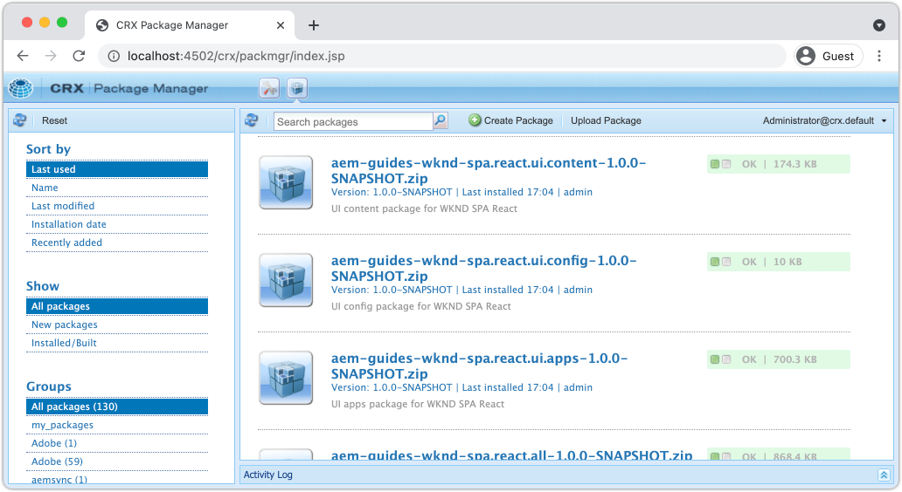
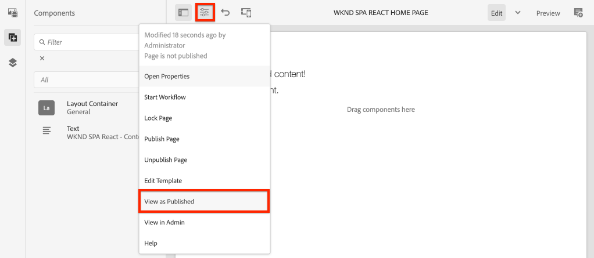

# 创建项目 {#spa-editor-project}

了解如何生成Adobe Experience Manager(AEM)Maven项目，作为与AEM SPA编辑器集成的React应用程序的起点。

## 目标

1. 使用SPA项目原型生成启用AEM Editor的项目。
2. 将起始项目部署到AEM的本地实例。

## 将构建的内容 {#what-build}

在本章中，将根据 [AEM项目原型](https://github.com/adobe/aem-project-archetype). AEM项目正在启动，React SPA的起点非常简单。

**什么是Maven项目？** - [阿帕奇·马文](https://maven.apache.org/) 是用于构建项目的软件管理工具。 *全部Adobe Experience Manager* 实施使用Maven项目来基于AEM构建、管理和部署自定义代码。

**什么是Maven原型？** - A [Maven原型](https://maven.apache.org/archetype/index.html) 是用于生成新项目的模板或模式。 AEM项目原型允许我们生成具有自定义命名空间的新项目，并包含遵循最佳实践的项目结构，从而大大加快了我们的项目速度。

## 前提条件

查看设置 [本地开发环境](overview.md#local-dev-environment). 确保以 **作者** 模式。

## 创建项目 {#create}

>[!NOTE]
>
>本教程使用的是版本 **35** 原型。

1. 打开命令行终端并输入以下Maven命令：

   ```shell
   mvn -B org.apache.maven.plugins:maven-archetype-plugin:3.2.1:generate \
    -D archetypeGroupId=com.adobe.aem \
    -D archetypeArtifactId=aem-project-archetype \
    -D archetypeVersion=35 \
    -D appTitle="WKND SPA React" \
    -D appId="wknd-spa-react" \
    -D artifactId="aem-guides-wknd-spa.react" \
    -D groupId="com.adobe.aem.guides.wkndspa.react" \
    -D frontendModule="react" \
    -D aemVersion="cloud"
   ```

   >[!NOTE]
   >
   > 如果定位AEM 6.5.5+，请替换 `aemVersion="cloud"` with `aemVersion="6.5.5"`. 如果定位的是6.4.8及更高版本，请使用 `aemVersion="6.4.8"`.

   请注意 `frontendModule=react` 属性。 这可告知AEM项目原型使用启动程序引导项目 [React代码库](https://experienceleague.adobe.com/docs/experience-manager-core-components/using/developing/archetype/uifrontend-react.html) 与AEM SPA Editor一起使用时，不会将其标记为“隐藏”。 属性，如 `appTitle`, `appId`, `artifactId`和 `groupId` 用于标识项目和用途。

   用于配置项目的可用属性的完整列表 [可在此处找到](https://github.com/adobe/aem-project-archetype#available-properties).

1. 以下文件夹和文件结构由本地文件系统上的Maven原型生成：

   ```plain
   |--- aem-guides-wknd-spa.react/
       |--- LICENSE
       |--- README.md
       |--- all/
       |--- archetype.properties
       |--- core/
       |--- dispatcher/
       |--- it.tests/
       |--- pom.xml
       |--- ui.apps/
       |--- ui.apps.structure/
       |--- ui.config/
       |--- ui.content/
       |--- ui.frontend/
       |--- ui.tests /
       |--- .gitignore
   ```

   每个文件夹都表示一个Maven模块。 在本教程中，我们将主要使用 `ui.frontend` 模块，即React应用程序。 有关各个模块的更多详细信息，请参阅 [AEM项目原型文档](https://experienceleague.adobe.com/docs/experience-manager-core-components/using/developing/archetype/overview.html).

## 部署和构建项目

接下来，使用Maven编译、构建项目代码并将其部署到AEM的本地实例。

1. 确保AEM实例在端口上本地运行 **4502**.
1. 从命令行中，导航到 `aem-guides-wknd-spa.react` 项目目录。

   ```shell
   $ cd aem-guides-wknd-spa.react
   ```

1. 运行以下命令以构建整个项目并将其部署到AEM:

   ```shell
   $ mvn clean install -PautoInstallSinglePackage
   ```

   内部版本将花费大约一分钟，且应以以下消息结束：

   ```shell
   ...
   [INFO] ------------------------------------------------------------------------
   [INFO] Reactor Summary for aem-guides-wknd-spa.react 1.0.0-SNAPSHOT:
   [INFO]
   [INFO] aem-guides-wknd-spa.react .......................... SUCCESS [  0.257 s]
   [INFO] WKND SPA React - Core .............................. SUCCESS [ 12.553 s]
   [INFO] WKND SPA React - UI Frontend ....................... SUCCESS [01:46 min]
   [INFO] WKND SPA React - Repository Structure Package ...... SUCCESS [  1.082 s]
   [INFO] WKND SPA React - UI apps ........................... SUCCESS [  8.237 s]
   [INFO] WKND SPA React - UI content ........................ SUCCESS [  5.633 s]
   [INFO] WKND SPA React - UI config ......................... SUCCESS [  0.234 s]
   [INFO] WKND SPA React - All ............................... SUCCESS [  0.643 s]
   [INFO] WKND SPA React - Integration Tests ................. SUCCESS [ 12.377 s]
   [INFO] WKND SPA React - Dispatcher ........................ SUCCESS [  0.066 s]
   [INFO] WKND SPA React - UI Tests .......................... SUCCESS [  0.074 s]
   [INFO] WKND SPA React - Project Analyser .................. SUCCESS [ 31.287 s]
   [INFO] ------------------------------------------------------------------------
   [INFO] BUILD SUCCESS
   [INFO] ------------------------------------------------------------------------
   ```

   Maven个人资料 `autoInstallSinglePackage` 编译项目的各个模块，并将单个包部署到AEM实例。 默认情况下，此包将部署到端口上本地运行的AEM实例 **4502** 并拥有 `admin:admin`.

1. 导航到 **包管理器** 在本地AEM实例上： [http://localhost:4502/crx/packmgr/index.jsp](http://localhost:4502/crx/packmgr/index.jsp).

1. 您应会看到多个包的前缀为 `aem-guides-wknd-spa.react`.

   

   *AEM包管理器*

   项目所需的所有自定义代码都捆绑到这些包中，并安装在AEM环境中。

## 创作内容

接下来，打开由原型生成的起始SPA，并更新一些内容。

1. 导航到 **站点** 控制台： [http://localhost:4502/sites.html/content](http://localhost:4502/sites.html/content).

   WKND SPA包括基本站点结构，其中包含国家/地区、语言和主页。 此层次结构基于的 `language_country` 和 `isSingleCountryWebsite`. 这些值可通过更新 [可用属性](https://github.com/adobe/aem-project-archetype#available-properties) 生成项目时。

2. 打开 **us** > **en** > **WKND SPA React主页** 页面，方法是选择页面并单击 **编辑** 按钮：

   

3. A **文本** 组件已添加到页面。 您可以像在AEM中编辑任何其他组件一样编辑此组件。

   

4. 添加其他 **文本** 组件。

   请注意，创作体验与传统AEM Sites页面的体验类似。 目前可使用的组件数量有限。 在教程中添加了更多内容。

## Inspect单页应用程序

接下来，使用浏览器的开发人员工具验证这是单页应用程序。

1. 在 **页面编辑器**，请单击 **页面信息** 按钮> **查看已发布的项目**:

   

   这将打开一个包含查询参数的新选项卡 `?wcmmode=disabled` 这会有效地关闭AEM编辑器： [http://localhost:4502/content/wknd-spa-react/us/en/home.html?wcmmode=disabled](http://localhost:4502/content/wknd-spa-react/us/en/home.html?wcmmode=disabled)

2. 查看页面的源并注意文本内容 **[!DNL Hello World]** 或找不到任何其他内容。 您而应会看到HTML，如下所示：

   ```html
   ...
   <body>
       <noscript>You need to enable JavaScript to run this app.</noscript>
       <div id="spa-root"></div>
       <script type="text/javascript" src="/etc.clientlibs/wknd-spa-react/clientlibs/clientlib-react.lc-xxxx-lc.min.js"></script>
   </body>
   ...
   ```

   `clientlib-react.min.js` 是加载到页面并负责呈现内容的React SPA。

   但是， *内容从何而来？*

3. 返回到选项卡： [http://localhost:4502/content/wknd-spa-react/us/en/home.html?wcmmode=disabled](http://localhost:4502/content/wknd-spa-react/us/en/home.html?wcmmode=disabled)
4. 打开浏览器的开发人员工具，并在刷新期间检查页面的网络流量。 查看 **XHR** 请求：

   

   应请求 [http://localhost:4502/content/wknd-spa-react/us/en.model.json](http://localhost:4502/content/wknd-spa-react/us/en.model.json). 其中包含将驱动SPA的所有内容（格式为JSON）。

5. 在新选项卡中打开 [http://localhost:4502/content/wknd-spa-react/us/en.model.json](http://localhost:4502/content/wknd-spa-react/us/en.model.json)

   请求 `en.model.json` 表示将驱动应用程序的内容模型。 Inspect输出，您应该能够找到表示 **[!UICONTROL 文本]** 组件。

   ```json
   ...
   ":items": {
       "text": {
           "text": "<p>Hello World! Updated content!</p>\r\n",
           "richText": true,
           ":type": "wknd-spa-react/components/text"
       },
       "text_98796435": {
           "text": "<p>A new text component.</p>\r\n",
           "richText": true,
           ":type": "wknd-spa-react/components/text"
       },
   }
   ...
   ```

   在下一章中，我们将检查此JSON内容如何从AEM组件映射到SPA组件，以构建AEM SPA编辑器体验的基础。

   >[!NOTE]
   >
   > 安装浏览器扩展以自动设置JSON输出格式可能会有所帮助。

## 恭喜！ {#congratulations}

恭喜，您刚刚创建了第一个AEM SPA Editor项目！

SPA很简单。 在接下来的几章中，添加了更多功能。

### 后续步骤 {#next-steps}

[集成SPA](integrate-spa.md)  — 了解SPA源代码如何与AEM项目集成，并了解可用于快速开发SPA的工具。
