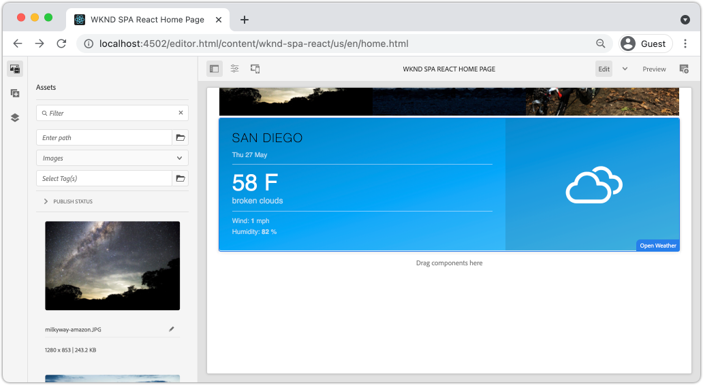

# 创建自定义WeatherComponent {#custom-component}

了解如何创建要与AEM SPA编辑器一起使用的自定义天气组件。 了解如何开发创作对话框和Sling模型以扩展JSON模型以填充自定义组件。 的 [Open Weather API](https://openweathermap.org) 和 [React Open Weather组件](https://www.npmjs.com/package/react-open-weather) 中，将使用。

## 目标

1. 了解Sling模型在处理AEM提供的JSON模型API中的角色。
2. 了解如何创建新的AEM组件对话框。
3. 了解如何创建 **自定义** 与AEM编辑器框架兼容的SPA组件。

## 将构建的内容

构建了简单的天气组件。 内容作者可以将此组件添加到SPA中。 使用AEM对话框，作者可以设置天气的显示位置。  此组件的实施说明了创建与AEM SPA Editor框架兼容的全新AEM组件所需的步骤。


## 前提条件

查看设置 [本地开发环境](overview.md#local-dev-environment). 本章是 [导航和路由](navigation-routing.md) 但是，章节之后，您只需要将一个启用了SPA的AEM项目部署到本地AEM实例。

### 打开天气API密钥

来自的API密钥 [开放天气](https://openweathermap.org/) 需要与教程一起使用。 [注册免费](https://home.openweathermap.org/users/sign_up) 的API调用数量有限。

## 定义AEM组件

AEM组件被定义为节点和属性。 在项目中，这些节点和属性在 `ui.apps` 模块。 接下来，在 `ui.apps` 模块。

>[!NOTE]
>
> 快速刷新 [AEM组件基础知识可能会有所帮助](https://experienceleague.adobe.com/docs/experience-manager-learn/getting-started-wknd-tutorial-develop/project-archetype/component-basics.html).

1. 在选择的IDE中，打开 `ui.apps` 文件夹。
2. 导航到 `ui.apps/src/main/content/jcr_root/apps/wknd-spa-react/components` 并创建名为 `open-weather`.
3. 创建名为的新文件 `.content.xml` 在 `open-weather` 文件夹。 填充 `open-weather/.content.xml` ，具有以下特点：

   ```xml
   <?xml version="1.0" encoding="UTF-8"?>
   <jcr:root xmlns:sling="http://sling.apache.org/jcr/sling/1.0" xmlns:cq="http://www.day.com/jcr/cq/1.0" xmlns:jcr="http://www.jcp.org/jcr/1.0"
       jcr:primaryType="cq:Component"
       jcr:title="Open Weather"
       componentGroup="WKND SPA React - Content"/>
   ```

   

   `jcr:primaryType="cq:Component"`  — 标识此节点是AEM组件。

   `jcr:title` 是显示给内容作者的值，并且 `componentGroup` 确定创作UI中的组件分组。

4. 在 `custom-component` 文件夹，创建另一个名为 `_cq_dialog`.
5. 在 `_cq_dialog` 文件夹创建名为 `.content.xml` 并使用以下内容填充该变量：

   ```xml
   <?xml version="1.0" encoding="UTF-8"?>
   <jcr:root xmlns:sling="http://sling.apache.org/jcr/sling/1.0" xmlns:granite="http://www.adobe.com/jcr/granite/1.0" xmlns:cq="http://www.day.com/jcr/cq/1.0" xmlns:jcr="http://www.jcp.org/jcr/1.0" xmlns:nt="http://www.jcp.org/jcr/nt/1.0"
       jcr:primaryType="nt:unstructured"
       jcr:title="Open Weather"
       sling:resourceType="cq/gui/components/authoring/dialog">
       <content
           jcr:primaryType="nt:unstructured"
           sling:resourceType="granite/ui/components/coral/foundation/container">
           <items jcr:primaryType="nt:unstructured">
               <tabs
                   jcr:primaryType="nt:unstructured"
                   sling:resourceType="granite/ui/components/coral/foundation/tabs"
                   maximized="{Boolean}true">
                   <items jcr:primaryType="nt:unstructured">
                       <properties
                           jcr:primaryType="nt:unstructured"
                           jcr:title="Properties"
                           sling:resourceType="granite/ui/components/coral/foundation/container"
                           margin="{Boolean}true">
                           <items jcr:primaryType="nt:unstructured">
                               <columns
                                   jcr:primaryType="nt:unstructured"
                                   sling:resourceType="granite/ui/components/coral/foundation/fixedcolumns"
                                   margin="{Boolean}true">
                                   <items jcr:primaryType="nt:unstructured">
                                       <column
                                           jcr:primaryType="nt:unstructured"
                                           sling:resourceType="granite/ui/components/coral/foundation/container">
                                           <items jcr:primaryType="nt:unstructured">
                                               <label
                                                   jcr:primaryType="nt:unstructured"
                                                   sling:resourceType="granite/ui/components/coral/foundation/form/textfield"
                                                   fieldDescription="The label to display for the component"
                                                   fieldLabel="Label"
                                                   name="./label"/>
                                               <lat
                                                   jcr:primaryType="nt:unstructured"
                                                   sling:resourceType="granite/ui/components/coral/foundation/form/numberfield"
                                                   fieldDescription="The latitude of the location."
                                                   fieldLabel="Latitude"
                                                   step="any"
                                                   name="./lat" />
                                               <lon
                                                   jcr:primaryType="nt:unstructured"
                                                   sling:resourceType="granite/ui/components/coral/foundation/form/numberfield"
                                                   fieldDescription="The longitude of the location."
                                                   fieldLabel="Longitude"
                                                   step="any"
                                                   name="./lon"/>
                                           </items>
                                       </column>
                                   </items>
                               </columns>
                           </items>
                       </properties>
                   </items>
               </tabs>
           </items>
       </content>
   </jcr:root>
   ```

   

   上述XML文件会为 `Weather Component`. 文件的关键部分是内部 `<label>`, `<lat>` 和 `<lon>` 节点。 此对话框包含两个 `numberfield`s和a `textfield` 用于配置要显示的天气。

   随即会创建一个Sling模型，以显示 `label`,`lat` 和 `long` 属性。

   >[!NOTE]
   >
   > 您可以查看更多内容 [查看核心组件定义时显示的对话框示例](https://github.com/adobe/aem-core-wcm-components/tree/master/content/src/content/jcr_root/apps/core/wcm/components). 您还可以查看其他表单字段，如 `select`, `textarea`, `pathfield`下方可用 `/libs/granite/ui/components/coral/foundation/form` in [CRXDE-Lite](http://localhost:4502/crx/de/index.jsp#/libs/granite/ui/components/coral/foundation/form).

   使用传统AEM组件， [HTL](https://experienceleague.adobe.com/docs/experience-manager-htl/using/overview.html?lang=zh-Hans) 通常需要脚本。 由于SPA将渲染组件，因此无需HTL脚本。

## 创建Sling模型

Sling模型是注释驱动的Java“POJO”（纯旧Java对象），有助于将数据从JCR映射到Java变量。 [Sling模型](https://experienceleague.adobe.com/docs/experience-manager-learn/getting-started-wknd-tutorial-develop/project-archetype/component-basics.html?lang=en#sling-models) 通常用于封装AEM组件的复杂服务器端业务逻辑。

在SPA编辑器的上下文中，Sling模型通过使用的功能，通过JSON模型来显示组件的内容 [Sling模型导出程序](https://experienceleague.adobe.com/docs/experience-manager-learn/foundation/development/develop-sling-model-exporter.html?lang=zh-Hans).

1. 在选择的IDE中，打开 `core` 模块位置 `aem-guides-wknd-spa.react/core`.
1. 创建名为的文件 `OpenWeatherModel.java` at `core/src/main/java/com/adobe/aem/guides/wkndspa/react/core/models`.
1. 填充 `OpenWeatherModel.java` ，具有以下特点：

   ```java
   package com.adobe.aem.guides.wkndspa.react.core.models;
   
   import com.adobe.cq.export.json.ComponentExporter;
   
   // Sling Models intended to be used with SPA Editor must extend ComponentExporter interface
   public interface OpenWeatherModel extends ComponentExporter {
       public String getLabel();
       public double getLat();
       public double getLon();
   }
   ```

   这是我们组件的Java界面。 为了使我们的Sling模型与SPA Editor框架兼容，必须扩展 `ComponentExporter` 类。

1. 创建名为的文件夹 `impl` 下 `core/src/main/java/com/adobe/aem/guides/wkndspa/react/core/models`.
1. 创建名为 `OpenWeatherModelImpl.java` 下 `impl` 和填充以下内容：

   ```java
   package com.adobe.aem.guides.wkndspa.react.core.models.impl;
   
   import org.apache.sling.models.annotations.*;
   import org.apache.sling.models.annotations.injectorspecific.ValueMapValue;
   import com.adobe.cq.export.json.ComponentExporter;
   import com.adobe.cq.export.json.ExporterConstants;
   import org.apache.commons.lang3.StringUtils;
   import org.apache.sling.api.SlingHttpServletRequest;
   import com.adobe.aem.guides.wkndspa.react.core.models.OpenWeatherModel;
   
   // Sling Model annotation
   @Model(
       adaptables = SlingHttpServletRequest.class, 
       adapters = { OpenWeatherModel.class, ComponentExporter.class }, 
       resourceType = OpenWeatherModelImpl.RESOURCE_TYPE, 
       defaultInjectionStrategy = DefaultInjectionStrategy.OPTIONAL
   )
   @Exporter( //Exporter annotation that serializes the modoel as JSON
       name = ExporterConstants.SLING_MODEL_EXPORTER_NAME, 
       extensions = ExporterConstants.SLING_MODEL_EXTENSION
   )
   public class OpenWeatherModelImpl implements OpenWeatherModel {
   
       @ValueMapValue
       private String label; //maps variable to jcr property named "label" persisted by Dialog
   
       @ValueMapValue
       private double lat; //maps variable to jcr property named "lat"
   
       @ValueMapValue
       private double lon; //maps variable to jcr property named "lon"
   
       // points to AEM component definition in ui.apps
       static final String RESOURCE_TYPE = "wknd-spa-react/components/open-weather";
   
       // public getter method to expose value of private variable `label`
       // adds additional logic to default the label to "(Default)" if not set.
       @Override
       public String getLabel() {
           return StringUtils.isNotBlank(label) ? label : "(Default)";
       }
   
       // public getter method to expose value of private variable `lat`
       @Override
       public double getLat() {
           return lat;
       }
   
       // public getter method to expose value of private variable `lon`
       @Override
       public double getLon() {
           return lon;
       }
   
       // method required by `ComponentExporter` interface
       // exposes a JSON property named `:type` with a value of `wknd-spa-react/components/open-weather`
       // required to map the JSON export to the SPA component props via the `MapTo`
       @Override
       public String getExportedType() {
           return OpenWeatherModelImpl.RESOURCE_TYPE;
       }
   } 
   ```

   静态变量 `RESOURCE_TYPE` 必须指向 `ui.apps` 的子代。 的 `getExportedType()` 用于通过将JSON属性映射到SPA组件 `MapTo`. `@ValueMapValue` 是读取对话框保存的jcr属性的注释。

## 更新SPA

接下来，更新React代码以包含 [React Open Weather组件](https://www.npmjs.com/package/react-open-weather) 并将其映射到在上一步中创建的AEM组件。

1. 将React Open Weather组件安装为 **npm** 依赖关系：

   ```shell
   $ cd aem-guides-wknd-spa.react/ui.frontend
   $ npm i react-open-weather
   ```

1. 创建名为的新文件夹 `OpenWeather` at `ui.frontend/src/components/OpenWeather`.
1. 添加名为 `OpenWeather.js` 并使用以下内容填充该变量：

   ```js
   import React from 'react';
   import {MapTo} from '@adobe/aem-react-editable-components';
   import ReactWeather, { useOpenWeather } from 'react-open-weather';
   
   // Open weather API Key
   // For simplicity it is hard coded in the file, ideally this is extracted in to an environment variable
   const API_KEY = 'YOUR_API_KEY';
   
   // Logic to render placeholder or component
   const OpenWeatherEditConfig = {
   
       emptyLabel: 'Weather',
       isEmpty: function(props) {
           return !props || !props.lat || !props.lon || !props.label;
       }
   };
   
   // Wrapper function that includes react-open-weather component
   function ReactWeatherWrapper(props) {
       const { data, isLoading, errorMessage } = useOpenWeather({
           key: API_KEY,
           lat: props.lat, // passed in from AEM JSON
           lon: props.lon, // passed in from AEM JSON
           lang: 'en',
           unit: 'imperial', // values are (metric, standard, imperial)
       });
   
       return (
           <div className="cmp-open-weather">
               <ReactWeather
                   isLoading={isLoading}
                   errorMessage={errorMessage}
                   data={data}
                   lang="en"
                   locationLabel={props.label} // passed in from AEM JSON
                   unitsLabels={{ temperature: 'F', windSpeed: 'mph' }}
                   showForecast={false}
                 />
           </div>
       );
   }
   
   export default function OpenWeather(props) {
   
           // render nothing if component not configured
           if (OpenWeatherEditConfig.isEmpty(props)) {
               return null;
           }
   
           // render ReactWeather component if component configured
           // pass props to ReactWeatherWrapper. These props include the mapped properties from AEM JSON
           return ReactWeatherWrapper(props);
   
   }
   
   // Map OpenWeather to AEM component
   MapTo('wknd-spa-react/components/open-weather')(OpenWeather, OpenWeatherEditConfig);
   ```

1. 更新 `import-components.js` at `ui.frontend/src/components/import-components.js` 包含 `OpenWeather` 组件：

   ```diff
     // import-component.js
     import './Container/Container';
     import './ExperienceFragment/ExperienceFragment';
   + import './OpenWeather/OpenWeather';
   ```

1. 使用您的Maven技能，从项目目录的根目录将所有更新部署到本地AEM环境：

   ```shell
   $ cd aem-guides-wknd-spa.react
   $ mvn clean install -PautoInstallSinglePackage
   ```

## 更新模板策略

接下来，导航到AEM以验证更新并允许 `OpenWeather` 要添加到SPA的组件。

1. 通过导航到 [http://localhost:4502/system/console/status-slingmodels](http://localhost:4502/system/console/status-slingmodels).

   ```plain
   com.adobe.aem.guides.wkndspa.react.core.models.impl.OpenWeatherModelImpl - wknd-spa-react/components/open-weather
   
   com.adobe.aem.guides.wkndspa.react.core.models.impl.OpenWeatherModelImpl exports 'wknd-spa-react/components/open-weather' with selector 'model' and extension '[Ljava.lang.String;@2fd80fc5' with exporter 'jackson'
   ```

   您应会看到以上两行，这些行表示 `OpenWeatherModelImpl` 与 `wknd-spa-react/components/open-weather` 组件，并且已通过Sling模型导出程序进行注册。

1. 导航到SPA页面模板(位于 [http://localhost:4502/editor.html/conf/wknd-spa-react/settings/wcm/templates/spa-page-template/structure.html](http://localhost:4502/editor.html/conf/wknd-spa-react/settings/wcm/templates/spa-page-template/structure.html).
1. 更新布局容器的策略以添加新 `Open Weather` 作为允许的组件：

   

   保存对策略所做的更改，并观察 `Open Weather` 作为允许的组件：

   

## 创作打开的天气组件

接下来，创作 `Open Weather` 组件。 AEM SPA Editor

1. 导航到 [http://localhost:4502/editor.html/content/wknd-spa-react/us/en/home.html](http://localhost:4502/editor.html/content/wknd-spa-react/us/en/home.html).
1. 在 `Edit` 模式，添加 `Open Weather` 到 `Layout Container`:

   

1. 打开组件的对话框，然后输入 **标签**, **纬度**&#x200B;和 **经度**. 例如 **圣地亚哥**, **32.7157**&#x200B;和 **-117.1611**. 使用开放天气API，西半球和南半球的数字表示为负数

   

   这是基于章节前面的XML文件创建的对话框。

1. 保存更改。请留意 **圣地亚哥** 现在显示：

   

1. 通过导航到 [http://localhost:4502/content/wknd-spa-react/us/en.model.json](http://localhost:4502/content/wknd-spa-react/us/en.model.json). 搜索 `wknd-spa-react/components/open-weather`:

   ```json
   "open_weather": {
       "label": "San Diego",
       "lat": 32.7157,
       "lon": -117.1611,
       ":type": "wknd-spa-react/components/open-weather"
   }
   ```

   JSON值由Sling模型输出。 这些JSON值将作为prop传递到React组件中。

## 恭喜！ {#congratulations}

恭喜，您已学会如何创建要与SPA编辑器一起使用的自定义AEM组件。 您还了解了对话框、JCR属性和Sling模型如何进行交互以输出JSON模型。

### 后续步骤 {#next-steps}

[扩展核心组件](extend-component.md)  — 了解如何扩展要与AEM SPA编辑器一起使用的现有AEM核心组件。 了解如何向现有组件添加属性和内容是一项功能强大的技术，可扩展AEM SPA Editor实施的功能。
