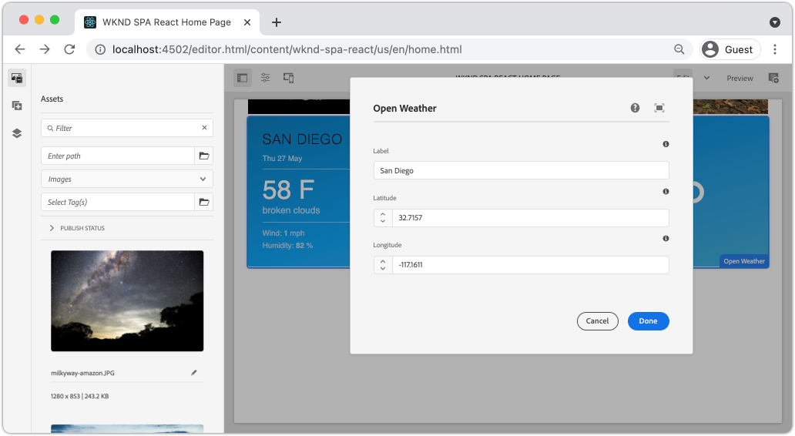
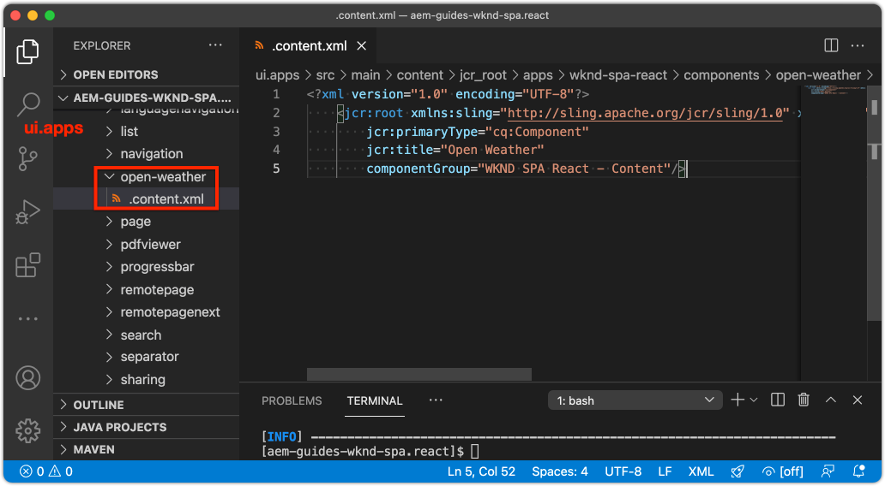
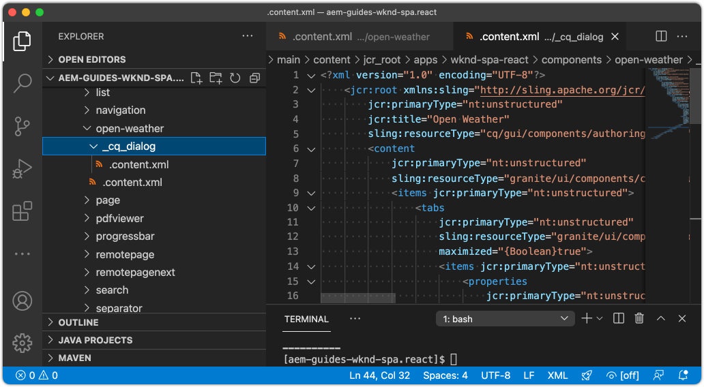
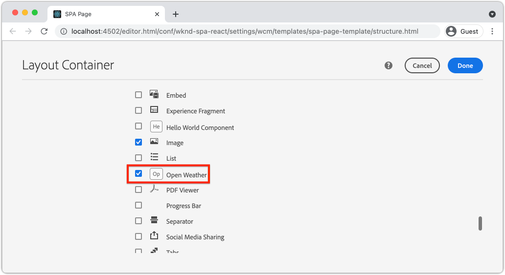
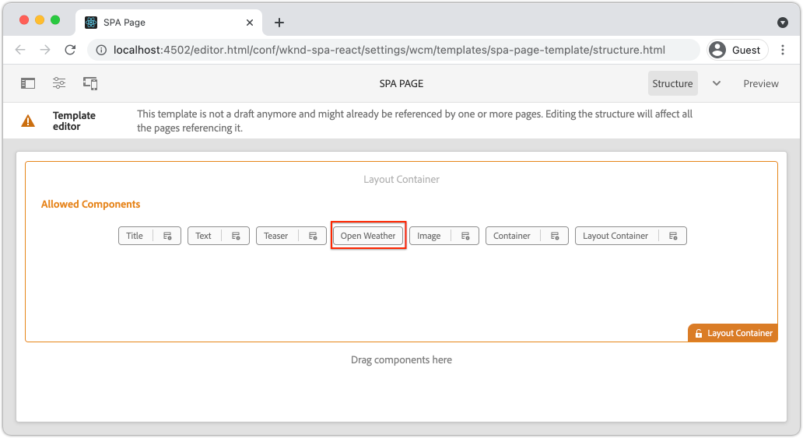
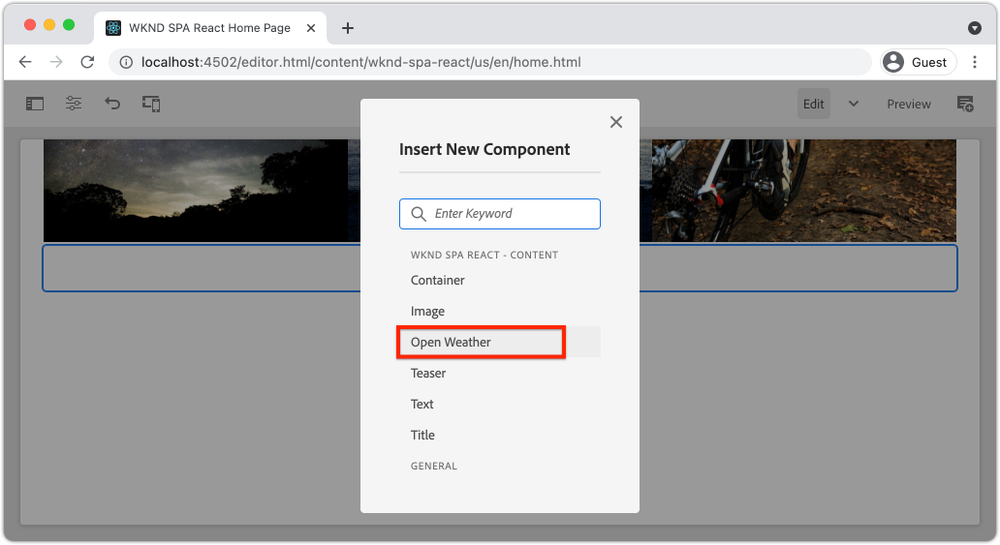
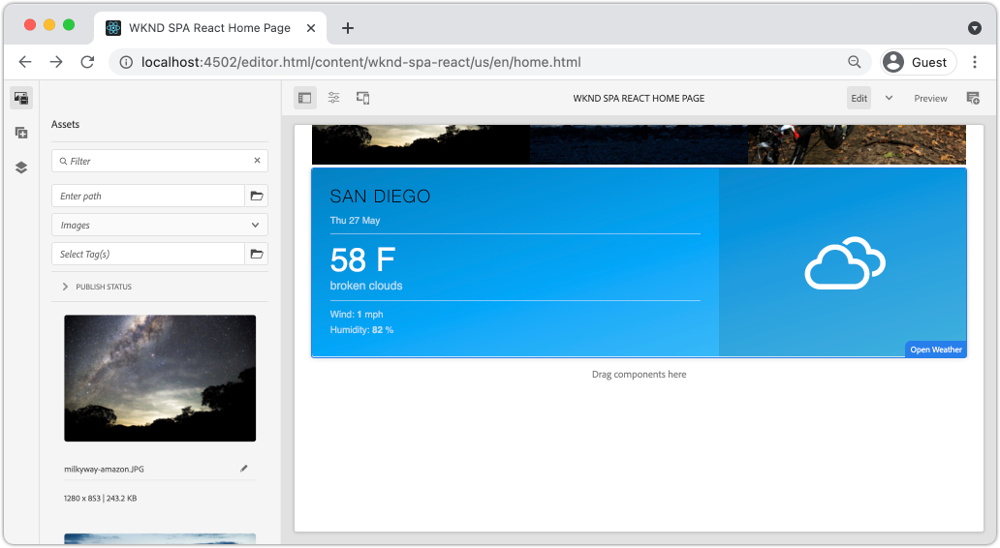

# Create a Custom WeatherComponent {#custom-component}

{{spa-editor-deprecation}}

Learn how to create a custom weather component to be used with the AEM SPA Editor. 了解如何开发创作对话框和Sling模型，以扩展JSON模型来填充自定义组件。 The [Open Weather API](https://openweathermap.org) and [React Open Weather component](https://www.npmjs.com/package/react-open-weather) are used.

## 目标

1. 了解Sling模型在操作AEM提供的JSON模型API方面的作用。
2. Understand how to create new AEM component dialogs.
3. 了解如何创建与SPA编辑器框架兼容的&#x200B;**自定义** AEM组件。

## 您将构建什么

A simple weather component is built. This component is able to be added to the SPA by content authors. 利用AEM对话框，作者可以设置天气的显示位置。  此组件的实施说明了创建与AEM SPA Editor Framework兼容的全新AEM组件所需的步骤。



## 先决条件

查看设置[本地开发环境](overview.md#local-dev-environment)所需的工具和说明。 本章是[导航和路由](navigation-routing.md)章节的延续，但您只需将启用了SPA的AEM项目部署到本地AEM实例即可。

### 打开天气API密钥

需要来自[Open Weather](https://openweathermap.org/)的API密钥以及教程。 [免费注册](https://home.openweathermap.org/users/sign_up)有限数量的API调用。

## 定义AEM组件

AEM组件被定义为节点和属性。 在项目中，这些节点和属性在`ui.apps`模块中表示为XML文件。 接下来，在`ui.apps`模块中创建AEM组件。

>[!NOTE]
>
> 有关AEM组件[基础知识的快速刷新可能有所帮助](https://experienceleague.adobe.com/docs/experience-manager-learn/getting-started-wknd-tutorial-develop/project-archetype/component-basics.html)。

1. 在您选择的IDE中，打开`ui.apps`文件夹。
2. 导航到`ui.apps/src/main/content/jcr_root/apps/wknd-spa-react/components`并创建一个名为`open-weather`的新文件夹。
3. 在`open-weather`文件夹下创建名为`.content.xml`的新文件。 使用以下内容填充`open-weather/.content.xml`：

   ```xml
   <?xml version="1.0" encoding="UTF-8"?>
   <jcr:root xmlns:sling="http://sling.apache.org/jcr/sling/1.0" xmlns:cq="http://www.day.com/jcr/cq/1.0" xmlns:jcr="http://www.jcp.org/jcr/1.0"
       jcr:primaryType="cq:Component"
       jcr:title="Open Weather"
       componentGroup="WKND SPA React - Content"/>
   ```

   

   `jcr:primaryType="cq:Component"` — 标识此节点是AEM组件。

   `jcr:title`是向内容作者显示的值，`componentGroup`确定创作UI中的组件分组。

4. 在`custom-component`文件夹下，创建另一个名为`_cq_dialog`的文件夹。
5. 在`_cq_dialog`文件夹下创建名为`.content.xml`的新文件并使用以下内容填充该文件：

   ```xml
   <?xml version="1.0" encoding="UTF-8"?>
   <jcr:root xmlns:sling="http://sling.apache.org/jcr/sling/1.0" xmlns:granite="http://www.adobe.com/jcr/granite/1.0" xmlns:cq="http://www.day.com/jcr/cq/1.0" xmlns:jcr="http://www.jcp.org/jcr/1.0" xmlns:nt="http://www.jcp.org/jcr/nt/1.0"
       jcr:primaryType="nt:unstructured"
       jcr:title="Open Weather"
       sling:resourceType="cq/gui/components/authoring/dialog">
       <content
           jcr:primaryType="nt:unstructured"
           sling:resourceType="granite/ui/components/coral/foundation/container">
           <items jcr:primaryType="nt:unstructured">
               <tabs
                   jcr:primaryType="nt:unstructured"
                   sling:resourceType="granite/ui/components/coral/foundation/tabs"
                   maximized="{Boolean}true">
                   <items jcr:primaryType="nt:unstructured">
                       <properties
                           jcr:primaryType="nt:unstructured"
                           jcr:title="Properties"
                           sling:resourceType="granite/ui/components/coral/foundation/container"
                           margin="{Boolean}true">
                           <items jcr:primaryType="nt:unstructured">
                               <columns
                                   jcr:primaryType="nt:unstructured"
                                   sling:resourceType="granite/ui/components/coral/foundation/fixedcolumns"
                                   margin="{Boolean}true">
                                   <items jcr:primaryType="nt:unstructured">
                                       <column
                                           jcr:primaryType="nt:unstructured"
                                           sling:resourceType="granite/ui/components/coral/foundation/container">
                                           <items jcr:primaryType="nt:unstructured">
                                               <label
                                                   jcr:primaryType="nt:unstructured"
                                                   sling:resourceType="granite/ui/components/coral/foundation/form/textfield"
                                                   fieldDescription="The label to display for the component"
                                                   fieldLabel="Label"
                                                   name="./label"/>
                                               <lat
                                                   jcr:primaryType="nt:unstructured"
                                                   sling:resourceType="granite/ui/components/coral/foundation/form/numberfield"
                                                   fieldDescription="The latitude of the location."
                                                   fieldLabel="Latitude"
                                                   step="any"
                                                   name="./lat" />
                                               <lon
                                                   jcr:primaryType="nt:unstructured"
                                                   sling:resourceType="granite/ui/components/coral/foundation/form/numberfield"
                                                   fieldDescription="The longitude of the location."
                                                   fieldLabel="Longitude"
                                                   step="any"
                                                   name="./lon"/>
                                           </items>
                                       </column>
                                   </items>
                               </columns>
                           </items>
                       </properties>
                   </items>
               </tabs>
           </items>
       </content>
   </jcr:root>
   ```

   

   上述XML文件为`Weather Component`生成了一个非常简单的对话框。 文件的关键部分是内部`<label>`、`<lat>`和`<lon>`节点。 此对话框包含两个`numberfield`和一个`textfield`，允许用户配置要显示的天气。

   A Sling Model is created next to expose the value of the `label`,`lat` and `long` properties via the JSON model.

   >[!NOTE]
   >
   > You can view a lot more [examples of dialogs by viewing the Core Component definitions](https://github.com/adobe/aem-core-wcm-components/tree/master/content/src/content/jcr_root/apps/core/wcm/components). You can also view additional form fields, like `select`, `textarea`, `pathfield`, available beneath `/libs/granite/ui/components/coral/foundation/form` in [CRXDE-Lite](http://localhost:4502/crx/de/index.jsp#/libs/granite/ui/components/coral/foundation/form).

   With a traditional AEM component, an [HTL](https://experienceleague.adobe.com/docs/experience-manager-htl/using/overview.html?lang=zh-Hans) script is typically required. Since the SPA will render the component, no HTL script is needed.

## Create the Sling Model

Sling Models are annotation driven Java &quot;POJO&#39;s&quot; (Plain Old Java Objects) that facilitate the mapping of data from the JCR to Java variables. [Sling Models](https://experienceleague.adobe.com/docs/experience-manager-learn/getting-started-wknd-tutorial-develop/project-archetype/component-basics.html?lang=en#sling-models) typically function to encapsulate complex server-side business logic for AEM Components.

In the context of the SPA Editor, Sling Models expose a component&#39;s content through the JSON model through a feature using the [Sling Model Exporter](https://experienceleague.adobe.com/docs/experience-manager-learn/foundation/development/develop-sling-model-exporter.html).

1. In the IDE of your choice open the `core` module at `aem-guides-wknd-spa.react/core`.
1. Create a file named at `OpenWeatherModel.java` at `core/src/main/java/com/adobe/aem/guides/wkndspa/react/core/models`.
1. 使用以下内容填充`OpenWeatherModel.java`：

   ```java
   package com.adobe.aem.guides.wkndspa.react.core.models;
   
   import com.adobe.cq.export.json.ComponentExporter;
   
   // Sling Models intended to be used with SPA Editor must extend ComponentExporter interface
   public interface OpenWeatherModel extends ComponentExporter {
       public String getLabel();
       public double getLat();
       public double getLon();
   }
   ```

   This is the Java interface for our component. In order for our Sling Model to be compatible with the SPA Editor framework it must extend the `ComponentExporter` class.

1. 在 `core/src/main/java/com/adobe/aem/guides/wkndspa/react/core/models` 下面创建一个名为 `impl` 的文件夹。
1. Create a file named `OpenWeatherModelImpl.java` beneath `impl` and populate with the following:

   ```java
   package com.adobe.aem.guides.wkndspa.react.core.models.impl;
   
   import org.apache.sling.models.annotations.*;
   import org.apache.sling.models.annotations.injectorspecific.ValueMapValue;
   import com.adobe.cq.export.json.ComponentExporter;
   import com.adobe.cq.export.json.ExporterConstants;
   import org.apache.commons.lang3.StringUtils;
   import org.apache.sling.api.SlingHttpServletRequest;
   import com.adobe.aem.guides.wkndspa.react.core.models.OpenWeatherModel;
   
   // Sling Model annotation
   @Model(
       adaptables = SlingHttpServletRequest.class, 
       adapters = { OpenWeatherModel.class, ComponentExporter.class }, 
       resourceType = OpenWeatherModelImpl.RESOURCE_TYPE, 
       defaultInjectionStrategy = DefaultInjectionStrategy.OPTIONAL
   )
   @Exporter( //Exporter annotation that serializes the modoel as JSON
       name = ExporterConstants.SLING_MODEL_EXPORTER_NAME, 
       extensions = ExporterConstants.SLING_MODEL_EXTENSION
   )
   public class OpenWeatherModelImpl implements OpenWeatherModel {
   
       @ValueMapValue
       private String label; //maps variable to jcr property named "label" persisted by Dialog
   
       @ValueMapValue
       private double lat; //maps variable to jcr property named "lat"
   
       @ValueMapValue
       private double lon; //maps variable to jcr property named "lon"
   
       // points to AEM component definition in ui.apps
       static final String RESOURCE_TYPE = "wknd-spa-react/components/open-weather";
   
       // public getter method to expose value of private variable `label`
       // adds additional logic to default the label to "(Default)" if not set.
       @Override
       public String getLabel() {
           return StringUtils.isNotBlank(label) ? label : "(Default)";
       }
   
       // public getter method to expose value of private variable `lat`
       @Override
       public double getLat() {
           return lat;
       }
   
       // public getter method to expose value of private variable `lon`
       @Override
       public double getLon() {
           return lon;
       }
   
       // method required by `ComponentExporter` interface
       // exposes a JSON property named `:type` with a value of `wknd-spa-react/components/open-weather`
       // required to map the JSON export to the SPA component props via the `MapTo`
       @Override
       public String getExportedType() {
           return OpenWeatherModelImpl.RESOURCE_TYPE;
       }
   } 
   ```

   The the static variable `RESOURCE_TYPE` must point to the path in `ui.apps` of the component. The `getExportedType()` is used to map the JSON properties to the SPA component via `MapTo`. `@ValueMapValue` is an annotation that reads the jcr property saved by the dialog.

## Update the SPA

Next, update the React code to include the [React Open Weather component](https://www.npmjs.com/package/react-open-weather) and have it map to the AEM component created in the previous steps.

1. Install the React Open Weather component as an **npm** dependency:

   ```shell
   $ cd aem-guides-wknd-spa.react/ui.frontend
   $ npm i react-open-weather
   ```

1. Create a new folder named `OpenWeather` at `ui.frontend/src/components/OpenWeather`.
1. Add a file named `OpenWeather.js` and populate it with the following:

   ```js
   import React from 'react';
   import {MapTo} from '@adobe/aem-react-editable-components';
   import ReactWeather, { useOpenWeather } from 'react-open-weather';
   
   // Open weather API Key
   // For simplicity it is hard coded in the file, ideally this is extracted in to an environment variable
   const API_KEY = 'YOUR_API_KEY';
   
   // Logic to render placeholder or component
   const OpenWeatherEditConfig = {
   
       emptyLabel: 'Weather',
       isEmpty: function(props) {
           return !props || !props.lat || !props.lon || !props.label;
       }
   };
   
   // Wrapper function that includes react-open-weather component
   function ReactWeatherWrapper(props) {
       const { data, isLoading, errorMessage } = useOpenWeather({
           key: API_KEY,
           lat: props.lat, // passed in from AEM JSON
           lon: props.lon, // passed in from AEM JSON
           lang: 'en',
           unit: 'imperial', // values are (metric, standard, imperial)
       });
   
       return (
           <div className="cmp-open-weather">
               <ReactWeather
                   isLoading={isLoading}
                   errorMessage={errorMessage}
                   data={data}
                   lang="en"
                   locationLabel={props.label} // passed in from AEM JSON
                   unitsLabels={{ temperature: 'F', windSpeed: 'mph' }}
                   showForecast={false}
                 />
           </div>
       );
   }
   
   export default function OpenWeather(props) {
   
           // render nothing if component not configured
           if (OpenWeatherEditConfig.isEmpty(props)) {
               return null;
           }
   
           // render ReactWeather component if component configured
           // pass props to ReactWeatherWrapper. These props include the mapped properties from AEM JSON
           return ReactWeatherWrapper(props);
   
   }
   
   // Map OpenWeather to AEM component
   MapTo('wknd-spa-react/components/open-weather')(OpenWeather, OpenWeatherEditConfig);
   ```

1. Update `import-components.js` at `ui.frontend/src/components/import-components.js` to include the `OpenWeather` component:

   ```diff
     // import-component.js
     import './Container/Container';
     import './ExperienceFragment/ExperienceFragment';
   + import './OpenWeather/OpenWeather';
   ```

1. Deploy all of the updates to a local AEM environment from the root of the project directory, using your Maven skills:

   ```shell
   $ cd aem-guides-wknd-spa.react
   $ mvn clean install -PautoInstallSinglePackage
   ```

## 更新模板策略

Next, navigate to AEM to verify the updates and allow the `OpenWeather` component to be added to the SPA.

1. 通过导航到[http://localhost:4502/system/console/status-slingmodels](http://localhost:4502/system/console/status-slingmodels)，验证新Sling模型的注册。

   ```plain
   com.adobe.aem.guides.wkndspa.react.core.models.impl.OpenWeatherModelImpl - wknd-spa-react/components/open-weather
   
   com.adobe.aem.guides.wkndspa.react.core.models.impl.OpenWeatherModelImpl exports 'wknd-spa-react/components/open-weather' with selector 'model' and extension '[Ljava.lang.String;@2fd80fc5' with exporter 'jackson'
   ```

   您应该看到以上两行，其中表示`OpenWeatherModelImpl`与`wknd-spa-react/components/open-weather`组件相关联，并已通过Sling模型导出程序注册。

1. Navigate to the SPA Page Template at [http://localhost:4502/editor.html/conf/wknd-spa-react/settings/wcm/templates/spa-page-template/structure.html](http://localhost:4502/editor.html/conf/wknd-spa-react/settings/wcm/templates/spa-page-template/structure.html).
1. 更新布局容器的策略以将新`Open Weather`添加为允许的组件：

   

   Save the changes to the policy, and observe the `Open Weather` as an allowed component:

   

## Author the Open Weather Component

接下来，使用AEM SPA编辑器创作`Open Weather`组件。

1. Navigate to [http://localhost:4502/editor.html/content/wknd-spa-react/us/en/home.html](http://localhost:4502/editor.html/content/wknd-spa-react/us/en/home.html).
1. In `Edit` mode, add the `Open Weather` to the `Layout Container`:

   

1. Open the component&#39;s dialog and enter a **Label**, **Latitude**, and **Longitude**. For example **San Diego**, **32.7157**, and **-117.1611**. Western hemisphere and Southern hemisphere numbers are represented as negative numbers with the Open Weather API

   

   This is the dialog that was created based on the XML file earlier in the chapter.

1. 保存更改。 Observe that the weather for **San Diego** is now displayed:

   

1. View the JSON model by navigating to [http://localhost:4502/content/wknd-spa-react/us/en.model.json](http://localhost:4502/content/wknd-spa-react/us/en.model.json). Search for `wknd-spa-react/components/open-weather`:

   ```json
   "open_weather": {
       "label": "San Diego",
       "lat": 32.7157,
       "lon": -117.1611,
       ":type": "wknd-spa-react/components/open-weather"
   }
   ```

   The JSON values are outputted by the Sling Model. These JSON values are passed into the React component as props.

## 恭喜！ {#congratulations}

Congratulations, you learned how to create a custom AEM component to be used with the SPA Editor. You also learned how dialogs, JCR properties, and Sling Models interact to output the JSON model.

### 后续步骤 {#next-steps}

[Extend a Core Component](extend-component.md) - Learn how to extend an existing AEM Core Component to be used with the AEM SPA Editor. Understanding how to add properties and content to an existing component is a powerful technique to expand the capabilities of an AEM SPA Editor implementation.
