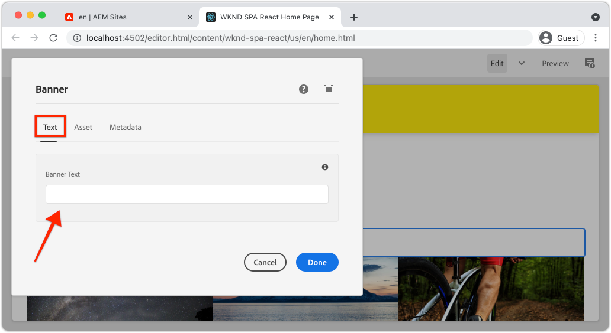
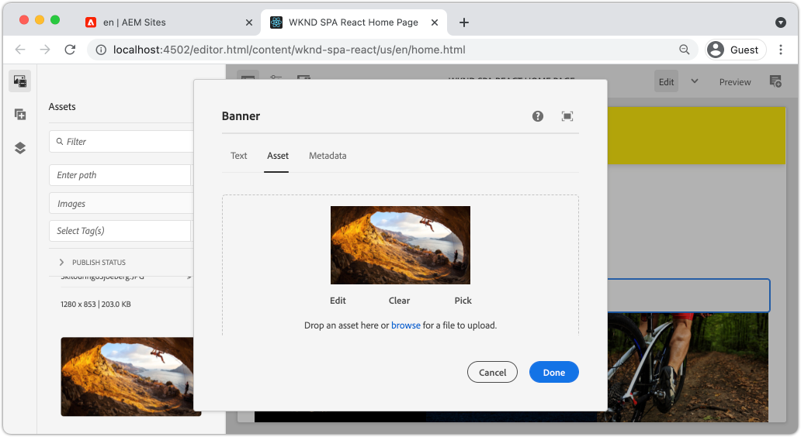
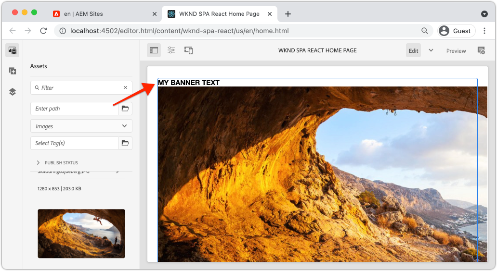

# Extend a Core Component {#extend-component}

{{spa-editor-deprecation}}

Learn how to extend an existing Core Component to be used with the AEM SPA Editor. Understanding how to extend an existing component is a powerful technique to customize and expand the capabilities of an AEM SPA Editor implementation.

## 目标

1. Extend an existing Core Component with additional properties and content.
2. Understand the basic of Component Inheritance with the use of `sling:resourceSuperType`.
3. Learn how to leverage the [Delegation Pattern](https://github.com/adobe/aem-core-wcm-components/wiki/Delegation-Pattern-for-Sling-Models) for Sling Models to re-use existing logic and functionality.

## 您将构建什么

This chapter illustrates the additional code needed to add an extra property to a standard `Image` component to fulfill the requirements for a new `Banner` component. The `Banner` component contains all of the same properties as the standard `Image` component but includes an additional property for users to populate the **Banner Text**.


## 先决条件

查看设置[本地开发环境](overview.md#local-dev-environment)所需的工具和说明。 It is assumed at this point in the tutorial users have a solid understanding of the AEM SPA Editor feature.

## Inheritance with Sling Resource Super Type {#sling-resource-super-type}

To extend an existing component set a property named `sling:resourceSuperType` on your component&#39;s definition.  `sling:resourceSuperType`is a [property](https://sling.apache.org/documentation/the-sling-engine/resources.html#resource-properties) that can be set on an AEM component&#39;s definition that points to another component. This explicitly sets the component to inherit all functionality of the component identified as the `sling:resourceSuperType`.

If we want to extend the `Image` component at `wknd-spa-react/components/image` we need to update the code in the `ui.apps` module.

1. Create a new folder beneath the `ui.apps` module for `banner` at `ui.apps/src/main/content/jcr_root/apps/wknd-spa-react/components/banner`.
1. Beneath `banner` create a Component definition (`.content.xml`) like the following:

   ```xml
   <?xml version="1.0" encoding="UTF-8"?>
   <jcr:root xmlns:sling="http://sling.apache.org/jcr/sling/1.0" xmlns:cq="http://www.day.com/jcr/cq/1.0" xmlns:jcr="http://www.jcp.org/jcr/1.0"
       jcr:primaryType="cq:Component"
       jcr:title="Banner"
       sling:resourceSuperType="wknd-spa-react/components/image"
       componentGroup="WKND SPA React - Content"/>
   ```

   This sets `wknd-spa-react/components/banner` to inherit all functionality of `wknd-spa-react/components/image`.

## cq:editConfig {#cq-edit-config}

`_cq_editConfig.xml`文件指示AEM创作UI中的拖放行为。 扩展图像组件时，资源类型必须与组件本身匹配，这一点很重要。

1. 在`ui.apps`模块中，在`banner`下创建名为`_cq_editConfig.xml`的其他文件。
1. 使用以下XML填充`_cq_editConfig.xml`：

   ```xml
   <?xml version="1.0" encoding="UTF-8"?>
   <jcr:root xmlns:sling="http://sling.apache.org/jcr/sling/1.0" xmlns:cq="http://www.day.com/jcr/cq/1.0" xmlns:jcr="http://www.jcp.org/jcr/1.0" xmlns:nt="http://www.jcp.org/jcr/nt/1.0"
       jcr:primaryType="cq:EditConfig">
       <cq:dropTargets jcr:primaryType="nt:unstructured">
           <image
               jcr:primaryType="cq:DropTargetConfig"
               accept="[image/gif,image/jpeg,image/png,image/webp,image/tiff,image/svg\\+xml]"
               groups="[media]"
               propertyName="./fileReference">
               <parameters
                   jcr:primaryType="nt:unstructured"
                   sling:resourceType="wknd-spa-react/components/banner"
                   imageCrop=""
                   imageMap=""
                   imageRotate=""/>
           </image>
       </cq:dropTargets>
       <cq:inplaceEditing
           jcr:primaryType="cq:InplaceEditingConfig"
           active="{Boolean}true"
           editorType="image">
           <inplaceEditingConfig jcr:primaryType="nt:unstructured">
               <plugins jcr:primaryType="nt:unstructured">
                   <crop
                       jcr:primaryType="nt:unstructured"
                       supportedMimeTypes="[image/jpeg,image/png,image/webp,image/tiff]"
                       features="*">
                       <aspectRatios jcr:primaryType="nt:unstructured">
                           <wideLandscape
                               jcr:primaryType="nt:unstructured"
                               name="Wide Landscape"
                               ratio="0.6180"/>
                           <landscape
                               jcr:primaryType="nt:unstructured"
                               name="Landscape"
                               ratio="0.8284"/>
                           <square
                               jcr:primaryType="nt:unstructured"
                               name="Square"
                               ratio="1"/>
                           <portrait
                               jcr:primaryType="nt:unstructured"
                               name="Portrait"
                               ratio="1.6180"/>
                       </aspectRatios>
                   </crop>
                   <flip
                       jcr:primaryType="nt:unstructured"
                       supportedMimeTypes="[image/jpeg,image/png,image/webp,image/tiff]"
                       features="-"/>
                   <map
                       jcr:primaryType="nt:unstructured"
                       supportedMimeTypes="[image/jpeg,image/png,image/webp,image/tiff,image/svg+xml]"
                       features="*"/>
                   <rotate
                       jcr:primaryType="nt:unstructured"
                       supportedMimeTypes="[image/jpeg,image/png,image/webp,image/tiff]"
                       features="*"/>
                   <zoom
                       jcr:primaryType="nt:unstructured"
                       supportedMimeTypes="[image/jpeg,image/png,image/webp,image/tiff]"
                       features="*"/>
               </plugins>
               <ui jcr:primaryType="nt:unstructured">
                   <inline
                       jcr:primaryType="nt:unstructured"
                       toolbar="[crop#launch,rotate#right,history#undo,history#redo,fullscreen#fullscreen,control#close,control#finish]">
                       <replacementToolbars
                           jcr:primaryType="nt:unstructured"
                           crop="[crop#identifier,crop#unlaunch,crop#confirm]"/>
                   </inline>
                   <fullscreen jcr:primaryType="nt:unstructured">
                       <toolbar
                           jcr:primaryType="nt:unstructured"
                           left="[crop#launchwithratio,rotate#right,flip#horizontal,flip#vertical,zoom#reset100,zoom#popupslider]"
                           right="[history#undo,history#redo,fullscreen#fullscreenexit]"/>
                       <replacementToolbars jcr:primaryType="nt:unstructured">
                           <crop
                               jcr:primaryType="nt:unstructured"
                               left="[crop#identifier]"
                               right="[crop#unlaunch,crop#confirm]"/>
                           <map
                               jcr:primaryType="nt:unstructured"
                               left="[map#rectangle,map#circle,map#polygon]"
                               right="[map#unlaunch,map#confirm]"/>
                       </replacementToolbars>
                   </fullscreen>
               </ui>
           </inplaceEditingConfig>
       </cq:inplaceEditing>
   </jcr:root>
   ```

1. 文件的唯一特性是将resourceType设置为`wknd-spa-react/components/banner`的`<parameters>`节点。

   ```xml
   <parameters
       jcr:primaryType="nt:unstructured"
       sling:resourceType="wknd-spa-react/components/banner"
       imageCrop=""
       imageMap=""
       imageRotate=""/>
   ```

   大多数组件不需要`_cq_editConfig`。 图像组件和子项则属于例外。

## 扩展对话框 {#extend-dialog}

我们的`Banner`组件要求在对话框中有一个额外的文本字段来捕获`bannerText`。 由于我们使用的是Sling继承，因此我们可以使用[Sling资源合并器](https://experienceleague.adobe.com/docs/experience-manager-65/developing/platform/sling-resource-merger.html)的功能来覆盖或扩展对话框的各个部分。 在此示例中，向对话框添加了一个新选项卡，用于从作者捕获其他数据以填充卡组件。

1. 在`ui.apps`模块的`banner`文件夹下创建名为`_cq_dialog`的文件夹。
1. 在`_cq_dialog`下创建对话框定义文件`.content.xml`。 使用以下内容填充：

   ```xml
   <?xml version="1.0" encoding="UTF-8"?>
   <jcr:root xmlns:sling="http://sling.apache.org/jcr/sling/1.0" xmlns:granite="http://www.adobe.com/jcr/granite/1.0" xmlns:cq="http://www.day.com/jcr/cq/1.0" xmlns:jcr="http://www.jcp.org/jcr/1.0" xmlns:nt="http://www.jcp.org/jcr/nt/1.0"
       jcr:primaryType="nt:unstructured"
       jcr:title="Banner"
       sling:resourceType="cq/gui/components/authoring/dialog">
       <content jcr:primaryType="nt:unstructured">
           <items jcr:primaryType="nt:unstructured">
               <tabs jcr:primaryType="nt:unstructured">
                   <items jcr:primaryType="nt:unstructured">
                       <text
                           jcr:primaryType="nt:unstructured"
                           jcr:title="Text"
                           sling:orderBefore="asset"
                           sling:resourceType="granite/ui/components/coral/foundation/container"
                           margin="{Boolean}true">
                           <items jcr:primaryType="nt:unstructured">
                               <columns
                                   jcr:primaryType="nt:unstructured"
                                   sling:resourceType="granite/ui/components/coral/foundation/fixedcolumns"
                                   margin="{Boolean}true">
                                   <items jcr:primaryType="nt:unstructured">
                                       <column
                                           jcr:primaryType="nt:unstructured"
                                           sling:resourceType="granite/ui/components/coral/foundation/container">
                                           <items jcr:primaryType="nt:unstructured">
                                               <textGroup
                                                   granite:hide="${cqDesign.titleHidden}"
                                                   jcr:primaryType="nt:unstructured"
                                                   sling:resourceType="granite/ui/components/coral/foundation/well">
                                                   <items jcr:primaryType="nt:unstructured">
                                                       <bannerText
                                                           jcr:primaryType="nt:unstructured"
                                                           sling:resourceType="granite/ui/components/coral/foundation/form/textfield"
                                                           fieldDescription="Text to display on top of the banner."
                                                           fieldLabel="Banner Text"
                                                           name="./bannerText"/>
                                                   </items>
                                               </textGroup>
                                           </items>
                                       </column>
                                   </items>
                               </columns>
                           </items>
                       </text>
                   </items>
               </tabs>
           </items>
       </content>
   </jcr:root>
   ```

   上述XML定义将创建一个名为&#x200B;**Text**&#x200B;的新选项卡，并在&#x200B;*现有&#x200B;**资产**选项卡之前*&#x200B;对其进行排序。 它将包含单个字段&#x200B;**横幅文本**。

1. 该对话框将如下所示：

   

   请注意，我们不必为&#x200B;**资源**&#x200B;或&#x200B;**元数据**&#x200B;定义选项卡。 这些是通过`sling:resourceSuperType`属性继承的。

   在可以预览该对话框之前，我们需要实施SPA组件和`MapTo`函数。

## 实施SPA组件 {#implement-spa-component}

要将横幅组件与SPA编辑器结合使用，必须创建将映射到`wknd-spa-react/components/banner`的新SPA组件。 此操作在`ui.frontend`模块中完成。

1. 在`ui.frontend`模块中，在`ui.frontend/src/components/Banner`为`Banner`创建新文件夹。
1. 在`Banner`文件夹下创建名为`Banner.js`的新文件。 使用以下内容填充：

   ```js
   import React, {Component} from 'react';
   import {MapTo} from '@adobe/aem-react-editable-components';
   
   export const BannerEditConfig = {
       emptyLabel: 'Banner',
   
       isEmpty: function(props) {
           return !props || !props.src || props.src.trim().length < 1;
       }
   };
   
   export default class Banner extends Component {
   
       get content() {
           return ;
       }
   
       // display our custom bannerText property!
       get bannerText() {
           if(this.props.bannerText) {
               return <h4>{this.props.bannerText}</h4>;
           }
   
           return null;
       }
   
       render() {
           if (BannerEditConfig.isEmpty(this.props)) {
               return null;
           }
   
           return (
               <div className="Banner">
                   {this.bannerText}
                   <div className="BannerImage">{this.content}</div>
               </div>
           );
       }
   }
   
   MapTo('wknd-spa-react/components/banner')(Banner, BannerEditConfig);
   ```

   此SPA组件映射到之前创建的AEM组件`wknd-spa-react/components/banner`。

1. 在`ui.frontend/src/components/import-components.js`更新`import-components.js`以包含新的`Banner` SPA组件：

   ```diff
     import './ExperienceFragment/ExperienceFragment';
     import './OpenWeather/OpenWeather';
   + import './Banner/Banner';
   ```

1. 此时，可以将项目部署到AEM并测试对话框。 使用您的Maven技能部署项目：

   ```shell
   $ cd aem-guides-wknd-spa.react
   $ mvn clean install -PautoInstallSinglePackage
   ```

1. 更新SPA模板的策略以将`Banner`组件添加为&#x200B;**允许的组件**。

1. 导航到SPA页面并将`Banner`组件添加到其中一个SPA页面：

   

   >[!NOTE]
   >
   > 该对话框将允许您保存&#x200B;**横幅文本**&#x200B;的值，但此值未反映在SPA组件中。 要启用，我们需要扩展组件的Sling模型。

## 添加Java接口 {#java-interface}

要最终将组件对话框中的值公开给React组件，我们需要更新为`Banner`组件填充JSON的Sling模型。 此操作在包含我们SPA项目的所有Java代码的`core`模块中完成。

首先，我们将为`Banner`创建一个扩展`Image` Java接口的新Java接口。

1. 在`core`模块的`core/src/main/java/com/adobe/aem/guides/wkndspa/react/core/models`处创建一个名为`BannerModel.java`的新文件。
1. 使用以下内容填充`BannerModel.java`：

   ```java
   package com.adobe.aem.guides.wkndspa.react.core.models;
   
   import com.adobe.cq.wcm.core.components.models.Image;
   import org.osgi.annotation.versioning.ProviderType;
   
   @ProviderType
   public interface BannerModel extends Image {
   
       public String getBannerText();
   
   }
   ```

   这将从核心组件`Image`接口继承所有方法，并添加新方法`getBannerText()`。

## 实施Sling模型 {#sling-model}

接下来，为`BannerModel`接口实施Sling模型。

1. 在`core`模块的`core/src/main/java/com/adobe/aem/guides/wkndspa/react/core/models/impl`处创建一个名为`BannerModelImpl.java`的新文件。

1. 使用以下内容填充`BannerModelImpl.java`：

   ```java
   package com.adobe.aem.guides.wkndspa.react.core.models.impl;
   
   import com.adobe.aem.guides.wkndspa.react.core.models.BannerModel;
   import com.adobe.cq.export.json.ComponentExporter;
   import com.adobe.cq.export.json.ExporterConstants;
   import com.adobe.cq.wcm.core.components.models.Image;
   import org.apache.sling.models.annotations.*;
   import org.apache.sling.api.SlingHttpServletRequest;
   import org.apache.sling.models.annotations.Model;
   import org.apache.sling.models.annotations.injectorspecific.Self;
   import org.apache.sling.models.annotations.injectorspecific.ValueMapValue;
   import org.apache.sling.models.annotations.via.ResourceSuperType;
   
   @Model(
       adaptables = SlingHttpServletRequest.class, 
       adapters = { BannerModel.class,ComponentExporter.class}, 
       resourceType = BannerModelImpl.RESOURCE_TYPE, 
       defaultInjectionStrategy = DefaultInjectionStrategy.OPTIONAL
   )
   @Exporter(name = ExporterConstants.SLING_MODEL_EXPORTER_NAME, extensions = ExporterConstants.SLING_MODEL_EXTENSION)
   public class BannerModelImpl implements BannerModel {
   
       // points to the the component resource path in ui.apps
       static final String RESOURCE_TYPE = "wknd-spa-react/components/banner";
   
       @Self
       private SlingHttpServletRequest request;
   
       // With sling inheritance (sling:resourceSuperType) we can adapt the current resource to the Image class
       // this allows us to re-use all of the functionality of the Image class, without having to implement it ourself
       // see https://github.com/adobe/aem-core-wcm-components/wiki/Delegation-Pattern-for-Sling-Models
       @Self
       @Via(type = ResourceSuperType.class)
       private Image image;
   
       // map the property saved by the dialog to a variable named `bannerText`
       @ValueMapValue
       private String bannerText;
   
       // public getter to expose the value of `bannerText` via the Sling Model and JSON output
       @Override
       public String getBannerText() {
           return bannerText;
       }
   
       // Re-use the Image class for all other methods:
   
       @Override
       public String getSrc() {
           return null != image ? image.getSrc() : null;
       }
   
       @Override
       public String getAlt() {
           return null != image ? image.getAlt() : null;
       }
   
       @Override
       public String getTitle() {
           return null != image ? image.getTitle() : null;
       }
   
       // method required by `ComponentExporter` interface
       // exposes a JSON property named `:type` with a value of `wknd-spa-react/components/banner`
       // required to map the JSON export to the SPA component props via the `MapTo`
       @Override
       public String getExportedType() {
           return BannerModelImpl.RESOURCE_TYPE;
       }
   }
   ```

   请注意使用的是`@Model`和`@Exporter`注释，以确保可以通过Sling模型导出器将Sling模型序列化为JSON。

   `BannerModelImpl.java`对Sling模型使用[委派模式](https://github.com/adobe/aem-core-wcm-components/wiki/Delegation-Pattern-for-Sling-Models)以避免重写图像核心组件中的所有逻辑。

1. 复查以下行：

   ```java
   @Self
   @Via(type = ResourceSuperType.class)
   private Image image;
   ```

   上述批注将根据`Banner`组件的`sling:resourceSuperType`继承实例化名为`image`的图像对象。

   ```java
   @Override
   public String getSrc() {
       return null != image ? image.getSrc() : null;
   }
   ```

   然后，可以简单地使用`image`对象实现`Image`接口定义的方法，而不必自己编写逻辑。 此技术用于`getSrc()`、`getAlt()`和`getTitle()`。

1. 打开终端窗口，然后使用`core`目录中的Maven `autoInstallBundle`配置文件仅部署`core`模块的更新。

   ```shell
   $ cd core/
   $ mvn clean install -PautoInstallBundle
   ```

## 融于一起 {#put-together}

1. 返回到AEM并打开具有`Banner`组件的SPA页面。
1. 更新`Banner`组件以包含&#x200B;**横幅文本**：

   

1. 使用图像填充组件：

   

   保存对话框更新。

1. 您现在应该会看到&#x200B;**横幅文本**&#x200B;的呈现值：

显示

1. 在以下位置查看JSON模型响应： [http://localhost:4502/content/wknd-spa-react/us/en.model.json](http://localhost:4502/content/wknd-spa-react/us/en.model.json)并搜索`wknd-spa-react/components/card`：

   ```json
   "banner": {
       "bannerText": "My Banner Text",
       "src": "/content/wknd-spa-react/us/en/home/_jcr_content/root/responsivegrid/banner.coreimg.jpeg/1622167884688/sport-climbing.jpeg",
       "alt": "alt banner rock climber",
       ":type": "wknd-spa-react/components/banner"
    },
   ```

   请注意，在`BannerModelImpl.java`中实施Sling模型后，使用其他键/值对更新了JSON模型。

## 恭喜！ {#congratulations}

恭喜，您已了解如何使用扩展AEM组件，以及Sling模型和对话框如何与JSON模型一起使用。
