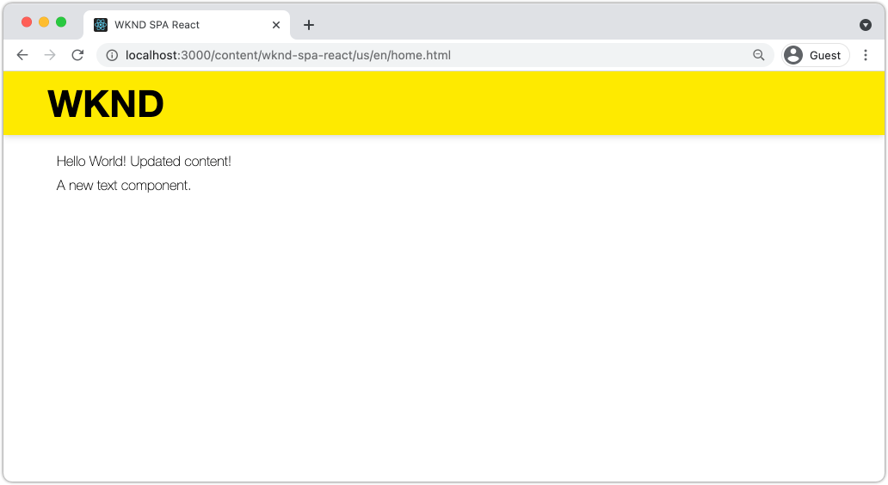

# 集成SPA {#developer-workflow}

了解如何将在React中编写的单页应用程序(SPA)的源代码与Adobe Experience Manager (AEM)项目集成。 了解如何使用现代前端工具（如webpack开发服务器）快速开发针对AEM JSON模型API的SPA。

## 目标

1. 了解SPA项目如何与AEM和客户端库集成。
2. 了解如何使用Webpack开发服务器进行专用前端开发。
3. 探索使用&#x200B;**proxy**&#x200B;和静态&#x200B;**mock**&#x200B;文件来针对AEM JSON模型API进行开发。

## 您将构建的内容

在本章中，您将对SPA进行几项细微更改，以了解它如何与AEM集成。
本章将向SPA添加一个简单的`Header`组件。 在构建此&#x200B;**静态** `Header`组件的过程中，使用了多种方法来开发AEM SPA。


*扩展SPA以添加静态`Header`组件*

## 先决条件

查看设置[本地开发环境](overview.md#local-dev-environment)所需的工具和说明。 本章是[创建项目](create-project.md)一章的延续，但是您需要遵循的是一个支持SPA的有效AEM项目。

## 集成方法 {#integration-approach}

在AEM项目中创建了两个模块： `ui.apps`和`ui.frontend`。

`ui.frontend`模块是包含所有SPA源代码的[webpack](https://webpack.js.org/)项目。 大多数SPA开发和测试都在Webpack项目中完成。 触发生产内部版本后，将使用webpack构建和编译SPA。 编译后的工件（CSS和Javascript）将复制到`ui.apps`模块，然后部署到AEM运行时。


*SPA集成的高级描述。*

有关前端内部版本的其他信息可在[此处](https://experienceleague.adobe.com/docs/experience-manager-core-components/using/developing/archetype/uifrontend-react.html)找到。

## 检查SPA集成 {#inspect-spa-integration}

接下来，检查`ui.frontend`模块以了解已由[AEM项目原型](https://experienceleague.adobe.com/docs/experience-manager-core-components/using/developing/archetype/uifrontend-react.html)自动生成的SPA。

1. 在您选择的IDE中，打开您的AEM项目。 本教程将使用[Visual Studio Code IDE](https://experienceleague.adobe.com/docs/experience-manager-learn/cloud-service/local-development-environment-set-up/development-tools.html#microsoft-visual-studio-code)。

   

1. 展开并检查`ui.frontend`文件夹。 打开文件`ui.frontend/package.json`

1. 在`dependencies`下，您应该会看到多个与`react`相关的项，包括`react-scripts`

   `ui.frontend`是基于[创建React应用程序](https://create-react-app.dev/)或CRA的React应用程序。 `react-scripts`版本指示使用的CRA版本。

1. 还有多个以`@adobe`为前缀的依赖项：

   ```json
   "@adobe/aem-react-editable-components": "~1.1.2",
   "@adobe/aem-spa-component-mapping": "~1.1.0",
   "@adobe/aem-spa-page-model-manager": "~1.3.3",
   "@adobe/aem-core-components-react-base": "1.1.8",
   "@adobe/aem-core-components-react-spa": "1.1.7",
   ```

   上述模块构成了[AEM SPA Editor JS SDK](https://experienceleague.adobe.com/docs/experience-manager-65/developing/headless/spas/spa-blueprint.html)，并提供了将SPA组件映射到AEM组件的功能。

   还包括[AEM WCM组件 — React Core实施](https://github.com/adobe/aem-react-core-wcm-components-base)和[AEM WCM组件 — Spa编辑器 — React Core实施](https://github.com/adobe/aem-react-core-wcm-components-spa)。 这些是一组可重复使用的UI组件，映射到开箱即用的AEM组件。 这些模板按原样设计和样式设计，以满足项目的需求。

1. 在`package.json`文件中，定义了多个`scripts`：

   ```json
   "scripts": {
       "start": "react-scripts start",
       "build": "react-scripts build && clientlib",
       "test": "react-scripts test",
       "eject": "react-scripts eject",
   }
   ```

   这些是创建React应用程序使[可用](https://create-react-app.dev/docs/available-scripts)的标准生成脚本。

   唯一的区别是将`&& clientlib`加到`build`脚本中。 此额外指令负责在生成期间将编译的SPA作为客户端库复制到`ui.apps`模块中。

   npm模块[aem-clientlib-generator](https://github.com/wcm-io-frontend/aem-clientlib-generator)用于实现此目的。

1. 检查文件`ui.frontend/clientlib.config.js`。 [aem-clientlib-generator](https://github.com/wcm-io-frontend/aem-clientlib-generator#clientlibconfigjs)使用此配置文件来确定如何生成客户端库。

1. 检查文件`ui.frontend/pom.xml`。 此文件将`ui.frontend`文件夹转换为[Maven模块](https://maven.apache.org/guides/mini/guide-multiple-modules.html)。 `pom.xml`文件已更新为在Maven生成期间使用[frontend-maven-plugin](https://github.com/eirslett/frontend-maven-plugin)到&#x200B;**test**&#x200B;和&#x200B;**build** SPA。

1. 在`ui.frontend/src/index.js`处检查文件`index.js`：

   ```js
   //ui.frontend/src/index.js
   ...
   document.addEventListener('DOMContentLoaded', () => {
       ModelManager.initialize().then(pageModel => {
           const history = createBrowserHistory();
           render(
           <Router history={history}>
               <App
               history={history}
               cqChildren={pageModel[Constants.CHILDREN_PROP]}
               cqItems={pageModel[Constants.ITEMS_PROP]}
               cqItemsOrder={pageModel[Constants.ITEMS_ORDER_PROP]}
               cqPath={pageModel[Constants.PATH_PROP]}
               locationPathname={window.location.pathname}
               />
           </Router>,
           document.getElementById('spa-root')
           );
       });
   });
   ```

   `index.js`是SPA的入口点。 `ModelManager`由AEM SPA编辑器JS SDK提供。 它负责调用`pageModel`（JSON内容）并将其插入到应用程序中。

1. 在`ui.frontend/src/components/import-components.js`处检查文件`import-components.js`。 此文件导入现成的&#x200B;**React核心组件**，并使它们可用于项目。 我们将在下一章中检查AEM内容到SPA组件的映射。

## 添加静态SPA组件 {#static-spa-component}

接下来，向SPA添加新组件，并将更改部署到本地AEM实例。 这是一个简单的更改，只是为了说明SPA如何更新。

1. 在`ui.frontend`模块的`ui.frontend/src/components`下创建名为`Header`的新文件夹。
1. 在`Header`文件夹下创建名为`Header.js`的文件。

   

1. 使用以下内容填充`Header.js`：

   ```js
   //Header.js
   import React, {Component} from 'react';
   
   export default class Header extends Component {
   
       render() {
           return (
                   <header className="Header">
                       <div className="Header-container">
                           <h1>WKND</h1>
                       </div>
                   </header>
           );
       }
   }
   ```

   以上是将输出静态文本字符串的标准React组件。

1. 打开文件`ui.frontend/src/App.js`。 这是应用程序的入口点。
1. 对`App.js`进行以下更新以包含静态`Header`：

   ```diff
     import { Page, withModel } from '@adobe/aem-react-editable-components';
     import React from 'react';
   + import Header from './components/Header/Header';
   
     // This component is the application entry point
     class App extends Page {
     render() {
         return (
         <div>
   +       <Header />
            {this.childComponents}
            {this.childPages}
        </div>
   ```

1. 打开新终端并导航到`ui.frontend`文件夹并运行`npm run build`命令：

   ```shell
   $ cd aem-guides-wknd-spa
   $ cd ui.frontend
   $ npm run build
   ...
   Compiled successfully.
   
   File sizes after gzip:
   
   118.95 KB (-33 B)  build/static/js/2.489f399a.chunk.js
   1.11 KB (+48 B)    build/static/js/main.6cfa5095.chunk.js
   806 B              build/static/js/runtime-main.42b998df.js
   451 B              build/static/css/main.e57bbe8a.chunk.css
   ```

1. 导航到`ui.apps`文件夹。 在`ui.apps/src/main/content/jcr_root/apps/wknd-spa-react/clientlibs/clientlib-react`下方，您应该会看到已从`ui.frontend/build`文件夹中复制了编译的SPA文件。

   

1. 返回终端并导航到`ui.apps`文件夹。 执行以下Maven命令：

   ```shell
   $ cd ../ui.apps
   $ mvn clean install -PautoInstallPackage
   ...
   [INFO] ------------------------------------------------------------------------
   [INFO] BUILD SUCCESS
   [INFO] ------------------------------------------------------------------------
   [INFO] Total time:  9.629 s
   [INFO] Finished at: 2020-05-04T17:48:07-07:00
   [INFO] ------------------------------------------------------------------------
   ```

   这会将`ui.apps`包部署到AEM的本地正在运行的实例。

1. 打开浏览器选项卡并导航到[http://localhost:4502/editor.html/content/wknd-spa-react/us/en/home.html](http://localhost:4502/editor.html/content/wknd-spa-react/us/en/home.html)。 您现在应会看到`Header`组件的内容显示在SPA中。

   

   从项目的根目录（即`mvn clean install -PautoInstallSinglePackage`）触发Maven生成时，将自动执行上述步骤。 您现在应该了解SPA和AEM客户端库之间集成的基础知识。 请注意，您仍然可以在AEM中的静态`Header`组件下编辑和添加`Text`组件。

## Webpack开发服务器 — JSON API代理 {#proxy-json}

如前面的练习所示，执行构建并将客户端库同步到AEM的本地实例需要几分钟时间。 这对于最终测试来说是可以接受的，但对于大多数SPA开发来说，这不理想。

可以使用[webpack-dev-server](https://webpack.js.org/configuration/dev-server/)快速开发SPA。 SPA由AEM生成的JSON模型驱动。 在本练习中，来自AEM正在运行的实例的JSON内容被&#x200B;**代理**&#x200B;到开发服务器。

1. 返回IDE并打开文件`ui.frontend/package.json`。

   查找类似于以下内容的行：

   ```json
   "proxy": "http://localhost:4502",
   ```

   [创建React应用程序](https://create-react-app.dev/docs/proxying-api-requests-in-development)提供了一种代理API请求的简单机制。 所有未知请求均通过本地AEM快速入门`localhost:4502`代理。

1. 打开终端窗口并导航到`ui.frontend`文件夹。 运行命令`npm start`：

   ```shell
   $ cd ui.frontend
   $ npm start
   ...
   Compiled successfully!
   
   You can now view wknd-spa-react in the browser.
   
   Local:            http://localhost:3000
   On Your Network:  http://192.168.86.136:3000
   
   Note that the development build is not optimized.
   To create a production build, use npm run build.
   ```

1. 打开新的浏览器选项卡（如果尚未打开）并导航到[http://localhost:3000/content/wknd-spa-react/us/en/home.html](http://localhost:3000/content/wknd-spa-react/us/en/home.html)。

   

   您应会看到与AEM相同的内容，但未启用任何创作功能。

   >[!NOTE]
   >
   > 由于AEM的安全要求，您将需要在同一浏览器中，但在其他选项卡中登录到本地AEM实例(http://localhost:4502)。

1. 返回到IDE并在`src/components/Header`文件夹中创建名为`Header.css`的文件。
1. 使用以下内容填充`Header.css`：

   ```css
   .Header {
       background-color: #FFEA00;
       width: 100%;
       position: fixed;
       top: 0;
       left: 0;
       z-index: 99;
       box-shadow: 0px 0px 10px 0px rgba(0, 0, 0, 0.24);
   }
   
   .Header-container {
       display: flex;
       max-width: 1024px;
       margin: 0 auto;
       padding: 12px;
   }
   
   .Header-container h1 {
       letter-spacing: 0;
       font-size: 48px;
   }
   ```

   

1. 重新打开`Header.js`并将以下行添加到引用`Header.css`：

   ```diff
     //Header.js
     import React, {Component} from 'react';
   + require('./Header.css');
   ```

   保存更改。

1. 导航到[http://localhost:3000/content/wknd-spa-react/us/en/home.html](http://localhost:3000/content/wknd-spa-react/us/en/home.html)以查看样式更改自动反映出来。

1. 在`ui.frontend/src/components/Page`处打开文件`Page.css`。 进行以下更改以修复内边距：

   ```css
   .page {
     max-width: 1024px;
     margin: 0 auto;
     padding: 12px;
     padding-top: 50px;
   }
   ```

1. 返回位于[http://localhost:3000/content/wknd-spa-react/us/en/home.html](http://localhost:3000/content/wknd-spa-react/us/en/home.html)的浏览器。 您应该会立即看到对应用程序所做的更改得到反映。

   

   您可以继续在AEM中进行内容更新，并在&#x200B;**webpack-dev-server**&#x200B;中反映这些更新，因为我们正在代理内容。

1. 停止终端中带有`ctrl+c`的webpack开发服务器。

## 将SPA更新部署到AEM

对`Header`所做的更改当前仅通过&#x200B;**webpack-dev-server**&#x200B;可见。 将更新后的SPA部署到AEM以查看更改内容。

1. 导航到项目的根目录(`aem-guides-wknd-spa`)，并使用Maven将该项目部署到AEM：

   ```shell
   $ cd ..
   $ mvn clean install -PautoInstallSinglePackage
   ```

2. 导航到[http://localhost:4502/editor.html/content/wknd-spa-react/us/en/home.html](http://localhost:4502/editor.html/content/wknd-spa-react/us/en/home.html)。 您应会看到已应用的`Header`更新样式和样式。

   

   现在，更新后的SPA位于AEM中，创作可以继续进行。

## 恭喜！ {#congratulations}

恭喜，您已更新SPA并探索了与AEM的集成！ 您现在知道如何使用&#x200B;**webpack-dev-server**&#x200B;针对AEM JSON模型API开发SPA。

### 后续步骤 {#next-steps}

[将SPA组件映射到AEM组件](map-components.md) — 了解如何使用AEM SPA编辑器JS SDK将React组件映射到Adobe Experience Manager (AEM)组件。 组件映射使用户能够在AEM SPA编辑器中对SPA组件进行动态更新，类似于传统的AEM创作。

## （奖励） Webpack开发服务器 — Mock JSON API {#mock-json}

快速开发的另一种方法是使用静态JSON文件充当JSON模型。 通过“嘲弄”JSON，我们删除了对本地AEM实例的依赖关系。 它还允许前端开发人员更新JSON模型，以测试功能并驱动对JSON API的更改，这些更改稍后将由后端开发人员实施。

模拟JSON的初始设置需要&#x200B;**本地AEM实例**。

1. 返回到IDE并导航到`ui.frontend/public`并添加名为`mock-content`的新文件夹。
1. 在`ui.frontend/public/mock-content`下创建名为`mock.model.json`的新文件。
1. 在浏览器中导航到[http://localhost:4502/content/wknd-spa-react/us/en.model.json](http://localhost:4502/content/wknd-spa-react/us/en.model.json)。

   这是由AEM导出的驱动应用程序的JSON。 复制JSON输出。

1. 将上一步的JSON输出粘贴到文件`mock.model.json`中。

   

1. 在`ui.frontend/public/index.html`处打开文件`index.html`。 更新AEM页面模型的元数据属性以指向变量`%REACT_APP_PAGE_MODEL_PATH%`：

   ```html
       <!-- AEM page model -->
       <meta
          property="cq:pagemodel_root_url"
          content="%REACT_APP_PAGE_MODEL_PATH%"
       />
   ```

   为`cq:pagemodel_root_url`的值使用变量将更便于在代理和模拟json模型之间进行切换。

1. 打开文件`ui.frontend/.env.development`并进行以下更新以注释掉`REACT_APP_PAGE_MODEL_PATH`和`REACT_APP_API_HOST`的上一个值：

   ```diff
   + PUBLIC_URL=/
   - PUBLIC_URL=/etc.clientlibs/wknd-spa-react/clientlibs/clientlib-react/resources
   
   - REACT_APP_PAGE_MODEL_PATH=/content/wknd-spa-react/us/en.model.json
   + REACT_APP_PAGE_MODEL_PATH=/mock-content/mock.model.json
   
   - REACT_APP_API_HOST=http://localhost:4502
   + #REACT_APP_API_HOST=http://localhost:4502
   
   REACT_APP_ROOT=/content/wknd-spa-react/us/en/home.html
   ```

1. 如果当前正在运行，请停止&#x200B;**webpack-dev-server**。 从终端启动&#x200B;**webpack-dev-server**：

   ```shell
   $ cd ui.frontend
   $ npm start
   ```

   导航到[http://localhost:3000/content/wknd-spa-react/us/en/home.html](http://localhost:3000/content/wknd-spa-react/us/en/home.html)，您应该会看到在&#x200B;**代理** json中使用了相同内容的SPA。

1. 对之前创建的`mock.model.json`文件进行小幅更改。 您应该会看到更新的内容立即反映在&#x200B;**webpack-dev-server**&#x200B;中。

   

能够处理JSON模型并查看对实时SPA的影响可以帮助开发人员了解JSON模型API。 它还允许前端和后端开发并行进行。

您现在可以通过切换`env.development`文件中的条目来切换使用JSON内容的位置：

```plain
# JSON API via proxy to AEM
#REACT_APP_PAGE_MODEL_PATH=/content/wknd-spa-react/us/en.model.json
#REACT_APP_API_HOST=http://localhost:4502

# JSON API via static mock file
REACT_APP_PAGE_MODEL_PATH=/mock-content/mock.model.json
```
