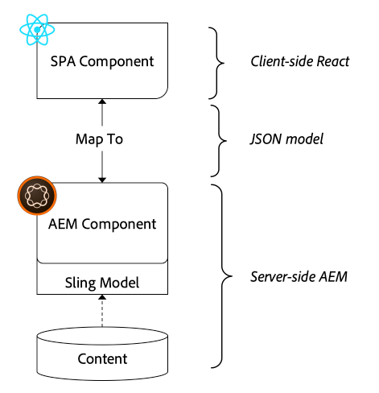

# 将SPA组件映射到AEM组件 {#map-components}

了解如何使用AEM SPA Editor JS SDK将React组件映射到Adobe Experience Manager(AEM)组件。 组件映射允许用户在AEM SPA编辑器中对SPA组件进行动态更新，这与传统的AEM创作类似。

本章更深入地介绍了AEM JSON模型API，以及如何将AEM组件公开的JSON内容自动作为prop注入到React组件中。

## 目标

1. 了解如何将AEM组件映射到SPA组件。
1. Inspect React组件如何使用从AEM传递的动态属性。
1. 了解如何开箱即用[React AEM Core Components](https://github.com/adobe/aem-react-core-wcm-components-examples)。

## 将构建的内容

本章将检查提供的`Text` SPA组件如何映射到AEM `Text`组件。 React核心组件(如`Image` SPA组件)将用在SPA中并在AEM中创作。 **布局容器**&#x200B;和&#x200B;**模板编辑器**&#x200B;策略的开箱即用功能还将用于创建外观稍有变化的视图。


## 前提条件

查看设置[本地开发环境](overview.md#local-dev-environment)所需的工具和说明。 本章是[集成SPA](integrate-spa.md)章节的继续，但是，随后您只需要启用SPA的AEM项目。

## 映射方法

基本概念是将SPA组件映射到AEM组件。 AEM组件、运行服务器端，将内容导出为JSON模型API的一部分。 SPA会使用JSON内容，并在浏览器中运行客户端。 将创建SPA组件与AEM组件之间的1:1映射。



*将AEM组件映射到React组件的概述*

## Inspect文本组件

[AEM项目原型](https://github.com/adobe/aem-project-archetype)提供了映射到AEM [文本组件](https://experienceleague.adobe.com/docs/experience-manager-core-components/using/components/text.html)的`Text`组件。 这是&#x200B;**content**&#x200B;组件的示例，其中组件从AEM中呈现&#x200B;*content*。

让我们看看组件的工作方式。

### Inspect JSON模型

1. 在跳转到SPA代码之前，请务必了解AEM提供的JSON模型。 导航到[核心组件库](https://www.aemcomponents.dev/content/core-components-examples/library/page-authoring/text.html)并查看文本组件的页面。 核心组件库提供了所有AEM核心组件的示例。
1. 选择&#x200B;**JSON**&#x200B;选项卡，以获取以下示例之一：

   

   您应会看到三个资产：`text`、`richText`和`:type`。

   `:type` 是一个保留属性，其中列 `sling:resourceType` 出了AEM组件的（或路径）。值`:type`用于将AEM组件映射到SPA组件。

   `text` 和是 `richText` 将公开给SPA组件的其他属性。

1. 在[http://localhost:4502/content/wknd-spa-react/us/en.model.json](http://localhost:4502/content/wknd-spa-react/us/en.model.json)查看JSON输出。 您应该能够找到类似于以下内容的条目：

   ```json
   "text": {
       "id": "text-a647cec03a",
       "text": "<p>Hello World! Updated content!</p>\r\n",
       "richText": true,
       ":type": "wknd-spa-react/components/text",
       "dataLayer": {}
      }
   ```

### Inspect文本SPA组件

1. 在选择的IDE中，打开SPA的AEM项目。 展开`ui.frontend`模块，并在`ui.frontend/src/components/Text/Text.js`下打开文件`Text.js`。

1. 我们将检查的第一个区域是位于~40行的`class Text`:

   ```js
   class Text extends Component {
   
       get richTextContent() {
           return (<div
                   id={extractModelId(this.props.cqPath)}
                   data-rte-editelement
                   dangerouslySetInnerHTML={{__html: DOMPurify.sanitize(this.props.text)}} />
                   );
       }
   
       get textContent() {
           return <div>{this.props.text}</div>;
       }
   
       render() {
           return this.props.richText ? this.richTextContent : this.textContent;
       }
   }
   ```

   `Text` 是标准React组件。组件使用`this.props.richText`确定要渲染的内容是富文本还是纯文本。 使用的实际“content”来自`this.props.text`。

   为避免潜在的XSS攻击，富文本在使用[alisalSetInnerHTML](https://reactjs.org/docs/dom-elements.html#dangerouslysetinnerhtml)渲染内容之前会通过`DOMPurify`进行转义。 在练习前面的JSON模型中，回顾`richText`和`text`属性。

1. 接下来，查看位于~29行的`TextEditConfig`:

   ```js
   const TextEditConfig = {
   emptyLabel: 'Text',
   
       isEmpty: function(props) {
           return !props || !props.text || props.text.trim().length < 1;
       }
   };
   ```

   上述代码负责确定何时在AEM创作环境中渲染占位符。 如果`isEmpty`方法返回&#x200B;**true**，则将呈现占位符。

1. 最后，查看~line 62处的`MapTo`调用：

   ```js
   export default MapTo('wknd-spa-react/components/text')(Text, TextEditConfig);
   ```

   `MapTo` 由AEM SPA Editor JS SDK(`@adobe/aem-react-editable-components`)提供。路径`wknd-spa-react/components/text`表示AEM组件的`sling:resourceType`。 此路径与之前观察到的JSON模型公开的`:type`相匹配。 `MapTo` 负责解析JSON模型响应并将正确的值传递 `props` 到SPA组件。

   您可以在`ui.apps/src/main/content/jcr_root/apps/wknd-spa-react/components/text`中找到AEM `Text`组件定义。

## 使用React核心组件

[AEM WCM组件 — React核心](https://github.com/adobe/aem-react-core-wcm-components-base) 实施和 [AEM WCM组件 — Spa编辑器 — React核心实施](https://github.com/adobe/aem-react-core-wcm-components-spa)。这些是一组可重用的UI组件，可映射到开箱即用的AEM组件。 大多数项目都可以重复使用这些组件作为自己实施的起点。

1. 在项目代码中，在`ui.frontend/src/components`处打开文件`import-components.js`。
此文件将导入映射到AEM组件的所有SPA组件。 鉴于SPA Editor实施的动态性质，我们必须明确引用任何与AEM可创作组件绑定的SPA组件。 这允许AEM作者选择在应用程序中的任意位置使用组件。
1. 以下import语句包括在项目中编写的SPA组件：

   ```js
   import './Page/Page';
   import './Text/Text';
   import './Container/Container';
   import './ExperienceFragment/ExperienceFragment';
   ```

1. `@adobe/aem-core-components-react-spa`和`@adobe/aem-core-components-react-base`中还有其他几个`imports`。 这些组件将导入React核心组件，并使其在当前项目中可用。 然后，这些组件会使用`MapTo`映射到特定于项目的AEM组件，就像前面的`Text`组件示例一样。

### 更新AEM策略

策略是AEM模板的一项功能，它允许开发人员和高级用户精确控制可使用的组件。 SPA代码中包含React核心组件，但需要通过策略来启用这些组件，才能在应用程序中使用它们。

1. 从“AEM开始”屏幕导航到&#x200B;**工具** > **模板** > **[WKND SPA React](http://localhost:4502/libs/wcm/core/content/sites/templates.html/conf/wknd-spa-react)**。

1. 选择并打开&#x200B;**SPA Page**&#x200B;模板进行编辑。

1. 选择&#x200B;**布局容器**&#x200B;并单击其&#x200B;**policy**&#x200B;图标以编辑策略：

   

1. 在&#x200B;**允许的组件** > **WKND SPA React - Content** > check **Image**、**Teaser**&#x200B;和&#x200B;**Title**&#x200B;下。

   

   在&#x200B;**默认组件** > **添加映射**&#x200B;下，选择&#x200B;**图像 — WKND SPA React — 内容**&#x200B;组件：

   

   输入&#x200B;**mime类型**，共`image/*`。

   单击&#x200B;**完成**&#x200B;以保存策略更新。

1. 在&#x200B;**布局容器**&#x200B;中，单击&#x200B;**Text**&#x200B;组件的&#x200B;**策略**&#x200B;图标。

   创建名为&#x200B;**WKND SPA Text**&#x200B;的新策略。 在&#x200B;**Plugins** > **Formatting** >下，选中所有框以启用其他格式选项：

   

   在&#x200B;**Plugins** > **段落样式** >下，选中复选框以&#x200B;**启用段落样式**:

   

   单击&#x200B;**完成**&#x200B;以保存策略更新。

### 创作内容

1. 导航到&#x200B;**Homepage** [http://localhost:4502/editor.html/content/wknd-spa-react/us/en/home.html](http://localhost:4502/editor.html/content/wknd-spa-react/us/en/home.html)。

1. 现在，您应该能够在页面上使用其他组件&#x200B;**Image**、**Teaser**&#x200B;和&#x200B;**Title**。

   

1. 您还应该能够编辑`Text`组件，并在&#x200B;**全屏**&#x200B;模式下添加其他段落样式。

   

1. 您还应该能够从&#x200B;**资产查找器**&#x200B;中拖放图像：

   

1. 使用&#x200B;**Title**&#x200B;和&#x200B;**Teaser**&#x200B;组件进行体验。

1. 通过[AEM Assets](http://localhost:4502/assets.html/content/dam)添加您自己的映像，或为标准[WKND引用站点](https://github.com/adobe/aem-guides-wknd/releases/latest)安装完成的代码库。 [WKND引用站点](https://github.com/adobe/aem-guides-wknd/releases/latest)包含许多可在WKND SPA上重新使用的图像。 可以使用[AEM Package Manager](http://localhost:4502/crx/packmgr/index.jsp)安装包。

   

## Inspect布局容器

AEM SPA Editor SDK会自动提供对&#x200B;**布局容器**&#x200B;的支持。 **布局容器**（如名称所示）是&#x200B;**容器**&#x200B;组件。 容器组件是接受表示&#x200B;*其他*&#x200B;组件并动态实例化它们的JSON结构的组件。

让我们进一步检查布局容器。

1. 在浏览器中，导航到[http://localhost:4502/content/wknd-spa-react/us/en.model.json](http://localhost:4502/content/wknd-spa-react/us/en.model.json)

   

   **布局容器**&#x200B;组件的`sling:resourceType`为`wcm/foundation/components/responsivegrid`，并且可由SPA编辑器使用`:type`属性进行识别，与`Text`和`Image`组件类似。

   SPA编辑器中提供了使用[布局模式](https://experienceleague.adobe.com/docs/experience-manager-65/authoring/siteandpage/responsive-layout.html#defining-layouts-layout-mode)重新调整组件大小的相同功能。

2. 返回到[http://localhost:4502/editor.html/content/wknd-spa-react/us/en/home.html](http://localhost:4502/editor.html/content/wknd-spa-react/us/en/home.html)。 添加其他&#x200B;**Image**&#x200B;组件，然后尝试使用&#x200B;**布局**&#x200B;选项重新调整组件大小：

   

3. 重新打开JSON模型[http://localhost:4502/content/wknd-spa-react/us/en.model.json](http://localhost:4502/content/wknd-spa-react/us/en.model.json)，并在JSON中观察`columnClassNames` :

   

   类名称`aem-GridColumn--default--4`表示组件应具有4列宽，基于12列网格。 有关[响应式网格的更多详细信息，请参阅此处](https://adobe-marketing-cloud.github.io/aem-responsivegrid/)。

4. 返回到IDE，在`ui.apps`模块中，有一个在`ui.apps/src/main/content/jcr_root/apps/wknd-spa-react/clientlibs/clientlib-grid`定义的客户端库。 打开文件`less/grid.less`。

   此文件确定&#x200B;**布局容器**&#x200B;使用的断点（`default`、`tablet`和`phone`）。 此文件将根据项目规范进行自定义。 当前，断点设置为`1200px`和`768px`。

5. 您应该能够使用`Text`组件的响应功能和更新的富文本策略来创作如下视图：

   

## 恭喜！ {#congratulations}

恭喜，您已学习如何将SPA组件映射到AEM组件，并且还使用了React核心组件。 您还有机会探索&#x200B;**布局容器**&#x200B;的响应功能。

### 后续步骤 {#next-steps}

[导航和路由](navigation-routing.md)  — 通过SPA Editor SDK将映射到AEM页面，了解如何支持SPA中的多个视图。动态导航是使用React Router和React Core Components实现的。

## （附加练习）保留用于源控制的配置 {#bonus-configs}

在很多情况下，特别是在AEM项目开始时，将配置（如模板和相关内容策略）保留到源控制中非常有价值。 这可确保所有开发人员针对同一组内容和配置开展工作，并可确保各环境之间具有额外的一致性。 一旦项目达到一定的成熟度，管理模板的做法就可以交给一组特定的高级用户。

接下来的几个步骤将使用Visual Studio代码IDE和[VSCode AEM同步](https://marketplace.visualstudio.com/items?itemName=yamato-ltd.vscode-aem-sync)执行，但可能会使用任何工具和任何已配置为&#x200B;**pull**&#x200B;或&#x200B;**从AEM的本地实例导入**&#x200B;内容的IDE来执行。

1. 在Visual Studio代码IDE中，确保已通过Marketplace扩展安装了&#x200B;**VSCode AEM Sync**:

   

2. 在项目资源管理器中展开&#x200B;**ui.content**&#x200B;模块，然后导航到`/conf/wknd-spa-react/settings/wcm/templates`。

3. **右键+单** 击文 `templates` 件夹，然后选 **择从AEM Server导入**:

   

4. 重复这些步骤以导入内容，但选择位于`/conf/wknd-spa-react/settings/wcm/templates/policies`的&#x200B;**policys**&#x200B;文件夹。

5. Inspect位于`ui.content/src/main/content/META-INF/vault/filter.xml`的`filter.xml`文件。

   ```xml
   <!--ui.content filter.xml-->
   <?xml version="1.0" encoding="UTF-8"?>
    <workspaceFilter version="1.0">
        <filter root="/conf/wknd-spa-react" mode="merge"/>
        <filter root="/content/wknd-spa-react" mode="merge"/>
        <filter root="/content/dam/wknd-spa-react" mode="merge"/>
        <filter root="/content/experience-fragments/wknd-spa-react" mode="merge"/>
    </workspaceFilter>
   ```

   `filter.xml`文件负责标识将随包一起安装的节点的路径。 请注意每个过滤器上的`mode="merge"`，指示不会修改现有内容，只会添加新内容。 由于内容作者可能正在更新这些路径，因此代码部署必须&#x200B;**不**&#x200B;覆盖内容。 有关使用过滤器元素的更多详细信息，请参阅[FileVault文档](https://jackrabbit.apache.org/filevault/filter.html)。

   比较`ui.content/src/main/content/META-INF/vault/filter.xml`和`ui.apps/src/main/content/META-INF/vault/filter.xml`以了解每个模块管理的不同节点。

## （附加练习）创建自定义图像组件 {#bonus-image}

SPA Core组件已提供React图像组件。 但是，如果您需要其他练习，请创建您自己的React实施，该实施将映射到AEM [图像组件](https://experienceleague.adobe.com/docs/experience-manager-core-components/using/components/image.html)。 `Image`组件是&#x200B;**content**&#x200B;组件的另一个示例。

### Inspect JSON

在跳转到SPA代码之前，请检查AEM提供的JSON模型。

1. 导航到核心组件库](https://www.aemcomponents.dev/content/core-components-examples/library/page-authoring/image.html)中的[图像示例。

   

   将使用`src`、`alt`和`title`的属性填充SPA `Image`组件。

   >[!NOTE]
   >
   > 还公开了其他图像属性(`lazyEnabled`、`widths`)，允许开发人员创建自适应和延迟加载组件。 本教程中构建的组件将会很简单，**不会**&#x200B;使用这些高级属性。

### 实施图像组件

1. 接下来，在`ui.frontend/src/components`下创建一个名为`Image`的新文件夹。
1. 在`Image`文件夹下，创建一个名为`Image.js`的新文件。

   

1. 将以下`import`语句添加到`Image.js`中：

   ```js
   import React, {Component} from 'react';
   import {MapTo} from '@adobe/aem-react-editable-components';
   ```

1. 然后添加`ImageEditConfig`以确定何时在AEM中显示占位符：

   ```js
   export const ImageEditConfig = {
   
       emptyLabel: 'Image',
   
       isEmpty: function(props) {
           return !props || !props.src || props.src.trim().length < 1;
       }
   };
   ```

   如果未设置`src`属性，则将显示占位符。

1. 接下来实现`Image`类：

   ```js
    export default class Image extends Component {
   
       get content() {
           return ;
       }
   
       render() {
           if(ImageEditConfig.isEmpty(this.props)) {
               return null;
           }
   
           return (
                   <div className="Image">
                       {this.content}
                   </div>
           );
       }
   }
   ```

   上述代码将根据JSON模型传入的prop `src`、`alt`和`title`来呈现``。

1. 添加`MapTo`代码以将React组件映射到AEM组件：

   ```js
   MapTo('wknd-spa-react/components/image')(Image, ImageEditConfig);
   ```

   请注意，字符串`wknd-spa-react/components/image`对应于AEM组件在`ui.apps`中的位置：`ui.apps/src/main/content/jcr_root/apps/wknd-spa-react/components/image`。

1. 在同一目录中创建名为`Image.css`的新文件，并添加以下内容：

   ```scss
   .Image-src {
       margin: 1rem 0;
       width: 100%;
       border: 0;
   }
   ```

1. 在`Image.js`中，在`import`语句下方的顶部添加对文件的引用：

   ```js
   import React, {Component} from 'react';
   import {MapTo} from '@adobe/aem-react-editable-components';
   
   require('./Image.css');
   ```

1. 打开文件`ui.frontend/src/components/import-components.js`并添加对新`Image`组件的引用：

   ```js
   import './Page/Page';
   import './Text/Text';
   import './Container/Container';
   import './ExperienceFragment/ExperienceFragment';
   import './Image/Image'; //add reference to Image component
   ```

1. 在`import-components.js`中注释掉React核心组件图像：

   ```js
   //MapTo('wknd-spa-react/components/image')(ImageV2, {isEmpty: ImageV2IsEmptyFn});
   ```

   这将确保改用我们的自定义图像组件。

1. 从项目的根目录使用Maven将SPA代码部署到AEM:

   ```shell
   $ cd aem-guides-wknd-spa.react
   $ mvn clean install -PautoInstallSinglePackage
   ```

1. Inspect AEM中的SPA。 页面上的任何图像组件都应继续工作。 Inspect渲染的输出，您应会看到自定义图像组件的标记，而不是React核心组件。

   *自定义图像组件标记*

   ```html
   <div class="Image">
       
   </div>
   ```

   *React核心组件图像标记*

   ```html
   <div class="cmp-image cq-dd-image">
       
   </div>
   ```

   这是有关扩展和实施您自己的组件的简要介绍。
