# 将SPA组件映射到AEM组件 {#map-components}

{{spa-editor-deprecation}}

了解如何使用AEM SPA编辑器JS SDK将React组件映射到Adobe Experience Manager (AEM)组件。 组件映射使用户能够在AEM SPA编辑器中对SPA组件进行动态更新，类似于传统的AEM创作。

本章更深入地介绍了AEM JSON模型API，以及如何将由AEM组件公开的JSON内容作为prop自动插入到React组件中。

## 目标

1. 了解如何将AEM组件映射到SPA组件。
1. 检查React组件如何使用从AEM传递的动态属性。
1. 了解如何使用现成的[React AEM核心组件](https://github.com/adobe/aem-react-core-wcm-components-examples)。

## 您将构建什么

本章检查提供的`Text` SPA组件如何映射到AEM `Text`组件。 在SPA中使用并在AEM中创作的React核心组件（如`Image` SPA组件）。 **布局容器**&#x200B;和&#x200B;**模板编辑器**&#x200B;策略的现成功能也用于创建外观变化稍大的视图。

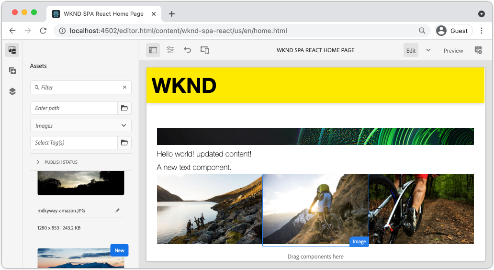

## 先决条件

查看设置[本地开发环境](overview.md#local-dev-environment)所需的工具和说明。 本章是[集成SPA](integrate-spa.md)章节的延续，但您需要遵循的是一个支持SPA的AEM项目。

## 映射方法

基本概念是将SPA组件映射到AEM组件。 AEM组件运行服务器端，将内容导出为JSON模型API的一部分。 SPA使用在浏览器中运行客户端的JSON内容。 创建了SPA组件与AEM组件之间的1:1映射。

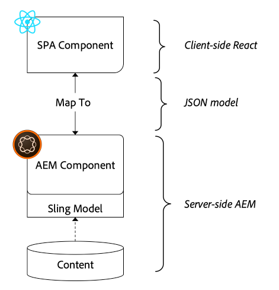

*将AEM组件映射到React组件的高级概述*

## 检查文本组件

[AEM项目原型](https://github.com/adobe/aem-project-archetype)提供了一个映射到AEM [文本组件](https://experienceleague.adobe.com/docs/experience-manager-core-components/using/components/text.html)的`Text`组件。 这是&#x200B;**content**&#x200B;组件的示例，该组件渲染来自AEM的&#x200B;*content*。

我们来看看组件的工作方式。

### 检查JSON模型

1. 在介绍SPA代码之前，请务必了解AEM提供的JSON模型。 导航到[核心组件库](https://www.aemcomponents.dev/content/core-components-examples/library/core-content/text.html)并查看文本组件的页面。 核心组件库提供了所有AEM核心组件的示例。
1. 为以下示例之一选择&#x200B;**JSON**&#x200B;选项卡：

   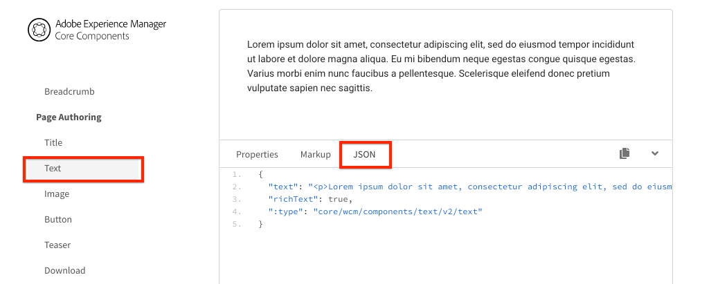

   您应该看到三个属性：`text`、`richText`和`:type`。

   `:type`是一个保留属性，它列出了AEM组件的`sling:resourceType`（或路径）。 `:type`的值用于将AEM组件映射到SPA组件。

   `text`和`richText`是对SPA组件公开的其他属性。

1. 在[http://localhost:4502/content/wknd-spa-react/us/en.model.json](http://localhost:4502/content/wknd-spa-react/us/en.model.json)处查看JSON输出。 您应该能够找到类似于以下内容的条目：

   ```json
   "text": {
       "id": "text-a647cec03a",
       "text": "<p>Hello World! Updated content!</p>\r\n",
       "richText": true,
       ":type": "wknd-spa-react/components/text",
       "dataLayer": {}
      }
   ```

### 检查文本SPA组件

1. 在您选择的IDE中，打开SPA的AEM项目。 展开`ui.frontend`模块并在`ui.frontend/src/components/Text/Text.js`下打开文件`Text.js`。

1. 我们将检查的第一个区域是位于~第40行的`class Text`：

   ```js
   class Text extends Component {
   
       get richTextContent() {
           return (<div
                   id={extractModelId(this.props.cqPath)}
                   data-rte-editelement
                   dangerouslySetInnerHTML={{__html: DOMPurify.sanitize(this.props.text)}} />
                   );
       }
   
       get textContent() {
           return <div>{this.props.text}</div>;
       }
   
       render() {
           return this.props.richText ? this.richTextContent : this.textContent;
       }
   }
   ```

   `Text`是标准React组件。 组件使用`this.props.richText`来确定要呈现的内容是富文本还是纯文本。 实际使用的“内容”来自`this.props.text`。

   为避免潜在的XSS攻击，富文本在使用[dangullySetInnerHTML](https://reactjs.org/docs/dom-elements.html#dangerouslysetinnerhtml)呈现内容之前通过`DOMPurify`进行转义。 在练习的前面从JSON模型中撤回`richText`和`text`属性。

1. 接下来，打开`ui.frontend/src/components/import-components.js`查看~第86行上的`TextEditConfig`：

   ```js
   const TextEditConfig = {
   emptyLabel: 'Text',
   
       isEmpty: function(props) {
           return !props || !props.text || props.text.trim().length < 1;
       }
   };
   ```

   上述代码负责确定何时在AEM创作环境中呈现占位符。 如果`isEmpty`方法返回&#x200B;**true**，则会呈现占位符。

1. 最后，查看第94行以下位置的`MapTo`调用：

   ```js
   export default MapTo('wknd-spa-react/components/text')(LazyTextComponent, TextEditConfig);
   ```

   `MapTo`由AEM SPA编辑器JS SDK (`@adobe/aem-react-editable-components`)提供。 路径`wknd-spa-react/components/text`表示AEM组件的`sling:resourceType`。 此路径与之前观察到的JSON模型公开的`:type`匹配。 `MapTo`负责解析JSON模型响应并将正确的值作为`props`传递到SPA组件。

   您可以在`ui.apps/src/main/content/jcr_root/apps/wknd-spa-react/components/text`找到AEM `Text`组件定义。

## 使用React核心组件

[AEM WCM组件 — React核心实施](https://github.com/adobe/aem-react-core-wcm-components-base)和[AEM WCM组件 — Spa编辑器 — React核心实施](https://github.com/adobe/aem-react-core-wcm-components-spa)。 这些是一组可重复使用的UI组件，映射到开箱即用的AEM组件。 大多数项目可以重复使用这些组件作为自己的实施的起点。

1. In the project code open the file `import-components.js` at `ui.frontend/src/components`.
This file imports all of the SPA components that map to AEM components. Given the dynamic nature of the SPA Editor implementation, we must explicitly reference any SPA components that are tied to AEM author-able components. This allows an AEM author to choose to use a component wherever they want in the application.
1. The following import statements include SPA components written in the project:

   ```js
   import './Page/Page';
   import './Text/Text';
   import './Container/Container';
   import './ExperienceFragment/ExperienceFragment';
   ```

1. There are several other `imports` from `@adobe/aem-core-components-react-spa` and `@adobe/aem-core-components-react-base`. These are importing the React Core components and making them available in the current project. These are then mapped to project specific AEM components using the `MapTo`, just like with the `Text` component example earlier.

### Update AEM Policies

Policies are a feature of AEM templates gives developers and power-users granular control over which components are available to be used. The React Core Components are included in the SPA Code but need to be enabled via a policy before they can be used in the application.

1. From the AEM Start screen navigate to **Tools** > **Templates** > **[WKND SPA React](http://localhost:4502/libs/wcm/core/content/sites/templates.html/conf/wknd-spa-react)**.

1. Select and open the **SPA Page** template for editing.

1. Select the **Layout Container** and click it&#39;s **policy** icon to edit the policy:

   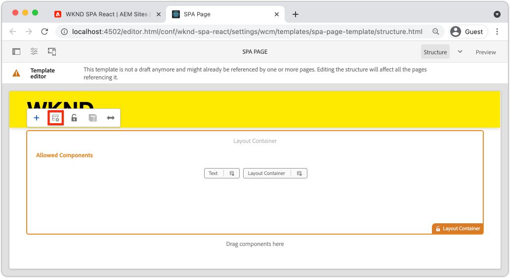

1. Under **Allowed Components** > **WKND SPA React - Content** > check **Image**, **Teaser**, and **Title**.

   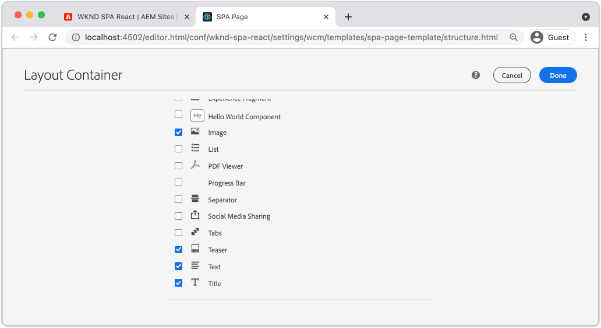

   Under **Default Components** > **Add mapping** and choose the **Image - WKND SPA React - Content** component:

   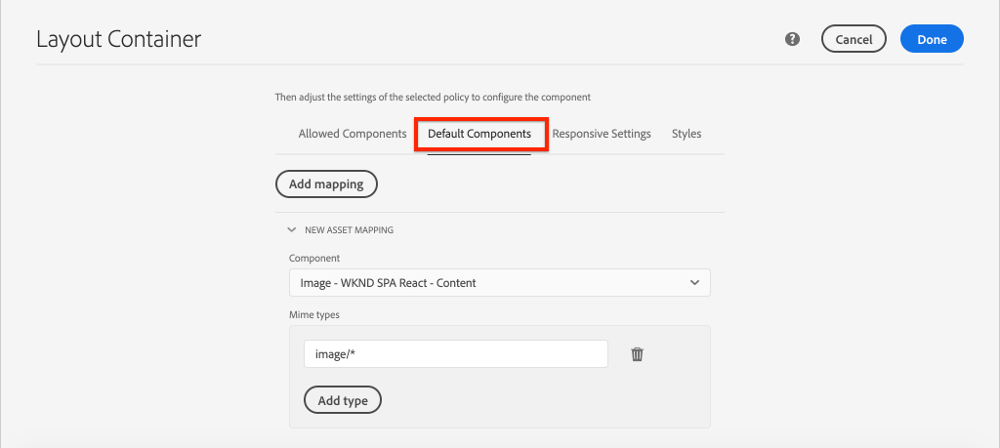

   Enter a **mime type** of `image/*`.

   Click **Done** to save the policy updates.

1. In the **Layout Container** click the **policy** icon for the **Text** component.

   Create a new policy named **WKND SPA Text**. Under **Plugins** > **Formatting** > check all the boxes to enable additional formatting options:

   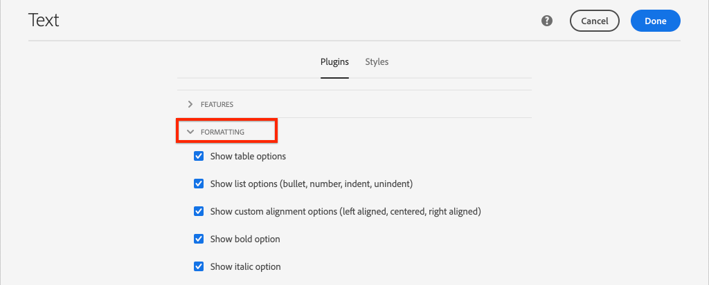

   在&#x200B;**插件** > **段落样式** >下，选中&#x200B;**启用段落样式**&#x200B;的框：

   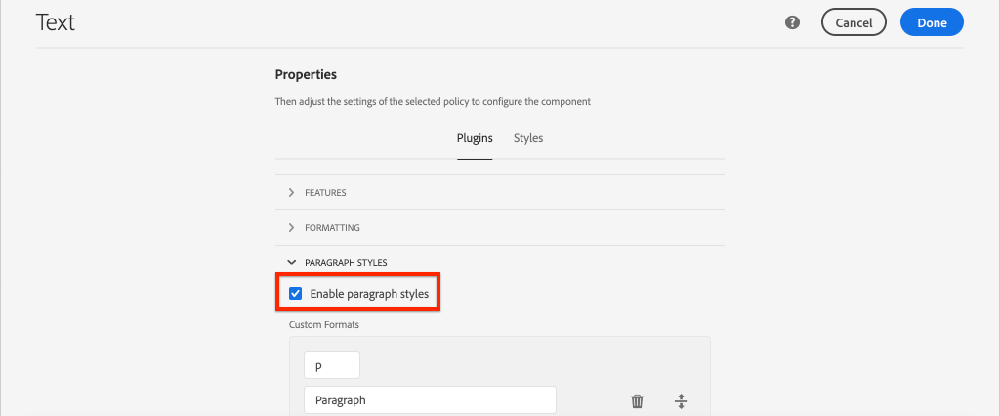

   单击&#x200B;**完成**&#x200B;以保存策略更新。

### 创作内容

1. 导航到&#x200B;**主页** [http://localhost:4502/editor.html/content/wknd-spa-react/us/en/home.html](http://localhost:4502/editor.html/content/wknd-spa-react/us/en/home.html)。

1. 您现在应该能够在页面上使用其他组件&#x200B;**Image**、**Teaser**&#x200B;和&#x200B;**Title**。

   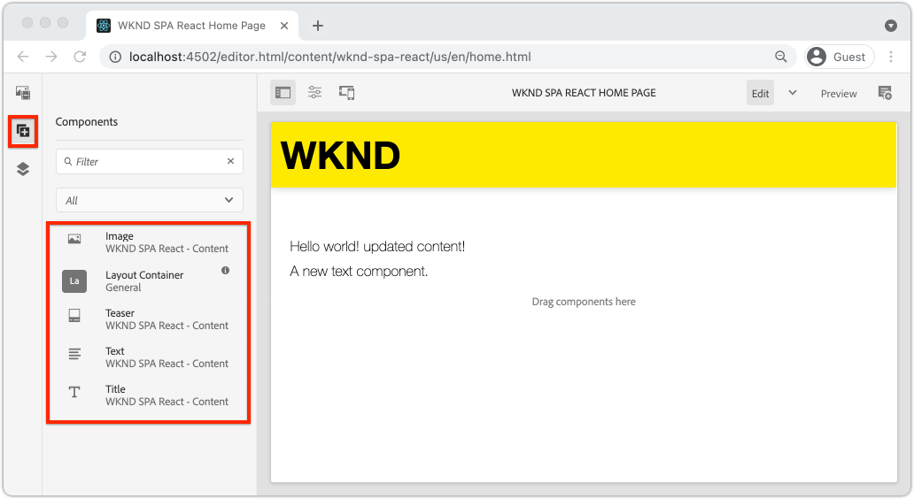

1. 您还应该能够编辑`Text`组件并在&#x200B;**全屏**&#x200B;模式下添加其他段落样式。

   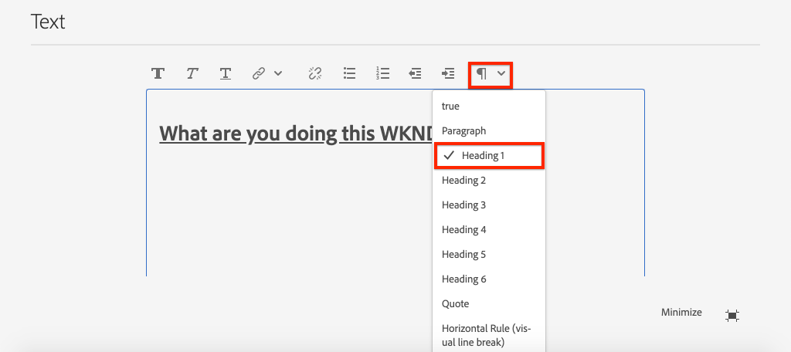

1. 您还应该能够从&#x200B;**资产查找器**&#x200B;中拖放图像：

   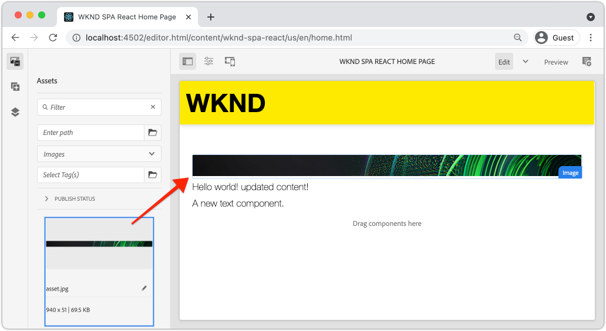

1. 使用&#x200B;**Title**&#x200B;和&#x200B;**Teaser**&#x200B;组件进行试验。

1. 通过[AEM Assets](http://localhost:4502/assets.html/content/dam)添加您自己的映像，或者为标准[WKND引用站点](https://github.com/adobe/aem-guides-wknd/releases/latest)安装完成的代码库。 [WKND引用站点](https://github.com/adobe/aem-guides-wknd/releases/latest)包含可在WKND SPA上重复使用的许多图像。 可以使用[AEM的包管理器](http://localhost:4502/crx/packmgr/index.jsp)安装该包。

   

## 检查布局容器

AEM SPA编辑器SDK自动提供对&#x200B;**布局容器**&#x200B;的支持。 名称指示的&#x200B;**布局容器**&#x200B;是&#x200B;**容器**&#x200B;组件。 容器组件是接受JSON结构的组件，该结构表示&#x200B;*其他*&#x200B;组件并动态实例化它们。

让我们进一步检查布局容器。

1. 在浏览器中导航到[http://localhost:4502/content/wknd-spa-react/us/en.model.json](http://localhost:4502/content/wknd-spa-react/us/en.model.json)

   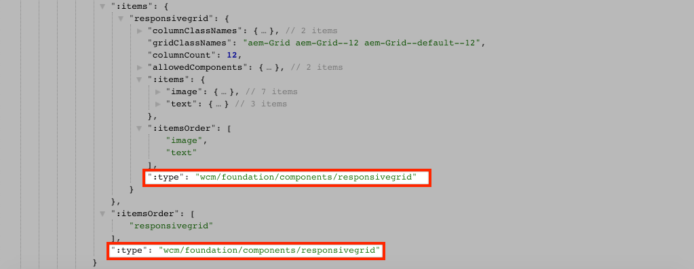

   **布局容器**&#x200B;组件具有`wcm/foundation/components/responsivegrid`的`sling:resourceType`，SPA编辑器使用`:type`属性识别它，就像`Text`和`Image`组件一样。

   在SPA编辑器中，可以使用[布局模式](https://experienceleague.adobe.com/docs/experience-manager-65/authoring/siteandpage/responsive-layout.html#defining-layouts-layout-mode)重新调整组件大小的相同功能。

2. Return to [http://localhost:4502/editor.html/content/wknd-spa-react/us/en/home.html](http://localhost:4502/editor.html/content/wknd-spa-react/us/en/home.html). Add additional **Image** components and try re-sizing them using the **Layout** option:

   

3. Re-open the JSON model [http://localhost:4502/content/wknd-spa-react/us/en.model.json](http://localhost:4502/content/wknd-spa-react/us/en.model.json) and observe the `columnClassNames` as part of the JSON:

   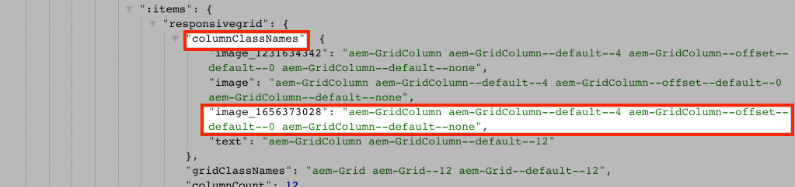

   The class name `aem-GridColumn--default--4` indicates the component should be 4 columns wide based on a 12 column grid. More details about the [responsive grid can be found here](https://adobe-marketing-cloud.github.io/aem-responsivegrid/).

4. Return to the IDE and in the `ui.apps` module there is a client-side library defined at `ui.apps/src/main/content/jcr_root/apps/wknd-spa-react/clientlibs/clientlib-grid`. 打开文件 `less/grid.less`。

   This file determines the breakpoints (`default`, `tablet`, and `phone`) used by the **Layout Container**. This file is intended to be customized per project specifications. Currently the breakpoints are set to `1200px` and `768px`.

5. You should be able to use the responsive capabilities and the updated rich text policies of the `Text` component to author a view like the following:

   

## 恭喜！ {#congratulations}

Congratulations, you learned how to map SPA components to AEM Components and you used the React Core Components. You also got a chance to explore the responsive capabilities of the **Layout Container**.

### 后续步骤 {#next-steps}

[Navigation and Routing](navigation-routing.md) - Learn how multiple views in the SPA can be supported by mapping to AEM Pages with the SPA Editor SDK. Dynamic navigation is implemented using React Router and React Core Components.

## (Bonus) Persist configurations to source control {#bonus-configs}

In many cases, especially at the beginning of an AEM project it is valuable to persist configurations, like templates and related content policies, to source control. 这可确保所有开发人员都针对同一组内容和配置工作，额外确保环境之间的一致性。 只要项目达到了一定的成熟度，管理模板的实践工作就可以移交给一个专门的高级用户组。

The next few steps will take place using the Visual Studio Code IDE and [VSCode AEM Sync](https://marketplace.visualstudio.com/items?itemName=yamato-ltd.vscode-aem-sync) but could be doing using any tool and any IDE that you have configured to **pull** or **import** content from a local instance of AEM.

1. In the Visual Studio Code IDE, ensure that you have **VSCode AEM Sync** installed via the Marketplace extension:

   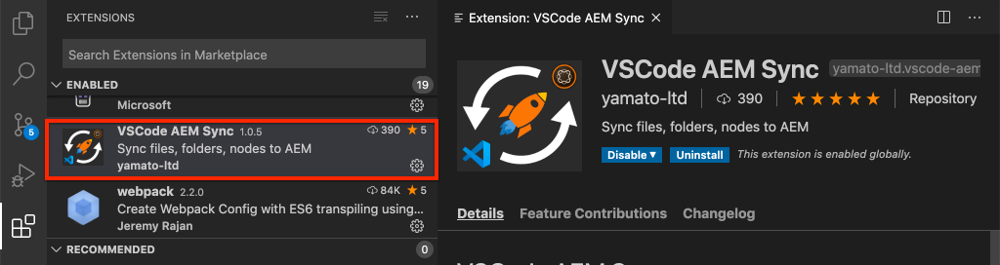

2. Expand the **ui.content** module in the Project explorer and navigate to `/conf/wknd-spa-react/settings/wcm/templates`.

3. **右键单击** `templates` 文件夹，然后选择&#x200B;**从 AEM 服务器导入**：

   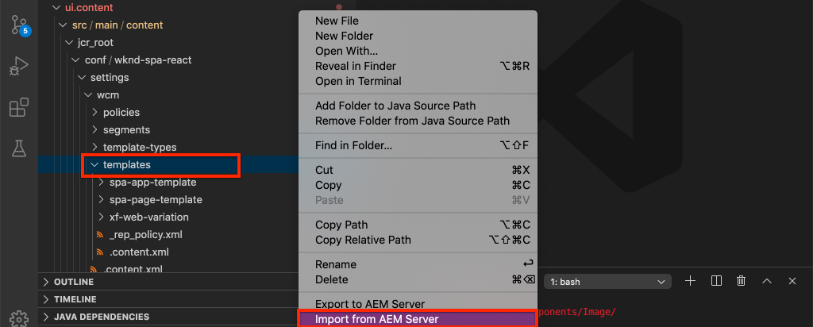

4. Repeat the steps to import content but select the **policies** folder located at `/conf/wknd-spa-react/settings/wcm/templates/policies`.

5. Inspect the `filter.xml` file located at `ui.content/src/main/content/META-INF/vault/filter.xml`.

   ```xml
   <!--ui.content filter.xml-->
   <?xml version="1.0" encoding="UTF-8"?>
    <workspaceFilter version="1.0">
        <filter root="/conf/wknd-spa-react" mode="merge"/>
        <filter root="/content/wknd-spa-react" mode="merge"/>
        <filter root="/content/dam/wknd-spa-react" mode="merge"/>
        <filter root="/content/experience-fragments/wknd-spa-react" mode="merge"/>
    </workspaceFilter>
   ```

   `filter.xml` 文件负责识别随包安装的节点的路径。 Notice the `mode="merge"` on each of the filters which indicates that existing content will not be modified, only new content is added. 由于内容作者可能会更新这些路径，因此代码部署&#x200B;**不会**&#x200B;覆盖内容，这一点很重要。 查看 [FileVault 文档](https://jackrabbit.apache.org/filevault/filter.html)，了解有关使用过滤器元素的更多详细信息。

   比较 `ui.content/src/main/content/META-INF/vault/filter.xml` 和 `ui.apps/src/main/content/META-INF/vault/filter.xml`，了解每个模块管理的不同节点。

## (Bonus) Create custom Image Component {#bonus-image}

A SPA Image component has already been provided by the React Core components. However, if you want extra practice, create your own React implementation that maps to the AEM [Image component](https://experienceleague.adobe.com/docs/experience-manager-core-components/using/components/image.html). The `Image` component is another example of a **content** component.

### Inspect the JSON

Before jumping into the SPA code, inspect the JSON model provided by AEM.

1. Navigate to the [Image examples in the Core Component library](https://www.aemcomponents.dev/content/core-components-examples/library/core-content/image.html).

   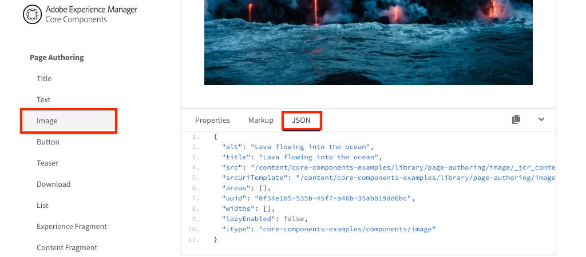

   Properties of `src`, `alt`, and `title` are used to populate the SPA `Image` component.

   >[!NOTE]
   >
   > There are other Image properties exposed (`lazyEnabled`, `widths`) that allow a developer to create an adaptive and lazy-loading component. The component built in this tutorial is simple and does **not** use these advanced properties.

### Implement the Image component

1. Next, create a new folder named `Image` under `ui.frontend/src/components`.
1. Beneath the `Image` folder create a new file named `Image.js`.

   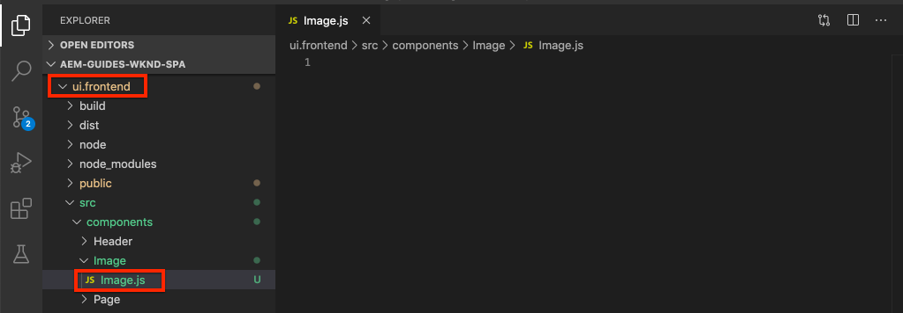

1. Add the following `import` statements to `Image.js`:

   ```js
   import React, {Component} from 'react';
   import {MapTo} from '@adobe/aem-react-editable-components';
   ```

1. Then add the `ImageEditConfig` to determine when to show the placeholder in AEM:

   ```js
   export const ImageEditConfig = {
   
       emptyLabel: 'Image',
   
       isEmpty: function(props) {
           return !props || !props.src || props.src.trim().length < 1;
       }
   };
   ```

   The placeholder will show if the `src` property is not set.

1. Next implement the `Image` class:

   ```js
    export default class Image extends Component {
   
       get content() {
           return ;
       }
   
       render() {
           if(ImageEditConfig.isEmpty(this.props)) {
               return null;
           }
   
           return (
                   <div className="Image">
                       {this.content}
                   </div>
           );
       }
   }
   ```

   The above code will render an `` based on the props `src`, `alt`, and `title` passed in by the JSON model.

1. Add the `MapTo` code to map the React component to the AEM component:

   ```js
   MapTo('wknd-spa-react/components/image')(Image, ImageEditConfig);
   ```

   Note the string `wknd-spa-react/components/image` corresponds to the location of the AEM component in `ui.apps` at: `ui.apps/src/main/content/jcr_root/apps/wknd-spa-react/components/image`.

1. Create a new file named `Image.css` in the same directory and add the following:

   ```scss
   .Image-src {
       margin: 1rem 0;
       width: 100%;
       border: 0;
   }
   ```

1. In `Image.js` add a reference to the file at the top beneath the `import` statements:

   ```js
   import React, {Component} from 'react';
   import {MapTo} from '@adobe/aem-react-editable-components';
   
   require('./Image.css');
   ```

1. 打开文件`ui.frontend/src/components/import-components.js`并添加对新`Image`组件的引用：

   ```js
   import './Page/Page';
   import './Text/Text';
   import './Container/Container';
   import './ExperienceFragment/ExperienceFragment';
   import './Image/Image'; //add reference to Image component
   ```

1. 在`import-components.js`中注释掉React核心组件图像：

   ```js
   //MapTo('wknd-spa-react/components/image')(ImageV2, {isEmpty: ImageV2IsEmptyFn});
   ```

   这将确保改用我们的自定义图像组件。

1. 使用Maven将SPA代码从项目的根部署到AEM：

   ```shell
   $ cd aem-guides-wknd-spa.react
   $ mvn clean install -PautoInstallSinglePackage
   ```

1. 在AEM中检查SPA。 页面上的任何图像组件都应继续工作。 检查渲染的输出，您应该会看到自定义图像组件的标记，而不是React核心组件。

   *自定义图像组件标记*

   ```html
   <div class="Image">
       
   </div>
   ```

   *React核心组件图像标记*

   ```html
   <div class="cmp-image cq-dd-image">
       
   </div>
   ```

   这是扩展和实施您自己的组件的良好介绍。
