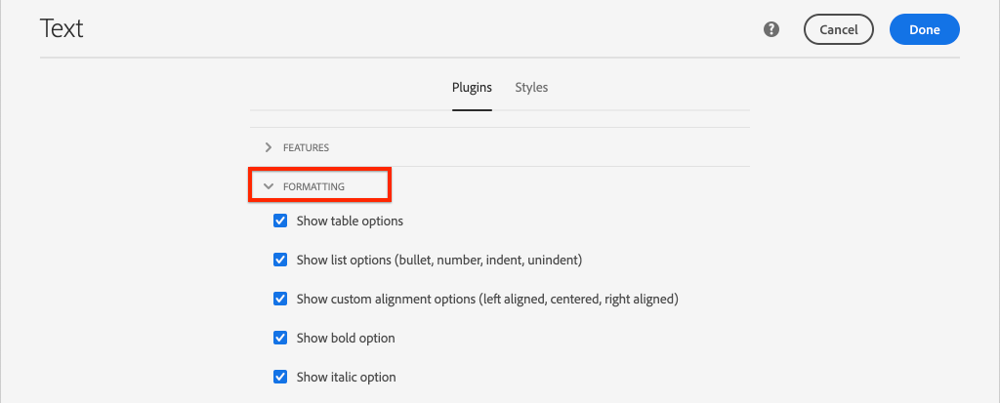

# 将SPA组件映射到AEM组件 {#map-components}

了解如何使用AEM SPA Editor JS SDK将React组件映射到Adobe Experience Manager(AEM)组件。 组件映射允许用户在AEM SPA编辑器中对SPA组件进行动态更新，这与传统的AEM创作类似。

本章更深入地介绍了AEM JSON模型API，以及如何将AEM组件公开的JSON内容自动作为prop注入到React组件中。

## 目标

1. 了解如何将AEM组件映射到SPA组件。
1. Inspect React组件如何使用从AEM传递的动态属性。
1. 了解如何开箱即用 [React AEM Core Components](https://github.com/adobe/aem-react-core-wcm-components-examples).

## 将构建的内容

本章将检查提供的 `Text` SPA组件已映射到AEM `Text`组件。 React核心组件，如 `Image` SPA组件将用在SPA中并在AEM中进行创作。 的开箱即用功能 **布局容器** 和 **模板编辑器** 还将使用策略来创建外观稍有不同的视图。


## 前提条件

查看设置 [本地开发环境](overview.md#local-dev-environment). 本章是 [集成SPA](integrate-spa.md) 章节，但是，为了顺应您的需要，您只需启用一个启用了SPA的AEM项目。

## 映射方法

基本概念是将SPA组件映射到AEM组件。 AEM组件、运行服务器端，将内容导出为JSON模型API的一部分。 SPA会使用JSON内容，并在浏览器中运行客户端。 将创建SPA组件与AEM组件之间的1:1映射。


*将AEM组件映射到React组件的概述*

## Inspect文本组件

的 [AEM项目原型](https://github.com/adobe/aem-project-archetype) 提供 `Text` 映射到AEM的组件 [文本组件](https://experienceleague.adobe.com/docs/experience-manager-core-components/using/components/text.html). 这是 **内容** 组件，在其中，它呈现 *内容* 从AEM。

让我们看看组件的工作方式。

### Inspect JSON模型

1. 在跳转到SPA代码之前，请务必了解AEM提供的JSON模型。 导航到 [核心组件库](https://www.aemcomponents.dev/content/core-components-examples/library/core-content/text.html) 并查看文本组件的页面。 核心组件库提供了所有AEM核心组件的示例。
1. 选择 **JSON** 选项卡，以查看以下示例：

   

   您应会看到三个资产： `text`, `richText`和 `:type`.

   `:type` 是一个保留属性，其中列出了 `sling:resourceType` （或路径）。 的值 `:type` 用于将AEM组件映射到SPA组件。

   `text` 和 `richText` 是将向SPA组件公开的其他属性。

1. 在以下位置查看JSON输出： [http://localhost:4502/content/wknd-spa-react/us/en.model.json](http://localhost:4502/content/wknd-spa-react/us/en.model.json). 您应该能够找到类似于以下内容的条目：

   ```json
   "text": {
       "id": "text-a647cec03a",
       "text": "<p>Hello World! Updated content!</p>\r\n",
       "richText": true,
       ":type": "wknd-spa-react/components/text",
       "dataLayer": {}
      }
   ```

### Inspect文本SPA组件

1. 在选择的IDE中，打开SPA的AEM项目。 展开 `ui.frontend` 模块并打开文件 `Text.js` 在 `ui.frontend/src/components/Text/Text.js`.

1. 我们首先要检查的是 `class Text` 在第40行：

   ```js
   class Text extends Component {
   
       get richTextContent() {
           return (<div
                   id={extractModelId(this.props.cqPath)}
                   data-rte-editelement
                   dangerouslySetInnerHTML={{__html: DOMPurify.sanitize(this.props.text)}} />
                   );
       }
   
       get textContent() {
           return <div>{this.props.text}</div>;
       }
   
       render() {
           return this.props.richText ? this.richTextContent : this.textContent;
       }
   }
   ```

   `Text` 是标准React组件。 组件使用 `this.props.richText` 以确定要呈现的内容是富文本还是纯文本。 使用的实际“内容”来自 `this.props.text`.

   为避免潜在的XSS攻击，富文本会通过进行转义 `DOMPurify` 使用之前 [危险的SetInnerHTML](https://reactjs.org/docs/dom-elements.html#dangerouslysetinnerhtml) 来渲染内容。 回顾 `richText` 和 `text` 属性。

1. 接下来，请查看 `TextEditConfig` 在第29行：

   ```js
   const TextEditConfig = {
   emptyLabel: 'Text',
   
       isEmpty: function(props) {
           return !props || !props.text || props.text.trim().length < 1;
       }
   };
   ```

   上述代码负责确定何时在AEM创作环境中渲染占位符。 如果 `isEmpty` 方法返回 **true** 然后，将呈现占位符。

1. 最后看看 `MapTo` 致电~62线：

   ```js
   export default MapTo('wknd-spa-react/components/text')(Text, TextEditConfig);
   ```

   `MapTo` 由AEM SPA Editor JS SDK提供(`@adobe/aem-react-editable-components`)。 路径 `wknd-spa-react/components/text` 表示 `sling:resourceType` 的AEM组件。 此路径与 `:type` 由之前观察到的JSON模型公开。 `MapTo` 负责解析JSON模型响应并将正确值作为 `props` 到SPA组件。

   您可以找到AEM `Text` 组件定义 `ui.apps/src/main/content/jcr_root/apps/wknd-spa-react/components/text`.

## 使用React核心组件

[AEM WCM组件 — React Core实施](https://github.com/adobe/aem-react-core-wcm-components-base) 和 [AEM WCM组件 — Spa编辑器 — React Core实施](https://github.com/adobe/aem-react-core-wcm-components-spa). 这些是一组可重用的UI组件，可映射到开箱即用的AEM组件。 大多数项目都可以重复使用这些组件作为自己实施的起点。

1. 在项目代码中，打开文件 `import-components.js` at `ui.frontend/src/components`.
此文件将导入映射到AEM组件的所有SPA组件。 鉴于SPA Editor实施的动态性质，我们必须明确引用任何与AEM可创作组件绑定的SPA组件。 这允许AEM作者选择在应用程序中的任意位置使用组件。
1. 以下import语句包括在项目中编写的SPA组件：

   ```js
   import './Page/Page';
   import './Text/Text';
   import './Container/Container';
   import './ExperienceFragment/ExperienceFragment';
   ```

1. 还有其他几个 `imports` 从 `@adobe/aem-core-components-react-spa` 和 `@adobe/aem-core-components-react-base`. 这些组件将导入React核心组件，并使其在当前项目中可用。 然后，这些组件会使用 `MapTo`，就象 `Text` 组件示例。

### 更新AEM策略

策略是AEM模板的一项功能，它允许开发人员和高级用户精确控制可使用的组件。 SPA代码中包含React核心组件，但需要通过策略来启用这些组件，才能在应用程序中使用它们。

1. 从AEM开始屏幕中，导航到 **工具** > **模板** > **[WKND SPA React](http://localhost:4502/libs/wcm/core/content/sites/templates.html/conf/wknd-spa-react)**.

1. 选择并打开 **SPA页面** 模板进行编辑。

1. 选择 **布局容器** 点击 **策略** 图标以编辑策略：

   

1. 在 **允许的组件** > **WKND SPA React — 内容** >检查 **图像**, **Teaser**&#x200B;和 **标题**.

   

   在 **默认组件** > **添加映射** 然后选择 **图像 — WKND SPA React — 内容** 组件：

   

   输入 **mime类型** of `image/*`.

   单击 **完成** 以保存策略更新。

1. 在 **布局容器** 单击 **策略** 图标 **文本** 组件。

   创建名为的新策略 **WKND SPA文本**. 在 **插件** > **格式** >选中所有框以启用其他格式选项：

   

   在 **插件** > **段落样式** >选中复选框 **启用段落样式**:

   

   单击 **完成** 以保存策略更新。

### 创作内容

1. 导航到 **主页** [http://localhost:4502/editor.html/content/wknd-spa-react/us/en/home.html](http://localhost:4502/editor.html/content/wknd-spa-react/us/en/home.html).

1. 现在，您应该能够使用其他组件 **图像**, **Teaser**&#x200B;和 **标题** 页面上。

   

1. 您还应该能够编辑 `Text` 组件和在 **全屏** 模式。

   

1. 您还应该能够从 **资产查找器**:

   

1. 体验 **标题** 和 **Teaser** 组件。

1. 通过 [AEM Assets](http://localhost:4502/assets.html/content/dam) 或为标准 [WKND参考站点](https://github.com/adobe/aem-guides-wknd/releases/latest). 的 [WKND参考站点](https://github.com/adobe/aem-guides-wknd/releases/latest) 包含许多可在WKND SPA中重复使用的图像。 可以使用 [AEM包管理器](http://localhost:4502/crx/packmgr/index.jsp).

   

## Inspect布局容器

支持 **布局容器** 由AEM SPA Editor SDK自动提供。 的 **布局容器**，如名称所示，为 **容器** 组件。 容器组件是接受JSON结构(表示 *其他* 组件，并动态实例化它们。

让我们进一步检查布局容器。

1. 在浏览器中，导航到 [http://localhost:4502/content/wknd-spa-react/us/en.model.json](http://localhost:4502/content/wknd-spa-react/us/en.model.json)

   

   的 **布局容器** 组件具有 `sling:resourceType` of `wcm/foundation/components/responsivegrid` 且由SPA编辑器使用 `:type` 资产，就像 `Text` 和 `Image` 组件。

   与使用 [布局模式](https://experienceleague.adobe.com/docs/experience-manager-65/authoring/siteandpage/responsive-layout.html#defining-layouts-layout-mode) 在SPA编辑器中可用。

2. 返回 [http://localhost:4502/editor.html/content/wknd-spa-react/us/en/home.html](http://localhost:4502/editor.html/content/wknd-spa-react/us/en/home.html). 添加其他 **图像** 并尝试使用 **布局** 选项：

   

3. 重新打开JSON模型 [http://localhost:4502/content/wknd-spa-react/us/en.model.json](http://localhost:4502/content/wknd-spa-react/us/en.model.json) 观察 `columnClassNames` 作为JSON的一部分：

   

   类名称 `aem-GridColumn--default--4` 指示组件应宽4列（基于12列网格）。 有关 [可在此处找到响应式网格](https://adobe-marketing-cloud.github.io/aem-responsivegrid/).

4. 返回到IDE和 `ui.apps` 模块中有一个在 `ui.apps/src/main/content/jcr_root/apps/wknd-spa-react/clientlibs/clientlib-grid`. 打开文件 `less/grid.less`.

   此文件确定断点(`default`, `tablet`和 `phone`) **布局容器**. 此文件将根据项目规范进行自定义。 当前断点设置为 `1200px` 和 `768px`.

5. 您应该能够使用 `Text` 组件来创作视图，如下所示：

   

## 恭喜！ {#congratulations}

恭喜，您已学习如何将SPA组件映射到AEM组件，并且还使用了React核心组件。 您还有机会探索 **布局容器**.

### 后续步骤 {#next-steps}

[导航和路由](navigation-routing.md)  — 了解如何通过SPA Editor SDK将SPA中的多个视图映射到AEM页面来支持这些视图。 动态导航是使用React Router和React Core Components实现的。

## （附加练习）保留用于源控制的配置 {#bonus-configs}

在很多情况下，特别是在AEM项目开始时，将配置（如模板和相关内容策略）保留到源控制中非常有价值。 这可确保所有开发人员针对同一组内容和配置开展工作，并可确保各环境之间具有额外的一致性。 一旦项目达到一定的成熟度，管理模板的做法就可以交给一组特定的高级用户。

接下来的几个步骤将使用Visual Studio代码IDE和 [VSCode AEM同步](https://marketplace.visualstudio.com/items?itemName=yamato-ltd.vscode-aem-sync) 但可以使用您配置的任何工具和IDE **提取** 或 **导入** 来自AEM本地实例的内容。

1. 在Visual Studio代码IDE中，确保 **VSCode AEM同步** 通过Marketplace扩展安装：

   

2. 展开 **ui.content** 模块，并导航到 `/conf/wknd-spa-react/settings/wcm/templates`.

3. **右键单击** the `templates` 文件夹，选择 **从AEM Server导入**:

   

4. 重复导入内容的步骤，但选择 **策略** 位于 `/conf/wknd-spa-react/settings/wcm/templates/policies`.

5. Inspect `filter.xml` 位于 `ui.content/src/main/content/META-INF/vault/filter.xml`.

   ```xml
   <!--ui.content filter.xml-->
   <?xml version="1.0" encoding="UTF-8"?>
    <workspaceFilter version="1.0">
        <filter root="/conf/wknd-spa-react" mode="merge"/>
        <filter root="/content/wknd-spa-react" mode="merge"/>
        <filter root="/content/dam/wknd-spa-react" mode="merge"/>
        <filter root="/content/experience-fragments/wknd-spa-react" mode="merge"/>
    </workspaceFilter>
   ```

   的 `filter.xml` 文件负责标识将随包一起安装的节点的路径。 请注意 `mode="merge"` 在指示不会修改现有内容的每个过滤器上，只会添加新内容。 由于内容作者可能正在更新这些路径，因此代码部署必须执行以下操作 **not** 覆盖内容。 请参阅 [FileVault文档](https://jackrabbit.apache.org/filevault/filter.html) 有关使用过滤器元素的更多详细信息。

   比较 `ui.content/src/main/content/META-INF/vault/filter.xml` 和 `ui.apps/src/main/content/META-INF/vault/filter.xml` 以了解每个模块管理的不同节点。

## （附加练习）创建自定义图像组件 {#bonus-image}

SPA Core组件已提供React图像组件。 但是，如果您需要其他实践，请创建您自己的可映射到AEM的React实施 [图像组件](https://experienceleague.adobe.com/docs/experience-manager-core-components/using/components/image.html). 的 `Image` 组件是 **内容** 组件。

### Inspect JSON

在跳转到SPA代码之前，请检查AEM提供的JSON模型。

1. 导航到 [核心组件库中的图像示例](https://www.aemcomponents.dev/content/core-components-examples/library/core-content/image.html).

   

   属性 `src`, `alt`和 `title` 将用于填充SPA `Image` 组件。

   >[!NOTE]
   >
   > 还显示了其他图像属性(`lazyEnabled`, `widths`)来创建自适应和延迟加载组件。 本教程中构建的组件将非常简单，并且将 **not** 使用这些高级属性。

### 实施图像组件

1. 接下来，创建一个名为 `Image` 在 `ui.frontend/src/components`.
1. 在 `Image` 文件夹创建名为 `Image.js`.

   

1. 添加以下内容 `import` 语句 `Image.js`:

   ```js
   import React, {Component} from 'react';
   import {MapTo} from '@adobe/aem-react-editable-components';
   ```

1. 然后，将 `ImageEditConfig` 要确定何时在AEM中显示占位符，请执行以下操作：

   ```js
   export const ImageEditConfig = {
   
       emptyLabel: 'Image',
   
       isEmpty: function(props) {
           return !props || !props.src || props.src.trim().length < 1;
       }
   };
   ```

   占位符将显示 `src` 属性未设置。

1. 下一步实施 `Image` 类：

   ```js
    export default class Image extends Component {
   
       get content() {
           return ;
       }
   
       render() {
           if(ImageEditConfig.isEmpty(this.props)) {
               return null;
           }
   
           return (
                   <div className="Image">
                       {this.content}
                   </div>
           );
       }
   }
   ```

   上述代码将呈现 `` 基于prop `src`, `alt`和 `title` 由JSON模型传入。

1. 添加 `MapTo` 将React组件映射到AEM组件的代码：

   ```js
   MapTo('wknd-spa-react/components/image')(Image, ImageEditConfig);
   ```

   记下字符串 `wknd-spa-react/components/image` 对应于AEM组件在 `ui.apps` at: `ui.apps/src/main/content/jcr_root/apps/wknd-spa-react/components/image`.

1. 创建名为的新文件 `Image.css` 并添加以下内容：

   ```scss
   .Image-src {
       margin: 1rem 0;
       width: 100%;
       border: 0;
   }
   ```

1. 在 `Image.js` 在 `import` 语句：

   ```js
   import React, {Component} from 'react';
   import {MapTo} from '@adobe/aem-react-editable-components';
   
   require('./Image.css');
   ```

1. 打开文件 `ui.frontend/src/components/import-components.js` 并添加对新 `Image` 组件：

   ```js
   import './Page/Page';
   import './Text/Text';
   import './Container/Container';
   import './ExperienceFragment/ExperienceFragment';
   import './Image/Image'; //add reference to Image component
   ```

1. 在 `import-components.js` 注释掉React核心组件图像：

   ```js
   //MapTo('wknd-spa-react/components/image')(ImageV2, {isEmpty: ImageV2IsEmptyFn});
   ```

   这将确保改用我们的自定义图像组件。

1. 从项目的根目录使用Maven将SPA代码部署到AEM:

   ```shell
   $ cd aem-guides-wknd-spa.react
   $ mvn clean install -PautoInstallSinglePackage
   ```

1. Inspect AEM中的SPA。 页面上的任何图像组件都应继续工作。 Inspect渲染的输出，您应会看到自定义图像组件的标记，而不是React核心组件。

   *自定义图像组件标记*

   ```html
   <div class="Image">
       
   </div>
   ```

   *React核心组件图像标记*

   ```html
   <div class="cmp-image cq-dd-image">
       
   </div>
   ```

   这是有关扩展和实施您自己的组件的简要介绍。
