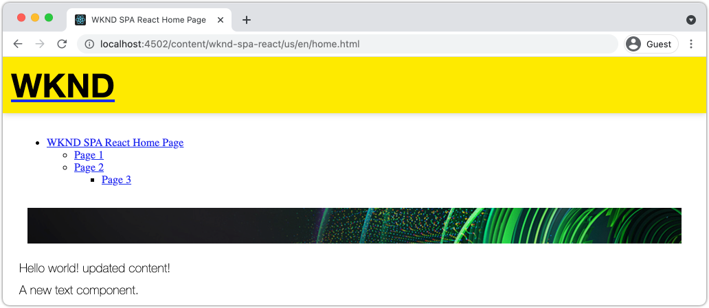
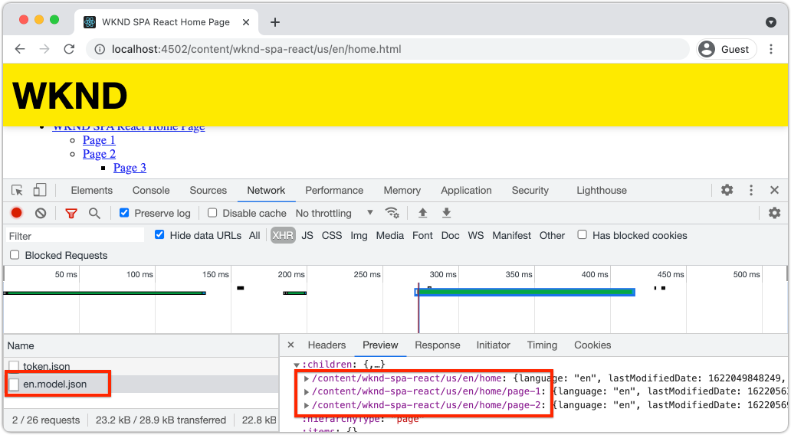
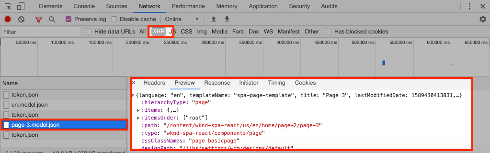

# 添加导航和路由 {#navigation-routing}

了解如何使用SPA编辑器SDK将映射到AEM页面，从而支持SPA中的多个视图。 动态导航是使用React Router和React Core Components实现的。

## 目标

1. 了解使用SPA编辑器时可用的SPA模型路由选项。
1. 了解如何使用[React Router](https://reacttraining.com/react-router)在SPA的不同视图之间导航。
1. 使用AEM React核心组件实施由AEM页面层次结构驱动的动态导航。

## 您将构建的内容

本章将导航添加到AEM中的SPA。 导航菜单由AEM页面层次结构驱动，将使用[导航核心组件](https://experienceleague.adobe.com/docs/experience-manager-core-components/using/wcm-components/navigation.html)提供的JSON模型。

已添加

## 先决条件

查看设置[本地开发环境](overview.md#local-dev-environment)所需的工具和说明。 本章是[映射组件](map-components.md)章节的延续，但是要遵循这一章，您需要将一个启用了SPA的AEM项目部署到本地AEM实例。

## 将导航添加到模板 {#add-navigation-template}

1. 打开浏览器并登录到AEM，[http://localhost:4502/](http://localhost:4502/)。 应该已经部署了起始代码库。
1. 导航到&#x200B;**SPA页面模板**： [http://localhost:4502/editor.html/conf/wknd-spa-react/settings/wcm/templates/spa-page-template/structure.html](http://localhost:4502/editor.html/conf/wknd-spa-react/settings/wcm/templates/spa-page-template/structure.html)。
1. 选择最外层的&#x200B;**根布局容器**&#x200B;并单击其&#x200B;**策略**&#x200B;图标。 请注意，**not**&#x200B;选择已解锁的&#x200B;**布局容器**&#x200B;进行创作。

   

1. 创建名为&#x200B;**SPA结构**&#x200B;的新策略：

   

   在&#x200B;**允许的组件** > **常规** >下，选择&#x200B;**布局容器**&#x200B;组件。

   在&#x200B;**允许的组件** > **WKND SPA REACT — 结构** >选择&#x200B;**导航**&#x200B;组件下：

   

   在&#x200B;**允许的组件** > **WKND SPA REACT - Content** >下，选择&#x200B;**Image**&#x200B;和&#x200B;**Text**&#x200B;组件。 您总共应选择4个组件。

   单击&#x200B;**完成**&#x200B;以保存更改。

1. 刷新页面，并在解锁的&#x200B;**布局容器**&#x200B;上方添加&#x200B;**导航**&#x200B;组件：

   

1. 选择&#x200B;**导航**&#x200B;组件并单击其&#x200B;**策略**&#x200B;图标以编辑策略。
1. 使用&#x200B;**SPA导航**&#x200B;的&#x200B;**策略标题**&#x200B;创建新策略。

   在&#x200B;**属性**&#x200B;下：

   * 将&#x200B;**导航根**&#x200B;设置为`/content/wknd-spa-react/us/en`。
   * 将&#x200B;**排除根级别**&#x200B;设置为&#x200B;**1**。
   * 取消选中&#x200B;**收集所有子页面**。
   * 将&#x200B;**导航结构深度**&#x200B;设置为&#x200B;**3**。

   

   这将收集`/content/wknd-spa-react/us/en`下方的导航2级。

1. 保存更改后，您应该会看到模板中已填充的`Navigation`：

   

## 创建子页面

接下来，在AEM中创建其他页面，这些页面将用作SPA中的不同视图。 我们还将检查AEM提供的JSON模型的层次结构。

1. 导航到&#x200B;**站点**&#x200B;控制台： [http://localhost:4502/sites.html/content/wknd-spa-react/us/en/home](http://localhost:4502/sites.html/content/wknd-spa-react/us/en/home)。 选择&#x200B;**WKND SPA React主页**&#x200B;并单击&#x200B;**创建** > **页面**：

   

1. 在&#x200B;**模板**&#x200B;下，选择&#x200B;**SPA页面**。 在&#x200B;**属性**&#x200B;下，输入&#x200B;**标题**&#x200B;的&#x200B;**页面1**&#x200B;和名称&#x200B;**页面1**。

   

   单击&#x200B;**创建**，在对话框弹出窗口中单击&#x200B;**打开**&#x200B;以在AEM SPA编辑器中打开该页面。

1. 将新的&#x200B;**Text**&#x200B;组件添加到主&#x200B;**布局容器**。 编辑组件并输入文本： **第1**&#x200B;页（使用RTE和&#x200B;**H2**&#x200B;元素）。

   

   您可以随意添加其他内容，如图像。

1. 返回到AEM Sites控制台并重复上述步骤，创建名为&#x200B;**Page 2**&#x200B;的第二个页面作为&#x200B;**Page 1**&#x200B;的同级。
1. 最后，创建第三页&#x200B;**第3**，但作为&#x200B;**第2**&#x200B;页的&#x200B;**子**。 完成之后，站点层级应如下所示：

   

1. 导航组件现在可用于导航到SPA的不同区域。

   

1. 打开AEM编辑器外部的页面： [http://localhost:4502/content/wknd-spa-react/us/en/home.html](http://localhost:4502/content/wknd-spa-react/us/en/home.html)。 使用&#x200B;**导航**&#x200B;组件导航到应用程序的不同视图。

1. 在导航时，使用浏览器的开发人员工具检查网络请求。 以下屏幕截图是从Google Chrome浏览器中捕获的。

   

   请注意，在初始页面加载后，后续导航不会导致完全页面刷新，并且在返回到先前访问的页面时，网络通信量会降至最低。

## 层次结构页面JSON模型 {#hierarchy-page-json-model}

接下来，检查驱动SPA多视图体验的JSON模型。

1. 在新选项卡中，打开AEM提供的JSON模型API： [http://localhost:4502/content/wknd-spa-react/us/en.model.json](http://localhost:4502/content/wknd-spa-react/us/en.model.json)。 使用浏览器扩展来[格式化JSON](https://chrome.google.com/webstore/detail/json-formatter/bcjindcccaagfpapjjmafapmmgkkhgoa)可能很有帮助。

   首次加载SPA时会请求此JSON内容。 外部结构如下所示：

   ```json
   {
   "language": "en",
   "title": "en",
   "templateName": "spa-app-template",
   "designPath": "/libs/settings/wcm/designs/default",
   "cssClassNames": "spa page basicpage",
   ":type": "wknd-spa-react/components/spa",
   ":items": {},
   ":itemsOrder": [],
   ":hierarchyType": "page",
   ":path": "/content/wknd-spa-react/us/en",
   ":children": {
      "/content/wknd-spa-react/us/en/home": {},
      "/content/wknd-spa-react/us/en/home/page-1": {},
      "/content/wknd-spa-react/us/en/home/page-2": {},
      "/content/wknd-spa-react/us/en/home/page-2/page-3": {}
      }
   }
   ```

   在`:children`下，您应该会看到所创建每个页面的条目。 所有页面的内容都包含在此初始JSON请求中。 通过导航路由，SPA的后续视图会快速加载，因为内容在客户端已经可用。

   在初始JSON请求中加载SPA的&#x200B;**ALL**&#x200B;内容是不明智的，因为这会降低初始页面加载的速度。 接下来，让我们看一下如何收集页面的层次结构深度。

1. 导航到&#x200B;**SPA Root**&#x200B;模板，网址为： [http://localhost:4502/editor.html/conf/wknd-spa-react/settings/wcm/templates/spa-app-template/structure.html](http://localhost:4502/editor.html/conf/wknd-spa-react/settings/wcm/templates/spa-app-template/structure.html)。

   单击&#x200B;**页面属性菜单** > **页面策略**：

   

1. **SPA根**&#x200B;模板具有额外的&#x200B;**层次结构**&#x200B;选项卡，用于控制收集的JSON内容。 **结构深度**&#x200B;确定网站层次结构中收集&#x200B;**根**&#x200B;下子页面的深度。 您还可以使用&#x200B;**结构模式**&#x200B;字段根据正则表达式筛选出其他页面。

   将&#x200B;**结构深度**&#x200B;更新为&#x200B;**2**：

   

   单击&#x200B;**完成**&#x200B;以保存对策略所做的更改。

1. 重新打开JSON模型[http://localhost:4502/content/wknd-spa-react/us/en.model.json](http://localhost:4502/content/wknd-spa-react/us/en.model.json)。

   ```json
   {
   "language": "en",
   "title": "en",
   "templateName": "spa-app-template",
   "designPath": "/libs/settings/wcm/designs/default",
   "cssClassNames": "spa page basicpage",
   ":type": "wknd-spa-react/components/spa",
   ":items": {},
   ":itemsOrder": [],
   ":hierarchyType": "page",
   ":path": "/content/wknd-spa-react/us/en",
   ":children": {
      "/content/wknd-spa-react/us/en/home": {},
      "/content/wknd-spa-react/us/en/home/page-1": {},
      "/content/wknd-spa-react/us/en/home/page-2": {}
      }
   }
   ```

   请注意，**页面3**&#x200B;路径已从初始JSON模型中移除： `/content/wknd-spa-react/us/en/home/page-2/page-3`。 这是因为&#x200B;**页面3**&#x200B;在层次结构中处于级别3，我们更新了策略以仅包含最大深度为级别2的内容。

1. 重新打开SPA主页： [http://localhost:4502/content/wknd-spa-react/us/en/home.html](http://localhost:4502/content/wknd-spa-react/us/en/home.html)，然后打开浏览器的开发人员工具。

   刷新页面，您应该会看到对`/content/wknd-spa-react/us/en.model.json`(即SPA根)的XHR请求。 请注意，根据教程前面部分对SPA根模板的层级深度配置，只包含三个子页面。 这不包括&#x200B;**第3**&#x200B;页。

   

1. 在开发人员工具打开的情况下，使用`Navigation`组件直接导航到&#x200B;**第3**&#x200B;页：

   请注意，已向`/content/wknd-spa-react/us/en/home/page-2/page-3.model.json`发出新的XHR请求

   

   AEM模型管理器了解&#x200B;**Page 3** JSON内容不可用，因此会自动触发额外的XHR请求。

1. 通过直接导航到[http://localhost:4502/content/wknd-spa-react/us/en/home/page-2.html](http://localhost:4502/content/wknd-spa-react/us/en/home/page-2.html)尝试使用深层链接。 另请注意，浏览器的“后退”按钮将继续工作。

## Inspect React路由  {#react-routing}

使用[React Router](https://reactrouter.com/en/main)实现导航和路由。 React Router是用于React应用程序的导航组件集合。 [AEM React核心组件](https://github.com/adobe/aem-react-core-wcm-components-base)使用React Router的功能来实现前面步骤中使用的&#x200B;**导航**&#x200B;组件。

接下来，检查React Router如何与SPA集成，并使用React Router的[Link](https://reactrouter.com/en/main/components/link)组件进行测试。

1. 在IDE的`ui.frontend/src/index.js`处打开文件`index.js`。

   ```js
   /* index.js */
   import { Router } from 'react-router-dom';
   ...
   ...
    ModelManager.initialize().then(pageModel => {
       const history = createBrowserHistory();
       render(
       <Router history={history}>
           <App
           history={history}
           cqChildren={pageModel[Constants.CHILDREN_PROP]}
           cqItems={pageModel[Constants.ITEMS_PROP]}
           cqItemsOrder={pageModel[Constants.ITEMS_ORDER_PROP]}
           cqPath={pageModel[Constants.PATH_PROP]}
           locationPathname={window.location.pathname}
           />
       </Router>,
       document.getElementById('spa-root')
       );
   });
   ```

   请注意，`App`已包装在[React Router](https://reacttraining.com/react-router)的`Router`组件中。 由AEM SPA编辑器JS SDK提供的`ModelManager`根据JSON模型API向AEM页面添加动态路由。

1. 在`ui.frontend/src/components/Page/Page.js`处打开文件`Page.js`

   ```js
   class AppPage extends Page {
     get containerProps() {
       let attrs = super.containerProps;
       attrs.className =
         (attrs.className || '') + ' page ' + (this.props.cssClassNames || '');
       return attrs;
     }
   }
   
   export default MapTo('wknd-spa-react/components/page')(
     withComponentMappingContext(withRoute(AppPage))
   );
   ```

   `Page` SPA组件使用`MapTo`函数将AEM中的&#x200B;**Pages**&#x200B;映射到相应的SPA组件。 `withRoute`实用工具有助于根据`cqPath`属性将SPA动态路由到适当的AEM子页面。

1. 在`ui.frontend/src/components/Header/Header.js`处打开`Header.js`组件。
1. 更新`Header`以将`<h1>`标记包装在指向主页的[链接](https://reactrouter.com/en/main/components/link)中：

   ```diff
     //Header.js
     import React, {Component} from 'react';
   + import {Link} from 'react-router-dom';
     require('./Header.css');
   
   export default class Header extends Component {
   
       render() {
           return (
               <header className="Header">
               <div className="Header-container">
   +              <Link to="/content/wknd-spa-react/us/en/home.html">
                       <h1>WKND</h1>
   +              </Link>
               </div>
               </header>
           );
       }
   ```

   我们使用React路由器提供的`<Link>`，而不是使用默认的`<a>`锚点标记。 只要`to=`指向有效的路由，SPA就会切换到该路由，**不会**&#x200B;执行全页刷新。 在这里，我们只是硬编码指向主页的链接以说明如何使用`Link`。

1. 在`App.test.js`的`ui.frontend/src/App.test.js`处更新测试。

   ```diff
   + import { BrowserRouter as Router } from 'react-router-dom';
     import App from './App';
   
     it('renders without crashing', () => {
       const div = document.createElement('div');
   -   ReactDOM.render(<App />, div);
   +   ReactDOM.render(<Router><App /></Router>, div);
     });
   ```

   由于我们在`App.js`中引用的静态组件中使用React Router的功能，因此我们需要更新单元测试以考虑它。

1. 打开终端，导航到项目的根，然后使用您的Maven技能将该项目部署到AEM：

   ```shell
   $ cd aem-guides-wknd-spa.react
   $ mvn clean install -PautoInstallSinglePackage
   ```

1. 导航到AEM中SPA的以下页面之一： [http://localhost:4502/content/wknd-spa-react/us/en/home/page-1.html](http://localhost:4502/content/wknd-spa-react/us/en/home/page-1.html)

   请使用`Header`中的链接而不是`Navigation`组件进行导航。

   

   请注意，未触发完整页面刷新&#x200B;****，并且SPA路由正在运行。

1. （可选）使用标准`<a>`锚标记试验`Header.js`文件：

   ```js
   <a href="/content/wknd-spa-react/us/en/home.html">
       <h1>WKND</h1>
   </a>
   ```

   这有助于说明SPA路由与常规网页链接之间的区别。

## 恭喜！ {#congratulations}

恭喜，您已了解如何通过使用SPA编辑器SDK映射到AEM页面来支持SPA中的多个视图。 已使用React路由器实施动态导航并将其添加到`Header`组件。
