# 添加导航和路由 {#navigation-routing}

{{spa-editor-deprecation}}

Learn how multiple views in the SPA can be supported by mapping to AEM Pages with the SPA Editor SDK. Dynamic navigation is implemented using React Router and React Core Components.

## 目标

1. 了解使用SPA编辑器时可用的SPA模型路由选项。
1. 了解如何使用[React Router](https://reacttraining.com/react-router)在SPA的不同视图之间导航。
1. 使用AEM React核心组件实施由AEM页面层次结构驱动的动态导航。

## 您将构建什么

本章将导航到AEM中的SPA。 导航菜单由AEM页面层次结构驱动，将使用[导航核心组件](https://experienceleague.adobe.com/docs/experience-manager-core-components/using/wcm-components/navigation.html?lang=zh-Hans)提供的JSON模型。

已添加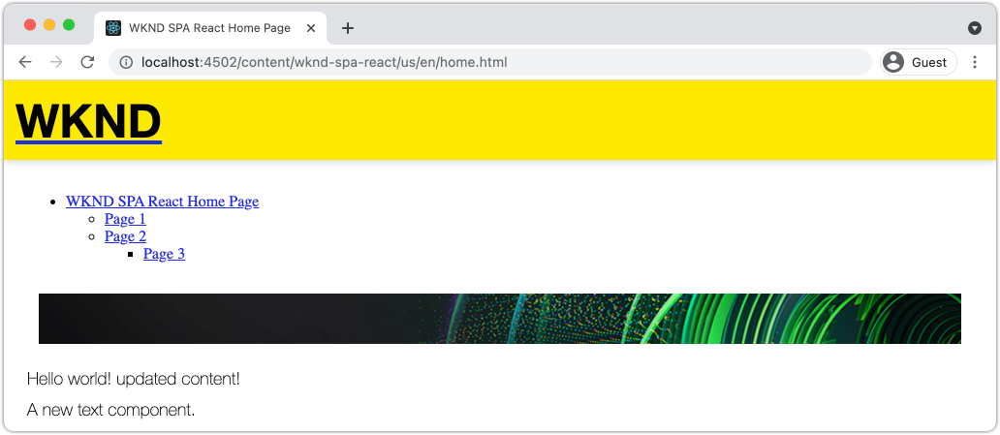

## 先决条件

查看设置[本地开发环境](overview.md#local-dev-environment)所需的工具和说明。 本章是[映射组件](map-components.md)章节的延续，但是要遵循这一章，您需要将一个启用了SPA的AEM项目部署到本地AEM实例。

## 将导航添加到模板 {#add-navigation-template}

1. 打开浏览器并登录到AEM，[http://localhost:4502/](http://localhost:4502/)。 应该已经部署了起始代码库。
1. 导航到&#x200B;**SPA页面模板**： [http://localhost:4502/editor.html/conf/wknd-spa-react/settings/wcm/templates/spa-page-template/structure.html](http://localhost:4502/editor.html/conf/wknd-spa-react/settings/wcm/templates/spa-page-template/structure.html)。
1. 选择最外层的&#x200B;**根布局容器**&#x200B;并单击其&#x200B;**策略**&#x200B;图标。 请注意，**not**&#x200B;选择已解锁的&#x200B;**布局容器**&#x200B;进行创作。

   

1. 创建名为&#x200B;**SPA结构**&#x200B;的新策略：

   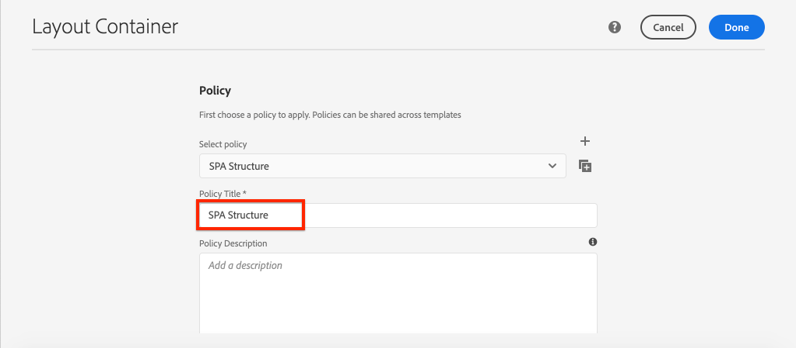

   在&#x200B;**允许的组件** > **常规** >下，选择&#x200B;**布局容器**&#x200B;组件。

   在&#x200B;**允许的组件** > **WKND SPA REACT — 结构** >选择&#x200B;**导航**&#x200B;组件下：

   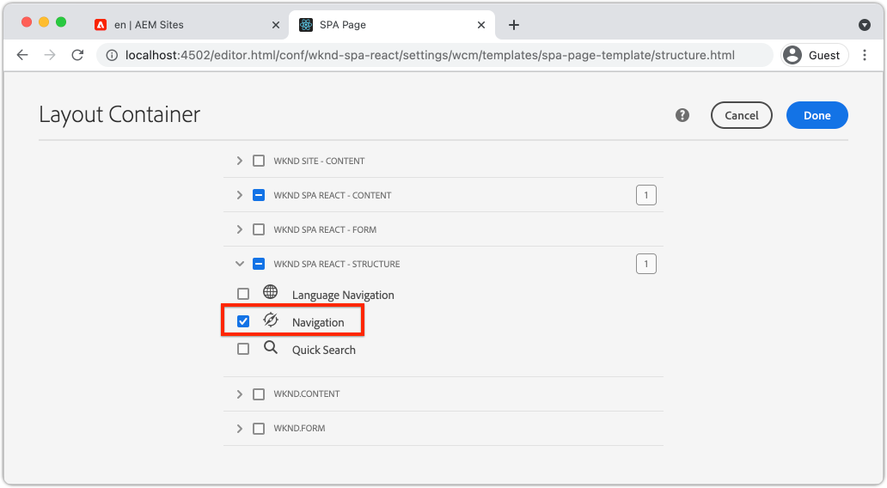

   在&#x200B;**允许的组件** > **WKND SPA REACT - Content** >选择&#x200B;**Image**&#x200B;和&#x200B;**Text**&#x200B;组件。 您总共应选择4个组件。

   单击&#x200B;**完成**&#x200B;以保存更改。

1. 刷新页面，并在解锁的&#x200B;**布局容器**&#x200B;上方添加&#x200B;**导航**&#x200B;组件：

   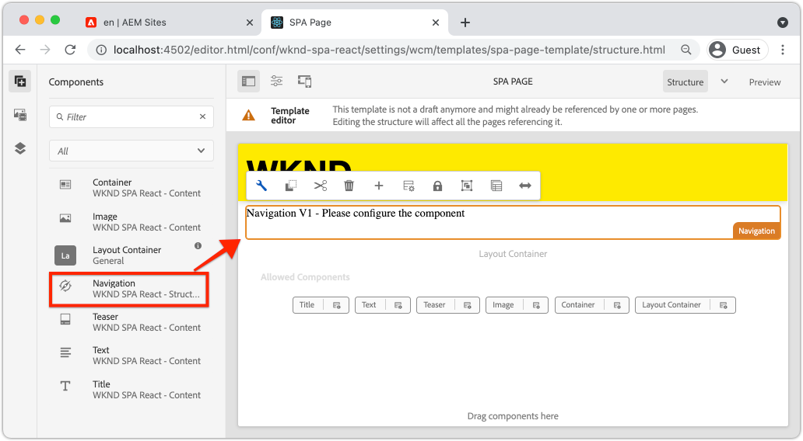

1. 选择&#x200B;**导航**&#x200B;组件并单击其&#x200B;**策略**&#x200B;图标以编辑策略。
1. 使用&#x200B;**SPA导航**&#x200B;的&#x200B;**策略标题**&#x200B;创建新策略。

   在&#x200B;**属性**&#x200B;下：

   * 将&#x200B;**导航根**&#x200B;设置为`/content/wknd-spa-react/us/en`。
   * 将&#x200B;**排除根级别**&#x200B;设置为 **1**。
   * 取消勾选&#x200B;**收集所有子页面**。
   * 将&#x200B;**导航结构深度**&#x200B;设置为 **3**。

   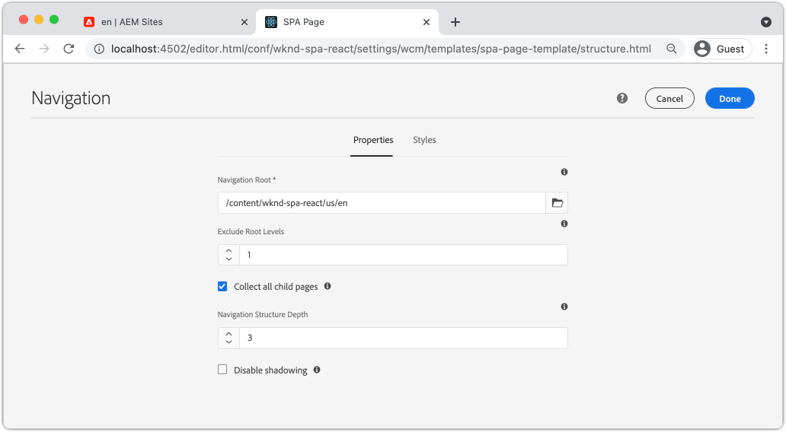

   这将收集`/content/wknd-spa-react/us/en`下方的导航2级。

1. 保存更改后，您应该会看到模板中已填充的`Navigation`：

   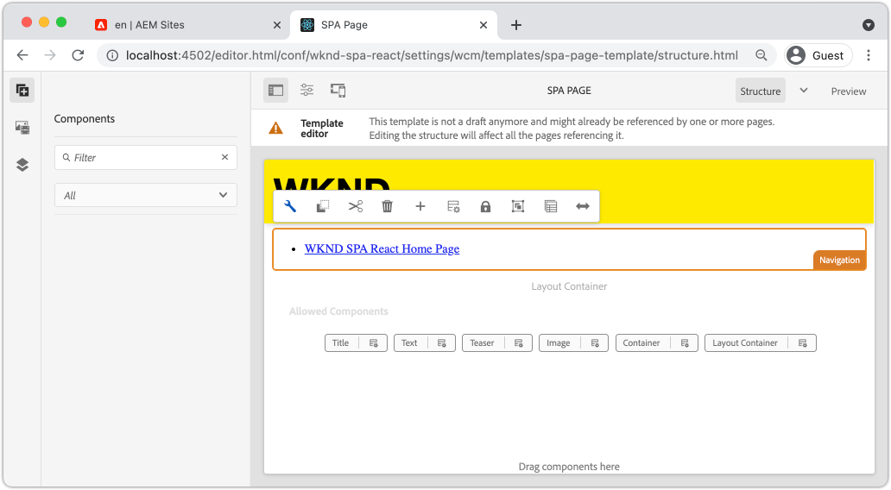

## 创建子页面

接下来，在AEM中创建其他页面，这些页面将用作SPA中的各种视图。 我们还将检查AEM提供的JSON模型的层次结构。

1. 导航到&#x200B;**站点**&#x200B;控制台： [http://localhost:4502/sites.html/content/wknd-spa-react/us/en/home](http://localhost:4502/sites.html/content/wknd-spa-react/us/en/home)。 选择&#x200B;**WKND SPA React主页**，然后单击&#x200B;**创建** > **页面**：

   

1. 在&#x200B;**模板**&#x200B;下，选择&#x200B;**SPA页面**。 在&#x200B;**属性**&#x200B;下，输入&#x200B;**标题**&#x200B;的&#x200B;**页面1**&#x200B;和名称&#x200B;**页面1**。

   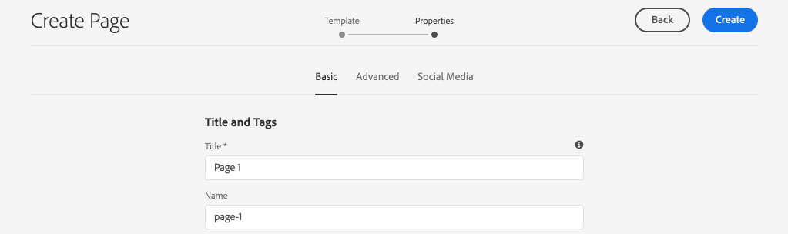

   单击&#x200B;**创建**，然后在对话框弹出窗口中单击&#x200B;**打开**&#x200B;以在AEM SPA编辑器中打开该页面。

1. 将新的&#x200B;**Text**&#x200B;组件添加到主&#x200B;**布局容器**。 编辑组件并输入文本： **第1**&#x200B;页（使用RTE和&#x200B;**H2**&#x200B;元素）。

   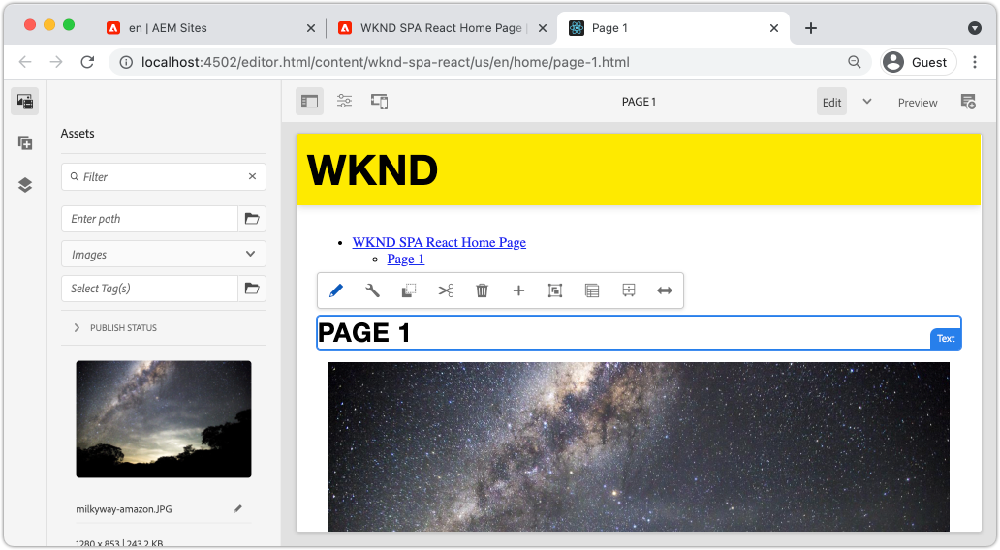

   您可以随意添加其他内容，如图像。

1. 返回到AEM Sites控制台并重复上述步骤，创建名为&#x200B;**Page 2**&#x200B;的第二个页面作为&#x200B;**Page 1**&#x200B;的同级。
1. 最后，创建第三页&#x200B;**第3**，但作为&#x200B;**第2**&#x200B;页的&#x200B;**子**。 完成之后，站点层级应如下所示：

   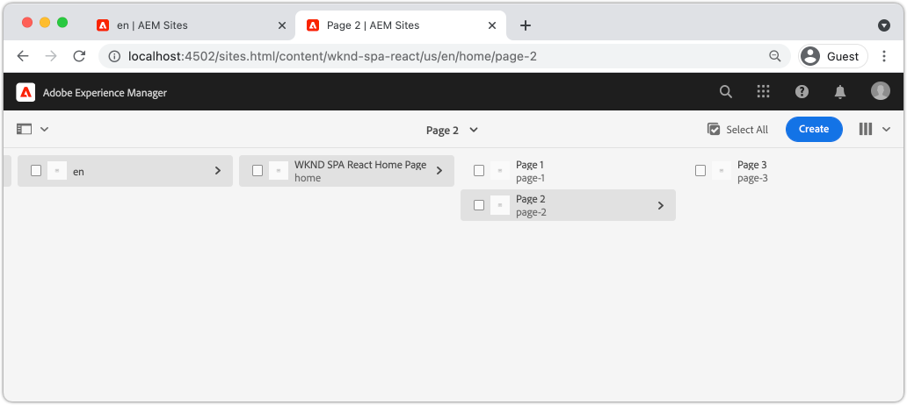

1. 导航组件现在可用于导航到SPA的不同区域。

   

1. 在AEM编辑器外部打开页面： [http://localhost:4502/content/wknd-spa-react/us/en/home.html](http://localhost:4502/content/wknd-spa-react/us/en/home.html)。 使用&#x200B;**导航**&#x200B;组件导航到应用程序的不同视图。

1. 在导航时，使用浏览器的开发人员工具检查网络请求。 以下屏幕截图是从Google Chrome浏览器中捕获的。

   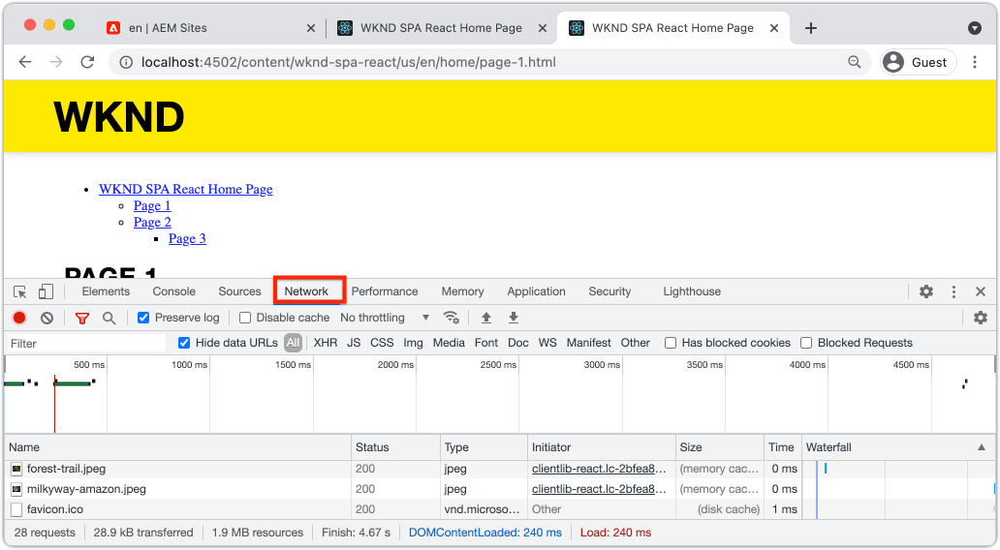

   请注意，在初始页面加载后，后续导航不会导致完全页面刷新，并且在返回到先前访问的页面时，网络通信量会降至最低。

## 层次结构页面JSON模型 {#hierarchy-page-json-model}

接下来，检查驱动SPA多视图体验的JSON模型。

1. 在新选项卡中，打开AEM提供的JSON模型API： [http://localhost:4502/content/wknd-spa-react/us/en.model.json](http://localhost:4502/content/wknd-spa-react/us/en.model.json)。 使用浏览器扩展来[格式化JSON](https://chrome.google.com/webstore/detail/json-formatter/bcjindcccaagfpapjjmafapmmgkkhgoa)可能很有帮助。

   首次加载SPA时会请求此JSON内容。 外部结构如下所示：

   ```json
   {
   "language": "en",
   "title": "en",
   "templateName": "spa-app-template",
   "designPath": "/libs/settings/wcm/designs/default",
   "cssClassNames": "spa page basicpage",
   ":type": "wknd-spa-react/components/spa",
   ":items": {},
   ":itemsOrder": [],
   ":hierarchyType": "page",
   ":path": "/content/wknd-spa-react/us/en",
   ":children": {
      "/content/wknd-spa-react/us/en/home": {},
      "/content/wknd-spa-react/us/en/home/page-1": {},
      "/content/wknd-spa-react/us/en/home/page-2": {},
      "/content/wknd-spa-react/us/en/home/page-2/page-3": {}
      }
   }
   ```

   在`:children`下，您应该会看到所创建每个页面的条目。 所有页面的内容都包含在此初始JSON请求中。 通过导航路由，SPA的后续视图会快速加载，因为内容在客户端已经可用。

   在初始JSON请求中加载SPA的&#x200B;**所有**&#x200B;内容是不明智的，因为这会降低初始页面加载的速度。 接下来，让我们看一下如何收集页面的层次结构深度。

1. 导航到&#x200B;**SPA根**&#x200B;模板，网址为： [http://localhost:4502/editor.html/conf/wknd-spa-react/settings/wcm/templates/spa-app-template/structure.html](http://localhost:4502/editor.html/conf/wknd-spa-react/settings/wcm/templates/spa-app-template/structure.html)。

   单击&#x200B;**页面属性菜单** > **页面策略**：

   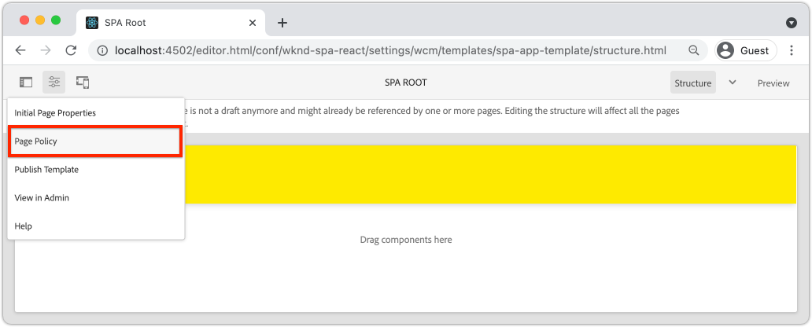

1. **SPA根**&#x200B;模板具有额外的&#x200B;**层次结构**&#x200B;选项卡，用于控制收集的JSON内容。 **结构深度**&#x200B;确定网站层次结构中收集&#x200B;**根**&#x200B;下子页面的深度。 您还可以使用&#x200B;**结构模式**&#x200B;字段根据正则表达式筛选出其他页面。

   将&#x200B;**结构深度**&#x200B;更新为&#x200B;**2**：

   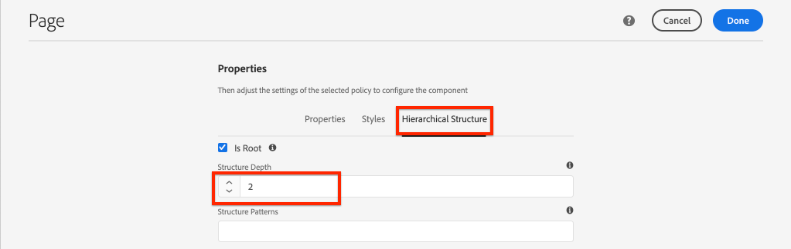

   单击&#x200B;**完成**&#x200B;以保存对策略所做的更改。

1. Re-open the JSON model [http://localhost:4502/content/wknd-spa-react/us/en.model.json](http://localhost:4502/content/wknd-spa-react/us/en.model.json).

   ```json
   {
   "language": "en",
   "title": "en",
   "templateName": "spa-app-template",
   "designPath": "/libs/settings/wcm/designs/default",
   "cssClassNames": "spa page basicpage",
   ":type": "wknd-spa-react/components/spa",
   ":items": {},
   ":itemsOrder": [],
   ":hierarchyType": "page",
   ":path": "/content/wknd-spa-react/us/en",
   ":children": {
      "/content/wknd-spa-react/us/en/home": {},
      "/content/wknd-spa-react/us/en/home/page-1": {},
      "/content/wknd-spa-react/us/en/home/page-2": {}
      }
   }
   ```

   请注意，**页面3**&#x200B;路径已从初始JSON模型中移除： `/content/wknd-spa-react/us/en/home/page-2/page-3`。 This is because **Page 3** is at a level 3 in the hierarchy and we updated the policy to only include content at a max depth of level 2.

1. Re-open the SPA homepage: [http://localhost:4502/content/wknd-spa-react/us/en/home.html](http://localhost:4502/content/wknd-spa-react/us/en/home.html) and open your browser&#39;s developer tools.

   Refresh the page and you should see the XHR request to `/content/wknd-spa-react/us/en.model.json`, which is the SPA Root. 请注意，根据教程中前面制作的SPA根模板的层级深度配置，只包含三个子页面。 这不包括&#x200B;**第3**&#x200B;页。

   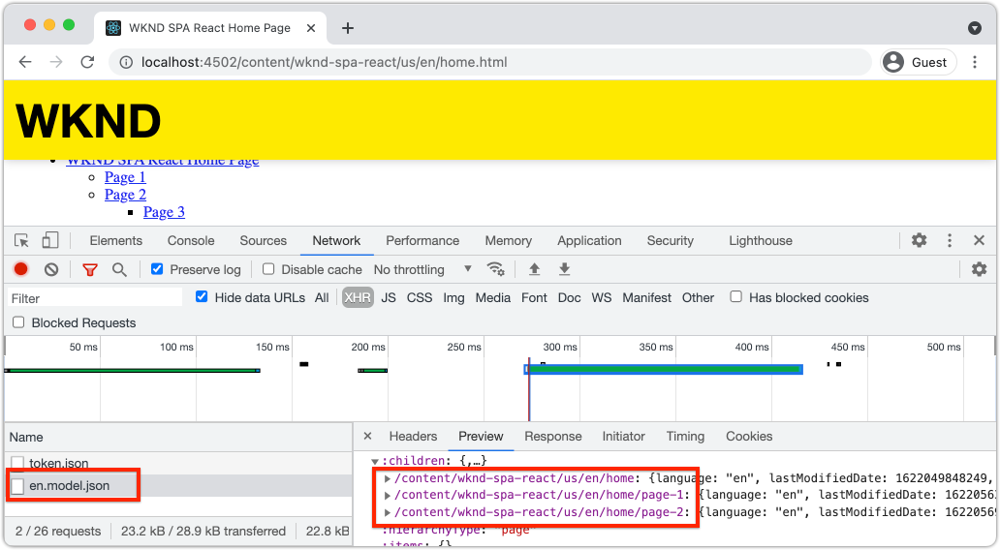

1. With the developer tools open, use the `Navigation` component to navigate directly to **Page 3**:

   请注意，已向`/content/wknd-spa-react/us/en/home/page-2/page-3.model.json`发出新的XHR请求

   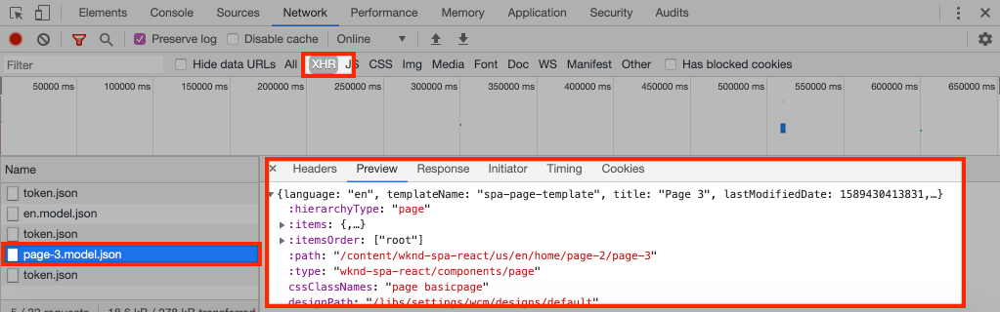

   AEM模型管理器了解&#x200B;**Page 3** JSON内容不可用，因此会自动触发额外的XHR请求。

1. Experiment with deep links by navigating directly to: [http://localhost:4502/content/wknd-spa-react/us/en/home/page-2.html](http://localhost:4502/content/wknd-spa-react/us/en/home/page-2.html). Also observe that the browser&#39;s back button continues to work.

## Inspect React Routing  {#react-routing}

The navigation and routing is implemented with [React Router](https://reactrouter.com/en/main). React Router is a collection of navigation components for React applications. [AEM React Core Components](https://github.com/adobe/aem-react-core-wcm-components-base) uses features of React Router to implement the **Navigation** component used in the previous steps.

Next, inspect how React Router is integrated with the SPA and experiment using React Router&#39;s [Link](https://reactrouter.com/en/main/components/link) component.

1. 在IDE的`ui.frontend/src/index.js`处打开文件`index.js`。

   ```js
   /* index.js */
   import { Router } from 'react-router-dom';
   ...
   ...
    ModelManager.initialize().then(pageModel => {
       const history = createBrowserHistory();
       render(
       <Router history={history}>
           <App
           history={history}
           cqChildren={pageModel[Constants.CHILDREN_PROP]}
           cqItems={pageModel[Constants.ITEMS_PROP]}
           cqItemsOrder={pageModel[Constants.ITEMS_ORDER_PROP]}
           cqPath={pageModel[Constants.PATH_PROP]}
           locationPathname={window.location.pathname}
           />
       </Router>,
       document.getElementById('spa-root')
       );
   });
   ```

   Notice that the `App` is wrapped in the `Router` component from [React Router](https://reacttraining.com/react-router). The `ModelManager`, provided by the AEM SPA Editor JS SDK, adds the dynamic routes to AEM Pages based on the JSON model API.

1. 在`ui.frontend/src/components/Page/Page.js`处打开文件`Page.js`

   ```js
   class AppPage extends Page {
     get containerProps() {
       let attrs = super.containerProps;
       attrs.className =
         (attrs.className || '') + ' page ' + (this.props.cssClassNames || '');
       return attrs;
     }
   }
   
   export default MapTo('wknd-spa-react/components/page')(
     withComponentMappingContext(withRoute(AppPage))
   );
   ```

   The `Page` SPA component uses the `MapTo` function to map **Pages** in AEM to a corresponding SPA component. `withRoute`实用程序有助于根据`cqPath`属性将SPA动态路由到相应的AEM子页面。

1. 在`ui.frontend/src/components/Header/Header.js`处打开`Header.js`组件。
1. 更新`Header`以将`<h1>`标记包装在指向主页的[链接](https://reactrouter.com/en/main/components/link)中：

   ```diff
     //Header.js
     import React, {Component} from 'react';
   + import {Link} from 'react-router-dom';
     require('./Header.css');
   
   export default class Header extends Component {
   
       render() {
           return (
               <header className="Header">
               <div className="Header-container">
   +              <Link to="/content/wknd-spa-react/us/en/home.html">
                       <h1>WKND</h1>
   +              </Link>
               </div>
               </header>
           );
       }
   ```

   我们使用React路由器提供的`<Link>`，而不是使用默认的`<a>`锚点标记。 只要`to=`指向有效的路由，SPA就会切换到该路由，**不会**&#x200B;执行全页刷新。 在这里，我们只是硬编码指向主页的链接以说明如何使用`Link`。

1. 在`App.test.js`的`ui.frontend/src/App.test.js`处更新测试。

   ```diff
   + import { BrowserRouter as Router } from 'react-router-dom';
     import App from './App';
   
     it('renders without crashing', () => {
       const div = document.createElement('div');
   -   ReactDOM.render(<App />, div);
   +   ReactDOM.render(<Router><App /></Router>, div);
     });
   ```

   由于我们在`App.js`中引用的静态组件中使用React Router的功能，因此我们需要更新单元测试以考虑它。

1. 打开终端，导航到项目的根，然后使用您的Maven技能将该项目部署到AEM：

   ```shell
   $ cd aem-guides-wknd-spa.react
   $ mvn clean install -PautoInstallSinglePackage
   ```

1. 导航到AEM中SPA的以下页面之一： [http://localhost:4502/content/wknd-spa-react/us/en/home/page-1.html](http://localhost:4502/content/wknd-spa-react/us/en/home/page-1.html)

   请使用`Header`中的链接而不是`Navigation`组件进行导航。

   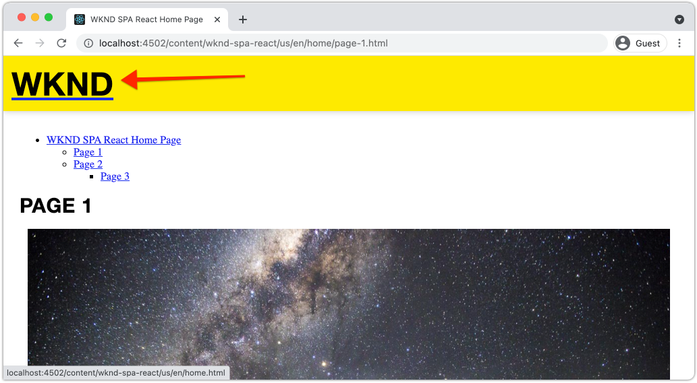

   请注意，未触发完整页面刷新&#x200B;**&#x200B;**，并且SPA路由正在运行。

1. （可选）使用标准`<a>`锚标记试验`Header.js`文件：

   ```js
   <a href="/content/wknd-spa-react/us/en/home.html">
       <h1>WKND</h1>
   </a>
   ```

   这有助于说明SPA路由与常规网页链接之间的区别。

## 恭喜！ {#congratulations}

恭喜，您已了解如何通过使用SPA Editor SDK映射到AEM页面来支持SPA中的多个视图。 已使用React路由器实施动态导航并将其添加到`Header`组件。
