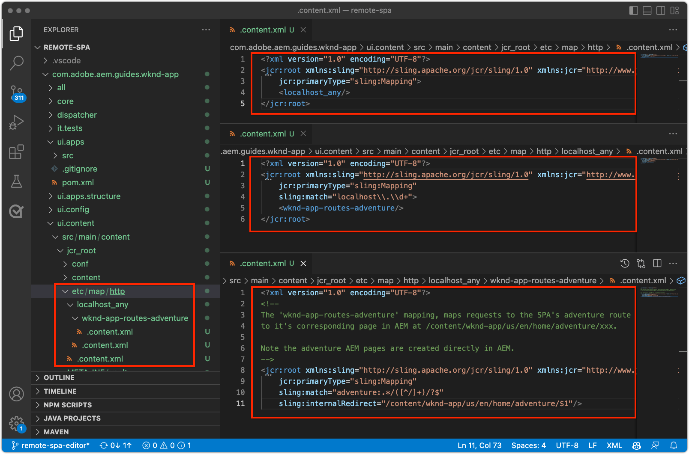

# 为SPA编辑器配置AEM

虽然SPA代码库在AEM之外进行管理，但需要使用AEM项目来设置支持配置和内容要求。 本章介绍如何创建包含必要配置的AEM项目：

+ AEM WCM核心组件代理
+ AEM Remote SPA Page代理
+ AEM远程SPA页面模板
+ 基线远程SPA AEM页
+ 用于定义SPA到AEM URL映射的子项目
+ OSGi配置文件夹

## 从GitHub下载基本项目

从Github.com下载`aem-guides-wknd-graphql`项目。 这将包含此项目中使用的一些基线文件。

```
$ mkdir -p ~/Code
$ git clone https://github.com/adobe/aem-guides-wknd-graphql.git
$ cd remote-spa-tutorial
```

## 创建AEM项目

创建管理配置和基线内容的AEM项目。 此项目将在克隆的`aem-guides-wknd-graphql`项目的`remote-spa-tutorial`文件夹中生成。

_始终使用最新版本的[AEM Archetype](https://github.com/adobe/aem-project-archetype)。_

```
$ cd ~/Code/aem-guides-wknd-graphql/remote-spa-tutorial
$ mvn -B archetype:generate \
 -D archetypeGroupId=com.adobe.aem \
 -D archetypeArtifactId=aem-project-archetype \
 -D archetypeVersion=39 \
 -D aemVersion=cloud \
 -D appTitle="WKND App" \
 -D appId="wknd-app" \
 -D groupId="com.adobe.aem.guides.wkndapp" \
 -D frontendModule="react"
$ mv ~/Code/aem-guides-wknd-graphql/remote-spa-tutorial/wknd-app ~/Code/aem-guides-wknd-graphql/remote-spa-tutorial/com.adobe.aem.guides.wknd-app
```

_最后一个命令只是重命名了AEM项目文件夹，因此它显然是AEM项目，不要与远程SPA混淆__

在指定`frontendModule="react"`时，`ui.frontend`项目未用于远程SPA用例。 SPA是在外部开发并管理到AEM的，并且仅使用AEM作为内容API。 项目需要`frontendModule="react"`标记才能包含`spa-project`个AEM Java™依赖项并设置远程SPA页面模板。

AEM项目原型会生成以下元素，这些元素用于配置AEM以便与SPA集成。

+ 在`ui.apps/src/.../apps/wknd-app/components`处的&#x200B;__AEM WCM核心组件代理__
+ __AEM SPA Remote Page代理__，位于`ui.apps/src/.../apps/wknd-app/components/remotepage`
+ __AEM页面模板__，位于`ui.content/src/.../conf/wknd-app/settings/wcm/templates`
+ __子项目以定义位于`ui.content/src/...`的内容映射__
+ __基线远程SPA AEM页__，位于`ui.content/src/.../content/wknd-app`
+ __位于`ui.config/src/.../apps/wknd-app/osgiconfig`的OSGi配置文件夹__

生成基本AEM项目后，进行了一些调整以确保SPA Editor与Remote SPA兼容。

## 移除ui.frontend项目

由于SPA是远程SPA，因此假定它是在AEM项目之外开发和管理的。 为避免冲突，请从部署中删除`ui.frontend`项目。 如果未删除`ui.frontend`项目，则会在AEM SPA编辑器中同时加载两个SPA(在`ui.frontend`项目和远程SPA中提供的默认SPA)。

1. 在IDE中打开AEM项目(`~/Code/aem-guides-wknd-graphql/remote-spa-tutorial/com.adobe.aem.guides.wknd-app`)
1. 打开根`pom.xml`
1. 从`<modules>`列表中注释`<module>ui.frontend</module`

   ```
   <modules>
       <module>all</module>
       <module>core</module>
   
       <!-- <module>ui.frontend</module> -->
   
       <module>ui.apps</module>
       <module>ui.apps.structure</module>
       <module>ui.config</module>
       <module>ui.content</module>
       <module>it.tests</module>
       <module>dispatcher</module>
       <module>ui.tests</module>
       <module>analyse</module>
   </modules>
   ```

   `pom.xml`文件应如下所示：

   

1. 打开`ui.apps/pom.xml`
1. 在`<artifactId>wknd-app.ui.frontend</artifactId>`上注释掉`<dependency>`

   ```
   <dependencies>
   
       <!-- Remote SPA project will provide all frontend resources
       <dependency>
           <groupId>com.adobe.aem.guides.wkndapp</groupId>
           <artifactId>wknd-app.ui.frontend</artifactId>
           <version>${project.version}</version>
           <type>zip</type>
       </dependency>
       --> 
   </dependencies>
   ```

   `ui.apps/pom.xml`文件应如下所示：

   

如果AEM项目是在这些更改之前生成的，请从位于`ui.apps/src/main/content/jcr_root/apps/wknd-app/clientlibs/clientlib-react`的`ui.apps`项目中手动删除`ui.frontend`生成的客户端库。

## AEM内容映射

要让AEM在SPA编辑器中加载远程SPA，必须在SPA路由和用于打开和创作内容的AEM页面之间建立映射。

稍后将探讨此配置的重要性。

可以使用`/etc/map`中定义的[Sling映射](https://sling.apache.org/documentation/the-sling-engine/mappings-for-resource-resolution.html#root-level-mappings-1)完成映射。

1. 在IDE中，打开`ui.content`子项目
1. 导航到`src/main/content/jcr_root`
1. 创建文件夹`etc`
1. 在`etc`中创建文件夹`map`
1. 在`map`中创建文件夹`http`
1. 在`http`中，创建包含下列内容的文件`.content.xml`：

   ```
   <?xml version="1.0" encoding="UTF-8"?>
   <jcr:root xmlns:sling="http://sling.apache.org/jcr/sling/1.0" xmlns:jcr="http://www.jcp.org/jcr/1.0"
       jcr:primaryType="sling:Mapping">
       <localhost_any/>
   </jcr:root>
   ```

1. 在`http`中创建文件夹`localhost_any`
1. 在`localhost_any`中，创建包含下列内容的文件`.content.xml`：

   ```
   <?xml version="1.0" encoding="UTF-8"?>
   <jcr:root xmlns:sling="http://sling.apache.org/jcr/sling/1.0" xmlns:jcr="http://www.jcp.org/jcr/1.0"
       jcr:primaryType="sling:Mapping"
       sling:match="localhost\\.\\d+">
       <wknd-app-routes-adventure/>
   </jcr:root>
   ```

1. 在`localhost_any`中创建文件夹`wknd-app-routes-adventure`
1. 在`wknd-app-routes-adventure`中，创建包含下列内容的文件`.content.xml`：

   ```
   <?xml version="1.0" encoding="UTF-8"?>
   
   <!--
   The 'wknd-app-routes-adventure' mapping, maps requests to the SPA's adventure route 
   to it's corresponding page in AEM at /content/wknd-app/us/en/home/adventure/xxx.
   
   Note the adventure AEM pages are created directly in AEM.
   -->
   
   <jcr:root xmlns:sling="http://sling.apache.org/jcr/sling/1.0" xmlns:jcr="http://www.jcp.org/jcr/1.0"
       jcr:primaryType="sling:Mapping"
       sling:match="adventure:.*/([^/]+)/?$"
       sling:internalRedirect="/content/wknd-app/us/en/home/adventure/$1"/>
   ```

1. 将映射节点添加到`ui.content/src/main/content/META-INF/vault/filter.xml`以使其包含在AEM包中。

   ```
   <?xml version="1.0" encoding="UTF-8"?>
   <workspaceFilter version="1.0">
       <filter root="/conf/wknd-app" mode="merge"/>
       <filter root="/content/wknd-app" mode="merge"/>
       <filter root="/content/dam/wknd-app/asset.jpg" mode="merge"/>
       <filter root="/content/experience-fragments/wknd-app" mode="merge"/>
   
       <!-- Add the Sling Mapping rules for the WKND App -->
       <filter root="/etc/map" mode="merge"/>
   </workspaceFilter>
   ```

文件夹结构和`.context.xml`文件应如下所示：



`filter.xml`文件应如下所示：


现在，在部署AEM项目时，将自动包含这些配置。

Sling映射影响`http`和`localhost`上运行的AEM，因此仅支持本地开发。 部署到AEM as a Cloud Service时，必须添加类似的Sling映射，以便针对`https`和适当的AEM as a Cloud Service域。有关详细信息，请参阅[Sling映射文档](https://sling.apache.org/documentation/the-sling-engine/mappings-for-resource-resolution.html)。

## 跨源资源共享安全策略

接下来，配置AEM以保护内容，以便仅此SPA可以访问AEM内容。 在AEM[&#128279;](https://experienceleague.adobe.com/docs/experience-manager-learn/foundation/security/develop-for-cross-origin-resource-sharing.html)中配置跨源资源共享。

1. 在IDE中，打开`ui.config` Maven子项目
1. 导航`src/main/content/jcr_root/apps/wknd-app/osgiconfig/config`
1. 创建名为`com.adobe.granite.cors.impl.CORSPolicyImpl~wknd-app_remote-spa.cfg.json`的文件
1. 在文件中添加以下内容：

   ```
   {
       "supportscredentials":true,
       "exposedheaders":[
           ""
       ],
       "supportedmethods":[
           "GET",
           "HEAD",
           "POST",
           "OPTIONS"
       ],
       "alloworigin":[
           "https://external-hosted-app", "localhost:3000"
       ],
       "maxage:Integer":1800,
       "alloworiginregexp":[
           ".*"
       ],
       "allowedpaths":[
           ".*"
       ],
       "supportedheaders":[
           "Origin",
           "Accept",
           "X-Requested-With",
           "Content-Type",
           "Access-Control-Request-Method",
           "Access-Control-Request-Headers",
           "authorization"
       ]
   }
   ```

`com.adobe.granite.cors.impl.CORSPolicyImpl~wknd-app_remote-spa.cfg.json`文件应如下所示：


关键配置元素包括：

+ `alloworigin`指定允许哪些主机从AEM检索内容。
   + 已添加`localhost:3000`以支持在本地运行的SPA
   + `https://external-hosted-app`充当占位符，将替换为Remote SPA所在的域。
+ `allowedpaths`指定此CORS配置涵盖AEM中的哪些路径。 默认允许访问AEM中的所有内容，但可以仅将其范围限定为SPA可以访问的特定路径，例如： `/content/wknd-app`。

## 将AEM页面设置为远程SPA页面模板

AEM项目原型会生成一个已准备好与Remote SPA集成AEM的项目，但需要对自动生成的AEM页面结构进行小幅但重要的调整。 自动生成的AEM页面的类型必须更改为&#x200B;__远程SPA页面__，而不是&#x200B;__SPA页面__。

1. 在IDE中，打开`ui.content`子项目
1. 打开至`src/main/content/jcr_root/content/wknd-app/us/en/home/.content.xml`
1. 使用以下内容更新此`.content.xml`文件：

   ```
   <?xml version="1.0" encoding="UTF-8"?>
   <jcr:root xmlns:sling="http://sling.apache.org/jcr/sling/1.0" xmlns:cq="http://www.day.com/jcr/cq/1.0" xmlns:jcr="http://www.jcp.org/jcr/1.0" xmlns:nt="http://www.jcp.org/jcr/nt/1.0"
           jcr:primaryType="cq:Page">
       <jcr:content
           cq:template="/conf/wknd-app/settings/wcm/templates/spa-remote-page"
           jcr:primaryType="cq:PageContent"
           jcr:title="WKND App Home Page"
           sling:resourceType="wknd-app/components/remotepage">
           <root
               jcr:primaryType="nt:unstructured"
               sling:resourceType="wcm/foundation/components/responsivegrid">
               <responsivegrid
                   jcr:primaryType="nt:unstructured"
                   sling:resourceType="wcm/foundation/components/responsivegrid">
                   <text
                       jcr:primaryType="nt:unstructured"
                       sling:resourceType="wknd-app/components/text"
                       text="&lt;p>Hello World!&lt;/p>"
                       textIsRich="true">
                       <cq:responsive jcr:primaryType="nt:unstructured"/>
                   </text>
               </responsivegrid>
           </root>
       </jcr:content>
   </jcr:root>
   ```

关键更改是对`jcr:content`节点的更新：

+ `cq:template`至`/conf/wknd-app/settings/wcm/templates/spa-remote-page`
+ `sling:resourceType`至`wknd-app/components/remotepage`

`src/main/content/jcr_root/content/wknd-app/us/en/home/.content.xml`文件应如下所示：


这些更改使作为AEM中SPA根目录的此页面能够在SPA编辑器中加载远程SPA。

>[!NOTE]
>
>如果此项目之前已部署到AEM，请确保将AEM页面作为&#x200B;__Sites > WKND应用程序>我们> en > WKND应用程序主页__&#x200B;删除，因为`ui.content`项目设置为&#x200B;__合并__&#x200B;节点，而不是&#x200B;__更新__。

此页面也可以在AEM本身中删除并重新创建为远程SPA页面，但是，由于此页面是在`ui.content`项目中自动创建的，因此最好在代码库中更新它。

## 将AEM项目部署到AEM SDK

1. 确保AEM Author服务在端口4502上运行
1. 从命令行中，导航到AEM Maven项目的根
1. 使用Maven将该项目部署到本地AEM SDK创作服务

   ```
   $ mvn clean install -PautoInstallSinglePackage
   ```

   

## 配置根AEM页面

部署AEM项目后，最后一个步骤是准备SPA编辑器以加载我们的远程SPA。 在AEM中，标记与AEM项目原型生成的SPA根`/content/wknd-app/us/en/home`对应的AEM页面。

1. 登录AEM Author
1. 导航到&#x200B;__站点> WKND应用程序>我们> en__
1. 选择&#x200B;__WKND应用程序主页__，然后点按&#x200B;__属性__

   

1. 导航到&#x200B;__SPA__&#x200B;选项卡
1. 填写&#x200B;__远程SPA配置__
   + __SPA主机URL__： `http://localhost:3000`
      + 到远程SPA根目录的URL

   

1. 点按&#x200B;__保存并关闭__

请记住，我们已将此页面的类型更改为&#x200B;__远程SPA页面__&#x200B;的类型，这允许我们在其&#x200B;__页面属性__&#x200B;中看到&#x200B;__SPA__&#x200B;选项卡。

只能在对应于AEM根目录的SPA页面上设置此配置。 此页面下的所有AEM页面都将继承该值。

## 恭喜

您现在已准备好AEM配置并将其部署到本地AEM作者！ 您现在知道如何：

+ 通过在`ui.frontend`中注释掉依赖关系，删除AEM项目原型生成的SPA
+ 将Sling映射添加到AEM，以将SPA路由映射到AEM中的资源
+ 设置AEM跨源资源共享安全策略，以允许远程SPA使用AEM中的内容
+ 将AEM项目部署到本地AEM SDK作者服务
+ 使用AEM主机URL页属性将SPA页标记为远程SPA根目录

## 后续步骤

配置AEM后，我们可以重点使用AEM SPA Editor引导远程SPA[&#128279;](./spa-bootstrap.md)，并支持可编辑区域！
