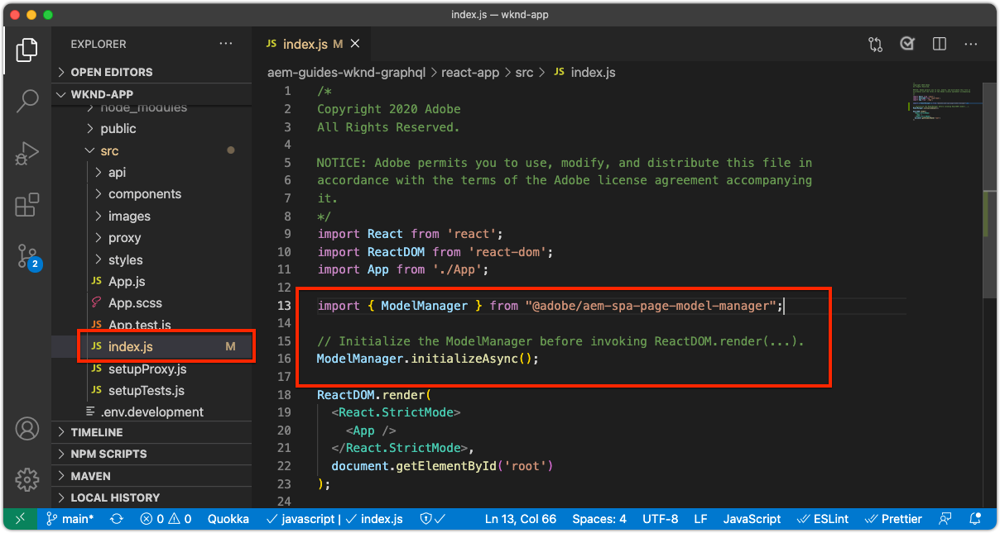

# Bootstrap远程SPA for SPA编辑器

必须先使用AEM SPA Editor JavaScript SDK和其他一些配置引导可编辑区域，然后才能将其添加到远程SPA。

## 安装AEM SPA编辑器JS SDK npm依赖项

首先，查看React项目的AEM SPA npm依赖项，并安装它们。

+ [`@adobe/aem-spa-page-model-manager`](https://github.com/adobe/aem-spa-page-model-manager) ：提供用于从AEM检索内容的API。
+ [`@adobe/aem-spa-component-mapping`](https://github.com/adobe/aem-spa-component-mapping) ：提供将AEM内容映射到SPA组件的API。
+ [`@adobe/aem-react-editable-components` v2](https://github.com/adobe/aem-react-editable-components) ：提供用于生成自定义SPA组件的API并提供常用实现，如`AEMPage` React组件。

```shell
$ cd ~/Code/aem-guides-wknd-graphql/remote-spa-tutorial/react-app
$ npm install @adobe/aem-spa-page-model-manager 
$ npm install @adobe/aem-spa-component-mapping
$ npm install @adobe/aem-react-editable-components 
```

## 查看SPA环境变量

多个环境变量必须向远程SPA公开，以便它知道如何与AEM交互。

1. 在IDE中的`~/Code/aem-guides-wknd-graphql/remote-spa-tutorial/react-app`处打开远程SPA项目
1. 打开文件`.env.development`
1. 在文件中，请特别注意键值，并根据需要进行更新：

   ```
   REACT_APP_HOST_URI=http://localhost:4502
   
   REACT_APP_USE_PROXY=true
   
   REACT_APP_AUTH_METHOD=basic
   
   REACT_APP_BASIC_AUTH_USER=admin
   REACT_APP_BASIC_AUTH_PASS=admin
   ```

   

   *请记住，React中的自定义环境变量必须添加前缀`REACT_APP_`。*

   + `REACT_APP_HOST_URI`：远程SPA连接到的AEM服务的方案和主机。
      + 此值根据AEM环境（本地、开发、暂存或生产）和AEM服务类型(创作与Publish)的状态而变化
   + `REACT_APP_USE_PROXY`：通过告知react开发服务器使用`http-proxy-middleware`模块代理AEM请求（例如`/content, /graphql, .model.json`），从而避免了在开发期间出现CORS问题。
   + `REACT_APP_AUTH_METHOD`：为AEM提供的请求提供身份验证方法，选项为“service-token”、“dev-token”、“basic”或对于no-auth用例保留为空
      + 需要与AEM Author一起使用
      + 可能需要与AEM Publish一起使用（如果内容受保护）
      + 针对AEM SDK进行开发时，可通过基本身份验证支持本地帐户。 这是本教程中使用的方法。
      + 与AEM as a Cloud Service集成时，使用[访问令牌](https://experienceleague.adobe.com/docs/experience-manager-learn/getting-started-with-aem-headless/authentication/overview.html)
   + `REACT_APP_BASIC_AUTH_USER`：检索AEM内容时，SPA验证的AEM __用户名__。
   + `REACT_APP_BASIC_AUTH_PASS`：检索AEM内容时SPA验证的AEM __密码__。

## 集成ModelManager API

利用应用程序可用的AEM SPA npm依赖项，在调用`ReactDOM.render(...)`之前，初始化项目`index.js`中的AEM `ModelManager`。

[ModelManager](https://github.com/adobe/aem-spa-page-model-manager/blob/master/src/ModelManager.ts)负责连接到AEM以检索可编辑的内容。

1. 在IDE中打开远程SPA项目
1. 打开文件`src/index.js`
1. 添加导入`ModelManager`并在`root.render(..)`调用之前对其进行初始化，

   ```javascript
   ...
   import { ModelManager } from "@adobe/aem-spa-page-model-manager";
   
   // Initialize the ModelManager before invoking root.render(..).
   ModelManager.initializeAsync();
   
   const container = document.getElementById('root');
   const root = createRoot(container);
   root.render(<App />);
   ```

`src/index.js`文件应如下所示：



## 设置内部SPA代理

创建可编辑的SPA时，最好在SPA[&#128279;](https://create-react-app.dev/docs/proxying-api-requests-in-development/#configuring-the-proxy-manually)中设置内部代理，将其配置为将相应的请求路由到AEM。 这是通过使用[http-proxy-middleware](https://www.npmjs.com/package/http-proxy-middleware) npm模块完成的，该模块已由基本WKND GraphQL应用程序安装。

1. 在IDE中打开远程SPA项目
1. 在`src/proxy/setupProxy.spa-editor.auth.basic.js`处打开文件
1. 使用以下代码更新文件：

   ```javascript
   const { createProxyMiddleware } = require('http-proxy-middleware');
   const {REACT_APP_HOST_URI, REACT_APP_BASIC_AUTH_USER, REACT_APP_BASIC_AUTH_PASS } = process.env;
   
   /*
       Set up a proxy with AEM for local development
       In a production environment this proxy should be set up at the webserver level or absolute URLs should be used.
   */
   module.exports = function(app) {
   
       /**
       * Filter to check if the request should be re-routed to AEM. The paths to be re-routed at:
       * - Starts with /content (AEM content)
       * - Starts with /graphql (AEM graphQL endpoint)
       * - Ends with .model.json (AEM Content Services)
       * 
       * @param {*} path the path being requested of the SPA
       * @param {*} req the request object
       * @returns true if the SPA request should be re-routed to AEM
       */
       const toAEM = function(path, req) {
           return path.startsWith('/content') || 
               path.startsWith('/graphql') ||
               path.endsWith('.model.json')
       }
   
       /**
       * Re-writes URLs being proxied to AEM such that they can resolve to real AEM resources
       * - The "root" case of `/.model.json` are rewritten to the SPA's home page in AEM
       * - .model.json requests for /adventure:xxx routes are rewritten to their corresponding adventure page under /content/wknd-app/us/en/home/adventure/ 
       * 
       * @param {*} path the path being requested of the SPA
       * @param {*} req the request object
       * @returns returns a re-written path, or nothing to use the @param path
       */
       const pathRewriteToAEM = function (path, req) { 
           if (path === '/.model.json') {
               return '/content/wknd-app/us/en/home.model.json';
           } else if (path.startsWith('/adventure/') && path.endsWith('.model.json')) {
               return '/content/wknd-app/us/en/home/adventure/' + path.split('/').pop();
           }    
       }
   
       /**
       * Register the proxy middleware using the toAEM filter and pathRewriteToAEM rewriter 
       */
       app.use(
           createProxyMiddleware(
               toAEM, // Only route the configured requests to AEM
               {
                   target: REACT_APP_HOST_URI,
                   changeOrigin: true,
                   // Pass in credentials when developing against an Author environment
                   auth: `${REACT_APP_BASIC_AUTH_USER}:${REACT_APP_BASIC_AUTH_PASS}`,
                   pathRewrite: pathRewriteToAEM // Rewrite SPA paths being sent to AEM
               }
           )
       );
   
       /**
       * Enable CORS on requests from the SPA to AEM
       * 
       * If this rule is not in place, CORS errors will occur when running the SPA on http://localhost:3000
       */
       app.use((req, res, next) => {
           res.header("Access-Control-Allow-Origin", REACT_APP_HOST_URI);
           next();
       });
   };
   ```

   `setupProxy.spa-editor.auth.basic.js`文件应如下所示：

   

   此代理配置主要执行两项操作：

   1. 将向SPA (`http://localhost:3000`)发出的特定请求代理到AEM `http://localhost:4502`
      + 它仅代理其路径与指示应由AEM提供服务的模式匹配的请求（如`toAEM(path, req)`中所定义）。
      + 它将SPA路径重写为其对应的AEM页面，如`pathRewriteToAEM(path, req)`中所定义
   1. 它会将CORS标头添加到所有请求，以允许对`res.header("Access-Control-Allow-Origin", REACT_APP_HOST_URI);`定义的AEM内容的访问
      + 如果未添加此设置，则在SPA中加载AEM内容时将会发生CORS错误。

1. 打开文件`src/setupProxy.js`
1. 查看指向`setupProxy.spa-editor.auth.basic`代理配置文件的行：

   ```
   ...
   case BASIC:
   // Use user/pass for local development with Local Author Env
   return require('./proxy/setupProxy.spa-editor.auth.basic');
   ...
   ```

请注意，对`src/setupProxy.js`或其引用的文件所做的任何更改都需要重新启动SPA。

## 静态SPA资源

静态SPA资源（如WKND徽标和正在加载的图形）需要更新其src URL，以强制从远程SPA主机加载它们。 如果保留为相对位置，则当SPA加载到SPA编辑器中以进行创作时，这些URL默认使用AEM主机而不是SPA，从而产生404个请求，如下图所示。


要解决此问题，请使远程SPA托管的静态资源使用包含远程SPA源的绝对路径。

1. 在IDE中打开SPA项目
1. 打开SPA环境变量文件`src/.env.development`并为SPA公共URI添加变量：

   ```
   ...
   # The base URI the SPA is accessed from
   REACT_APP_PUBLIC_URI=http://localhost:3000
   ```

   _部署到AEM as a Cloud Service时，您需要对相应的`.env`文件执行相同的操作。_

1. 打开文件`src/App.js`
1. 从SPA环境变量导入SPA公共URI

   ```javascript
   const {  REACT_APP_PUBLIC_URI } = process.env;
   
   function App() { ... }
   ```

1. 为WKND徽标``添加前缀`REACT_APP_PUBLIC_URI`以强制对SPA进行解析。

   ```html
   
   ```

1. 在`src/components/Loading.js`中加载图像时执行相同操作

   ```javascript
   const { REACT_APP_PUBLIC_URI } = process.env;
   
   class Loading extends Component {
   
       render() {
           return (<div className="loading">
               
           </div>);
       }
   }
   ```

1. 对于`src/components/AdventureDetails.js`中返回按钮的&#x200B;__两个实例__

   ```javascript
   const { REACT_APP_PUBLIC_URI } = process.env;
   
   function AdventureDetail(props) {
       ...
       render() {
           
       }
   }
   ```

`App.js`、`Loading.js`和`AdventureDetails.js`文件应类似于：


## AEM响应式网格

要支持SPA编辑器对SPA中可编辑区域的布局模式，我们必须将AEM响应式网格CSS集成到SPA中。 不必担心 — 此网格系统仅适用于可编辑的容器，您可以使用所选的网格系统来驱动SPA其余部分的布局。

将AEM响应式网格SCSS文件添加到SPA。

1. 在IDE中打开SPA项目
1. 将以下两个文件下载并复制到`src/styles`
   + [_网格.scss](./assets/spa-bootstrap/_grid.scss)
      + AEM响应式网格SCSS生成器
   + [_网格 — 初始化.scss](./assets/spa-bootstrap/_grid-init.scss)
      + 使用SPA特定的断点（桌面和移动设备）和列(12)调用`_grid.scss`。
1. 打开`src/App.scss`并导入`./styles/grid-init.scss`

   ```scss
   ...
   @import './styles/grid-init';
   ...
   ```

`_grid.scss`和`_grid-init.scss`文件应类似于：


现在，对于添加到AEM容器的组件，SPA包含了支持AEM布局模式所需的CSS。

## 实用程序类

将以下实用程序类复制到您的React应用程序项目中。

+ [RoutedLink.js](./assets/spa-bootstrap/RoutedLink.js)到`~/Code/aem-guides-wknd-graphql/remote-spa-tutorial/react-app/src/components/editable/core/RoutedLink.js`
+ [EditorPlaceholder.js](./assets/spa-bootstrap/EditorPlaceholder.js)到`~/Code/aem-guides-wknd-graphql/remote-spa-tutorial/react-app/src/components/editable/core/util/EditorPlaceholder.js`
+ [withConditionalPlaceholder.js](./assets/spa-bootstrap/withConditionalPlaceholder.js)到`~/Code/aem-guides-wknd-graphql/remote-spa-tutorial/react-app/src/components/editable/core/util/withConditionalPlaceholder.js`
+ [withStandardBaseCssClass.js](./assets/spa-bootstrap/withStandardBaseCssClass.js)至`~/Code/aem-guides-wknd-graphql/remote-spa-tutorial/react-app/src/components/editable/core/util/withStandardBaseCssClass.js`


## 启动SPA

现在SPA已引导以与AEM集成，让我们运行SPA并查看它看起来是什么样的！

1. 在命令行中，导航到SPA项目的根目录
1. 使用普通命令启动SPA（如果尚未这样做）

   ```shell
   $ cd ~/Code/aem-guides-wknd-graphql/remote-spa-tutorial/react-app
   $ npm install 
   $ npm run start
   ```

1. 浏览[http://localhost:3000](http://localhost:3000)上的SPA。 一切应该看起来不错！

在http://localhost:3000上运行的SPA

## 在AEM SPA编辑器中打开SPA

在[http://localhost:3000](http://localhost:3000)上运行SPA时，让我们使用AEM SPA编辑器将其打开。 SPA中尚无可编辑的内容，这仅验证AEM中的SPA。

1. 登录AEM Author
1. 导航到&#x200B;__站点> WKND应用程序>我们> en__
1. 选择&#x200B;__WKND应用程序主页__&#x200B;并点按&#x200B;__编辑__，将显示SPA。

   

1. 使用右上角的模式切换器切换到&#x200B;__预览__
1. 单击SPA周围

   在http://localhost:3000上运行的SPA

## 恭喜！

您已引导远程SPA使其与AEM SPA Editor兼容！ 您现在知道如何：

+ 将AEM SPA编辑器JS SDK npm依赖项添加到SPA项目
+ 配置SPA环境变量
+ 将ModelManager API与SPA集成
+ 为SPA设置内部代理，以便将相应的内容请求路由到AEM
+ 解决在SPA Editor上下文中解析静态SPA资源的问题
+ 添加AEM响应式网格CSS以支持AEM可编辑容器中的布局

## 后续步骤

现在，我们已经达到了与AEM SPA Editor的兼容性基准，我们可以开始引入可编辑区域。 我们首先了解如何在SPA中放置[可编辑的固定组件](./spa-fixed-component.md)。
