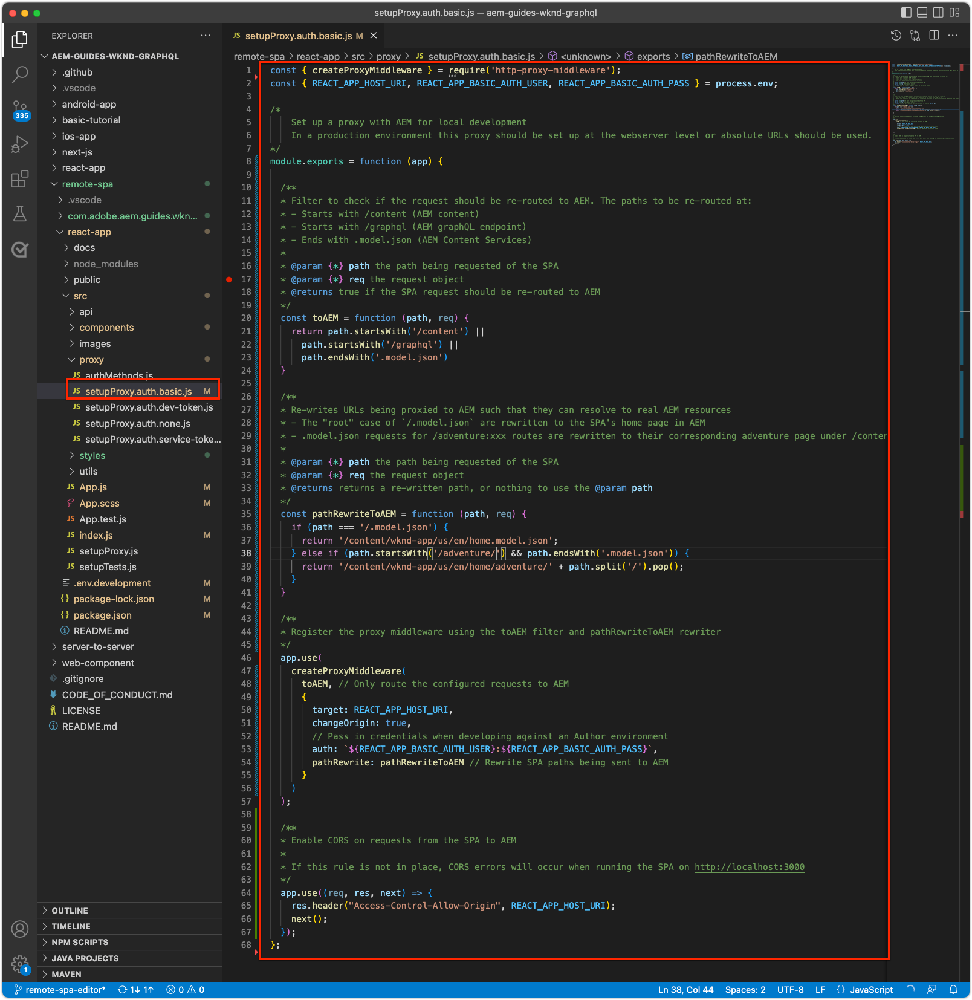

# BootstrapRemote SPA for SPA Editor

在将可编辑区域添加到远程SPA中之前，必须先通过AEM SPA Editor JavaScript SDK和其他一些配置将其引导。

## 添加AEM SPA Editor JS SDK npm依赖项

首先，将AEM SPA npm依赖项添加到React项目。

```
$ cd ~/Code/wknd-app/aem-guides-wknd-graphql/react-app
$ npm install --save \
    @adobe/aem-spa-page-model-manager \
    @adobe/aem-spa-component-mapping \
    @adobe/aem-react-editable-components \
    @adobe/aem-core-components-react-base \
    @adobe/aem-core-components-react-spa
```

+ `@adobe/aem-spa-page-model-manager` 提供了用于从AEM检索内容的API。
+ `@adobe/aem-spa-component-mapping` 提供了将AEM内容映射到SPA组件的API。
+ ` @adobe/aem-react-editable-components` 提供了用于构建自定义SPA组件的API，并提供了常用实施，如 `AEMPage` React组件。
+ `@adobe/aem-core-components-react-base` 提供了一套现成的React组件，这些组件与AEM WCM核心组件无缝集成，且与SPA编辑器无关。这些组件主要包括以下内容组件：
   + 标题
   + 文本
   + 痕迹导航
   + 等等。
+ `@adobe/aem-core-components-react-spa` 提供了一套现成的React组件，这些组件与AEM WCM核心组件无缝集成，但需要SPA编辑器。这些组件主要包含包含`@adobe/aem-core-components-react-base`中的内容组件的组件，例如：
   + 容器
   + 轮播
   + 等等。

## 查看SPA环境变量

必须向远程SPA显示多个环境变量，以便其知道如何与AEM交互。

1. 在IDE的`~/Code/wknd-app/aem-guides-wknd-graphql/react-app`处打开远程SPA项目
1. 打开文件`.env.development`
1. 添加文件，并特别注意键：

   ```
   REACT_APP_HOST_URI=http://localhost:4502
   REACT_APP_AUTHORIZATION=admin:admin
   ```

   

   *请记住，React中的自定义环境变量必须带有前缀 `REACT_APP_`。*

   + `REACT_APP_AEM_URI`:远程SPA连接到的AEM服务的方案和主机。
      + 此值会根据AEM环境（本地、开发、暂存或生产）和AEM服务类型（创作与发布）的情况而发生更改
   + `REACT_APP_AEM_AUTH`:SPA对AEM进行身份验证并检索内容时使用的凭据。
      + 与AEM作者一起使用时需要
      + 可能需要用于AEM发布（如果内容受到保护）
      + 针对AEM SDK进行开发支持通过基本身份验证进行本地帐户。 这是本教程中使用的方法。
      + 与AEM as aCloud Service集成时，请使用[访问令牌](https://experienceleague.adobe.com/docs/experience-manager-learn/getting-started-with-aem-headless/authentication/overview.html)

## 集成ModelManager API

使用应用程序可用的AEM SPA npm依赖项，在调用`ReactDOM.render(...)`之前，初始化项目`index.js`中的AEM `ModelManager`。

[ModelManager](https://www.npmjs.com/package/@adobe/aem-spa-page-model-manager)负责连接到AEM以检索可编辑的内容。

1. 在IDE中打开远程SPA项目
1. 打开文件`src/index.js`
1. 添加import `ModelManager`并在`ReactDOM.render(..)`调用之前对其进行初始化，

   ```
   ...
   import { ModelManager } from "@adobe/aem-spa-page-model-manager";
   
   // Initialize the ModelManager before invoking ReactDOM.render(...).
   ModelManager.initializeAsync();
   
   ReactDOM.render(...);
   ```

`src/index.js`文件应该如下所示：


## 设置内部SPA代理

从SPA的AEM中采购可编辑内容时，最好在SPA](https://create-react-app.dev/docs/proxying-api-requests-in-development/#configuring-the-proxy-manually)中设置一个[内部代理，该代理配置为将相应请求路由到AEM。 这是使用[http-proxy-middleware](https://www.npmjs.com/package/http-proxy-middleware) npm模块完成的，该模块已由基本WKND GraphQL应用程序安装。

1. 在IDE中打开远程SPA项目
1. 在`src/proxy/setupProxy.spa-editor.auth.basic.js`创建文件
1. 将以下代码添加到该文件：

   ```
   const { createProxyMiddleware } = require('http-proxy-middleware');
   const {REACT_APP_HOST_URI, REACT_APP_AUTHORIZATION } = process.env;
   
   /*
       Set up a proxy with AEM for local development
       In a production environment this proxy should be set up at the webserver level or absolute URLs should be used.
   */
   module.exports = function(app) {
   
       /**
       * Filter to check if the request should be re-routed to AEM. The paths to be re-routed at:
       * - Starts with /content (AEM content)
       * - Starts with /graphql (AEM graphQL endpoint)
       * - Ends with .model.json (AEM Content Services)
       * 
       * @param {*} path the path being requested of the SPA
       * @param {*} req the request object
       * @returns true if the SPA request should be re-routed to AEM
       */
       const toAEM = function(path, req) {
           return path.startsWith('/content') || 
               path.startsWith('/graphq') ||
               path.endsWith('.model.json')
       }
   
       /**
       * Re-writes URLs being proxied to AEM such that they can resolve to real AEM resources
       * - The "root" case of `/.model.json` are rewritten to the SPA's home page in AEM
       * - .model.json requests for /adventure:xxx routes are rewritten to their corresponding adventure page under /content/wknd-app/us/en/home/adventure/ 
       * 
       * @param {*} path the path being requested of the SPA
       * @param {*} req the request object
       * @returns returns a re-written path, or nothing to use the @param path
       */
       const pathRewriteToAEM = function (path, req) { 
           if (path === '/.model.json') {
               return '/content/wknd-app/us/en/home.model.json';
           } else if (path.startsWith('/adventure:') && path.endsWith('.model.json')) {
               return '/content/wknd-app/us/en/home/adventure/' + path.split('/').pop();
           }    
       }
   
       /**
       * Register the proxy middleware using the toAEM filter and pathRewriteToAEM rewriter 
       */
       app.use(
           createProxyMiddleware(
               toAEM, // Only route the configured requests to AEM
               {
                   target: REACT_APP_HOST_URI,
                   changeOrigin: true,
                   // Pass in credentials when developing against an Author environment
                   auth: REACT_APP_AUTHORIZATION,
                   pathRewrite: pathRewriteToAEM // Rewrite SPA paths being sent to AEM
               }
           )
       );
   
       /**
       * Enable CORS on requests from the SPA to AEM
       * 
       * If this rule is not in place, CORS errors will occur when running the SPA on http://localhost:3000
       */
       app.use((req, res, next) => {
           res.header("Access-Control-Allow-Origin", REACT_APP_HOST_URI);
           next();
       });
   };
   ```

   `setupProxy.spa-editor.auth.basic.js`文件应该如下所示：

   

   此代理配置执行两项主要操作：

   1. 针对SPA、`http://localhost:3000`和AEM `http://localhost:4502`发出的特定于代理的请求
      + 它仅代理其路径与指示应由AEM提供服务的模式匹配的请求，如`toAEM(path, req)`中所定义。
      + 它会按照`pathRewriteToAEM(path, req)`中的定义，将SPA路径重写到与之相对的AEM页面
   1. 它会向所有请求添加CORS标头，以便允许访问由`res.header("Access-Control-Allow-Origin", REACT_APP_HOST_URI);`定义的AEM内容
      + 如果未添加，则在SPA中加载AEM内容时会发生CORS错误。

1. 打开文件`src/setupProxy.js`
1. 注释掉行`const proxy = require('./proxy/setupProxy.auth.basic')`
1. 添加一行，指向新的代理配置文件：

   ```
   // Proxy configuration for SPA Editor (and GraphQL) using Basic Auth
   const proxy = require('./proxy/setupProxy.spa-editor.auth.basic')
   ```

   `setupProxy.js`文件应该如下所示：

   

请注意，对`src/setupProxy.js`或其引用的文件所做的任何更改都需要重新启动SPA。

## 静态SPA资源

静态SPA资源（如WKND徽标和加载图形）需要更新其src URL以强制从远程SPA主机加载。 如果为左侧相对，则在SPA Editor中加载SPA以进行创作时，这些URL默认使用AEM主机，而不是SPA，从而导致404个请求，如下图所示。


要解决此问题，请使由远程SPA托管的静态资源使用包含远程SPA源的绝对路径。

1. 在IDE中打开SPA项目
1. 打开SPA环境变量文件`src/.env.development`并为SPA公共URI添加一个变量：

   ```
   ...
   # The base URI the SPA is accessed from
   REACT_APP_PUBLIC_URI=http://localhost:3000
   ```

   _将AEM作为Cloud Service部署时，您需要对相应文件执行相同的 `.env` 部署。_

1. 打开文件`src/App.js`
1. 从SPA环境变量导入SPA公共URI

   ```
   const {  REACT_APP_PUBLIC_URI } = process.env;
   
   function App() { ... }
   ```

1. 为WKND徽标``添加前缀`REACT_APP_PUBLIC_URI`以强制对SPA进行分辨率。

   ```
   
   ```

1. 在`src/components/Loading.js`中加载图像时，请执行相同的操作

   ```
   const { REACT_APP_PUBLIC_URI } = process.env;
   
   class Loading extends Component {
   
       render() {
           return (<div className="loading">
               
           </div>);
       }
   }
   ```

1. .. 和&#x200B;__`src/components/AdventureDetails.js`中返回按钮的两个实例__

   ```
   const { REACT_APP_PUBLIC_URI } = process.env;
   
   function AdventureDetail(props) {
       ...
       render() {
           
       }
   }
   ```

`App.js`、`Loading.js`和`AdventureDetails.js`文件应当如下所示：


## AEM响应式网格

要支持SPA编辑器的布局模式用于SPA中的可编辑区域，我们必须将AEM响应式网格CSS集成到SPA中。 别担心 — 此网格系统将仅对可编辑的容器进行，您可以使用所选的网格系统来驱动其余SPA的布局。

将AEM响应式网格SCSS文件添加到SPA。

1. 在IDE中打开SPA项目
1. 下载以下两个文件并将其复制到`src/styles`中
   + [_grid.scss](./assets/spa-bootstrap/_grid.scss)
      + AEM响应式网格SCSS生成器
   + [_grid-init.scss](./assets/spa-bootstrap/_grid.scss)
      + 使用SPA特定断点（桌面和移动设备）和列(12)调用`_grid.scss`。
1. 打开`src/App.scss`并导入`./styles/grid-init.scss`

   ```
   ...
   @import './styles/grid-init';
   ...
   ```

`_grid.scss`和`_grid-init.scss`文件应当如下所示：


现在，SPA中包含为添加到AEM容器的组件支持AEM布局模式所需的CSS。

## 启动SPA

现在，SPA正在自动与AEM集成，让我们运行SPA并查看其外观！

1. 在命令行中，导航到SPA项目的根
1. 使用普通命令启动SPA（如果尚未运行`npm install`）

   ```
   $ cd ~/Code/wknd-app/aem-guides-wknd-graphql/react-app
   $ npm install 
   $ npm run start
   ```

1. 浏览[http://localhost:3000](http://localhost:3000)上的SPA。 一切都应该好看！


## 在AEM SPA编辑器中打开SPA

在[http://localhost:3000](http://localhost:3000)上运行SPA时，让我们使用AEM SPA编辑器将其打开。 SPA中尚无任何内容可编辑，这仅会在AEM中验证SPA。

1. 登录到AEM作者
1. 导航至&#x200B;__站点> WKND应用程序>使用> en__
1. 选择&#x200B;__WKND应用程序主页__&#x200B;并点按&#x200B;__编辑__，此时将显示SPA。

   

1. 使用右上方的模式切换器切换到&#x200B;__预览__
1. 单击周围的SPA

   

## 恭喜！

您已引导远程SPA以兼容AEM SPA编辑器！ 您现在知道如何：

+ 将AEM SPA Editor JS SDK npm依赖项添加到SPA项目
+ 配置SPA环境变量
+ 将ModelManager API与SPA集成
+ 为SPA设置内部代理，以便将相应的内容请求路由到AEM
+ 解决在SPA Editor上下文中解决静态SPA资源的问题
+ 添加AEM响应式网格CSS以支持在AEM可编辑的容器中进行布局

## 后续步骤

现在，我们已实现与AEM SPA Editor兼容性的基准，接下来可以开始引入可编辑的区域。 我们将首先研究如何在SPA中放置[固定可编辑的组件](./spa-fixed-component.md)。
