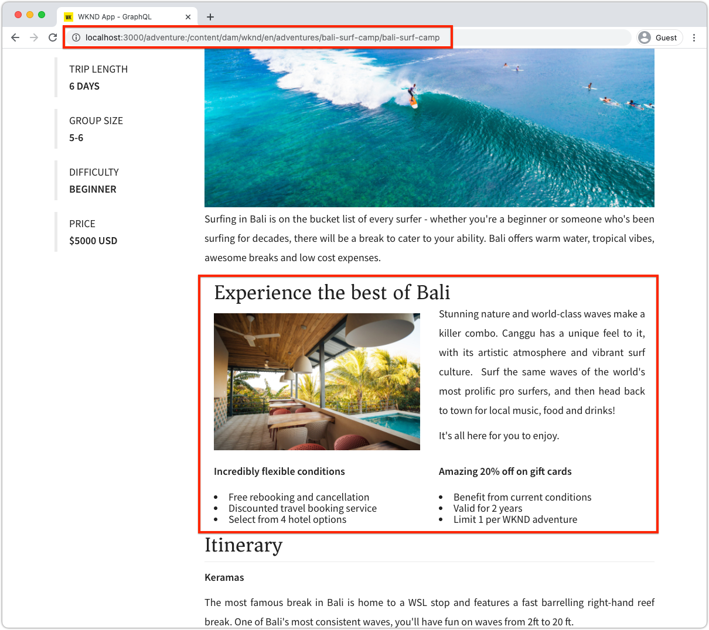

# 动态路由和可编辑组件

{{spa-editor-deprecation}}

在本章中，我们启用两个动态冒险详细信息路线来支持可编辑的组件：__Bali Surf Camp__&#x200B;和&#x200B;__Beervana in Portland__。


冒险详细信息SPA路由定义为`/adventure/:slug`，其中`slug`是冒险内容片段上的唯一标识符属性。

## 将SPA URL映射到AEM页面

在前两章中，我们将可编辑的组件内容从SPA的“主页”视图映射到AEM中位于`/content/wknd-app/us/en/`的相应远程SPA根页面。

为SPA动态路由的可编辑组件定义映射类似，但是我们必须在路由实例与AEM页面之间制定1:1映射方案。

在本教程中，我们使用WKND冒险内容片段的名称（该路径的最后一个区段），并将其映射到`/content/wknd-app/us/en/adventure`下的简单路径。

| 远程SPA路由 | AEM页面路径 |
|------------------------------------|--------------------------------------------|
| / | /content/wknd-app/us/en/home |
| /adventure/__bali-surf-camp__ | /content/wknd-app/us/en/home/adventure/__bali-surf-camp__ |
| /adventure/__beervana-portland__ | /content/wknd-app/us/en/home/adventure/__beervana-in-portland__ |

因此，基于此映射，我们必须创建两个新的AEM页面：

* `/content/wknd-app/us/en/home/adventure/bali-surf-camp`
* `/content/wknd-app/us/en/home/adventure/beervana-in-portland`

## 远程SPA映射

通过在[BootstrapSPA](./spa-bootstrap.md)中完成的`setupProxy`配置配置了离开远程SPA的请求的映射。

## SPA编辑器映射

通过AEM SPA编辑器打开SPA时，SPA请求的映射通过[配置AEM](./aem-configure.md)中的“Sling映射”配置进行配置。

## 在AEM中创建内容页面

首先，创建中间`adventure`页面区段：

1. 登录AEM Author
1. 导航到&#x200B;__Sites > WKND应用程序>我们> en > WKND应用程序主页__
   1. 此AEM页面被映射为SPA的根，因此我们将在此处开始为其他SPA路由构建AEM页面结构。
1. 点按&#x200B;__创建__&#x200B;并选择&#x200B;__页面__
1. 选择&#x200B;__远程SPA页面__&#x200B;模板，然后点按&#x200B;__下一步__
1. 填写页面属性
   1. __标题__：冒险
   1. __名称__：`adventure`
      1. 此值定义AEM页面的URL，因此必须匹配SPA的路由区段。
1. 点按&#x200B;__完成__

然后，创建与每个需要可编辑区域的SPA URL相对应的AEM页面。

1. 在网站管理员中导航到新的&#x200B;__冒险__&#x200B;页面
1. 点按&#x200B;__创建__&#x200B;并选择&#x200B;__页面__
1. 选择&#x200B;__远程SPA页面__&#x200B;模板，然后点按&#x200B;__下一步__
1. 填写页面属性
   1. __标题__：巴厘岛冲浪营
   1. __名称__：`bali-surf-camp`
      1. 此值定义AEM页面的URL，因此必须匹配SPA路由的最后一个区段
1. 点按&#x200B;__完成__
1. 重复步骤3-6以在Portland __中创建__ Beervana页面，其中：
   1. __标题__：波特兰的贝尔瓦纳
   1. __名称__：`beervana-in-portland`
      1. 此值定义AEM页面的URL，因此必须匹配SPA路由的最后一个区段

这两个AEM页面包含其匹配的SPA路由各自编写的内容。 如果其他SPA路由需要创作，则必须在AEM中远程SPA页面的根页面(`/content/wknd-app/us/en/home`)下的其SPA URL上创建新的AEM页面。

## 更新WKND应用程序

让我们将在[最后一章](./spa-container-component.md)中创建的`<ResponsiveGrid...>`组件放入我们的`AdventureDetail` SPA组件中，创建一个可编辑的容器。

### 放置ResponsiveGrid SPA组件

将`<ResponsiveGrid...>`放置到`AdventureDetail`组件中会在该路由中创建可编辑的容器。 关键在于，由于多个路由使用`AdventureDetail`组件进行渲染，因此我们必须动态调整`<ResponsiveGrid...>'s pagePath`属性。 必须派生`pagePath`以根据路由实例显示的冒险来指向相应的AEM页面。

1. 打开并编辑`react-app-/src/components/AdventureDetail.js`
1. 导入`ResponsiveGrid`组件并将其放在`<h2>Itinerary</h2>`组件上方。
1. 在`<ResponsiveGrid...>`组件上设置以下属性。 请注意，`pagePath`属性添加当前`slug`，该当前页面根据上面定义的映射映射到冒险页面。
   1. `pagePath = '/content/wknd-app/us/en/home/adventure/${slug}'`
   1. `itemPath = 'root/responsivegrid'`

   这会指示`ResponsiveGrid`组件从AEM资源检索其内容：

   1. `/content/wknd-app/us/en/home/adventure/${slug}/jcr:content/root/responsivegrid`

使用以下行更新`AdventureDetail.js`：

```javascript
...
import { ResponsiveGrid } from '@adobe/aem-react-editable-components';
...

function AdventureDetailRender(props) {
    ...
    // Get the slug from the React route parameter, this will be used to specify the AEM Page to store/read editable content from
    const { slug } = useParams();

    return(
        ...
        // Pass the slug in
        function AdventureDetailRender({ title, primaryImage, activity, adventureType, tripLength, 
                groupSize, difficulty, price, description, itinerary, references, slug }) {
            ...
            return (
                ...
                <ResponsiveGrid 
                    pagePath={`/content/wknd-app/us/en/home/adventure/${slug}`}
                    itemPath="root/responsivegrid"/>
                    
                <h2>Itinerary</h2>
                ...
            )
        }
    )
}
```

`AdventureDetail.js`文件应如下所示：


## 在AEM中创作容器

在已准备好`<ResponsiveGrid...>`并且根据呈现的冒险动态设置其`pagePath`的情况下，我们尝试在其中创作内容。

1. 登录AEM Author
1. 导航到&#x200B;__站点> WKND应用程序>我们> en__
1. __编辑__ __WKND应用程序主页__&#x200B;页面
   1. 导航到SPA中的&#x200B;__巴厘岛冲浪营__&#x200B;路线以进行编辑
1. 从右上角的模式选择器中选择&#x200B;__预览__
1. 点按SPA中的&#x200B;__巴厘岛冲浪营__&#x200B;卡以导航到其路径
1. 从模式选择器中选择&#x200B;__编辑__
1. 在&#x200B;__行程__&#x200B;的正上方找到&#x200B;__布局容器__&#x200B;可编辑区域
1. 打开&#x200B;__页面编辑器的侧栏__，然后选择&#x200B;__组件视图__
1. 将某些启用的组件拖入&#x200B;__布局容器__
   1. 图像
   1. 文本
   1. 标题

   并创建一些促销营销材料。 它可能会看起来像这样：

   

1. 在AEM页面编辑器中&#x200B;__预览__&#x200B;您所做的更改
1. 刷新[http://localhost:3000](http://localhost:3000)上本地运行的WKND应用程序，导航到&#x200B;__巴厘岛冲浪营__&#x200B;路线以查看所编写的更改！

   

当导航到没有映射AEM页面的冒险详细信息路由时，该路由实例没有创作功能。 若要在这些页面上启用创作功能，只需在&#x200B;__冒险__&#x200B;页面下创建一个具有匹配名称的AEM页面即可！

## 恭喜！

恭喜！您为SPA中的动态路由添加了创作功能！

* 向动态路由添加了AEM React可编辑组件的ResponsiveGrid组件
* 创建了AEM页面，以支持在SPA中创作两条特定路径（波特兰的Bali Surf Camp和Beervana）
* 编写了关于巴厘岛冲浪营线路的内容！

现在，您已完成探索如何使用AEM SPA Editor将特定可编辑区域添加到远程SPA的第一步！
