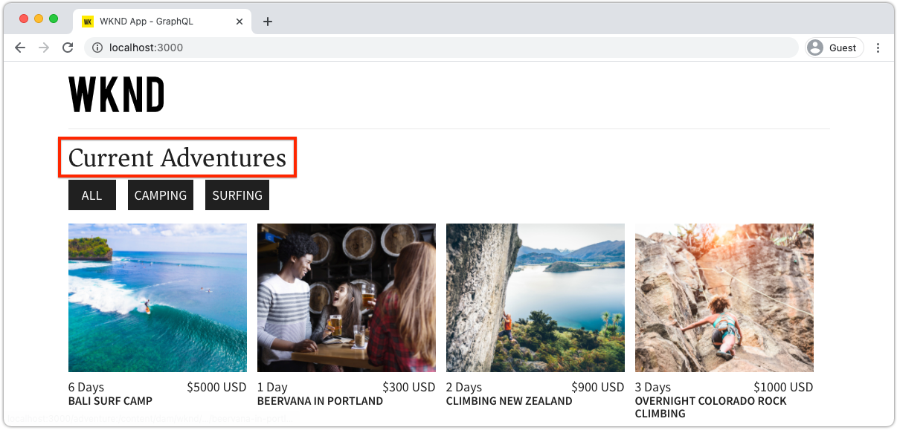
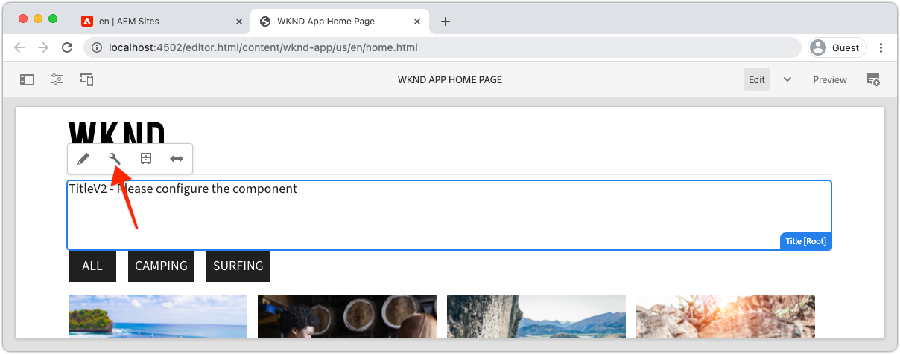
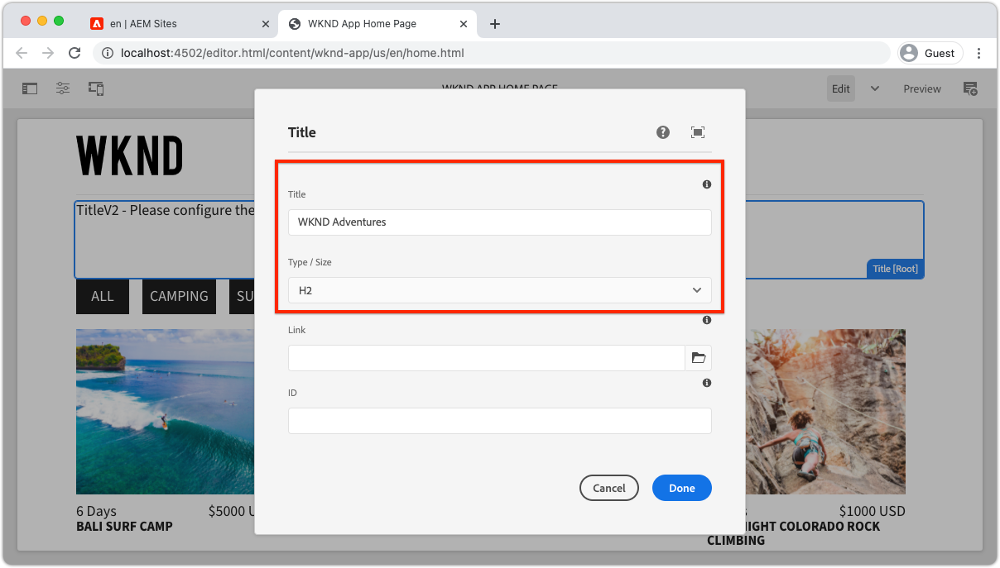
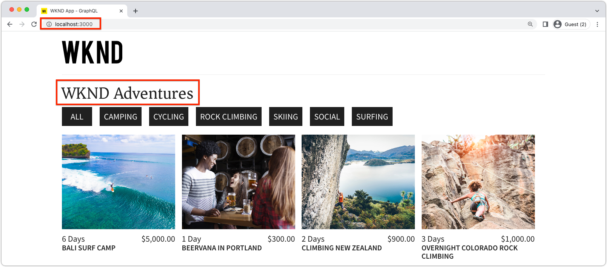

# 可编辑的固定组件

{{spa-editor-deprecation}}

可编辑的React组件可以“固定”，也可以硬编码到SPA视图中。 这允许开发人员将与SPA Editor兼容的组件放置到SPA视图中，并允许用户在AEM SPA Editor中创作组件的内容。



在本章中，我们将主页视图的标题“Current Adventures”替换为`Home.js`中的硬编码文本，该标题包含固定但可编辑的标题组件。 固定组件保证标题的放置，但也允许创作标题的文本，并在开发周期之外进行更改。

## 更新WKND应用程序

要将&#x200B;__Fixed__&#x200B;组件添加到“主页”视图：

* 创建自定义可编辑的标题组件并将它注册到项目标题的资源类型中
* 将可编辑的标题组件放在SPA的“主页”视图中

### 创建可编辑的React标题组件

在SPA的“主页”视图中，将硬编码文本`<h2>Current Adventures</h2>`替换为自定义的可编辑标题组件。 在使用标题组件之前，我们必须：

1. 创建自定义标题React组件
1. 使用`@adobe/aem-react-editable-components`中的方法修饰自定义标题组件使其可编辑。
1. 向`MapTo`注册可编辑的标题组件，以便稍后在[容器组件](./spa-container-component.md)中使用它。

要执行此操作：

1. 在IDE中的`~/Code/aem-guides-wknd-graphql/remote-spa-tutorial/react-app`处打开远程SPA项目
1. 在`react-app/src/components/editable/core/Title.js`处创建React组件
1. 将以下代码添加到`Title.js`。

   ```javascript
   import React from 'react'
   import { RoutedLink } from "./RoutedLink";
   
   const TitleLink = (props) => {
   return (
       <RoutedLink className={props.baseCssClass + (props.nested ? '-' : '__') + 'link'} 
           isRouted={props.routed} 
           to={props.linkURL}>
       {props.text}
       </RoutedLink>
   );
   };
   
   const TitleV2Contents = (props) => {
       if (!props.linkDisabled) {
           return <TitleLink {...props} />
       }
   
       return <>{props.text}</>
   };
   
   export const Title = (props) => {
       if (!props.baseCssClass) {
           props.baseCssClass = 'cmp-title'
       }
   
       const elementType = (!!props.type) ? props.type.toString() : 'h3';
       return (<div className={props.baseCssClass}>
           {
               React.createElement(elementType, {
                       className: props.baseCssClass + (props.nested ? '-' : '__') + 'text',
                   },
                   <TitleV2Contents {...props} />
               )
           }
   
           </div>)
   }
   
   export const titleIsEmpty = (props) => props.text == null || props.text.trim().length === 0
   ```

   请注意，此React组件尚无法使用AEM SPA Editor进行编辑。 此基本组件将在下一步中变为可编辑。

   阅读有关实施详细信息的代码注释。

1. 在`react-app/src/components/editable/EditableTitle.js`处创建React组件
1. 将以下代码添加到`EditableTitle.js`。

   ```javascript
   // Import the withMappable API provided bu the AEM SPA Editor JS SDK
   import { EditableComponent, MapTo } from '@adobe/aem-react-editable-components';
   import React from 'react'
   
   // Import the AEM the Title component implementation and it's Empty Function
   import { Title, titleIsEmpty } from "./core/Title";
   import { withConditionalPlaceHolder } from "./core/util/withConditionalPlaceholder";
   import { withStandardBaseCssClass } from "./core/util/withStandardBaseCssClass";
   
   // The sling:resourceType of the AEM component used to collected and serialize the data this React component displays
   const RESOURCE_TYPE = "wknd-app/components/title";
   
   // Create an EditConfig to allow the AEM SPA Editor to properly render the component in the Editor's context
   const EditConfig = {
       emptyLabel: "Title",        // The component placeholder in AEM SPA Editor
       isEmpty: titleIsEmpty,      // The function to determine if this component has been authored
       resourceType: RESOURCE_TYPE // The sling:resourceType this component is mapped to
   };
   
   export const WrappedTitle = (props) => {
       const Wrapped = withConditionalPlaceHolder(withStandardBaseCssClass(Title, "cmp-title"), titleIsEmpty, "TitleV2")
       return <Wrapped {...props} />
   }
   
   // EditableComponent makes the component editable by the AEM editor, either rendered statically or in a container
   const EditableTitle = (props) => <EditableComponent config={EditConfig} {...props}><WrappedTitle /></EditableComponent>
   
   // MapTo allows the AEM SPA Editor JS SDK to dynamically render components added to SPA Editor Containers
   MapTo(RESOURCE_TYPE)(EditableTitle);
   
   export default EditableTitle;
   ```

   This `EditableTitle` React component wraps the `Title` React component, wrapping and decorating it to be editable in AEM SPA Editor.

### Use the React EditableTitle component

Now that the EditableTitle React component is registered in and available for use within the React app, replace the hard-coded title text on the Home view.

1. Edit `react-app/src/components/Home.js`
1. In the `Home()` at the bottom, import `EditableTitle` and replace the hard-coded title with the new `AEMTitle` component:

   ```javascript
   ...
   import EditableTitle from './editable/EditableTitle';
   ...
   function Home() {
       return (
           <div className="Home">
   
           <EditableTitle
               pagePath='/content/wknd-app/us/en/home'
               itemPath='root/title'/>
   
               <Adventures />
           </div>
       );
   }
   ```

`Home.js`文件应如下所示：


## Author the Title component in AEM

1. 登录AEM Author
1. 导航到&#x200B;__站点> WKND应用程序__
1. 点按&#x200B;__主页__&#x200B;并从顶部操作栏中选择&#x200B;__编辑__
1. Select __Edit__ from the edit mode selector in the top right of the Page Editor
1. Hover over the default title text below the WKND logo and above the adventures list, until the blue edit outline displays
1. Tap to expose the component&#39;s action bar, and then tap the __wrench__  to edit

   

1. Author the Title component:
   1. Title: __WKND Adventures__
   1. Type/Size: __H2__

      

1. Tap __Done__ to save
1. Preview your changes in AEM SPA Editor
1. Refresh the WKND App running locally on [http://localhost:3000](http://localhost:3000) and see the authored title changes immediately reflected.

   

## 恭喜！

You&#39;ve added a fixed, editable component to the WKND App! 您现在知道如何：

* 在SPA中创建了一个固定的可编辑组件
* 在AEM中创作固定组件
* 查看远程SPA中的创作内容

## 后续步骤

接下来的步骤是[将AEM ResponsiveGrid容器组件](./spa-container-component.md)添加到SPA，以便作者向SPA添加可编辑的组件！
