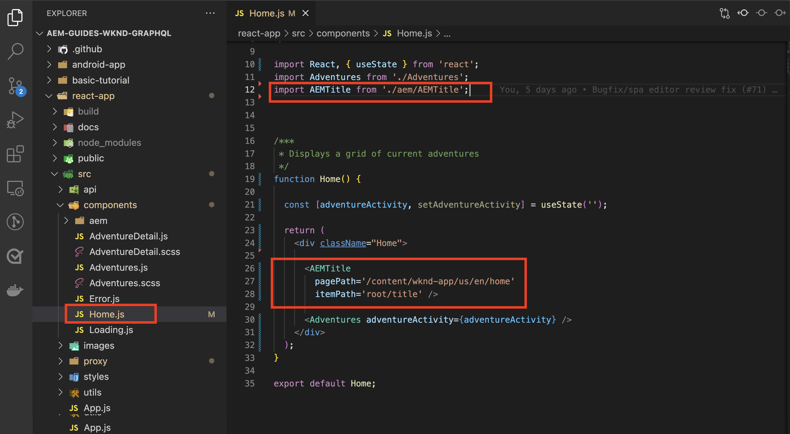

# 可编辑的固定组件

可编辑的React组件可以是“固定”的，也可以硬编码到SPA视图中。 这允许开发人员将与SPA Editor兼容的组件放入SPA视图中，并允许用户在AEM SPA Editor中创作组件内容。


在本章中，我们将替换主页视图的标题“当前历险”，该标题在 `Home.js` 具有固定但可编辑的标题组件。 固定的组件可确保标题的放置，但也允许创作标题的文本，并在开发周期之外进行更改。

## 更新WKND应用程序

添加 __已修复__ 组件添加到主页视图：

+ 导入AEM React核心组件标题组件，并将其注册到项目标题的资源类型
+ 将可编辑的标题组件放在SPA主页视图上

### 在AEM React核心组件的标题组件中导入

在SPA主页视图中，替换硬编码的文本 `<h2>Current Adventures</h2>` 与AEM React核心组件的标题组件一起使用。 在使用标题组件之前，我们必须：

1. 从导入标题组件 `@adobe/aem-core-components-react-base`
1. 使用注册它 `withMappable` 以便开发人员可以将其放入SPA中
1. 另外，请在 `MapTo` 这样它就可以用于 [容器组件稍后组件](./spa-container-component.md).

要执行此操作：

1. 在以下位置打开远程SPA项目 `~/Code/wknd-app/aem-guides-wknd-graphql/react-app` 在IDE中
1. 在 `react-app/src/components/aem/AEMTitle.js`
1. 将以下代码添加到 `AEMTitle.js`.

   ```
   // Import the withMappable API provided by the AEM SPA Editor JS SDK
   import { withMappable, MapTo } from '@adobe/aem-react-editable-components';
   
   // Import the AEM React Core Components' Title component implementation and it's Empty Function 
   import { TitleV2, TitleV2IsEmptyFn } from "@adobe/aem-core-components-react-base";
   
   // The sling:resourceType for which this Core Component is registered with in AEM
   const RESOURCE_TYPE = "wknd-app/components/title";
   
   // Create an EditConfig to allow the AEM SPA Editor to properly render the component in the Editor's context
   const EditConfig = {    
       emptyLabel: "Title",  // The component placeholder in AEM SPA Editor
       isEmpty: TitleV2IsEmptyFn, // The function to determine if this component has been authored
       resourceType: RESOURCE_TYPE // The sling:resourceType this component is mapped to
   };
   
   // MapTo allows the AEM SPA Editor JS SDK to dynamically render components added to SPA Editor Containers
   MapTo(RESOURCE_TYPE)(TitleV2, EditConfig);
   
   // withMappable allows the component to be hardcoded into the SPA; <AEMTitle .../>
   const AEMTitle = withMappable(TitleV2, EditConfig);
   
   export default AEMTitle;
   ```

阅读代码中有关实施详细信息的注释。

的 `AEMTitle.js` 文件应该如下所示：


### 使用React AEMTitle组件

现在，AEM React核心组件的标题组件已在中注册，并可在React应用程序中使用，请替换主页视图上的硬编码标题文本。

1. 编辑 `react-app/src/Home.js`
1. 在 `Home()` 在底部，将硬编码的标题替换为 `AEMTitle` 组件：

   ```
   <h2>Current Adventures</h2>
   ```

   替换为

   ```
   <AEMTitle
       pagePath='/content/wknd-app/us/en/home' 
       itemPath='root/title'/>
   ```

   更新 `Home.js` 使用以下代码：

   ```
   ...
   import { AEMTitle } from './aem/AEMTitle';
   ...
   function Home() {
       return (
           <div className="Home">
   
               <AEMTitle
                   pagePath='/content/wknd-app/us/en/home' 
                   itemPath='root/title'/>
   
               <Adventures />
           </div>
       );
   }
   ```

的 `Home.js` 文件应该如下所示：



## 在AEM中创作标题组件

1. 登录到AEM作者
1. 导航到 __站点> WKND应用程序__
1. 点按 __主页__ 选择 __编辑__ 从顶部操作栏
1. 选择 __编辑__ 从页面编辑器右上角的编辑模式选择器中
1. 将鼠标悬停在WKND徽标下方和冒险列表上方的默认标题文本上，直到显示蓝色的编辑大纲
1. 点按以显示组件的操作栏，然后点按 __扳手__  编辑

   

1. 创作标题组件：
   + 标题： __WKND冒险__
   + 类型/大小： __H2__

      

1. 点按 __完成__ 保存
1. 在AEM SPA编辑器中预览更改
1. 刷新在本地运行的WKND应用程序 [http://localhost:3000](http://localhost:3000) 并立即查看所创作的标题更改。

   

## 恭喜！

您已向WKND应用程序添加了一个固定的可编辑组件！ 您现在知道如何：

+ 在SPA中导入AEM React核心组件并将其重复使用
+ 向SPA中添加一个已修复但可编辑的组件
+ 在AEM中创作固定组件
+ 在远程SPA中查看创作的内容

## 下面的步骤

接下来的步骤是 [添加AEM ResponsiveGrid容器组件](./spa-container-component.md) 添加到SPA中，以便作者向SPA中添加和可编辑的组件！
