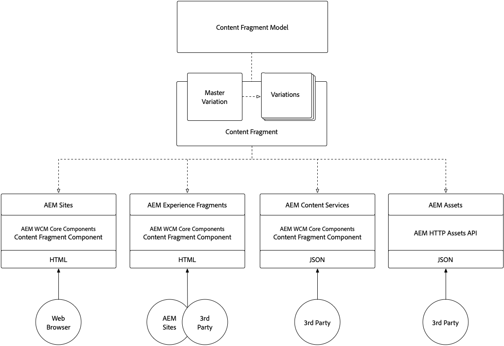

# 内容片段和体验片段

Adobe Experience Manager的内容片段和体验片段表面上看起来可能类似，但它们在不同的用例中起到关键作用。 了解内容片段和体验片段如何相似、不同，以及何时以及如何使用它们。

## 比较

<table>
<tbody><tr><td><strong> </strong></td>
<td><strong>内容片段(CF)</strong></td>
<td><strong>体验片段(XF)</strong></td>
</tr><tr><td><strong>定义</strong></td>
<td><ul>
<li>可重复使用，与呈现无关 <strong>内容</strong>，由结构化数据元素（文本、日期、引用等）组成</li>
</ul>
</td>
<td><ul>
<li>由一个或多个定义内容和表示形式的AEM组件组成的可重复使用、复合组件，可形成 <strong>体验</strong> 这本身就说得通</li>
</ul>
</td>
</tr><tr><td><strong>核心租户</strong></td>
<td><ul>
<li>以内容为中心</li>
<li>由定义 <a href="https://experienceleague.adobe.com/docs/experience-manager-65/assets/fragments/content-fragments-models.html?lang=en" target="_blank">结构化、基于表单、数据模型。</a></li>
<li>设计和布局不可知。</li>
<li>渠道拥有内容片段内容的演示（布局和设计）</li>
</ul>
</td>
<td><ul>
<li>以演示文稿为中心</li>
<li>由AEM组件的非结构化构成定义</li>
<li>定义内容的设计和布局</li>
<li>在渠道中使用“原样”</li>
</ul>
</td>
</tr><tr><td><strong>技术详细信息</strong></td>
<td><ul>
<li>实施为 <strong>dam：Asset</strong></li>
<li>由定义 <a href="https://experienceleague.adobe.com/docs/experience-manager-65/assets/fragments/content-fragments-models.html?lang=en" target="_blank">内容片段模型</a></li>
</ul>
</td>
<td><ul>
<li>实施为 <strong>cq：Page</strong></li>
<li>由可编辑的模板定义</li>
<li>本机HTML演绎版</li>
</ul>
</td>
</tr><tr><td><strong>变体</strong></td>
<td><ul>
<li>主变量是规范变量</li>
<li>变体是特定于用例的，可能与渠道一致。</li>
</ul>
</td>
<td><ul>
<li>变量特定于渠道或上下文</li>
<li>变体通过AEM Live Copy保持同步</li>
<li><a href="https://experienceleague.adobe.com/docs/experience-manager-65/authoring/authoring/experience-fragments.html" target="_blank">构建基块</a> 允许跨变体重复使用内容</li>
</ul>
</td>
</tr><tr><td><strong>功能</strong></td>
<td><ul>
<li>变体</li>
<li>版本</li>
<li><a href="https://experienceleague.adobe.com/docs/experience-manager-65/assets/fragments/content-fragments-variations.html?lang=en#synchronizing-with-master" target="_blank">同步</a> 跨变体的内容数量</li>
<li><a href="https://experienceleague.adobe.com/docs/experience-manager-65/assets/fragments/content-fragments-managing.html?lang=en#comparing-fragment-versions" target="_blank">视觉差异</a> 内容片段版本数量</li>
<li><a href="https://experienceleague.adobe.com/docs/experience-manager-65/assets/fragments/content-fragments-variations.html?lang=en#annotating-a-content-fragment" target="_blank">注释</a> 多行文本元素的</li>
<li>智能 <a href="https://experienceleague.adobe.com/docs/experience-manager-65/assets/fragments/content-fragments-variations.html?lang=en#summarizing-text" target="_blank">摘要</a> 多行文本元素的URL。</li>
<li><a href="https://experienceleague.adobe.com/docs/experience-manager-65/assets/fragments/creating-translation-projects-for-content-fragments.html?lang=en" target="_blank">翻译/本地化</a></li>
</ul>
</td>
<td><ul>
<li>变体</li>
<li>变体作为活动副本</li>
<li>版本</li>
<li><a href="https://experienceleague.adobe.com/docs/experience-manager-65/authoring/authoring/experience-fragments.html?lang=en#building-blocks" target="_blank">构建基块</a></li>
<li>注释</li>
<li>响应式布局和预览</li>
<li>翻译/本地化</li>
<li>通过内容片段引用实现的复杂数据模型</li>
<li>应用程序内预览</li>
</ul>
</td>
</tr><tr><td><strong>使用</strong></td>
<td><ul>
<li>JSON导出方式 <a href="https://experienceleague.adobe.com/landing/experience-manager/headless/developer.html?lang=zh-Hans">AEM Headless GraphQL API</a></li>
<li><a href="https://experienceleague.adobe.com/docs/experience-manager-core-components/using/components/content-fragment-component.html?lang=zh-Hans" target="_blank">AEM核心组件内容片段组件</a> 用于AEM Sites、AEM Screens或体验片段。</li>
<li>JSON导出方式 <a href="https://experienceleague.adobe.com/docs/experience-manager-learn/getting-started-with-aem-headless/content-services/overview.html?lang=en" target="_blank">AEM内容服务</a> 用于第三方使用</li>
<li>将JSON导出到Adobe Target以提供目标选件</li>
<li>通过AEM HTTP Assets API使用JSON以供第三方使用</li>
</ul>
</td>
<td><ul>
<li>用于AEM Sites、AEM Screens或其他体验片段的AEM体验片段组件。</li>
<li>导出为 <a href="https://experienceleague.adobe.com/docs/experience-manager-65/authoring/authoring/experience-fragments.html?lang=en" target="_blank">普通HTML</a> 供第三方系统使用</li>
<li><a href="https://experienceleague.adobe.com/docs/experience-manager-65/administering/integration/experience-fragments-target.html?lang=en" target="_blank">HTML导出到Adobe Target</a> 目标选件</li>
<li>将JSON导出到Adobe Target以提供目标选件</li>
</ul>
</td>
</tr><tr><td><strong>常见用例</strong></td>
<td><ul>
<li>推动GraphQL上的Headless用例</li>
<li>结构化数据输入/基于表单的内容</li>
<li>长格式编辑内容（多行元素）</li>
<li>在提供内容的渠道的生命周期之外管理的内容</li>
</ul>
</td>
<td><ul>
<li>使用每个渠道的变化集中管理多渠道促销宣传资料。</li>
<li>在一个网站中的多个页面中重复使用内容。</li>
<li>网站颜色(例如 页眉和页脚)</li>
<li>在提供该体验的渠道的生命周期之外管理的体验</li>
</ul>
</td>
</tr><tr><td><strong>文档</strong></td>
<td><ul>
<li><a href="https://experienceleague.adobe.com/docs/experience-manager-65/assets/home.html?lang=en&amp;topic=/experience-manager/6-5/assets/morehelp/content-fragments.ug.js" target="_blank">AEM内容片段用户指南</a></li>
<li><a href="https://experienceleague.adobe.com/docs/experience-manager-learn/sites/content-fragments/content-fragments-feature-video-use.html?lang=en" target="_blank">在AEM中使用内容片段</a></li>
</ul>
</td>
<td><ul>
<li><a href="https://experienceleague.adobe.com/docs/experience-manager-65/authoring/authoring/experience-fragments.html?lang=en" target="_blank">有关Adobe片段的体验文档</a></li>
</ul>
</td>
</tr></tbody></table>

## 内容片段架构

下图说明了AEM内容片段的整体架构

+ **内容片段模型** 定义元素（或字段），这些元素定义内容片段可以捕获和公开的内容。
+ 此 **内容片段** 是表示逻辑内容实体的内容片段模型的实例。
+ 内容片段 **变体** 但是，遵守内容片段模型时，内容会发生变化。
+ 以下人员可以公开/使用内容片段：
   + 在上使用内容片段 **AEM Sites** (或AEM Screens)通过AEM WCM核心组件的内容片段组件。
   + 使用 **内容片段** 从使用AEM Headless GraphQL API的Headless应用程序。
   + 通过以JSON形式公开内容片段变体内容 **AEM内容服务** 和API页面，用于只读用例。
   + 通过直接调用AEM Assets，将内容片段内容（所有变量）直接公开为JSON **AEM ASSETS HTTP API** 对于CRUD用例。

## 体验片段架构

+ **可编辑的模板**，则由以下定义 **可编辑的模板类型** 和 **AEM页面组件实施**，定义可用于构建体验片段的允许的AEM组件。
+ 此 **体验片段** 是表示逻辑体验的可编辑模板的实例。
+ 体验片段 **变体** 但是，遵循可编辑模板会导致体验（内容和设计）发生变化。
+ 体验片段可由以下人员公开/使用：
   + 通过AEM体验片段组件在AEM Sites(或AEM Screens)上使用体验片段。
   + 通过以下方式以JSON(具有嵌入的HTML)形式公开体验片段变体内容 **AEM内容服务** 和API页面。
   + 将体验片段变量直接公开为 **“普通HTML”**.
   + 将体验片段导出到 **Adobe Target** 作为HTML或JSON选件。
   + AEM Sites本机支持HTML选件，但是，JSON选件需要自定义开发。

## 内容片段的支持资源

+ [内容片段用户指南](https://experienceleague.adobe.com/docs/experience-manager-65/assets/home.html?lang=en&amp;topic=/experience-manager/6-5/assets/morehelp/content-fragments.ug.js)
+ [Adobe Experience Manager as a Headless CMS简介](https://experienceleague.adobe.com/docs/experience-manager-cloud-service/content/headless/introduction.html?lang=zh-Hans)
+ [在AEM中使用内容片段](https://experienceleague.adobe.com/docs/experience-manager-learn/sites/content-fragments/content-fragments-feature-video-use.html?lang=en)
+ [AEM WCM核心组件的内容片段组件](https://experienceleague.adobe.com/docs/experience-manager-core-components/using/components/content-fragment-component.html?lang=zh-Hans)
+ [使用内容片段和AEM Headless](https://experienceleague.adobe.com/docs/experience-manager-learn/getting-started-with-aem-headless/overview.html?lang=en)
+ [AEM Content Services入门](https://experienceleague.adobe.com/docs/experience-manager-learn/getting-started-with-aem-headless/content-services/overview.html?lang=en)

## 体验片段的支持资源

+ [有关Adobe片段的体验文档](https://experienceleague.adobe.com/docs/experience-manager-65/authoring/authoring/experience-fragments.html?lang=en)
+ [了解AEM Experience Fragments](https://experienceleague.adobe.com/docs/experience-manager-learn/sites/experience-fragments/experience-fragments-feature-video-use.html?lang=en)
+ [使用AEM Experience Fragments](https://experienceleague.adobe.com/docs/experience-manager-learn/sites/experience-fragments/experience-fragments-feature-video-use.html?lang=en)
+ [在Adobe Target中使用AEM Experience Fragments](https://medium.com/adobetech/experience-fragments-and-adobe-target-d8d74381b9b2)
